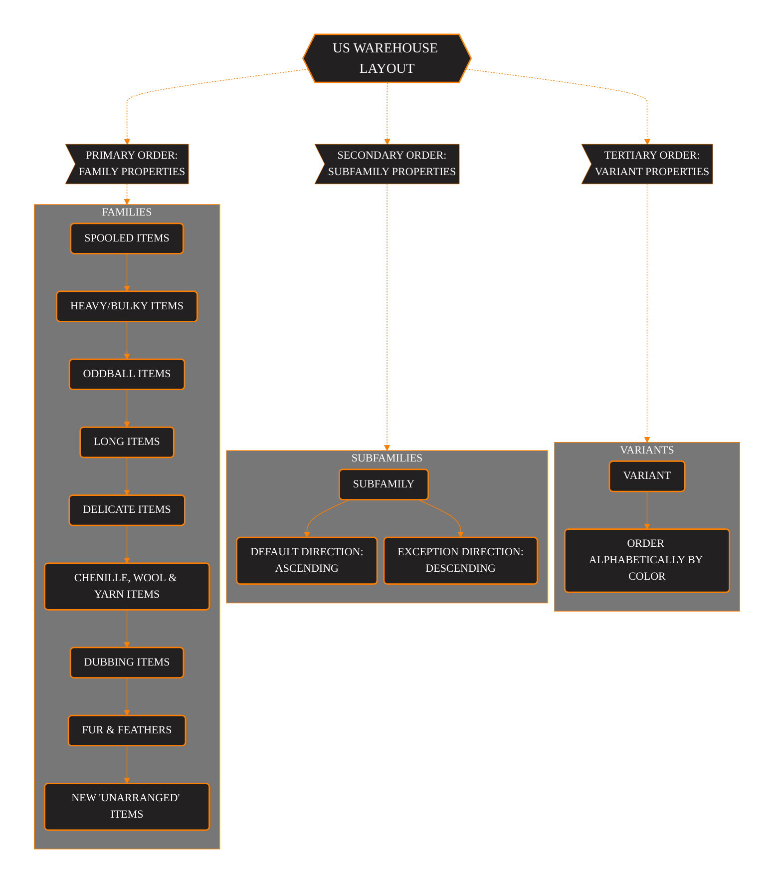
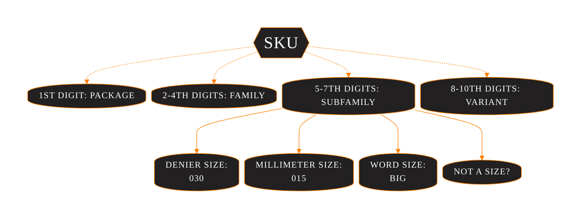
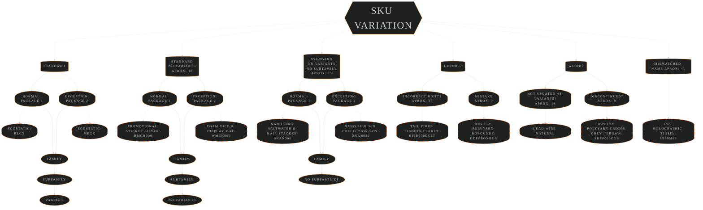
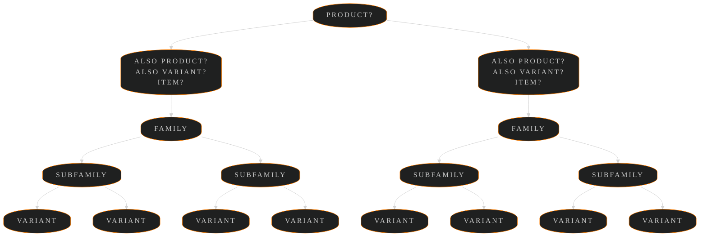
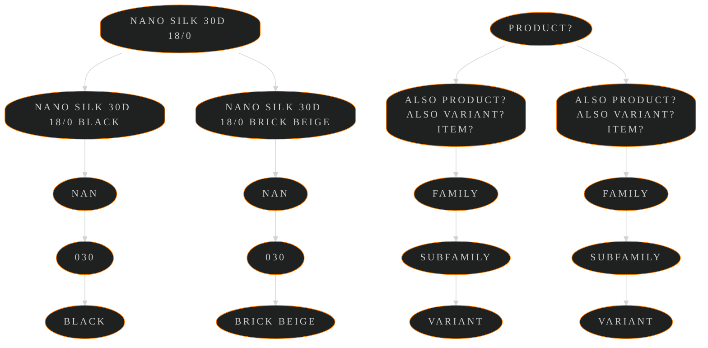

<!-- markdownlint-disable MD033 -->
<!-- markdownlint-disable MD001 -->
<!-- markdownlint-disable MD056 -->

# A Snippet From My Current Sorting Config To Help Explain The Warehouse Layout

### Warehouse Layout Logic



## Terminology and Sku Variation I am Working on Documenting

### Sku Terminology WIP



### Sku Variation From Standard WIP

<hr style="height:1px; solid #666;">



### I Also Want to Figure Out How the Product System Hierarchy Works, and Update the Terminology WIP

<hr style="height:1px; solid #666;">



<hr style="height:1px; solid #666;">



---

## 1. Primary Order

### This is the main sorting config that defines the order of product families

```javascript
familyOrder: [
// first are the spooled items as they are the heaviest and fit best at the bottom
    "NAN", // nanosilk
    "CWT", // classic waxed thread 240yd + 3/0 120yd
    "CWX", // classic waxed thread 110yd
    "DBY", // dirty bug yarn
    "DFP", // dry fly polyyarn
    "GMF", // gel core body micro fritz
    "MGL", // micro glint nymph tinsel
    "MMT", // micro metal hybrid thread, tinsel & wire
    "FBR", // fluoro brite
    "WIR", // wire
    "LED", // lead free wire and adhesive flat lead foil sheet
    "LPB", // lead wire
    "CKY", // cheeky uv
    "STL", // straggle legs
    "STS", // straggle string
    "STI", // ice chenille straggle
    "OTN", // french tinsel
    "FBD", // flat braid
    "FLO", // fly tying floss
    "PDG", // perdigon body
    "SPY", // spyder thread
    "SLK", // pure silk
    "STE", // stainless steel fly & brush wire
    "T16", //
    "T32", //
    "T69", //
    "PQS", // peacock quill subs

// second are the heavy/bulky items
    // dispensers,
    // collections,
    "EDB", // empty dubbing boxes and flash storage pot
    "SPC", // 10 Spool storage case
    "FPB", // hi float plastazote foam block
    "FFT", // flat fly tyers foam
    "FFD", // double decker foam
    "TBD", // tungsten slotted beads

// third are the oddball items
    // merch
    // tools
    // stickers
    "MCH", // merch
    "WAX", // wax
    "UVT", // uv tools
    "TRD", // empty spool display box
    "6FG", // six finger scissors
    "CLP", // fly display clips
    // Ect.

// fourth are the long items that may need to be placed in a particular way to fit in the box
    // multicards
    "GMC", // game changer chenille pack
    "CSH", // synthetic cashmere monkey
    "KKF", // semperFlash krystal
    "H69", // SemperFlash Holographic 1/69
    "H32", // SemperFlash Holographic 1/32
    "SFM", // SemperFlash fucking multi
    "PSW", // streamer wing
    "SFB", // semperFlash blends + baitfish wing
    "PFB", // predator fibres
    "SLW", // synthetic lumi wing

// fifth are the more delicate items so they have a solid flat-ish surface under them and soft products on top
    "IBT", // inferno goose biots
    "NBT", // natural range goose biots
    "SJC", // synthetic jungle cock
    "JCB", // jungle cock bulk
    "THX", // sandys thorax magic colour enhancing tape
    "ORG", // sparkle organza
    "PQL", // transparent peccary + true peccary + perfect quills
    "EYE", // 3d epoxy eyes
    "BSP", // bodyspan spandex elastic
    "FIB", // tail fibre fibbets
    "MCD", // mylar cord
    "SKN", // semperSkin shrimp
    "SLG", // siliLegs

// sixth are the chenille, wool, and yarn items
    "BRB", // body n rib
    "SST", // swiss straw synthetic raffia
    "WOL", // wool
    "PYN", // polyyarn
    "EGG", // egg yarn
    "EGX", // eggStatic
    "FCH", // fry chenille '30mm xxl'
    "TGD", // gold tinsel fleck
    "TSV", // silver tinsel fleck
    "TSP", // copper tinsel fleck
    "CSP", // metallic tinsel chenille
    "MOP", // mopster mop chenille
    "TCH", // plush translucent chenille
    "CAM", // camo chenille
    "XST", // extreme string
    "GHC", // guard hair chenille
    "SCH", // solid chenille
    "WCH", // worm chenille
    "CHS", // suede chenille 1mm
    "SC2", // suede chenille 1.5mm
    "SC3", // suede chenille 2mm
    "PSC", // pearl chenille
    "ICE", // ice chenille

// seventh are the dubbing items
    "IDB", // ice dubbing
    "KPK", // kapok dubbing
    "SCD", // scud dubbing
    "SKD", // sparkle dubbing
    "SFD", // superfine dubbing
    "BOM", // boom dubbing
    "SEA", // semperSeal subs

// eighth fur and feathers
    "CFR", // semperFur
    "SRZ", // synthetic rabbit zonker strips

// ninth are the newer items we haven't had time to rearrange yet
    "SPH", // synthetic peacock herl
    "MAR", // synthetic marabou
    "CMN", // competition chenille
    "CMP", // competition uv chenille
    "EDG", // edgeBrite
    "GFR", // semperFut grizzle
    "HKC", // hackle chenille
    "HKU", // uv hackle chenille
    "KP2", // kapok fusion dubbing
    "KV2", // kapok fusion uv dubbing
    "Lat", // latex sheet
    "SBK", // scud back
    "LAT", // latex sheet
]
```

## 2. Secondary Order

### The subfamilies are sorted in ascending or descending order within the family groups

```javascript
  defaultDirection: "ascending", // Default sort direction for families
  exceptionDirection: {
    FFD: "descending", // double decker foam
    PQS: "descending", // peacock quill subs
    OTN: "descending", // french tinsel
  },
```

## 3. Tertiary Order

### The variants are sorted alphabetically according to the color
