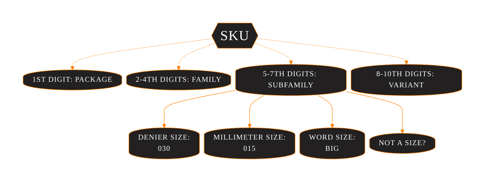
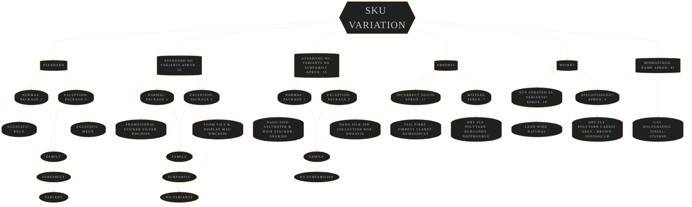
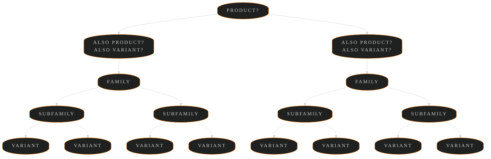
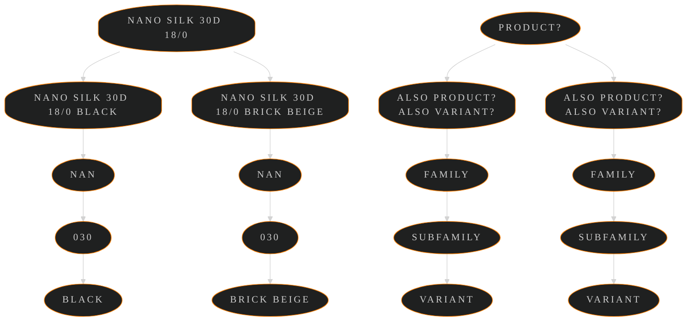

<!-- markdownlint-disable MD033 -->
<!-- markdownlint-disable MD001 -->
<!-- markdownlint-disable MD056 -->

# A Snippet From My Current Sorting Config To Help Explain The Warehouse Layout

### Warehouse Layout Logic


## Terminology and Sku Variation I am Working on Documenting

### Sku Terminology WIP



### Sku Variation From Standard WIP

<hr style="height:1px; solid #666;">



### I Also Want to Figure Out How the Product System Hierarchy Works, and Update the Terminology WIP

<hr style="height:1px; solid #666;">



<hr style="height:1px; solid #666;">



---

## 1. Primary Order

### <pre>   This is the main sorting config that defines the order of product families</pre>

```javascript
familyOrder: [
// first are the spooled items as they are the heaviest and fit best at the bottom
    "NAN", // nanosilk
    "CWT", // classic waxed thread 240yd + 3/0 120yd
    "CWX", // classic waxed thread 110yd
    "DBY", // dirty bug yarn
    "DFP", // dry fly polyyarn
    "GMF", // gel core body micro fritz
    "MGL", // micro glint nymph tinsel
    "MMT", // micro metal hybrid thread, tinsel & wire
    "FBR", // fluoro brite
    "WIR", // wire
    "LED", // lead free wire and adhesive flat lead foil sheet
    "LPB", // lead wire
    "CKY", // cheeky uv
    "STL", // straggle legs
    "STS", // straggle string
    "STI", // ice chenille straggle
    "OTN", // french tinsel
    "FBD", // flat braid
    "FLO", // fly tying floss
    "PDG", // perdigon body
    "SPY", // spyder thread
    "SLK", // pure silk
    "STE", // stainless steel fly & brush wire
    "T16", //
    "T32", //
    "T69", //
    "PQS", // peacock quill subs

// second are the heavy/bulky items
    // dispensers,
    // collections,
    "EDB", // empty dubbing boxes and flash storage pot
    "SPC", // 10 Spool storage case
    "FPB", // hi float plastazote foam block
    "FFT", // flat fly tyers foam
    "FFD", // double decker foam
    "TBD", // tungsten slotted beads

// third are the oddball items
    // merch
    // tools
    // stickers
    "MCH", // merch
    "WAX", // wax
    "UVT", // uv tools
    "TRD", // empty spool display box
    "6FG", // six finger scissors
    "CLP", // fly display clips
    // Ect.

// fourth are the long items that may need to be placed in a particular way to fit in the box
    // multicards
    "GMC", // game changer chenille pack
    "CSH", // synthetic cashmere monkey
    "KKF", // semperFlash krystal
    "H69", // SemperFlash Holographic 1/69
    "H32", // SemperFlash Holographic 1/32
    "SFM", // SemperFlash fucking multi
    "PSW", // streamer wing
    "SFB", // semperFlash blends + baitfish wing
    "PFB", // predator fibres
    "SLW", // synthetic lumi wing

// fifth are the more delicate items so they have a solid flat-ish surface under them and soft products on top
    "IBT", // inferno goose biots
    "NBT", // natural range goose biots
    "SJC", // synthetic jungle cock
    "JCB", // jungle cock bulk
    "THX", // sandys thorax magic colour enhancing tape
    "ORG", // sparkle organza
    "PQL", // transparent peccary + true peccary + perfect quills
    "EYE", // 3d epoxy eyes
    "BSP", // bodyspan spandex elastic
    "FIB", // tail fibre fibbets
    "MCD", // mylar cord
    "SKN", // semperSkin shrimp
    "SLG", // siliLegs

// sixth are the chenille, wool, and yarn items
    "BRB", // body n rib
    "SST", // swiss straw synthetic raffia
    "WOL", // wool
    "PYN", // polyyarn
    "EGG", // egg yarn
    "EGX", // eggStatic
    "FCH", // fry chenille '30mm xxl'
    "TGD", // gold tinsel fleck
    "TSV", // silver tinsel fleck
    "TSP", // copper tinsel fleck
    "CSP", // metallic tinsel chenille
    "MOP", // mopster mop chenille
    "TCH", // plush translucent chenille
    "CAM", // camo chenille
    "XST", // extreme string
    "GHC", // guard hair chenille
    "SCH", // solid chenille
    "WCH", // worm chenille
    "CHS", // suede chenille 1mm
    "SC2", // suede chenille 1.5mm
    "SC3", // suede chenille 2mm
    "PSC", // pearl chenille
    "ICE", // ice chenille

// seventh are the dubbing items
    "IDB", // ice dubbing
    "KPK", // kapok dubbing
    "SCD", // scud dubbing
    "SKD", // sparkle dubbing
    "SFD", // superfine dubbing
    "BOM", // boom dubbing
    "SEA", // semperSeal subs

// eighth fur and feathers
    "CFR", // semperFur
    "SRZ", // synthetic rabbit zonker strips

// ninth are the newer items we haven't had time to rearrange yet
    "SPH", // synthetic peacock herl
    "MAR", // synthetic marabou
    "CMN", // competition chenille
    "CMP", // competition uv chenille
    "EDG", // edgeBrite
    "GFR", // semperFut grizzle
    "HKC", // hackle chenille
    "HKU", // uv hackle chenille
    "KP2", // kapok fusion dubbing
    "KV2", // kapok fusion uv dubbing
    "Lat", // latex sheet
    "SBK", // scud back
    "LAT", // latex sheet
]
```

## 2. Secondary Order

### <pre>   The subfamilies are sorted in ascending or descending order within the family groups</pre>

```javascript
  defaultDirection: "ascending", // Default sort direction for families
  exceptionDirection: {
    FFD: "descending", // double decker foam
    PQS: "descending", // peacock quill subs
    OTN: "descending", // french tinsel
  },
```

## 3. Tertiary Order

### <pre>   The variants are sorted alphabetically according to the color</pre>

---

## Here is the Current Output of my Sorting Process When I Run all the Products

|sku|name|colorSize|barcode|quantity|skuLength|package|family|subfamily|variant|isVariant|packageFamilyGroup|packageFamilySubfamilyGroup|fullName|
|---|---|---|---|---|---|---|---|---|---|---|---|---|---|
|KNAN030BLK|Nano Silk 30D 18/0 Bulk 500m|Black|886741060868|7|10|K|NAN|30|BLK|TRUE|KNAN|KNAN030|Nano Silk 30D 18/0 Bulk 500m Black|
|KNAN030WHT|Nano Silk 30D 18/0 Bulk 500m|White|886741591805|20|10|K|NAN|30|WHT|TRUE|KNAN|KNAN030|Nano Silk 30D 18/0 Bulk 500m White|
|KNAN050BLK|Nano Silk 50D 12/0 Bulk 250m|Black|886741060875|21|10|K|NAN|50|BLK|TRUE|KNAN|KNAN050|Nano Silk 50D 12/0 Bulk 250m Black|
|KNAN050WHT|Nano Silk 50D 12/0 Bulk 250m|White|886741057974|8|10|K|NAN|50|WHT|TRUE|KNAN|KNAN050|Nano Silk 50D 12/0 Bulk 250m White|
|KNAN100BLK|Nano Silk 100D 6/0 Bulk 200m|Black|886741060882|19|10|K|NAN|100|BLK|TRUE|KNAN|KNAN100|Nano Silk 100D 6/0 Bulk 200m Black|
|KNAN100WHT|Nano Silk 100D 6/0 Bulk 200m|White|886741059404|22|10|K|NAN|100|WHT|TRUE|KNAN|KNAN100|Nano Silk 100D 6/0 Bulk 200m White|
|SNAN020BLK|Nano Silk Pro 20D|Black|886741004176|19|10|S|NAN|20|BLK|TRUE|SNAN|SNAN020|Nano Silk Pro 20D Black|
|SNAN020WHT|Nano Silk Pro 20D|White|886741004268|6|10|S|NAN|20|WHT|TRUE|SNAN|SNAN020|Nano Silk Pro 20D White|
|SNAN030BLK|Nano Silk 30D 18/0|Black|886741042628|128|10|S|NAN|30|BLK|TRUE|SNAN|SNAN030|Nano Silk 30D 18/0 Black|
|SNAN030BRG|Nano Silk 30D 18/0|Brick Beige|886741052542|-16|10|S|NAN|30|BRG|TRUE|SNAN|SNAN030|Nano Silk 30D 18/0 Brick Beige|
|SNAN030BRN|Nano Silk 30D 18/0|Brown|886741042642|-12|10|S|NAN|30|BRN|TRUE|SNAN|SNAN030|Nano Silk 30D 18/0 Brown|
|SNAN030CPR|Nano Silk 30D 18/0|Copper|886741042666|156|10|S|NAN|30|CPR|TRUE|SNAN|SNAN030|Nano Silk 30D 18/0 Copper|
|SNAN030BGR|Nano Silk 30D 18/0|Dark Green|886741049726|3|10|S|NAN|30|BGR|TRUE|SNAN|SNAN030|Nano Silk 30D 18/0 Dark Green|
|SNAN030GRY|Nano Silk 30D 18/0|Gray|886741042680|6|10|S|NAN|30|GRY|TRUE|SNAN|SNAN030|Nano Silk 30D 18/0 Gray|
|SNAN030LMG|Nano Silk 30D 18/0|Lime Green|886741052559|-10|10|S|NAN|30|LMG|TRUE|SNAN|SNAN030|Nano Silk 30D 18/0 Lime Green|
|SNAN030OLV|Nano Silk 30D 18/0|Olive|886741042703|48|10|S|NAN|30|OLV|TRUE|SNAN|SNAN030|Nano Silk 30D 18/0 Olive|
|SNAN030ORG|Nano Silk 30D 18/0|Orange|886741042727|16|10|S|NAN|30|ORG|TRUE|SNAN|SNAN030|Nano Silk 30D 18/0 Orange|
|SNAN030PNK|Nano Silk 30D 18/0|Pink|886741042741|39|10|S|NAN|30|PNK|TRUE|SNAN|SNAN030|Nano Silk 30D 18/0 Pink|
|SNAN030PRP|Nano Silk 30D 18/0|Purple|886741049719|10|10|S|NAN|30|PRP|TRUE|SNAN|SNAN030|Nano Silk 30D 18/0 Purple|
|SNAN030RED|Nano Silk 30D 18/0|Red|886741042772|0|10|S|NAN|30|RED|TRUE|SNAN|SNAN030|Nano Silk 30D 18/0 Red|
|SNAN030TRQ|Nano Silk 30D 18/0|Turquoise|886741586207|-7|10|S|NAN|30|TRQ|TRUE|SNAN|SNAN030|Nano Silk 30D 18/0 Turquoise|
|SNAN030WHT|Nano Silk 30D 18/0|White|886741053358|-2|10|S|NAN|30|WHT|TRUE|SNAN|SNAN030|Nano Silk 30D 18/0 White|
|SNAN030YEL|Nano Silk 30D 18/0|Yellow|886741042819|106|10|S|NAN|30|YEL|TRUE|SNAN|SNAN030|Nano Silk 30D 18/0 Yellow|
|SNAN050BLK|Nano Silk 50D 12/0|Black|886741026598|543|10|S|NAN|50|BLK|TRUE|SNAN|SNAN050|Nano Silk 50D 12/0 Black|
|SNAN050BRN|Nano Silk 50D 12/0|Brown|886741026604|37|10|S|NAN|50|BRN|TRUE|SNAN|SNAN050|Nano Silk 50D 12/0 Brown|
|SNAN050CPR|Nano Silk 50D 12/0|Copper|886741026611|256|10|S|NAN|50|CPR|TRUE|SNAN|SNAN050|Nano Silk 50D 12/0 Copper|
|SNAN050GRY|Nano Silk 50D 12/0|Gray|886741026628|266|10|S|NAN|50|GRY|TRUE|SNAN|SNAN050|Nano Silk 50D 12/0 Gray|
|SNAN050OLV|Nano Silk 50D 12/0|Olive|886741026635|134|10|S|NAN|50|OLV|TRUE|SNAN|SNAN050|Nano Silk 50D 12/0 Olive|
|SNAN050ORG|Nano Silk 50D 12/0|Orange|886741026642|98|10|S|NAN|50|ORG|TRUE|SNAN|SNAN050|Nano Silk 50D 12/0 Orange|
|SNAN050PNK|Nano Silk 50D 12/0|Pink|886741036283|-19|10|S|NAN|50|PNK|TRUE|SNAN|SNAN050|Nano Silk 50D 12/0 Pink|
|SNAN050RED|Nano Silk 50D 12/0|Red|886741036276|191|10|S|NAN|50|RED|TRUE|SNAN|SNAN050|Nano Silk 50D 12/0 Red|
|SNAN050WHT|Nano Silk 50D 12/0|White|886741026659|-79|10|S|NAN|50|WHT|TRUE|SNAN|SNAN050|Nano Silk 50D 12/0 White|
|SNAN050YEL|Nano Silk 50D 12/0|Yellow|886741026666|155|10|S|NAN|50|YEL|TRUE|SNAN|SNAN050|Nano Silk 50D 12/0 Yellow|
|SNAN100BLK|Nano Silk 100D 6/0|Black|886741058155|610|10|S|NAN|100|BLK|TRUE|SNAN|SNAN100|Nano Silk 100D 6/0 Black|
|SNAN100BRN|Nano Silk 100D 6/0|Brown|886741043090|209|10|S|NAN|100|BRN|TRUE|SNAN|SNAN100|Nano Silk 100D 6/0 Brown|
|SNAN100CPR|Nano Silk 100D 6/0|Copper|886741043069|74|10|S|NAN|100|CPR|TRUE|SNAN|SNAN100|Nano Silk 100D 6/0 Copper|
|SNAN100GRY|Nano Silk 100D 6/0|Gray|886741043106|64|10|S|NAN|100|GRY|TRUE|SNAN|SNAN100|Nano Silk 100D 6/0 Gray|
|SNAN100OLV|Nano Silk 100D 6/0|Olive|886741043076|280|10|S|NAN|100|OLV|TRUE|SNAN|SNAN100|Nano Silk 100D 6/0 Olive|
|SNAN100ORG|Nano Silk 100D 6/0|Orange|886741043052|-13|10|S|NAN|100|ORG|TRUE|SNAN|SNAN100|Nano Silk 100D 6/0 Orange|
|SNAN100PNK|Nano Silk 100D 6/0|Pink|886741043113|83|10|S|NAN|100|PNK|TRUE|SNAN|SNAN100|Nano Silk 100D 6/0 Pink|
|SNAN100RED|Nano Silk 100D 6/0|Red|886741043045|167|10|S|NAN|100|RED|TRUE|SNAN|SNAN100|Nano Silk 100D 6/0 Red|
|SNAN100WHT|Nano Silk 100D 6/0|White|886741042338|-92|10|S|NAN|100|WHT|TRUE|SNAN|SNAN100|Nano Silk 100D 6/0 White|
|SNAN100YEL|Nano Silk 100D 6/0|Yellow|886741043038|13|10|S|NAN|100|YEL|TRUE|SNAN|SNAN100|Nano Silk 100D 6/0 Yellow|
|SNANBIGBLK|Nano Silk Streamer 200D|Black|886741006743|95|10|S|NAN|BIG|BLK|TRUE|SNAN|SNANBIG|Nano Silk Streamer 200D Black|
|SNANBIGBLU|Nano Silk Streamer 200D|Blue|886741006842|40|10|S|NAN|BIG|BLU|TRUE|SNAN|SNANBIG|Nano Silk Streamer 200D Blue|
|SNANBIGDGR|Nano Silk Streamer 200D|Dark Gray|886741006767|9|10|S|NAN|BIG|DGR|TRUE|SNAN|SNANBIG|Nano Silk Streamer 200D Dark Gray|
|SNANBIGDGO|Nano Silk Streamer 200D|Dark Green Olive|886741006811|24|10|S|NAN|BIG|DGO|TRUE|SNAN|SNANBIG|Nano Silk Streamer 200D Dark Green Olive|
|SNANBIGORG|Nano Silk Streamer 200D|Orange|886741006798|23|10|S|NAN|BIG|ORG|TRUE|SNAN|SNANBIG|Nano Silk Streamer 200D Orange|
|SNANBIGPLG|Nano Silk Streamer 200D|Pale Green|886741010085|-2|10|S|NAN|BIG|PLG|TRUE|SNAN|SNANBIG|Nano Silk Streamer 200D Pale Green|
|SNANBIGRED|Nano Silk Streamer 200D|Red|886741006781|37|10|S|NAN|BIG|RED|TRUE|SNAN|SNANBIG|Nano Silk Streamer 200D Red|
|SNANBIGFRH|Nano Silk Streamer 200D|Rhyacophilia|886741006828|11|10|S|NAN|BIG|FRH|TRUE|SNAN|SNANBIG|Nano Silk Streamer 200D Rhyacophilia|
|SNANBIGWHT|Nano Silk Streamer 200D|White|886741006859|-1|10|S|NAN|BIG|WHT|TRUE|SNAN|SNANBIG|Nano Silk Streamer 200D White|
|SNANSLTBLK|Nano Silk Saltwater 100D|Black|886741012072|114|10|S|NAN|SLT|BLK|TRUE|SNAN|SNANSLT|Nano Silk Saltwater 100D Black|
|SNANSLTBLU|Nano Silk Saltwater 100D|Blue|886741012089|117|10|S|NAN|SLT|BLU|TRUE|SNAN|SNANSLT|Nano Silk Saltwater 100D Blue|
|SNANSLTDGR|Nano Silk Saltwater 100D|Dark Gray|886741012102|117|10|S|NAN|SLT|DGR|TRUE|SNAN|SNANSLT|Nano Silk Saltwater 100D Dark Gray|
|SNANSLTDGO|Nano Silk Saltwater 100D|Dark Green|886741012096|117|10|S|NAN|SLT|DGO|TRUE|SNAN|SNANSLT|Nano Silk Saltwater 100D Dark Green|
|SNANSLTORG|Nano Silk Saltwater 100D|Orange|886741012133|114|10|S|NAN|SLT|ORG|TRUE|SNAN|SNANSLT|Nano Silk Saltwater 100D Orange|
|SNANSLTPNK|Nano Silk Saltwater 100D|Pink|886741012188|114|10|S|NAN|SLT|PNK|TRUE|SNAN|SNANSLT|Nano Silk Saltwater 100D Pink|
|SNAN300WHT|Nano 300D Saltwater & Hair Stacker||886741002301|72|10|S|NAN|300|WHT|FALSE|||Nano 300D Saltwater & Hair Stacker|
|SCWT003BEI|Classic Waxed Thread 3/0 120 Yards|Beige|886741000468|49|10|S|CWT|3|BEI|TRUE|SCWT|SCWT003|Classic Waxed Thread 3/0 120 Yards Beige|
|SCWT003BLK|Classic Waxed Thread 3/0 120 Yards|Black|886741000536|17|10|S|CWT|3|BLK|TRUE|SCWT|SCWT003|Classic Waxed Thread 3/0 120 Yards Black|
|SCWT003BRN|Classic Waxed Thread 3/0 120 Yards|Brown|886741000598|19|10|S|CWT|3|BRN|TRUE|SCWT|SCWT003|Classic Waxed Thread 3/0 120 Yards Brown|
|SCWT003CLT|Classic Waxed Thread 3/0 120 Yards|Claret|886741000611|267|10|S|CWT|3|CLT|TRUE|SCWT|SCWT003|Classic Waxed Thread 3/0 120 Yards Claret|
|SCWT003CRN|Classic Waxed Thread 3/0 120 Yards|Cornflower|886741000628|97|10|S|CWT|3|CRN|TRUE|SCWT|SCWT003|Classic Waxed Thread 3/0 120 Yards Cornflower|
|SCWT003FGN|Classic Waxed Thread 3/0 120 Yards|Fl Green|886741000642|60|10|S|CWT|3|FGN|TRUE|SCWT|SCWT003|Classic Waxed Thread 3/0 120 Yards Fl Green|
|SCWT003FOR|Classic Waxed Thread 3/0 120 Yards|Fl Orange|886741000659|47|10|S|CWT|3|FOR|TRUE|SCWT|SCWT003|Classic Waxed Thread 3/0 120 Yards Fl Orange|
|SCWT003FPK|Classic Waxed Thread 3/0 120 Yards|Fl Pink|886741000666|50|10|S|CWT|3|FPK|TRUE|SCWT|SCWT003|Classic Waxed Thread 3/0 120 Yards Fl Pink|
|SCWT003FRD|Classic Waxed Thread 3/0 120 Yards|Fl Red|886741000673|55|10|S|CWT|3|FRD|TRUE|SCWT|SCWT003|Classic Waxed Thread 3/0 120 Yards Fl Red|
|SCWT003FYL|Classic Waxed Thread 3/0 120 Yards|Fl Yellow|886741000680|83|10|S|CWT|3|FYL|TRUE|SCWT|SCWT003|Classic Waxed Thread 3/0 120 Yards Fl Yellow|
|SCWT003GRY|Classic Waxed Thread 3/0 120 Yards|Gray|886741000703|99|10|S|CWT|3|GRY|TRUE|SCWT|SCWT003|Classic Waxed Thread 3/0 120 Yards Gray|
|SCWT003GRN|Classic Waxed Thread 3/0 120 Yards|Green|886741000697|123|10|S|CWT|3|GRN|TRUE|SCWT|SCWT003|Classic Waxed Thread 3/0 120 Yards Green|
|SCWT003HOR|Classic Waxed Thread 3/0 120 Yards|Hot Orange|886741000710|69|10|S|CWT|3|HOR|TRUE|SCWT|SCWT003|Classic Waxed Thread 3/0 120 Yards Hot Orange|
|SCWT003MOL|Classic Waxed Thread 3/0 120 Yards|Medium Olive|886741000727|69|10|S|CWT|3|MOL|TRUE|SCWT|SCWT003|Classic Waxed Thread 3/0 120 Yards Medium Olive|
|SCWT003NVY|Classic Waxed Thread 3/0 120 Yards|Navy|886741000734|93|10|S|CWT|3|NVY|TRUE|SCWT|SCWT003|Classic Waxed Thread 3/0 120 Yards Navy|
|SCWT003PNK|Classic Waxed Thread 3/0 120 Yards|Pink|886741000772|78|10|S|CWT|3|PNK|TRUE|SCWT|SCWT003|Classic Waxed Thread 3/0 120 Yards Pink|
|SCWT003PRI|Classic Waxed Thread 3/0 120 Yards|Primrose|886741000796|112|10|S|CWT|3|PRI|TRUE|SCWT|SCWT003|Classic Waxed Thread 3/0 120 Yards Primrose|
|SCWT003PRP|Classic Waxed Thread 3/0 120 Yards|Purple|886741000802|43|10|S|CWT|3|PRP|TRUE|SCWT|SCWT003|Classic Waxed Thread 3/0 120 Yards Purple|
|SCWT003RED|Classic Waxed Thread 3/0 120 Yards|Red|886741000819|68|10|S|CWT|3|RED|TRUE|SCWT|SCWT003|Classic Waxed Thread 3/0 120 Yards Red|
|SCWT003RST|Classic Waxed Thread 3/0 120 Yards|Rust|886741000826|70|10|S|CWT|3|RST|TRUE|SCWT|SCWT003|Classic Waxed Thread 3/0 120 Yards Rust|
|SCWT003WHT|Classic Waxed Thread 3/0 120 Yards|White|886741000871|21|10|S|CWT|3|WHT|TRUE|SCWT|SCWT003|Classic Waxed Thread 3/0 120 Yards White|
|SCWT006BEI|Classic Waxed Thread 6/0 240 Yards|Beige|886741060370|27|10|S|CWT|6|BEI|TRUE|SCWT|SCWT006|Classic Waxed Thread 6/0 240 Yards Beige|
|SCWT006BLK|Classic Waxed Thread 6/0 240 Yards|Black|886741060417|-5|10|S|CWT|6|BLK|TRUE|SCWT|SCWT006|Classic Waxed Thread 6/0 240 Yards Black|
|SCWT006BRN|Classic Waxed Thread 6/0 240 Yards|Brown|886741060363|11|10|S|CWT|6|BRN|TRUE|SCWT|SCWT006|Classic Waxed Thread 6/0 240 Yards Brown|
|SCWT006BOL|Classic Waxed Thread 6/0 240 Yards|Brown Olive|886741060431|11|10|S|CWT|6|BOL|TRUE|SCWT|SCWT006|Classic Waxed Thread 6/0 240 Yards Brown Olive|
|SCWT006BTO|Classic Waxed Thread 6/0 240 Yards|Burnt Orange|886741002820|172|10|S|CWT|6|BTO|TRUE|SCWT|SCWT006|Classic Waxed Thread 6/0 240 Yards Burnt Orange|
|SCWT006CHT|Classic Waxed Thread 6/0 240 Yards|Chartreuse|886741060516|13|10|S|CWT|6|CHT|TRUE|SCWT|SCWT006|Classic Waxed Thread 6/0 240 Yards Chartreuse|
|SCWT006CLT|Classic Waxed Thread 6/0 240 Yards|Claret|886741000994|18|10|S|CWT|6|CLT|TRUE|SCWT|SCWT006|Classic Waxed Thread 6/0 240 Yards Claret|
|SCWT006CRN|Classic Waxed Thread 6/0 240 Yards|Cornflower|886741060509|27|10|S|CWT|6|CRN|TRUE|SCWT|SCWT006|Classic Waxed Thread 6/0 240 Yards Cornflower|
|SCWT006DMB|Classic Waxed Thread 6/0 240 Yards|Dark Mocha Brown|886741060387|12|10|S|CWT|6|DMB|TRUE|SCWT|SCWT006|Classic Waxed Thread 6/0 240 Yards Dark Mocha Brown|
|SCWT006FGN|Classic Waxed Thread 6/0 240 Yards|Fl Green|886741060981|68|10|S|CWT|6|FGN|TRUE|SCWT|SCWT006|Classic Waxed Thread 6/0 240 Yards Fl Green|
|SCWT006FOR|Classic Waxed Thread 6/0 240 Yards|Fl Orange|886741061001|10|10|S|CWT|6|FOR|TRUE|SCWT|SCWT006|Classic Waxed Thread 6/0 240 Yards Fl Orange|
|SCWT006FPK|Classic Waxed Thread 6/0 240 Yards|Fl Pink|886741061384|119|10|S|CWT|6|FPK|TRUE|SCWT|SCWT006|Classic Waxed Thread 6/0 240 Yards Fl Pink|
|SCWT006FRD|Classic Waxed Thread 6/0 240 Yards|Fl Red|886741060998|22|10|S|CWT|6|FRD|TRUE|SCWT|SCWT006|Classic Waxed Thread 6/0 240 Yards Fl Red|
|SCWT006FYL|Classic Waxed Thread 6/0 240 Yards|Fl Yellow|886741061018|23|10|S|CWT|6|FYL|TRUE|SCWT|SCWT006|Classic Waxed Thread 6/0 240 Yards Fl Yellow|
|SCWT006GRY|Classic Waxed Thread 6/0 240 Yards|Gray|886741060424|-1|10|S|CWT|6|GRY|TRUE|SCWT|SCWT006|Classic Waxed Thread 6/0 240 Yards Gray|
|SCWT006GRN|Classic Waxed Thread 6/0 240 Yards|Green|886741060479|45|10|S|CWT|6|GRN|TRUE|SCWT|SCWT006|Classic Waxed Thread 6/0 240 Yards Green|
|SCWT006HOR|Classic Waxed Thread 6/0 240 Yards|Hot Orange|886741060394|14|10|S|CWT|6|HOR|TRUE|SCWT|SCWT006|Classic Waxed Thread 6/0 240 Yards Hot Orange|
|SCWT006MOL|Classic Waxed Thread 6/0 240 Yards|Medium Olive|886741060455|254|10|S|CWT|6|MOL|TRUE|SCWT|SCWT006|Classic Waxed Thread 6/0 240 Yards Medium Olive|
|SCWT006NVY|Classic Waxed Thread 6/0 240 Yards|Navy|886741060486|28|10|S|CWT|6|NVY|TRUE|SCWT|SCWT006|Classic Waxed Thread 6/0 240 Yards Navy|
|SCWT006ODN|Classic Waxed Thread 6/0 240 Yards|Olive Dun|886741060592|13|10|S|CWT|6|ODN|TRUE|SCWT|SCWT006|Classic Waxed Thread 6/0 240 Yards Olive Dun|
|SCWT006ORG|Classic Waxed Thread 6/0 240 Yards|Orange|886741060530|48|10|S|CWT|6|ORG|TRUE|SCWT|SCWT006|Classic Waxed Thread 6/0 240 Yards Orange|
|SCWT006PGR|Classic Waxed Thread 6/0 240 Yards|Pale Gray|886741060608|47|10|S|CWT|6|PGR|TRUE|SCWT|SCWT006|Classic Waxed Thread 6/0 240 Yards Pale Gray|
|SCWT006POL|Classic Waxed Thread 6/0 240 Yards|Pale Olive|886741060462|-12|10|S|CWT|6|POL|TRUE|SCWT|SCWT006|Classic Waxed Thread 6/0 240 Yards Pale Olive|
|SCWT006PNK|Classic Waxed Thread 6/0 240 Yards|Pink|886741060448|191|10|S|CWT|6|PNK|TRUE|SCWT|SCWT006|Classic Waxed Thread 6/0 240 Yards Pink|
|SCWT006PRI|Classic Waxed Thread 6/0 240 Yards|Primrose|886741060554|32|10|S|CWT|6|PRI|TRUE|SCWT|SCWT006|Classic Waxed Thread 6/0 240 Yards Primrose|
|SCWT006PRP|Classic Waxed Thread 6/0 240 Yards|Purple|886741060493|-7|10|S|CWT|6|PRP|TRUE|SCWT|SCWT006|Classic Waxed Thread 6/0 240 Yards Purple|
|SCWT006RED|Classic Waxed Thread 6/0 240 Yards|Red|886741060400|1|10|S|CWT|6|RED|TRUE|SCWT|SCWT006|Classic Waxed Thread 6/0 240 Yards Red|
|SCWT006RST|Classic Waxed Thread 6/0 240 Yards|Rust|886741060578|62|10|S|CWT|6|RST|TRUE|SCWT|SCWT006|Classic Waxed Thread 6/0 240 Yards Rust|
|SCWT006RBN|Classic Waxed Thread 6/0 240 Yards|Rusty Brown|886741002844|-12|10|S|CWT|6|RBN|TRUE|SCWT|SCWT006|Classic Waxed Thread 6/0 240 Yards Rusty Brown|
|SCWT006SPI|Classic Waxed Thread 6/0 240 Yards|Shell Pink|886741060547|16|10|S|CWT|6|SPI|TRUE|SCWT|SCWT006|Classic Waxed Thread 6/0 240 Yards Shell Pink|
|SCWT006STL|Classic Waxed Thread 6/0 240 Yards|Steel|886741060523|34|10|S|CWT|6|STL|TRUE|SCWT|SCWT006|Classic Waxed Thread 6/0 240 Yards Steel|
|SCWT006TAN|Classic Waxed Thread 6/0 240 Yards|Tan|886741060561|5|10|S|CWT|6|TAN|TRUE|SCWT|SCWT006|Classic Waxed Thread 6/0 240 Yards Tan|
|SCWT006VLT|Classic Waxed Thread 6/0 240 Yards|Violet|886741060585|21|10|S|CWT|6|VLT|TRUE|SCWT|SCWT006|Classic Waxed Thread 6/0 240 Yards Violet|
|SCWT006WLV|Classic Waxed Thread 6/0 240 Yards|Water Olive|886741002813|94|10|S|CWT|6|WLV|TRUE|SCWT|SCWT006|Classic Waxed Thread 6/0 240 Yards Water Olive|
|SCWT006WHT|Classic Waxed Thread 6/0 240 Yards|White|886741060349|2|10|S|CWT|6|WHT|TRUE|SCWT|SCWT006|Classic Waxed Thread 6/0 240 Yards White|
|SCWT006WDK|Classic Waxed Thread 6/0 240 Yards|Woodduck|886741002837|11|10|S|CWT|6|WDK|TRUE|SCWT|SCWT006|Classic Waxed Thread 6/0 240 Yards Woodduck|
|SCWT006YEL|Classic Waxed Thread 6/0 240 Yards|Yellow|886741060356|18|10|S|CWT|6|YEL|TRUE|SCWT|SCWT006|Classic Waxed Thread 6/0 240 Yards Yellow|
|SCWT008BEI|Classic Waxed Thread 8/0 240 Yards|Beige|886741060103|3|10|S|CWT|8|BEI|TRUE|SCWT|SCWT008|Classic Waxed Thread 8/0 240 Yards Beige|
|SCWT008BLK|Classic Waxed Thread 8/0 240 Yards|Black|886741060141|266|10|S|CWT|8|BLK|TRUE|SCWT|SCWT008|Classic Waxed Thread 8/0 240 Yards Black|
|SCWT008BRN|Classic Waxed Thread 8/0 240 Yards|Brown|886741060097|170|10|S|CWT|8|BRN|TRUE|SCWT|SCWT008|Classic Waxed Thread 8/0 240 Yards Brown|
|SCWT008BOL|Classic Waxed Thread 8/0 240 Yards|Brown Olive|886741060165|12|10|S|CWT|8|BOL|TRUE|SCWT|SCWT008|Classic Waxed Thread 8/0 240 Yards Brown Olive|
|SCWT008BTO|Classic Waxed Thread 8/0 240 Yards|Burnt Orange|886741002233|50|10|S|CWT|8|BTO|TRUE|SCWT|SCWT008|Classic Waxed Thread 8/0 240 Yards Burnt Orange|
|SCWT008CHT|Classic Waxed Thread 8/0 240 Yards|Chartreuse|886741060240|12|10|S|CWT|8|CHT|TRUE|SCWT|SCWT008|Classic Waxed Thread 8/0 240 Yards Chartreuse|
|SCWT008CLT|Classic Waxed Thread 8/0 240 Yards|Claret|886741000987|74|10|S|CWT|8|CLT|TRUE|SCWT|SCWT008|Classic Waxed Thread 8/0 240 Yards Claret|
|SCWT008CRN|Classic Waxed Thread 8/0 240 Yards|Cornflower|886741060233|6|10|S|CWT|8|CRN|TRUE|SCWT|SCWT008|Classic Waxed Thread 8/0 240 Yards Cornflower|
|SCWT008DMB|Classic Waxed Thread 8/0 240 Yards|Dark Mocha Brown|886741060110|19|10|S|CWT|8|DMB|TRUE|SCWT|SCWT008|Classic Waxed Thread 8/0 240 Yards Dark Mocha Brown|
|SCWT008FGN|Classic Waxed Thread 8/0 240 Yards|Fl Green|886741060905|0|10|S|CWT|8|FGN|TRUE|SCWT|SCWT008|Classic Waxed Thread 8/0 240 Yards Fl Green|
|SCWT008FOR|Classic Waxed Thread 8/0 240 Yards|Fl Orange|886741060929|6|10|S|CWT|8|FOR|TRUE|SCWT|SCWT008|Classic Waxed Thread 8/0 240 Yards Fl Orange|
|SCWT008FPK|Classic Waxed Thread 8/0 240 Yards|Fl Pink|886741061391|18|10|S|CWT|8|FPK|TRUE|SCWT|SCWT008|Classic Waxed Thread 8/0 240 Yards Fl Pink|
|SCWT008FRD|Classic Waxed Thread 8/0 240 Yards|Fl Red|886741060912|87|10|S|CWT|8|FRD|TRUE|SCWT|SCWT008|Classic Waxed Thread 8/0 240 Yards Fl Red|
|SCWT008FYL|Classic Waxed Thread 8/0 240 Yards|Fl Yellow|886741060936|34|10|S|CWT|8|FYL|TRUE|SCWT|SCWT008|Classic Waxed Thread 8/0 240 Yards Fl Yellow|
|SCWT008GRY|Classic Waxed Thread 8/0 240 Yards|Gray|886741060158|22|10|S|CWT|8|GRY|TRUE|SCWT|SCWT008|Classic Waxed Thread 8/0 240 Yards Gray|
|SCWT008GRN|Classic Waxed Thread 8/0 240 Yards|Green|886741060202|29|10|S|CWT|8|GRN|TRUE|SCWT|SCWT008|Classic Waxed Thread 8/0 240 Yards Green|
|SCWT008HOR|Classic Waxed Thread 8/0 240 Yards|Hot Orange|886741060127|0|10|S|CWT|8|HOR|TRUE|SCWT|SCWT008|Classic Waxed Thread 8/0 240 Yards Hot Orange|
|SCWT008MOL|Classic Waxed Thread 8/0 240 Yards|Medium Olive|886741060189|160|10|S|CWT|8|MOL|TRUE|SCWT|SCWT008|Classic Waxed Thread 8/0 240 Yards Medium Olive|
|SCWT008NVY|Classic Waxed Thread 8/0 240 Yards|Navy|886741060219|34|10|S|CWT|8|NVY|TRUE|SCWT|SCWT008|Classic Waxed Thread 8/0 240 Yards Navy|
|SCWT008ODN|Classic Waxed Thread 8/0 240 Yards|Olive Dun|886741060325|-10|10|S|CWT|8|ODN|TRUE|SCWT|SCWT008|Classic Waxed Thread 8/0 240 Yards Olive Dun|
|SCWT008ORG|Classic Waxed Thread 8/0 240 Yards|Orange|886741060264|16|10|S|CWT|8|ORG|TRUE|SCWT|SCWT008|Classic Waxed Thread 8/0 240 Yards Orange|
|SCWT008PGR|Classic Waxed Thread 8/0 240 Yards|Pale Gray|886741060332|14|10|S|CWT|8|PGR|TRUE|SCWT|SCWT008|Classic Waxed Thread 8/0 240 Yards Pale Gray|
|SCWT008POL|Classic Waxed Thread 8/0 240 Yards|Pale Olive|886741060196|-2|10|S|CWT|8|POL|TRUE|SCWT|SCWT008|Classic Waxed Thread 8/0 240 Yards Pale Olive|
|SCWT008PNK|Classic Waxed Thread 8/0 240 Yards|Pink|886741060172|231|10|S|CWT|8|PNK|TRUE|SCWT|SCWT008|Classic Waxed Thread 8/0 240 Yards Pink|
|SCWT008PRI|Classic Waxed Thread 8/0 240 Yards|Primrose|886741060288|-12|10|S|CWT|8|PRI|TRUE|SCWT|SCWT008|Classic Waxed Thread 8/0 240 Yards Primrose|
|SCWT008PRP|Classic Waxed Thread 8/0 240 Yards|Purple|886741060226|-17|10|S|CWT|8|PRP|TRUE|SCWT|SCWT008|Classic Waxed Thread 8/0 240 Yards Purple|
|SCWT008RED|Classic Waxed Thread 8/0 240 Yards|Red|886741060134|175|10|S|CWT|8|RED|TRUE|SCWT|SCWT008|Classic Waxed Thread 8/0 240 Yards Red|
|SCWT008RST|Classic Waxed Thread 8/0 240 Yards|Rust|886741060301|43|10|S|CWT|8|RST|TRUE|SCWT|SCWT008|Classic Waxed Thread 8/0 240 Yards Rust|
|SCWT008RBN|Classic Waxed Thread 8/0 240 Yards|Rusty Brown|886741002257|13|10|S|CWT|8|RBN|TRUE|SCWT|SCWT008|Classic Waxed Thread 8/0 240 Yards Rusty Brown|
|SCWT008SPI|Classic Waxed Thread 8/0 240 Yards|Shell Pink|886741060271|67|10|S|CWT|8|SPI|TRUE|SCWT|SCWT008|Classic Waxed Thread 8/0 240 Yards Shell Pink|
|SCWT008STL|Classic Waxed Thread 8/0 240 Yards|Steel|886741060257|79|10|S|CWT|8|STL|TRUE|SCWT|SCWT008|Classic Waxed Thread 8/0 240 Yards Steel|
|SCWT008TAN|Classic Waxed Thread 8/0 240 Yards|Tan|886741060295|117|10|S|CWT|8|TAN|TRUE|SCWT|SCWT008|Classic Waxed Thread 8/0 240 Yards Tan|
|SCWT008VLT|Classic Waxed Thread 8/0 240 Yards|Violet|886741060318|51|10|S|CWT|8|VLT|TRUE|SCWT|SCWT008|Classic Waxed Thread 8/0 240 Yards Violet|
|SCWT008WLV|Classic Waxed Thread 8/0 240 Yards|Water Olive|886741002240|21|10|S|CWT|8|WLV|TRUE|SCWT|SCWT008|Classic Waxed Thread 8/0 240 Yards Water Olive|
|SCWT008WHT|Classic Waxed Thread 8/0 240 Yards|White|886741060073|130|10|S|CWT|8|WHT|TRUE|SCWT|SCWT008|Classic Waxed Thread 8/0 240 Yards White|
|SCWT008WDK|Classic Waxed Thread 8/0 240 Yards|Woodduck|886741002219|41|10|S|CWT|8|WDK|TRUE|SCWT|SCWT008|Classic Waxed Thread 8/0 240 Yards Woodduck|
|SCWT008YEL|Classic Waxed Thread 8/0 240 Yards|Yellow|886741060080|8|10|S|CWT|8|YEL|TRUE|SCWT|SCWT008|Classic Waxed Thread 8/0 240 Yards Yellow|
|SCWT012BEI|Classic Waxed Thread 12/0 240 Yards|Beige|886741059831|25|10|S|CWT|12|BEI|TRUE|SCWT|SCWT012|Classic Waxed Thread 12/0 240 Yards Beige|
|SCWT012BLK|Classic Waxed Thread 12/0 240 Yards|Black|886741059879|272|10|S|CWT|12|BLK|TRUE|SCWT|SCWT012|Classic Waxed Thread 12/0 240 Yards Black|
|SCWT012BRN|Classic Waxed Thread 12/0 240 Yards|Brown|886741059824|109|10|S|CWT|12|BRN|TRUE|SCWT|SCWT012|Classic Waxed Thread 12/0 240 Yards Brown|
|SCWT012BOL|Classic Waxed Thread 12/0 240 Yards|Brown Olive|886741059893|47|10|S|CWT|12|BOL|TRUE|SCWT|SCWT012|Classic Waxed Thread 12/0 240 Yards Brown Olive|
|SCWT012BTO|Classic Waxed Thread 12/0 240 Yards|Burnt Orange|886741002288|46|10|S|CWT|12|BTO|TRUE|SCWT|SCWT012|Classic Waxed Thread 12/0 240 Yards Burnt Orange|
|SCWT012CHT|Classic Waxed Thread 12/0 240 Yards|Chartreuse|886741059978|-14|10|S|CWT|12|CHT|TRUE|SCWT|SCWT012|Classic Waxed Thread 12/0 240 Yards Chartreuse|
|SCWT012CLT|Classic Waxed Thread 12/0 240 Yards|Claret|886741000970|59|10|S|CWT|12|CLT|TRUE|SCWT|SCWT012|Classic Waxed Thread 12/0 240 Yards Claret|
|SCWT012CRN|Classic Waxed Thread 12/0 240 Yards|Cornflower|886741059961|41|10|S|CWT|12|CRN|TRUE|SCWT|SCWT012|Classic Waxed Thread 12/0 240 Yards Cornflower|
|SCWT012DMB|Classic Waxed Thread 12/0 240 Yards|Dark Mocha Brown|886741059848|9|10|S|CWT|12|DMB|TRUE|SCWT|SCWT012|Classic Waxed Thread 12/0 240 Yards Dark Mocha Brown|
|SCWT012FGN|Classic Waxed Thread 12/0 240 Yards|Fl Green|886741060943|45|10|S|CWT|12|FGN|TRUE|SCWT|SCWT012|Classic Waxed Thread 12/0 240 Yards Fl Green|
|SCWT012FOR|Classic Waxed Thread 12/0 240 Yards|Fl Orange|886741060967|57|10|S|CWT|12|FOR|TRUE|SCWT|SCWT012|Classic Waxed Thread 12/0 240 Yards Fl Orange|
|SCWT012FPK|Classic Waxed Thread 12/0 240 Yards|Fl Pink|886741061407|45|10|S|CWT|12|FPK|TRUE|SCWT|SCWT012|Classic Waxed Thread 12/0 240 Yards Fl Pink|
|SCWT012FRD|Classic Waxed Thread 12/0 240 Yards|Fl Red|886741060950|47|10|S|CWT|12|FRD|TRUE|SCWT|SCWT012|Classic Waxed Thread 12/0 240 Yards Fl Red|
|SCWT012FYL|Classic Waxed Thread 12/0 240 Yards|Fl Yellow|886741060974|29|10|S|CWT|12|FYL|TRUE|SCWT|SCWT012|Classic Waxed Thread 12/0 240 Yards Fl Yellow|
|SCWT012GRY|Classic Waxed Thread 12/0 240 Yards|Gray|886741059886|79|10|S|CWT|12|GRY|TRUE|SCWT|SCWT012|Classic Waxed Thread 12/0 240 Yards Gray|
|SCWT012GRN|Classic Waxed Thread 12/0 240 Yards|Green|886741059930|29|10|S|CWT|12|GRN|TRUE|SCWT|SCWT012|Classic Waxed Thread 12/0 240 Yards Green|
|SCWT012HOR|Classic Waxed Thread 12/0 240 Yards|Hot Orange|886741059855|34|10|S|CWT|12|HOR|TRUE|SCWT|SCWT012|Classic Waxed Thread 12/0 240 Yards Hot Orange|
|SCWT012MOL|Classic Waxed Thread 12/0 240 Yards|Medium Olive|886741059916|1|10|S|CWT|12|MOL|TRUE|SCWT|SCWT012|Classic Waxed Thread 12/0 240 Yards Medium Olive|
|SCWT012NVY|Classic Waxed Thread 12/0 240 Yards|Navy|886741059947|29|10|S|CWT|12|NVY|TRUE|SCWT|SCWT012|Classic Waxed Thread 12/0 240 Yards Navy|
|SCWT012ODN|Classic Waxed Thread 12/0 240 Yards|Olive Dun|886741060059|14|10|S|CWT|12|ODN|TRUE|SCWT|SCWT012|Classic Waxed Thread 12/0 240 Yards Olive Dun|
|SCWT012ORG|Classic Waxed Thread 12/0 240 Yards|Orange|886741059992|69|10|S|CWT|12|ORG|TRUE|SCWT|SCWT012|Classic Waxed Thread 12/0 240 Yards Orange|
|SCWT012PGR|Classic Waxed Thread 12/0 240 Yards|Pale Gray|886741060066|23|10|S|CWT|12|PGR|TRUE|SCWT|SCWT012|Classic Waxed Thread 12/0 240 Yards Pale Gray|
|SCWT012POL|Classic Waxed Thread 12/0 240 Yards|Pale Olive|886741059923|51|10|S|CWT|12|POL|TRUE|SCWT|SCWT012|Classic Waxed Thread 12/0 240 Yards Pale Olive|
|SCWT012PNK|Classic Waxed Thread 12/0 240 Yards|Pink|886741059909|65|10|S|CWT|12|PNK|TRUE|SCWT|SCWT012|Classic Waxed Thread 12/0 240 Yards Pink|
|SCWT012PRI|Classic Waxed Thread 12/0 240 Yards|Primrose|886741060011|-1|10|S|CWT|12|PRI|TRUE|SCWT|SCWT012|Classic Waxed Thread 12/0 240 Yards Primrose|
|SCWT012PRP|Classic Waxed Thread 12/0 240 Yards|Purple|886741060042|77|10|S|CWT|12|PRP|TRUE|SCWT|SCWT012|Classic Waxed Thread 12/0 240 Yards Purple|
|SCWT012RED|Classic Waxed Thread 12/0 240 Yards|Red|886741059862|1|10|S|CWT|12|RED|TRUE|SCWT|SCWT012|Classic Waxed Thread 12/0 240 Yards Red|
|SCWT012RST|Classic Waxed Thread 12/0 240 Yards|Rust|886741060035|18|10|S|CWT|12|RST|TRUE|SCWT|SCWT012|Classic Waxed Thread 12/0 240 Yards Rust|
|SCWT012RBN|Classic Waxed Thread 12/0 240 Yards|Rusty Brown|886741002264|17|10|S|CWT|12|RBN|TRUE|SCWT|SCWT012|Classic Waxed Thread 12/0 240 Yards Rusty Brown|
|SCWT012SPI|Classic Waxed Thread 12/0 240 Yards|Shell Pink|886741060004|41|10|S|CWT|12|SPI|TRUE|SCWT|SCWT012|Classic Waxed Thread 12/0 240 Yards Shell Pink|
|SCWT012STL|Classic Waxed Thread 12/0 240 Yards|Steel|886741059985|19|10|S|CWT|12|STL|TRUE|SCWT|SCWT012|Classic Waxed Thread 12/0 240 Yards Steel|
|SCWT012TAN|Classic Waxed Thread 12/0 240 Yards|Tan|886741060028|4|10|S|CWT|12|TAN|TRUE|SCWT|SCWT012|Classic Waxed Thread 12/0 240 Yards Tan|
|SCWT012VLT|Classic Waxed Thread 12/0 240 Yards|Violet|886741059954|55|10|S|CWT|12|VLT|TRUE|SCWT|SCWT012|Classic Waxed Thread 12/0 240 Yards Violet|
|SCWT012WLV|Classic Waxed Thread 12/0 240 Yards|Water Olive|886741002295|109|10|S|CWT|12|WLV|TRUE|SCWT|SCWT012|Classic Waxed Thread 12/0 240 Yards Water Olive|
|SCWT012WHT|Classic Waxed Thread 12/0 240 Yards|White|886741059800|23|10|S|CWT|12|WHT|TRUE|SCWT|SCWT012|Classic Waxed Thread 12/0 240 Yards White|
|SCWT012WDK|Classic Waxed Thread 12/0 240 Yards|Woodduck|886741002271|42|10|S|CWT|12|WDK|TRUE|SCWT|SCWT012|Classic Waxed Thread 12/0 240 Yards Woodduck|
|SCWT012YEL|Classic Waxed Thread 12/0 240 Yards|Yellow|886741059817|77|10|S|CWT|12|YEL|TRUE|SCWT|SCWT012|Classic Waxed Thread 12/0 240 Yards Yellow|
|SCWT018BEI|Classic Waxed Thread 18/0 240 Yards|Beige|886741156240|27|10|S|CWT|18|BEI|TRUE|SCWT|SCWT018|Classic Waxed Thread 18/0 240 Yards Beige|
|SCWT018BLK|Classic Waxed Thread 18/0 240 Yards|Black|886741156547|36|10|S|CWT|18|BLK|TRUE|SCWT|SCWT018|Classic Waxed Thread 18/0 240 Yards Black|
|SCWT018BRN|Classic Waxed Thread 18/0 240 Yards|Brown|886741156462|15|10|S|CWT|18|BRN|TRUE|SCWT|SCWT018|Classic Waxed Thread 18/0 240 Yards Brown|
|SCWT018DMB|Classic Waxed Thread 18/0 240 Yards|Dark Mocha Brown|886741156318|9|10|S|CWT|18|DMB|TRUE|SCWT|SCWT018|Classic Waxed Thread 18/0 240 Yards Dark Mocha Brown|
|SCWT018FGN|Classic Waxed Thread 18/0 240 Yards|Fl Green|886741156486|58|10|S|CWT|18|FGN|TRUE|SCWT|SCWT018|Classic Waxed Thread 18/0 240 Yards Fl Green|
|SCWT018FOR|Classic Waxed Thread 18/0 240 Yards|Fl Orange|886741156516|11|10|S|CWT|18|FOR|TRUE|SCWT|SCWT018|Classic Waxed Thread 18/0 240 Yards Fl Orange|
|SCWT018FPK|Classic Waxed Thread 18/0 240 Yards|Fl Pink|886741156554|2|10|S|CWT|18|FPK|TRUE|SCWT|SCWT018|Classic Waxed Thread 18/0 240 Yards Fl Pink|
|SCWT018FRD|Classic Waxed Thread 18/0 240 Yards|Fl Red|886741156431|4|10|S|CWT|18|FRD|TRUE|SCWT|SCWT018|Classic Waxed Thread 18/0 240 Yards Fl Red|
|SCWT018FYL|Classic Waxed Thread 18/0 240 Yards|Fl Yellow|886741156479|81|10|S|CWT|18|FYL|TRUE|SCWT|SCWT018|Classic Waxed Thread 18/0 240 Yards Fl Yellow|
|SCWT018GRY|Classic Waxed Thread 18/0 240 Yards|Gray|886741156523|7|10|S|CWT|18|GRY|TRUE|SCWT|SCWT018|Classic Waxed Thread 18/0 240 Yards Gray|
|SCWT018MOL|Classic Waxed Thread 18/0 240 Yards|Medium Olive|886741156424|30|10|S|CWT|18|MOL|TRUE|SCWT|SCWT018|Classic Waxed Thread 18/0 240 Yards Medium Olive|
|SCWT018NVY|Classic Waxed Thread 18/0 240 Yards|Navy|886741156455|104|10|S|CWT|18|NVY|TRUE|SCWT|SCWT018|Classic Waxed Thread 18/0 240 Yards Navy|
|SCWT018ODN|Classic Waxed Thread 18/0 240 Yards|Olive Dun|886741156288|0|10|S|CWT|18|ODN|TRUE|SCWT|SCWT018|Classic Waxed Thread 18/0 240 Yards Olive Dun|
|SCWT018ORG|Classic Waxed Thread 18/0 240 Yards|Orange|886741156493|60|10|S|CWT|18|ORG|TRUE|SCWT|SCWT018|Classic Waxed Thread 18/0 240 Yards Orange|
|SCWT018PGR|Classic Waxed Thread 18/0 240 Yards|Pale Gray|886741156530|44|10|S|CWT|18|PGR|TRUE|SCWT|SCWT018|Classic Waxed Thread 18/0 240 Yards Pale Gray|
|SCWT018POL|Classic Waxed Thread 18/0 240 Yards|Pale Olive|886741156332|-2|10|S|CWT|18|POL|TRUE|SCWT|SCWT018|Classic Waxed Thread 18/0 240 Yards Pale Olive|
|SCWT018PNK|Classic Waxed Thread 18/0 240 Yards|Pink|886741156264|84|10|S|CWT|18|PNK|TRUE|SCWT|SCWT018|Classic Waxed Thread 18/0 240 Yards Pink|
|SCWT018PRI|Classic Waxed Thread 18/0 240 Yards|Primrose|886741156349|37|10|S|CWT|18|PRI|TRUE|SCWT|SCWT018|Classic Waxed Thread 18/0 240 Yards Primrose|
|SCWT018RED|Classic Waxed Thread 18/0 240 Yards|Red|886741156400|21|10|S|CWT|18|RED|TRUE|SCWT|SCWT018|Classic Waxed Thread 18/0 240 Yards Red|
|SCWT018SPI|Classic Waxed Thread 18/0 240 Yards|Shell Pink|886741156271|64|10|S|CWT|18|SPI|TRUE|SCWT|SCWT018|Classic Waxed Thread 18/0 240 Yards Shell Pink|
|SCWT018STL|Classic Waxed Thread 18/0 240 Yards|Steel|886741156356|8|10|S|CWT|18|STL|TRUE|SCWT|SCWT018|Classic Waxed Thread 18/0 240 Yards Steel|
|SCWT018WHT|Classic Waxed Thread 18/0 240 Yards|White|886741156301|21|10|S|CWT|18|WHT|TRUE|SCWT|SCWT018|Classic Waxed Thread 18/0 240 Yards White|
|SCWT018YEL|Classic Waxed Thread 18/0 240 Yards|Yellow|886741156370|26|10|S|CWT|18|YEL|TRUE|SCWT|SCWT018|Classic Waxed Thread 18/0 240 Yards Yellow|
|SCWX106BEI|Classic Waxed Thread 6/0 110m (120 Yards)|Beige|886741053495|95|10|S|CWX|106|BEI|TRUE|SCWX|SCWX106|Classic Waxed Thread 6/0 110m (120 Yards) Beige|
|SCWX106BLK|Classic Waxed Thread 6/0 110m (120 Yards)|Black|886741053518|89|10|S|CWX|106|BLK|TRUE|SCWX|SCWX106|Classic Waxed Thread 6/0 110m (120 Yards) Black|
|SCWX106BRN|Classic Waxed Thread 6/0 110m (120 Yards)|Brown|886741053648|83|10|S|CWX|106|BRN|TRUE|SCWX|SCWX106|Classic Waxed Thread 6/0 110m (120 Yards) Brown|
|SCWX106BTO|Classic Waxed Thread 6/0 110m (120 Yards)|Burnt Orange|886741053853|64|10|S|CWX|106|BTO|TRUE|SCWX|SCWX106|Classic Waxed Thread 6/0 110m (120 Yards) Burnt Orange|
|SCWX106CHT|Classic Waxed Thread 6/0 110m (120 Yards)|Chartreuse|886741053921|54|10|S|CWX|106|CHT|TRUE|SCWX|SCWX106|Classic Waxed Thread 6/0 110m (120 Yards) Chartreuse|
|SCWX106CLT|Classic Waxed Thread 6/0 110m (120 Yards)|Claret|886741053945|53|10|S|CWX|106|CLT|TRUE|SCWX|SCWX106|Classic Waxed Thread 6/0 110m (120 Yards) Claret|
|SCWX106CRN|Classic Waxed Thread 6/0 110m (120 Yards)|Cornflower|886741053952|54|10|S|CWX|106|CRN|TRUE|SCWX|SCWX106|Classic Waxed Thread 6/0 110m (120 Yards) Cornflower|
|SCWX106DMB|Classic Waxed Thread 6/0 110m (120 Yards)|Dark Mocha Brown|886741053969|53|10|S|CWX|106|DMB|TRUE|SCWX|SCWX106|Classic Waxed Thread 6/0 110m (120 Yards) Dark Mocha Brown|
|SCWX106BRE|Classic Waxed Thread 6/0 110m (120 Yards)|Fl Bright Red|886741012294|74|10|S|CWX|106|BRE|TRUE|SCWX|SCWX106|Classic Waxed Thread 6/0 110m (120 Yards) Fl Bright Red|
|SCWX106FGN|Classic Waxed Thread 6/0 110m (120 Yards)|Fl Green|886741054034|63|10|S|CWX|106|FGN|TRUE|SCWX|SCWX106|Classic Waxed Thread 6/0 110m (120 Yards) Fl Green|
|SCWX106FOR|Classic Waxed Thread 6/0 110m (120 Yards)|Fl Orange|886741054041|69|10|S|CWX|106|FOR|TRUE|SCWX|SCWX106|Classic Waxed Thread 6/0 110m (120 Yards) Fl Orange|
|SCWX106FPK|Classic Waxed Thread 6/0 110m (120 Yards)|Fl Pink|886741054058|50|10|S|CWX|106|FPK|TRUE|SCWX|SCWX106|Classic Waxed Thread 6/0 110m (120 Yards) Fl Pink|
|SCWX106FRD|Classic Waxed Thread 6/0 110m (120 Yards)|Fl Red|886741054065|51|10|S|CWX|106|FRD|TRUE|SCWX|SCWX106|Classic Waxed Thread 6/0 110m (120 Yards) Fl Red|
|SCWX106FYL|Classic Waxed Thread 6/0 110m (120 Yards)|Fl Yellow|886741054072|52|10|S|CWX|106|FYL|TRUE|SCWX|SCWX106|Classic Waxed Thread 6/0 110m (120 Yards) Fl Yellow|
|SCWX106GRY|Classic Waxed Thread 6/0 110m (120 Yards)|Gray|886741054096|100|10|S|CWX|106|GRY|TRUE|SCWX|SCWX106|Classic Waxed Thread 6/0 110m (120 Yards) Gray|
|SCWX106GRN|Classic Waxed Thread 6/0 110m (120 Yards)|Green|886741054089|54|10|S|CWX|106|GRN|TRUE|SCWX|SCWX106|Classic Waxed Thread 6/0 110m (120 Yards) Green|
|SCWX106HOR|Classic Waxed Thread 6/0 110m (120 Yards)|Hot Orange|886741054102|53|10|S|CWX|106|HOR|TRUE|SCWX|SCWX106|Classic Waxed Thread 6/0 110m (120 Yards) Hot Orange|
|SCWX106MOL|Classic Waxed Thread 6/0 110m (120 Yards)|Medium Olive|886741054119|132|10|S|CWX|106|MOL|TRUE|SCWX|SCWX106|Classic Waxed Thread 6/0 110m (120 Yards) Medium Olive|
|SCWX106NVY|Classic Waxed Thread 6/0 110m (120 Yards)|Navy|886741054126|41|10|S|CWX|106|NVY|TRUE|SCWX|SCWX106|Classic Waxed Thread 6/0 110m (120 Yards) Navy|
|SCWX106ODN|Classic Waxed Thread 6/0 110m (120 Yards)|Olive Dun|886741054133|132|10|S|CWX|106|ODN|TRUE|SCWX|SCWX106|Classic Waxed Thread 6/0 110m (120 Yards) Olive Dun|
|SCWX106ORG|Classic Waxed Thread 6/0 110m (120 Yards)|Orange|886741054140|41|10|S|CWX|106|ORG|TRUE|SCWX|SCWX106|Classic Waxed Thread 6/0 110m (120 Yards) Orange|
|SCWX106PGR|Classic Waxed Thread 6/0 110m (120 Yards)|Pale Gray|886741054157|53|10|S|CWX|106|PGR|TRUE|SCWX|SCWX106|Classic Waxed Thread 6/0 110m (120 Yards) Pale Gray|
|SCWX106POL|Classic Waxed Thread 6/0 110m (120 Yards)|Pale Olive|886741054171|101|10|S|CWX|106|POL|TRUE|SCWX|SCWX106|Classic Waxed Thread 6/0 110m (120 Yards) Pale Olive|
|SCWX106PNK|Classic Waxed Thread 6/0 110m (120 Yards)|Pink|886741054164|41|10|S|CWX|106|PNK|TRUE|SCWX|SCWX106|Classic Waxed Thread 6/0 110m (120 Yards) Pink|
|SCWX106PRI|Classic Waxed Thread 6/0 110m (120 Yards)|Primrose|886741054188|101|10|S|CWX|106|PRI|TRUE|SCWX|SCWX106|Classic Waxed Thread 6/0 110m (120 Yards) Primrose|
|SCWX106PRP|Classic Waxed Thread 6/0 110m (120 Yards)|Purple|886741054195|101|10|S|CWX|106|PRP|TRUE|SCWX|SCWX106|Classic Waxed Thread 6/0 110m (120 Yards) Purple|
|SCWX106RED|Classic Waxed Thread 6/0 110m (120 Yards)|Red|886741054270|99|10|S|CWX|106|RED|TRUE|SCWX|SCWX106|Classic Waxed Thread 6/0 110m (120 Yards) Red|
|SCWX106RST|Classic Waxed Thread 6/0 110m (120 Yards)|Rust|886741054287|53|10|S|CWX|106|RST|TRUE|SCWX|SCWX106|Classic Waxed Thread 6/0 110m (120 Yards) Rust|
|SCWX106RBN|Classic Waxed Thread 6/0 110m (120 Yards)|Rusty Brown|886741054263|51|10|S|CWX|106|RBN|TRUE|SCWX|SCWX106|Classic Waxed Thread 6/0 110m (120 Yards) Rusty Brown|
|SCWX106SPI|Classic Waxed Thread 6/0 110m (120 Yards)|Shell Pink|886741054294|53|10|S|CWX|106|SPI|TRUE|SCWX|SCWX106|Classic Waxed Thread 6/0 110m (120 Yards) Shell Pink|
|SCWX106STL|Classic Waxed Thread 6/0 110m (120 Yards)|Steel|886741054300|53|10|S|CWX|106|STL|TRUE|SCWX|SCWX106|Classic Waxed Thread 6/0 110m (120 Yards) Steel|
|SCWX106TAN|Classic Waxed Thread 6/0 110m (120 Yards)|Tan|886741054317|134|10|S|CWX|106|TAN|TRUE|SCWX|SCWX106|Classic Waxed Thread 6/0 110m (120 Yards) Tan|
|SCWX106VLT|Classic Waxed Thread 6/0 110m (120 Yards)|Violet|886741054324|53|10|S|CWX|106|VLT|TRUE|SCWX|SCWX106|Classic Waxed Thread 6/0 110m (120 Yards) Violet|
|SCWX106WLV|Classic Waxed Thread 6/0 110m (120 Yards)|Water Olive|886741054355|65|10|S|CWX|106|WLV|TRUE|SCWX|SCWX106|Classic Waxed Thread 6/0 110m (120 Yards) Water Olive|
|SCWX106WHT|Classic Waxed Thread 6/0 110m (120 Yards)|White|886741054348|96|10|S|CWX|106|WHT|TRUE|SCWX|SCWX106|Classic Waxed Thread 6/0 110m (120 Yards) White|
|SCWX106WDK|Classic Waxed Thread 6/0 110m (120 Yards)|Woodduck|886741054331|75|10|S|CWX|106|WDK|TRUE|SCWX|SCWX106|Classic Waxed Thread 6/0 110m (120 Yards) Woodduck|
|SCWX106YEL|Classic Waxed Thread 6/0 110m (120 Yards)|Yellow|886741054386|54|10|S|CWX|106|YEL|TRUE|SCWX|SCWX106|Classic Waxed Thread 6/0 110m (120 Yards) Yellow|
|SCWX108BEI|Classic Waxed Thread 8/0 110m (120 Yards)|Beige|886741054393|97|10|S|CWX|108|BEI|TRUE|SCWX|SCWX108|Classic Waxed Thread 8/0 110m (120 Yards) Beige|
|SCWX108BLK|Classic Waxed Thread 8/0 110m (120 Yards)|Black|886741054409|167|10|S|CWX|108|BLK|TRUE|SCWX|SCWX108|Classic Waxed Thread 8/0 110m (120 Yards) Black|
|SCWX108BRN|Classic Waxed Thread 8/0 110m (120 Yards)|Brown|886741054423|84|10|S|CWX|108|BRN|TRUE|SCWX|SCWX108|Classic Waxed Thread 8/0 110m (120 Yards) Brown|
|SCWX108BOL|Classic Waxed Thread 8/0 110m (120 Yards)|Brown Olive|886741054416|88|10|S|CWX|108|BOL|TRUE|SCWX|SCWX108|Classic Waxed Thread 8/0 110m (120 Yards) Brown Olive|
|SCWX108BTO|Classic Waxed Thread 8/0 110m (120 Yards)|Burnt Orange|886741054430|8|10|S|CWX|108|BTO|TRUE|SCWX|SCWX108|Classic Waxed Thread 8/0 110m (120 Yards) Burnt Orange|
|SCWX108CHT|Classic Waxed Thread 8/0 110m (120 Yards)|Chartreuse|886741054447|49|10|S|CWX|108|CHT|TRUE|SCWX|SCWX108|Classic Waxed Thread 8/0 110m (120 Yards) Chartreuse|
|SCWX108CLT|Classic Waxed Thread 8/0 110m (120 Yards)|Claret|886741054454|47|10|S|CWX|108|CLT|TRUE|SCWX|SCWX108|Classic Waxed Thread 8/0 110m (120 Yards) Claret|
|SCWX108CRN|Classic Waxed Thread 8/0 110m (120 Yards)|Cornflower|886741011631|56|10|S|CWX|108|CRN|TRUE|SCWX|SCWX108|Classic Waxed Thread 8/0 110m (120 Yards) Cornflower|
|SCWX108DMB|Classic Waxed Thread 8/0 110m (120 Yards)|Dark Mocha Brown|886741054478|54|10|S|CWX|108|DMB|TRUE|SCWX|SCWX108|Classic Waxed Thread 8/0 110m (120 Yards) Dark Mocha Brown|
|SCWX108BRE|Classic Waxed Thread 8/0 110m (120 Yards)|Fl Bright Red|886741012300|70|10|S|CWX|108|BRE|TRUE|SCWX|SCWX108|Classic Waxed Thread 8/0 110m (120 Yards) Fl Bright Red|
|SCWX108FGN|Classic Waxed Thread 8/0 110m (120 Yards)|Fl Green|886741054485|63|10|S|CWX|108|FGN|TRUE|SCWX|SCWX108|Classic Waxed Thread 8/0 110m (120 Yards) Fl Green|
|SCWX108FOR|Classic Waxed Thread 8/0 110m (120 Yards)|Fl Orange|886741054492|55|10|S|CWX|108|FOR|TRUE|SCWX|SCWX108|Classic Waxed Thread 8/0 110m (120 Yards) Fl Orange|
|SCWX108FPK|Classic Waxed Thread 8/0 110m (120 Yards)|Fl Pink|886741054508|53|10|S|CWX|108|FPK|TRUE|SCWX|SCWX108|Classic Waxed Thread 8/0 110m (120 Yards) Fl Pink|
|SCWX108FRD|Classic Waxed Thread 8/0 110m (120 Yards)|Fl Red|886741054515|44|10|S|CWX|108|FRD|TRUE|SCWX|SCWX108|Classic Waxed Thread 8/0 110m (120 Yards) Fl Red|
|SCWX108FYL|Classic Waxed Thread 8/0 110m (120 Yards)|Fl Yellow|886741054522|50|10|S|CWX|108|FYL|TRUE|SCWX|SCWX108|Classic Waxed Thread 8/0 110m (120 Yards) Fl Yellow|
|SCWX108GRY|Classic Waxed Thread 8/0 110m (120 Yards)|Gray|886741054546|90|10|S|CWX|108|GRY|TRUE|SCWX|SCWX108|Classic Waxed Thread 8/0 110m (120 Yards) Gray|
|SCWX108GRN|Classic Waxed Thread 8/0 110m (120 Yards)|Green|886741054539|54|10|S|CWX|108|GRN|TRUE|SCWX|SCWX108|Classic Waxed Thread 8/0 110m (120 Yards) Green|
|SCWX108HOR|Classic Waxed Thread 8/0 110m (120 Yards)|Hot Orange|886741054553|51|10|S|CWX|108|HOR|TRUE|SCWX|SCWX108|Classic Waxed Thread 8/0 110m (120 Yards) Hot Orange|
|SCWX108MOL|Classic Waxed Thread 8/0 110m (120 Yards)|Medium Olive|886741054560|161|10|S|CWX|108|MOL|TRUE|SCWX|SCWX108|Classic Waxed Thread 8/0 110m (120 Yards) Medium Olive|
|SCWX108NVY|Classic Waxed Thread 8/0 110m (120 Yards)|Navy|886741054577|46|10|S|CWX|108|NVY|TRUE|SCWX|SCWX108|Classic Waxed Thread 8/0 110m (120 Yards) Navy|
|SCWX108ODN|Classic Waxed Thread 8/0 110m (120 Yards)|Olive Dun|886741054584|119|10|S|CWX|108|ODN|TRUE|SCWX|SCWX108|Classic Waxed Thread 8/0 110m (120 Yards) Olive Dun|
|SCWX108ORG|Classic Waxed Thread 8/0 110m (120 Yards)|Orange|886741054591|42|10|S|CWX|108|ORG|TRUE|SCWX|SCWX108|Classic Waxed Thread 8/0 110m (120 Yards) Orange|
|SCWX108PGR|Classic Waxed Thread 8/0 110m (120 Yards)|Pale Gray|886741054607|54|10|S|CWX|108|PGR|TRUE|SCWX|SCWX108|Classic Waxed Thread 8/0 110m (120 Yards) Pale Gray|
|SCWX108POL|Classic Waxed Thread 8/0 110m (120 Yards)|Pale Olive|886741054621|91|10|S|CWX|108|POL|TRUE|SCWX|SCWX108|Classic Waxed Thread 8/0 110m (120 Yards) Pale Olive|
|SCWX108PNK|Classic Waxed Thread 8/0 110m (120 Yards)|Pink|886741054614|42|10|S|CWX|108|PNK|TRUE|SCWX|SCWX108|Classic Waxed Thread 8/0 110m (120 Yards) Pink|
|SCWX108PRI|Classic Waxed Thread 8/0 110m (120 Yards)|Primrose|886741054638|90|10|S|CWX|108|PRI|TRUE|SCWX|SCWX108|Classic Waxed Thread 8/0 110m (120 Yards) Primrose|
|SCWX108PRP|Classic Waxed Thread 8/0 110m (120 Yards)|Purple|886741054645|91|10|S|CWX|108|PRP|TRUE|SCWX|SCWX108|Classic Waxed Thread 8/0 110m (120 Yards) Purple|
|SCWX108RED|Classic Waxed Thread 8/0 110m (120 Yards)|Red|886741054669|101|10|S|CWX|108|RED|TRUE|SCWX|SCWX108|Classic Waxed Thread 8/0 110m (120 Yards) Red|
|SCWX108RST|Classic Waxed Thread 8/0 110m (120 Yards)|Rust|886741054676|51|10|S|CWX|108|RST|TRUE|SCWX|SCWX108|Classic Waxed Thread 8/0 110m (120 Yards) Rust|
|SCWX108RBN|Classic Waxed Thread 8/0 110m (120 Yards)|Rusty Brown|886741054652|30|10|S|CWX|108|RBN|TRUE|SCWX|SCWX108|Classic Waxed Thread 8/0 110m (120 Yards) Rusty Brown|
|SCWX108SPI|Classic Waxed Thread 8/0 110m (120 Yards)|Shell Pink|886741054683|101|10|S|CWX|108|SPI|TRUE|SCWX|SCWX108|Classic Waxed Thread 8/0 110m (120 Yards) Shell Pink|
|SCWX108STL|Classic Waxed Thread 8/0 110m (120 Yards)|Steel|886741054690|54|10|S|CWX|108|STL|TRUE|SCWX|SCWX108|Classic Waxed Thread 8/0 110m (120 Yards) Steel|
|SCWX108TAN|Classic Waxed Thread 8/0 110m (120 Yards)|Tan|886741054706|120|10|S|CWX|108|TAN|TRUE|SCWX|SCWX108|Classic Waxed Thread 8/0 110m (120 Yards) Tan|
|SCWX108VLT|Classic Waxed Thread 8/0 110m (120 Yards)|Violet|886741054713|53|10|S|CWX|108|VLT|TRUE|SCWX|SCWX108|Classic Waxed Thread 8/0 110m (120 Yards) Violet|
|SCWX108WLV|Classic Waxed Thread 8/0 110m (120 Yards)|Water Olive|886741054744|66|10|S|CWX|108|WLV|TRUE|SCWX|SCWX108|Classic Waxed Thread 8/0 110m (120 Yards) Water Olive|
|SCWX108WHT|Classic Waxed Thread 8/0 110m (120 Yards)|White|886741054737|81|10|S|CWX|108|WHT|TRUE|SCWX|SCWX108|Classic Waxed Thread 8/0 110m (120 Yards) White|
|SCWX108WDK|Classic Waxed Thread 8/0 110m (120 Yards)|Woodduck|886741054720|67|10|S|CWX|108|WDK|TRUE|SCWX|SCWX108|Classic Waxed Thread 8/0 110m (120 Yards) Woodduck|
|SCWX108YEL|Classic Waxed Thread 8/0 110m (120 Yards)|Yellow|886741054751|54|10|S|CWX|108|YEL|TRUE|SCWX|SCWX108|Classic Waxed Thread 8/0 110m (120 Yards) Yellow|
|SCWX112BEI|Classic Waxed Thread 12/0 110m (120 Yards)|Beige|886741055109|91|10|S|CWX|112|BEI|TRUE|SCWX|SCWX112|Classic Waxed Thread 12/0 110m (120 Yards) Beige|
|SCWX112BLK|Classic Waxed Thread 12/0 110m (120 Yards)|Black|886741055116|119|10|S|CWX|112|BLK|TRUE|SCWX|SCWX112|Classic Waxed Thread 12/0 110m (120 Yards) Black|
|SCWX112BRN|Classic Waxed Thread 12/0 110m (120 Yards)|Brown|886741055130|92|10|S|CWX|112|BRN|TRUE|SCWX|SCWX112|Classic Waxed Thread 12/0 110m (120 Yards) Brown|
|SCWX112BOL|Classic Waxed Thread 12/0 110m (120 Yards)|Brown Olive|886741055123|87|10|S|CWX|112|BOL|TRUE|SCWX|SCWX112|Classic Waxed Thread 12/0 110m (120 Yards) Brown Olive|
|SCWX112BTO|Classic Waxed Thread 12/0 110m (120 Yards)|Burnt Orange|886741055147|63|10|S|CWX|112|BTO|TRUE|SCWX|SCWX112|Classic Waxed Thread 12/0 110m (120 Yards) Burnt Orange|
|SCWX112CHT|Classic Waxed Thread 12/0 110m (120 Yards)|Chartreuse|886741055154|53|10|S|CWX|112|CHT|TRUE|SCWX|SCWX112|Classic Waxed Thread 12/0 110m (120 Yards) Chartreuse|
|SCWX112CLT|Classic Waxed Thread 12/0 110m (120 Yards)|Claret|886741055161|52|10|S|CWX|112|CLT|TRUE|SCWX|SCWX112|Classic Waxed Thread 12/0 110m (120 Yards) Claret|
|SCWX112CRN|Classic Waxed Thread 12/0 110m (120 Yards)|Cornflower|886741055178|54|10|S|CWX|112|CRN|TRUE|SCWX|SCWX112|Classic Waxed Thread 12/0 110m (120 Yards) Cornflower|
|SCWX112DMB|Classic Waxed Thread 12/0 110m (120 Yards)|Dark Mocha Brown|886741055185|53|10|S|CWX|112|DMB|TRUE|SCWX|SCWX112|Classic Waxed Thread 12/0 110m (120 Yards) Dark Mocha Brown|
|SCWX112BRE|Classic Waxed Thread 12/0 110m (120 Yards)|Fl Bright Red|886741012317|74|10|S|CWX|112|BRE|TRUE|SCWX|SCWX112|Classic Waxed Thread 12/0 110m (120 Yards) Fl Bright Red|
|SCWX112FGN|Classic Waxed Thread 12/0 110m (120 Yards)|Fl Green|886741055192|56|10|S|CWX|112|FGN|TRUE|SCWX|SCWX112|Classic Waxed Thread 12/0 110m (120 Yards) Fl Green|
|SCWX112FOR|Classic Waxed Thread 12/0 110m (120 Yards)|Fl Orange|886741055208|65|10|S|CWX|112|FOR|TRUE|SCWX|SCWX112|Classic Waxed Thread 12/0 110m (120 Yards) Fl Orange|
|SCWX112FPK|Classic Waxed Thread 12/0 110m (120 Yards)|Fl Pink|886741055215|46|10|S|CWX|112|FPK|TRUE|SCWX|SCWX112|Classic Waxed Thread 12/0 110m (120 Yards) Fl Pink|
|SCWX112FRD|Classic Waxed Thread 12/0 110m (120 Yards)|Fl Red|886741055222|32|10|S|CWX|112|FRD|TRUE|SCWX|SCWX112|Classic Waxed Thread 12/0 110m (120 Yards) Fl Red|
|SCWX112FYL|Classic Waxed Thread 12/0 110m (120 Yards)|Fl Yellow|886741055253|40|10|S|CWX|112|FYL|TRUE|SCWX|SCWX112|Classic Waxed Thread 12/0 110m (120 Yards) Fl Yellow|
|SCWX112GRY|Classic Waxed Thread 12/0 110m (120 Yards)|Gray|886741055277|87|10|S|CWX|112|GRY|TRUE|SCWX|SCWX112|Classic Waxed Thread 12/0 110m (120 Yards) Gray|
|SCWX112GRN|Classic Waxed Thread 12/0 110m (120 Yards)|Green|886741055260|42|10|S|CWX|112|GRN|TRUE|SCWX|SCWX112|Classic Waxed Thread 12/0 110m (120 Yards) Green|
|SCWX112HOR|Classic Waxed Thread 12/0 110m (120 Yards)|Hot Orange|886741055284|42|10|S|CWX|112|HOR|TRUE|SCWX|SCWX112|Classic Waxed Thread 12/0 110m (120 Yards) Hot Orange|
|SCWX112MOL|Classic Waxed Thread 12/0 110m (120 Yards)|Medium Olive|886741055291|116|10|S|CWX|112|MOL|TRUE|SCWX|SCWX112|Classic Waxed Thread 12/0 110m (120 Yards) Medium Olive|
|SCWX112NVY|Classic Waxed Thread 12/0 110m (120 Yards)|Navy|886741055307|33|10|S|CWX|112|NVY|TRUE|SCWX|SCWX112|Classic Waxed Thread 12/0 110m (120 Yards) Navy|
|SCWX112ODN|Classic Waxed Thread 12/0 110m (120 Yards)|Olive Dun|886741055314|124|10|S|CWX|112|ODN|TRUE|SCWX|SCWX112|Classic Waxed Thread 12/0 110m (120 Yards) Olive Dun|
|SCWX112ORG|Classic Waxed Thread 12/0 110m (120 Yards)|Orange|886741055321|30|10|S|CWX|112|ORG|TRUE|SCWX|SCWX112|Classic Waxed Thread 12/0 110m (120 Yards) Orange|
|SCWX112PGR|Classic Waxed Thread 12/0 110m (120 Yards)|Pale Gray|886741055338|42|10|S|CWX|112|PGR|TRUE|SCWX|SCWX112|Classic Waxed Thread 12/0 110m (120 Yards) Pale Gray|
|SCWX112POL|Classic Waxed Thread 12/0 110m (120 Yards)|Pale Olive|886741055352|72|10|S|CWX|112|POL|TRUE|SCWX|SCWX112|Classic Waxed Thread 12/0 110m (120 Yards) Pale Olive|
|SCWX112PNK|Classic Waxed Thread 12/0 110m (120 Yards)|Pink|886741055345|30|10|S|CWX|112|PNK|TRUE|SCWX|SCWX112|Classic Waxed Thread 12/0 110m (120 Yards) Pink|
|SCWX112PRI|Classic Waxed Thread 12/0 110m (120 Yards)|Primrose|886741055369|82|10|S|CWX|112|PRI|TRUE|SCWX|SCWX112|Classic Waxed Thread 12/0 110m (120 Yards) Primrose|
|SCWX112PRP|Classic Waxed Thread 12/0 110m (120 Yards)|Purple|886741055376|86|10|S|CWX|112|PRP|TRUE|SCWX|SCWX112|Classic Waxed Thread 12/0 110m (120 Yards) Purple|
|SCWX112RED|Classic Waxed Thread 12/0 110m (120 Yards)|Red|886741055390|88|10|S|CWX|112|RED|TRUE|SCWX|SCWX112|Classic Waxed Thread 12/0 110m (120 Yards) Red|
|SCWX112RST|Classic Waxed Thread 12/0 110m (120 Yards)|Rust|886741055406|42|10|S|CWX|112|RST|TRUE|SCWX|SCWX112|Classic Waxed Thread 12/0 110m (120 Yards) Rust|
|SCWX112RBN|Classic Waxed Thread 12/0 110m (120 Yards)|Rusty Brown|886741055383|31|10|S|CWX|112|RBN|TRUE|SCWX|SCWX112|Classic Waxed Thread 12/0 110m (120 Yards) Rusty Brown|
|SCWX112SPI|Classic Waxed Thread 12/0 110m (120 Yards)|Shell Pink|886741055420|41|10|S|CWX|112|SPI|TRUE|SCWX|SCWX112|Classic Waxed Thread 12/0 110m (120 Yards) Shell Pink|
|SCWX112STL|Classic Waxed Thread 12/0 110m (120 Yards)|Steel|886741055451|41|10|S|CWX|112|STL|TRUE|SCWX|SCWX112|Classic Waxed Thread 12/0 110m (120 Yards) Steel|
|SCWX112TAN|Classic Waxed Thread 12/0 110m (120 Yards)|Tan|886741055468|112|10|S|CWX|112|TAN|TRUE|SCWX|SCWX112|Classic Waxed Thread 12/0 110m (120 Yards) Tan|
|SCWX112VLT|Classic Waxed Thread 12/0 110m (120 Yards)|Violet|886741055482|36|10|S|CWX|112|VLT|TRUE|SCWX|SCWX112|Classic Waxed Thread 12/0 110m (120 Yards) Violet|
|SCWX112WLV|Classic Waxed Thread 12/0 110m (120 Yards)|Water Olive|886741055512|41|10|S|CWX|112|WLV|TRUE|SCWX|SCWX112|Classic Waxed Thread 12/0 110m (120 Yards) Water Olive|
|SCWX112WHT|Classic Waxed Thread 12/0 110m (120 Yards)|White|886741055505|76|10|S|CWX|112|WHT|TRUE|SCWX|SCWX112|Classic Waxed Thread 12/0 110m (120 Yards) White|
|SCWX112WDK|Classic Waxed Thread 12/0 110m (120 Yards)|Woodduck|886741055499|56|10|S|CWX|112|WDK|TRUE|SCWX|SCWX112|Classic Waxed Thread 12/0 110m (120 Yards) Woodduck|
|SCWX112YEL|Classic Waxed Thread 12/0 110m (120 Yards)|Yellow|886741055529|35|10|S|CWX|112|YEL|TRUE|SCWX|SCWX112|Classic Waxed Thread 12/0 110m (120 Yards) Yellow|
|SDBY000BLK|Dirty Bug Yarn|Black|886741591249|69|10|S|DBY|0|BLK|TRUE|SDBY|SDBY000|Dirty Bug Yarn Black|
|SDBY000CBR|Dirty Bug Yarn|Caddis Brown|886741003827|149|10|S|DBY|0|CBR|TRUE|SDBY|SDBY000|Dirty Bug Yarn Caddis Brown|
|SDBY000CPP|Dirty Bug Yarn|Caddis Pupa|886741591379|94|10|S|DBY|0|CPP|TRUE|SDBY|SDBY000|Dirty Bug Yarn Caddis Pupa|
|SDBY000CHT|Dirty Bug Yarn|Chartreuse|886741002370|43|10|S|DBY|0|CHT|TRUE|SDBY|SDBY000|Dirty Bug Yarn Chartreuse|
|SDBY000CNM|Dirty Bug Yarn|Cinnamon|886741591393|61|10|S|DBY|0|CNM|TRUE|SDBY|SDBY000|Dirty Bug Yarn Cinnamon|
|SDBY000DAN|Dirty Bug Yarn|Danica|886741591416|65|10|S|DBY|0|DAN|TRUE|SDBY|SDBY000|Dirty Bug Yarn Danica|
|SDBY000DOL|Dirty Bug Yarn|Dark Olive|886741591478|5|10|S|DBY|0|DOL|TRUE|SDBY|SDBY000|Dirty Bug Yarn Dark Olive|
|SDBY000DDO|Dirty Bug Yarn|Dirty Dark Olive|886741591256|101|10|S|DBY|0|DDO|TRUE|SDBY|SDBY000|Dirty Bug Yarn Dirty Dark Olive|
|SDBY000DPO|Dirty Bug Yarn|Dirty Pale Olive|886741591263|105|10|S|DBY|0|DPO|TRUE|SDBY|SDBY000|Dirty Bug Yarn Dirty Pale Olive|
|SDBY000GOL|Dirty Bug Yarn|Golden Olive|886741591270|65|10|S|DBY|0|GOL|TRUE|SDBY|SDBY000|Dirty Bug Yarn Golden Olive|
|SDBY000GCD|Dirty Bug Yarn|Gray Caddis|886741591324|54|10|S|DBY|0|GCD|TRUE|SDBY|SDBY000|Dirty Bug Yarn Gray Caddis|
|SDBY000GRO|Dirty Bug Yarn|Green Olive|886741591485|79|10|S|DBY|0|GRO|TRUE|SDBY|SDBY000|Dirty Bug Yarn Green Olive|
|SDBY000HCO|Dirty Bug Yarn|High Contrast Olive|886741002387|60|10|S|DBY|0|HCO|TRUE|SDBY|SDBY000|Dirty Bug Yarn High Contrast Olive|
|SDBY000IVY|Dirty Bug Yarn|Ivory|886741591386|43|10|S|DBY|0|IVY|TRUE|SDBY|SDBY000|Dirty Bug Yarn Ivory|
|SDBY000LIT|Dirty Bug Yarn|Litchen|886741591522|77|10|S|DBY|0|LIT|TRUE|SDBY|SDBY000|Dirty Bug Yarn Litchen|
|SDBY000MCD|Dirty Bug Yarn|Mottled Caddis|886741001885|66|10|S|DBY|0|MCD|TRUE|SDBY|SDBY000|Dirty Bug Yarn Mottled Caddis|
|SDBY000MCG|Dirty Bug Yarn|Mottled Caddis Green|886741591300|65|10|S|DBY|0|MCG|TRUE|SDBY|SDBY000|Dirty Bug Yarn Mottled Caddis Green|
|SDBY000MCH|Dirty Bug Yarn|Mottled Chironomid|886741591515|41|10|S|DBY|0|MCH|TRUE|SDBY|SDBY000|Dirty Bug Yarn Mottled Chironomid|
|SDBY000MGR|Dirty Bug Yarn|Mottled Dark Green|886741591362|50|10|S|DBY|0|MGR|TRUE|SDBY|SDBY000|Dirty Bug Yarn Mottled Dark Green|
|SDBY000MGO|Dirty Bug Yarn|Mottled Golden Olive|886741591508|87|10|S|DBY|0|MGO|TRUE|SDBY|SDBY000|Dirty Bug Yarn Mottled Golden Olive|
|SDBY000MTO|Dirty Bug Yarn|Mottled Olive|886741001892|116|10|S|DBY|0|MTO|TRUE|SDBY|SDBY000|Dirty Bug Yarn Mottled Olive|
|SDBY000OCA|Dirty Bug Yarn|Olive Caddis|886741591294|100|10|S|DBY|0|OCA|TRUE|SDBY|SDBY000|Dirty Bug Yarn Olive Caddis|
|SDBY000OAP|Dirty Bug Yarn|Orange Aphid|886741001908|46|10|S|DBY|0|OAP|TRUE|SDBY|SDBY000|Dirty Bug Yarn Orange Aphid|
|SDBY000PBR|Dirty Bug Yarn|Pale Brown|886741002394|60|10|S|DBY|0|PBR|TRUE|SDBY|SDBY000|Dirty Bug Yarn Pale Brown|
|SDBY000POL|Dirty Bug Yarn|Pale Olive|886741591461|56|10|S|DBY|0|POL|TRUE|SDBY|SDBY000|Dirty Bug Yarn Pale Olive|
|SDBY000PRI|Dirty Bug Yarn|Primrose|886741591447|50|10|S|DBY|0|PRI|TRUE|SDBY|SDBY000|Dirty Bug Yarn Primrose|
|SDBY000RED|Dirty Bug Yarn|Red|886741591409|49|10|S|DBY|0|RED|TRUE|SDBY|SDBY000|Dirty Bug Yarn Red|
|SDBY000RHY|Dirty Bug Yarn|Rhyacophila|886741591317|94|10|S|DBY|0|RHY|TRUE|SDBY|SDBY000|Dirty Bug Yarn Rhyacophila|
|SDBY000SLM|Dirty Bug Yarn|Salmon|886741591331|39|10|S|DBY|0|SLM|TRUE|SDBY|SDBY000|Dirty Bug Yarn Salmon|
|SDBY000SMP|Dirty Bug Yarn|Shrimp|886741591492|36|10|S|DBY|0|SMP|TRUE|SDBY|SDBY000|Dirty Bug Yarn Shrimp|
|SDFP000BLK|Dry Fly Polyyarn|Black|886741062183|20|10|S|DFP|0|BLK|TRUE|SDFP|SDFP000|Dry Fly Polyyarn Black|
|SDFP000BLD|Dry Fly Polyyarn|Blue Damsel|886741062398|7|10|S|DFP|0|BLD|TRUE|SDFP|SDFP000|Dry Fly Polyyarn Blue Damsel|
|SDFP000CAM|Dry Fly Polyyarn|Caddis Amber|886741062220|33|10|S|DFP|0|CAM|TRUE|SDFP|SDFP000|Dry Fly Polyyarn Caddis Amber|
|SDFP000CBR|Dry Fly Polyyarn|Caddis Brown|886741062244|36|10|S|DFP|0|CBR|TRUE|SDFP|SDFP000|Dry Fly Polyyarn Caddis Brown|
|SDFP000CRM|Dry Fly Polyyarn|Cream|886741062268|30|10|S|DFP|0|CRM|TRUE|SDFP|SDFP000|Dry Fly Polyyarn Cream|
|SDFP000DBR|Dry Fly Polyyarn|Dark Brown|886741062152|42|10|S|DFP|0|DBR|TRUE|SDFP|SDFP000|Dry Fly Polyyarn Dark Brown|
|SDFP000FIB|Dry Fly Polyyarn|Firey Brown|886741062114|7|10|S|DFP|0|FIB|TRUE|SDFP|SDFP000|Dry Fly Polyyarn Firey Brown|
|SDFP000SNO|Dry Fly Polyyarn|Fl Sunburst Orange|886741062237|37|10|S|DFP|0|SNO|TRUE|SDFP|SDFP000|Dry Fly Polyyarn Fl Sunburst Orange|
|SDFP000GOL|Dry Fly Polyyarn|Golden Olive|886741062299|48|10|S|DFP|0|GOL|TRUE|SDFP|SDFP000|Dry Fly Polyyarn Golden Olive|
|SDFP000GBO|Dry Fly Polyyarn|Grayling Black & Orange|886741062190|124|10|S|DFP|0|GBO|TRUE|SDFP|SDFP000|Dry Fly Polyyarn Grayling Black & Orange|
|SDFP000IBU|Dry Fly Polyyarn|Iron Blue|886741062336|59|10|S|DFP|0|IBU|TRUE|SDFP|SDFP000|Dry Fly Polyyarn Iron Blue|
|SDFP000MAD|Dry Fly Polyyarn|Mottled Adams|886741062312|27|10|S|DFP|0|MAD|TRUE|SDFP|SDFP000|Dry Fly Polyyarn Mottled Adams|
|SDFP000MBO|Dry Fly Polyyarn|Mottled Beige & Orange|886741062282|22|10|S|DFP|0|MBO|TRUE|SDFP|SDFP000|Dry Fly Polyyarn Mottled Beige & Orange|
|SDFP000MBG|Dry Fly Polyyarn|Mottled Black & Golden Olive|886741062176|1|10|S|DFP|0|MBG|TRUE|SDFP|SDFP000|Dry Fly Polyyarn Mottled Black & Golden Olive|
|SDFP000MBC|Dry Fly Polyyarn|Mottled Brown & Cream|886741062169|0|10|S|DFP|0|MBC|TRUE|SDFP|SDFP000|Dry Fly Polyyarn Mottled Brown & Cream|
|SDFP000MDB|Dry Fly Polyyarn|Mottled Dark Brown|886741062138|24|10|S|DFP|0|MDB|TRUE|SDFP|SDFP000|Dry Fly Polyyarn Mottled Dark Brown|
|SDFP000MDG|Dry Fly Polyyarn|Mottled Dark Gray|886741062350|47|10|S|DFP|0|MDG|TRUE|SDFP|SDFP000|Dry Fly Polyyarn Mottled Dark Gray|
|SDFP000MBE|Dry Fly Polyyarn|Mottled Gray Beige|886741062367|44|10|S|DFP|0|MBE|TRUE|SDFP|SDFP000|Dry Fly Polyyarn Mottled Gray Beige|
|SDFP000MOB|Dry Fly Polyyarn|Mottled Orange Brown|886741062121|30|10|S|DFP|0|MOB|TRUE|SDFP|SDFP000|Dry Fly Polyyarn Mottled Orange Brown|
|SDFP000MPR|Dry Fly Polyyarn|Mottled Purple|886741062374|63|10|S|DFP|0|MPR|TRUE|SDFP|SDFP000|Dry Fly Polyyarn Mottled Purple|
|SDFP000PBR|Dry Fly Polyyarn|Pale Brown|886741062275|34|10|S|DFP|0|PBR|TRUE|SDFP|SDFP000|Dry Fly Polyyarn Pale Brown|
|SDFP000PGR|Dry Fly Polyyarn|Pale Gray|886741062329|41|10|S|DFP|0|PGR|TRUE|SDFP|SDFP000|Dry Fly Polyyarn Pale Gray|
|SDFP000POB|Dry Fly Polyyarn|Polar Bear|886741062206|7|10|S|DFP|0|POB|TRUE|SDFP|SDFP000|Dry Fly Polyyarn Polar Bear|
|SDFP000PRP|Dry Fly Polyyarn|Purple|886741062381|45|10|S|DFP|0|PRP|TRUE|SDFP|SDFP000|Dry Fly Polyyarn Purple|
|SDFP000RED|Dry Fly Polyyarn|Red|886741062107|4|10|S|DFP|0|RED|TRUE|SDFP|SDFP000|Dry Fly Polyyarn Red|
|SDFP000SGR|Dry Fly Polyyarn|Silver Gray|886741062343|35|10|S|DFP|0|SGR|TRUE|SDFP|SDFP000|Dry Fly Polyyarn Silver Gray|
|SDFP000WHT|Dry Fly Polyyarn|White|886741062213|25|10|S|DFP|0|WHT|TRUE|SDFP|SDFP000|Dry Fly Polyyarn White|
|SDFP000CGB|Dry Fly Polyyarn Caddis Grey / Brown||886741062305|15|10|S|DFP|0|CGB|FALSE|||Dry Fly Polyyarn Caddis Grey / Brown|
|SGMF001BLK|Gel Core Body Micro Fritz|Black|886741012263|22|10|S|GMF|1|BLK|TRUE|SGMF|SGMF001|Gel Core Body Micro Fritz Black|
|SGMF001BOL|Gel Core Body Micro Fritz|Brown Olive|886741012447|101|10|S|GMF|1|BOL|TRUE|SGMF|SGMF001|Gel Core Body Micro Fritz Brown Olive|
|SGMF001CNM|Gel Core Body Micro Fritz|Cinnamon|886741012577|82|10|S|GMF|1|CNM|TRUE|SGMF|SGMF001|Gel Core Body Micro Fritz Cinnamon|
|SGMF001DBR|Gel Core Body Micro Fritz|Dark Brown|886741012485|18|10|S|GMF|1|DBR|TRUE|SGMF|SGMF001|Gel Core Body Micro Fritz Dark Brown|
|SGMF001DMB|Gel Core Body Micro Fritz|Dark Mocha Brown|886741001014|13|10|S|GMF|1|DMB|TRUE|SGMF|SGMF001|Gel Core Body Micro Fritz Dark Mocha Brown|
|SGMF001DOL|Gel Core Body Micro Fritz|Dark Olive|886741012492|76|10|S|GMF|1|DOL|TRUE|SGMF|SGMF001|Gel Core Body Micro Fritz Dark Olive|
|SGMF001FCH|Gel Core Body Micro Fritz|Fl Chartreuse|886741012348|32|10|S|GMF|1|FCH|TRUE|SGMF|SGMF001|Gel Core Body Micro Fritz Fl Chartreuse|
|SGMF001FOS|Gel Core Body Micro Fritz|Fl Orange Sunburst|886741012324|102|10|S|GMF|1|FOS|TRUE|SGMF|SGMF001|Gel Core Body Micro Fritz Fl Orange Sunburst|
|SGMF001FPK|Gel Core Body Micro Fritz|Fl Pink|886741024976|108|10|S|GMF|1|FPK|TRUE|SGMF|SGMF001|Gel Core Body Micro Fritz Fl Pink|
|SGMF001FRD|Gel Core Body Micro Fritz|Fl Red|886741012591|73|10|S|GMF|1|FRD|TRUE|SGMF|SGMF001|Gel Core Body Micro Fritz Fl Red|
|SGMF001FWY|Gel Core Body Micro Fritz|Fl Wimbledon Yellow|886741024969|129|10|S|GMF|1|FWY|TRUE|SGMF|SGMF001|Gel Core Body Micro Fritz Fl Wimbledon Yellow|
|SGMF001FYS|Gel Core Body Micro Fritz|Fl Yellow Sunburst|886741012331|85|10|S|GMF|1|FYS|TRUE|SGMF|SGMF001|Gel Core Body Micro Fritz Fl Yellow Sunburst|
|SGMF001GOL|Gel Core Body Micro Fritz|Golden Olive|886741012355|87|10|S|GMF|1|GOL|TRUE|SGMF|SGMF001|Gel Core Body Micro Fritz Golden Olive|
|SGMF001GRY|Gel Core Body Micro Fritz|Gray|886741012614|100|10|S|GMF|1|GRY|TRUE|SGMF|SGMF001|Gel Core Body Micro Fritz Gray|
|SGMF001INS|Gel Core Body Micro Fritz|Insect Green|886741012362|136|10|S|GMF|1|INS|TRUE|SGMF|SGMF001|Gel Core Body Micro Fritz Insect Green|
|SGMF001IBU|Gel Core Body Micro Fritz|Iron Blue|886741012539|116|10|S|GMF|1|IBU|TRUE|SGMF|SGMF001|Gel Core Body Micro Fritz Iron Blue|
|SGMF001MOL|Gel Core Body Micro Fritz|Medium Olive|886741012379|30|10|S|GMF|1|MOL|TRUE|SGMF|SGMF001|Gel Core Body Micro Fritz Medium Olive|
|SGMF001ODN|Gel Core Body Micro Fritz|Olive Dun|886741012560|34|10|S|GMF|1|ODN|TRUE|SGMF|SGMF001|Gel Core Body Micro Fritz Olive Dun|
|SGMF001POL|Gel Core Body Micro Fritz|Pale Olive|886741012522|129|10|S|GMF|1|POL|TRUE|SGMF|SGMF001|Gel Core Body Micro Fritz Pale Olive|
|SGMF001PGN|Gel Core Body Micro Fritz|Peacock Green|886741000024|77|10|S|GMF|1|PGN|TRUE|SGMF|SGMF001|Gel Core Body Micro Fritz Peacock Green|
|SGMF001PRP|Gel Core Body Micro Fritz|Purple|886741000741|97|10|S|GMF|1|PRP|TRUE|SGMF|SGMF001|Gel Core Body Micro Fritz Purple|
|SGMF001RBR|Gel Core Body Micro Fritz|Rootbeer|886741012584|56|10|S|GMF|1|RBR|TRUE|SGMF|SGMF001|Gel Core Body Micro Fritz Rootbeer|
|SGMF001TAN|Gel Core Body Micro Fritz|Tan|886741012645|60|10|S|GMF|1|TAN|TRUE|SGMF|SGMF001|Gel Core Body Micro Fritz Tan|
|SGMF001WHT|Gel Core Body Micro Fritz|White|886741012607|119|10|S|GMF|1|WHT|TRUE|SGMF|SGMF001|Gel Core Body Micro Fritz White|
|SMGL000AGD|Micro Glint Nymph Tinsel|Antique Gold|886741049702|19|10|S|MGL|0|AGD|TRUE|SMGL|SMGL000|Micro Glint Nymph Tinsel Antique Gold|
|SMGL000BPK|Micro Glint Nymph Tinsel|Baby Pink|886741003513|49|10|S|MGL|0|BPK|TRUE|SMGL|SMGL000|Micro Glint Nymph Tinsel Baby Pink|
|SMGL000BLK|Micro Glint Nymph Tinsel|Black|886741061186|45|10|S|MGL|0|BLK|TRUE|SMGL|SMGL000|Micro Glint Nymph Tinsel Black|
|SMGL000PKB|Micro Glint Nymph Tinsel|Black Peacock|886741061193|79|10|S|MGL|0|PKB|TRUE|SMGL|SMGL000|Micro Glint Nymph Tinsel Black Peacock|
|SMGL000BGD|Micro Glint Nymph Tinsel|Bright Gold|886741052207|61|10|S|MGL|0|BGD|TRUE|SMGL|SMGL000|Micro Glint Nymph Tinsel Bright Gold|
|SMGL000BRN|Micro Glint Nymph Tinsel|Brown|886741038546|12|10|S|MGL|0|BRN|TRUE|SMGL|SMGL000|Micro Glint Nymph Tinsel Brown|
|SMGL000CPI|Micro Glint Nymph Tinsel|Candy Pink|886741002905|43|10|S|MGL|0|CPI|TRUE|SMGL|SMGL000|Micro Glint Nymph Tinsel Candy Pink|
|SMGL000CRS|Micro Glint Nymph Tinsel|Cerise|886741038607|99|10|S|MGL|0|CRS|TRUE|SMGL|SMGL000|Micro Glint Nymph Tinsel Cerise|
|SMGL000CLT|Micro Glint Nymph Tinsel|Claret|886741038591|34|10|S|MGL|0|CLT|TRUE|SMGL|SMGL000|Micro Glint Nymph Tinsel Claret|
|SMGL000CBT|Micro Glint Nymph Tinsel|Cobalt|886741038966|47|10|S|MGL|0|CBT|TRUE|SMGL|SMGL000|Micro Glint Nymph Tinsel Cobalt|
|SMGL000CPR|Micro Glint Nymph Tinsel|Copper|886741003100|61|10|S|MGL|0|CPR|TRUE|SMGL|SMGL000|Micro Glint Nymph Tinsel Copper|
|SMGL000DMB|Micro Glint Nymph Tinsel|Dark Mocha Brown|886741011068|27|10|S|MGL|0|DMB|TRUE|SMGL|SMGL000|Micro Glint Nymph Tinsel Dark Mocha Brown|
|SMGL000DOL|Micro Glint Nymph Tinsel|Dark Olive|886741002738|40|10|S|MGL|0|DOL|TRUE|SMGL|SMGL000|Micro Glint Nymph Tinsel Dark Olive|
|SMGL000DPC|Micro Glint Nymph Tinsel|Dark Peach|886741008198|73|10|S|MGL|0|DPC|TRUE|SMGL|SMGL000|Micro Glint Nymph Tinsel Dark Peach|
|SMGL000GOL|Micro Glint Nymph Tinsel|Golden Olive|886741038508|158|10|S|MGL|0|GOL|TRUE|SMGL|SMGL000|Micro Glint Nymph Tinsel Golden Olive|
|SMGL000KIN|Micro Glint Nymph Tinsel|Kingfisher|886741038997|22|10|S|MGL|0|KIN|TRUE|SMGL|SMGL000|Micro Glint Nymph Tinsel Kingfisher|
|SMGL000MOL|Micro Glint Nymph Tinsel|Medium Olive|886741038584|83|10|S|MGL|0|MOL|TRUE|SMGL|SMGL000|Micro Glint Nymph Tinsel Medium Olive|
|SMGL000NGR|Micro Glint Nymph Tinsel|Nymph Green|886741011051|47|10|S|MGL|0|NGR|TRUE|SMGL|SMGL000|Micro Glint Nymph Tinsel Nymph Green|
|SMGL000OGD|Micro Glint Nymph Tinsel|Old Gold|886741042420|31|10|S|MGL|0|OGD|TRUE|SMGL|SMGL000|Micro Glint Nymph Tinsel Old Gold|
|SMGL000OSL|Micro Glint Nymph Tinsel|Old Silver|886741042451|25|10|S|MGL|0|OSL|TRUE|SMGL|SMGL000|Micro Glint Nymph Tinsel Old Silver|
|SMGL000ORG|Micro Glint Nymph Tinsel|Orange|886741038485|130|10|S|MGL|0|ORG|TRUE|SMGL|SMGL000|Micro Glint Nymph Tinsel Orange|
|SMGL000PGN|Micro Glint Nymph Tinsel|Peacock Green|886741038522|6|10|S|MGL|0|PGN|TRUE|SMGL|SMGL000|Micro Glint Nymph Tinsel Peacock Green|
|SMGL000PRL|Micro Glint Nymph Tinsel|Pearl|886741042437|138|10|S|MGL|0|PRL|TRUE|SMGL|SMGL000|Micro Glint Nymph Tinsel Pearl|
|SMGL000PRP|Micro Glint Nymph Tinsel|Purple|886741038980|21|10|S|MGL|0|PRP|TRUE|SMGL|SMGL000|Micro Glint Nymph Tinsel Purple|
|SMGL000RBW|Micro Glint Nymph Tinsel|Rainbow|886741038560|21|10|S|MGL|0|RBW|TRUE|SMGL|SMGL000|Micro Glint Nymph Tinsel Rainbow|
|SMGL000RED|Micro Glint Nymph Tinsel|Red|886741038539|38|10|S|MGL|0|RED|TRUE|SMGL|SMGL000|Micro Glint Nymph Tinsel Red|
|SMGL000RST|Micro Glint Nymph Tinsel|Rust|886741038577|18|10|S|MGL|0|RST|TRUE|SMGL|SMGL000|Micro Glint Nymph Tinsel Rust|
|SMGL000SLV|Micro Glint Nymph Tinsel|Silver|886741042444|31|10|S|MGL|0|SLV|TRUE|SMGL|SMGL000|Micro Glint Nymph Tinsel Silver|
|SMGL000WLV|Micro Glint Nymph Tinsel|Water Olive|886741003308|35|10|S|MGL|0|WLV|TRUE|SMGL|SMGL000|Micro Glint Nymph Tinsel Water Olive|
|SMGL000YEL|Micro Glint Nymph Tinsel|Yellow|886741585118|34|10|S|MGL|0|YEL|TRUE|SMGL|SMGL000|Micro Glint Nymph Tinsel Yellow|
|SMMT000AGD|"Micro Metal Hybrid Thread| Tinsel & Wire"|Antique Gold|886741021425|8|10|S|MMT|0|AGD|TRUE|SMMT|SMMT000|"Micro Metal Hybrid Thread| Tinsel & Wire Antique Gold"|
|SMMT000BLK|"Micro Metal Hybrid Thread| Tinsel & Wire"|Black|886741023191|19|10|S|MMT|0|BLK|TRUE|SMMT|SMMT000|"Micro Metal Hybrid Thread| Tinsel & Wire Black"|
|SMMT000BRD|"Micro Metal Hybrid Thread| Tinsel & Wire"|Blood Red|886741021661|18|10|S|MMT|0|BRD|TRUE|SMMT|SMMT000|"Micro Metal Hybrid Thread| Tinsel & Wire Blood Red"|
|SMMT000BRN|"Micro Metal Hybrid Thread| Tinsel & Wire"|Brown|886741023184|47|10|S|MMT|0|BRN|TRUE|SMMT|SMMT000|"Micro Metal Hybrid Thread| Tinsel & Wire Brown"|
|SMMT000CBT|"Micro Metal Hybrid Thread| Tinsel & Wire"|Cobalt|886741023153|31|10|S|MMT|0|CBT|TRUE|SMMT|SMMT000|"Micro Metal Hybrid Thread| Tinsel & Wire Cobalt"|
|SMMT000DRD|"Micro Metal Hybrid Thread| Tinsel & Wire"|Dark Red|886741022354|19|10|S|MMT|0|DRD|TRUE|SMMT|SMMT000|"Micro Metal Hybrid Thread| Tinsel & Wire Dark Red"|
|SMMT000FCH|"Micro Metal Hybrid Thread| Tinsel & Wire"|Fl Chartreuse|886741023139|21|10|S|MMT|0|FCH|TRUE|SMMT|SMMT000|"Micro Metal Hybrid Thread| Tinsel & Wire Fl Chartreuse"|
|SMMT000FRD|"Micro Metal Hybrid Thread| Tinsel & Wire"|Fl Red|886741023122|12|10|S|MMT|0|FRD|TRUE|SMMT|SMMT000|"Micro Metal Hybrid Thread| Tinsel & Wire Fl Red"|
|SMMT000GLD|"Micro Metal Hybrid Thread| Tinsel & Wire"|Gold|886741021487|25|10|S|MMT|0|GLD|TRUE|SMMT|SMMT000|"Micro Metal Hybrid Thread| Tinsel & Wire Gold"|
|SMMT000GRY|"Micro Metal Hybrid Thread| Tinsel & Wire"|Gray|886741021548|23|10|S|MMT|0|GRY|TRUE|SMMT|SMMT000|"Micro Metal Hybrid Thread| Tinsel & Wire Gray"|
|SMMT000GRN|"Micro Metal Hybrid Thread| Tinsel & Wire"|Green|886741023115|25|10|S|MMT|0|GRN|TRUE|SMMT|SMMT000|"Micro Metal Hybrid Thread| Tinsel & Wire Green"|
|SMMT000ORG|"Micro Metal Hybrid Thread| Tinsel & Wire"|Orange|886741023146|7|10|S|MMT|0|ORG|TRUE|SMMT|SMMT000|"Micro Metal Hybrid Thread| Tinsel & Wire Orange"|
|SMMT000PGN|"Micro Metal Hybrid Thread| Tinsel & Wire"|Peacock Green|886741023108|26|10|S|MMT|0|PGN|TRUE|SMMT|SMMT000|"Micro Metal Hybrid Thread| Tinsel & Wire Peacock Green"|
|SMMT000RGD|"Micro Metal Hybrid Thread| Tinsel & Wire"|Rose Gold|886741022606|15|10|S|MMT|0|RGD|TRUE|SMMT|SMMT000|"Micro Metal Hybrid Thread| Tinsel & Wire Rose Gold"|
|SMMT000STL|"Micro Metal Hybrid Thread| Tinsel & Wire"|Steel|886741022729|24|10|S|MMT|0|STL|TRUE|SMMT|SMMT000|"Micro Metal Hybrid Thread| Tinsel & Wire Steel"|
|SMMT000VLT|"Micro Metal Hybrid Thread| Tinsel & Wire"|Violet|886741021609|15|10|S|MMT|0|VLT|TRUE|SMMT|SMMT000|"Micro Metal Hybrid Thread| Tinsel & Wire Violet"|
|SFBR000BRD|Fluoro Brite|Blood Red|886741036436|39|10|S|FBR|0|BRD|TRUE|SFBR|SFBR000|Fluoro Brite Blood Red|
|SFBR000FPR|Fluoro Brite|Fl Purple|886741001212|26|10|S|FBR|0|FPR|TRUE|SFBR|SFBR000|Fluoro Brite Fl Purple|
|SFBR000GRN|Fluoro Brite|Green|886741036399|1|10|S|FBR|0|GRN|TRUE|SFBR|SFBR000|Fluoro Brite Green|
|SFBR000ORG|Fluoro Brite|Orange|886741036429|41|10|S|FBR|0|ORG|TRUE|SFBR|SFBR000|Fluoro Brite Orange|
|SFBR000PLG|Fluoro Brite|Pale Green|886741054249|4|10|S|FBR|0|PLG|TRUE|SFBR|SFBR000|Fluoro Brite Pale Green|
|SFBR000POR|Fluoro Brite|Pale Orange|886741054225|10|10|S|FBR|0|POR|TRUE|SFBR|SFBR000|Fluoro Brite Pale Orange|
|SFBR000PPK|Fluoro Brite|Pale Pink|886741054256|52|10|S|FBR|0|PPK|TRUE|SFBR|SFBR000|Fluoro Brite Pale Pink|
|SFBR000PHY|Fluoro Brite|Phosphor Yellow|886741036405|249|10|S|FBR|0|PHY|TRUE|SFBR|SFBR000|Fluoro Brite Phosphor Yellow|
|SFBR000RED|Fluoro Brite|Red|886741036412|31|10|S|FBR|0|RED|TRUE|SFBR|SFBR000|Fluoro Brite Red|
|SFBR000SUL|Fluoro Brite|Sulphur|886741054232|28|10|S|FBR|0|SUL|TRUE|SFBR|SFBR000|Fluoro Brite Sulphur|
|SFBR000WHT|Fluoro Brite|White|886741036443|23|10|S|FBR|0|WHT|TRUE|SFBR|SFBR000|Fluoro Brite White|
|SFBR000YSN|Fluoro Brite|Yellow Sunburst|886741059435|33|10|S|FBR|0|YSN|TRUE|SFBR|SFBR000|Fluoro Brite Yellow Sunburst|
|SWIR001BPK|Wire 0.1mm|Baby Pink|886741038072|22|10|S|WIR|1|BPK|TRUE|SWIR|SWIR001|Wire 0.1mm Baby Pink|
|SWIR001BLK|Wire 0.1mm|Black|886741038065|18|10|S|WIR|1|BLK|TRUE|SWIR|SWIR001|Wire 0.1mm Black|
|SWIR001BGD|Wire 0.1mm|Bright Gold|886741038164|-2|10|S|WIR|1|BGD|TRUE|SWIR|SWIR001|Wire 0.1mm Bright Gold|
|SWIR001BSL|Wire 0.1mm|Bright Silver|886741585934|21|10|S|WIR|1|BSL|TRUE|SWIR|SWIR001|Wire 0.1mm Bright Silver|
|SWIR001BRN|Wire 0.1mm|Brown|886741585941|28|10|S|WIR|1|BRN|TRUE|SWIR|SWIR001|Wire 0.1mm Brown|
|SWIR001CHT|Wire 0.1mm|Chartreuse|886741585958|94|10|S|WIR|1|CHT|TRUE|SWIR|SWIR001|Wire 0.1mm Chartreuse|
|SWIR001CPR|Wire 0.1mm|Copper|886741585965|-4|10|S|WIR|1|CPR|TRUE|SWIR|SWIR001|Wire 0.1mm Copper|
|SWIR001HGR|Wire 0.1mm|Hot Green|886741038034|43|10|S|WIR|1|HGR|TRUE|SWIR|SWIR001|Wire 0.1mm Hot Green|
|SWIR001HPI|Wire 0.1mm|Hot Pink|886741585996|97|10|S|WIR|1|HPI|TRUE|SWIR|SWIR001|Wire 0.1mm Hot Pink|
|SWIR001IBL|Wire 0.1mm|Ice Blue|886741586009|185|10|S|WIR|1|IBL|TRUE|SWIR|SWIR001|Wire 0.1mm Ice Blue|
|SWIR001LGD|Wire 0.1mm|Light Gold|886741585989|19|10|S|WIR|1|LGD|TRUE|SWIR|SWIR001|Wire 0.1mm Light Gold|
|SWIR001MBR|Wire 0.1mm|March Brown|886741586016|179|10|S|WIR|1|MBR|TRUE|SWIR|SWIR001|Wire 0.1mm March Brown|
|SWIR001PRP|Wire 0.1mm|Purple|886741586023|117|10|S|WIR|1|PRP|TRUE|SWIR|SWIR001|Wire 0.1mm Purple|
|SWIR001RED|Wire 0.1mm|Red|886741586030|69|10|S|WIR|1|RED|TRUE|SWIR|SWIR001|Wire 0.1mm Red|
|SWIR001SGN|Wire 0.1mm|Sea Green|886741586047|59|10|S|WIR|1|SGN|TRUE|SWIR|SWIR001|Wire 0.1mm Sea Green|
|SWIR002BPK|Wire 0.2mm|Baby Pink|886741043533|43|10|S|WIR|2|BPK|TRUE|SWIR|SWIR002|Wire 0.2mm Baby Pink|
|SWIR002BLK|Wire 0.2mm|Black|886741043564|31|10|S|WIR|2|BLK|TRUE|SWIR|SWIR002|Wire 0.2mm Black|
|SWIR002BDG|Wire 0.2mm|Bright Damsel Green|886741043540|26|10|S|WIR|2|BDG|TRUE|SWIR|SWIR002|Wire 0.2mm Bright Damsel Green|
|SWIR002BGD|Wire 0.2mm|Bright Gold|886741043557|159|10|S|WIR|2|BGD|TRUE|SWIR|SWIR002|Wire 0.2mm Bright Gold|
|SWIR002BSL|Wire 0.2mm|Bright Silver|886741043571|459|10|S|WIR|2|BSL|TRUE|SWIR|SWIR002|Wire 0.2mm Bright Silver|
|SWIR002BRN|Wire 0.2mm|Brown|886741043588|100|10|S|WIR|2|BRN|TRUE|SWIR|SWIR002|Wire 0.2mm Brown|
|SWIR002CHT|Wire 0.2mm|Chartreuse|886741052450|13|10|S|WIR|2|CHT|TRUE|SWIR|SWIR002|Wire 0.2mm Chartreuse|
|SWIR002CPR|Wire 0.2mm|Copper|886741052467|18|10|S|WIR|2|CPR|TRUE|SWIR|SWIR002|Wire 0.2mm Copper|
|SWIR002HGR|Wire 0.2mm|Hot Green|886741052481|100|10|S|WIR|2|HGR|TRUE|SWIR|SWIR002|Wire 0.2mm Hot Green|
|SWIR002HPI|Wire 0.2mm|Hot Pink|886741052498|77|10|S|WIR|2|HPI|TRUE|SWIR|SWIR002|Wire 0.2mm Hot Pink|
|SWIR002IBL|Wire 0.2mm|Ice Blue|886741585248|148|10|S|WIR|2|IBL|TRUE|SWIR|SWIR002|Wire 0.2mm Ice Blue|
|SWIR002IVY|Wire 0.2mm|Ivory|886741999717|71|10|S|WIR|2|IVY|TRUE|SWIR|SWIR002|Wire 0.2mm Ivory|
|SWIR002LGD|Wire 0.2mm|Light Gold|886741052474|137|10|S|WIR|2|LGD|TRUE|SWIR|SWIR002|Wire 0.2mm Light Gold|
|SWIR002MBR|Wire 0.2mm|March Brown|886741052511|84|10|S|WIR|2|MBR|TRUE|SWIR|SWIR002|Wire 0.2mm March Brown|
|SWIR002PRP|Wire 0.2mm|Purple|886741052528|54|10|S|WIR|2|PRP|TRUE|SWIR|SWIR002|Wire 0.2mm Purple|
|SWIR002RED|Wire 0.2mm|Red|886741052535|-1|10|S|WIR|2|RED|TRUE|SWIR|SWIR002|Wire 0.2mm Red|
|SWIR002SGN|Wire 0.2mm|Sea Green|886741042154|73|10|S|WIR|2|SGN|TRUE|SWIR|SWIR002|Wire 0.2mm Sea Green|
|SWIR002VGN|Wire 0.2mm|Vivid Green|886741042161|63|10|S|WIR|2|VGN|TRUE|SWIR|SWIR002|Wire 0.2mm Vivid Green|
|SWIR003BPK|Wire 0.3mm|Baby Pink|886741060677|3|10|S|WIR|3|BPK|TRUE|SWIR|SWIR003|Wire 0.3mm Baby Pink|
|SWIR003BLK|Wire 0.3mm|Black|886741060646|181|10|S|WIR|3|BLK|TRUE|SWIR|SWIR003|Wire 0.3mm Black|
|SWIR003BDG|Wire 0.3mm|Bright Damsel Green|886741060684|25|10|S|WIR|3|BDG|TRUE|SWIR|SWIR003|Wire 0.3mm Bright Damsel Green|
|SWIR003BGD|Wire 0.3mm|Bright Gold|886741060660|115|10|S|WIR|3|BGD|TRUE|SWIR|SWIR003|Wire 0.3mm Bright Gold|
|SWIR003BSL|Wire 0.3mm|Bright Silver|886741060653|48|10|S|WIR|3|BSL|TRUE|SWIR|SWIR003|Wire 0.3mm Bright Silver|
|SWIR003BRN|Wire 0.3mm|Brown|886741060691|87|10|S|WIR|3|BRN|TRUE|SWIR|SWIR003|Wire 0.3mm Brown|
|SWIR003CHT|Wire 0.3mm|Chartreuse|886741060707|23|10|S|WIR|3|CHT|TRUE|SWIR|SWIR003|Wire 0.3mm Chartreuse|
|SWIR003CPR|Wire 0.3mm|Copper|886741060714|59|10|S|WIR|3|CPR|TRUE|SWIR|SWIR003|Wire 0.3mm Copper|
|SWIR003HGR|Wire 0.3mm|Hot Green|886741060738|7|10|S|WIR|3|HGR|TRUE|SWIR|SWIR003|Wire 0.3mm Hot Green|
|SWIR003HPI|Wire 0.3mm|Hot Pink|886741060745|42|10|S|WIR|3|HPI|TRUE|SWIR|SWIR003|Wire 0.3mm Hot Pink|
|SWIR003IBL|Wire 0.3mm|Ice Blue|886741060752|33|10|S|WIR|3|IBL|TRUE|SWIR|SWIR003|Wire 0.3mm Ice Blue|
|SWIR003IVY|Wire 0.3mm|Ivory|886741999700|95|10|S|WIR|3|IVY|TRUE|SWIR|SWIR003|Wire 0.3mm Ivory|
|SWIR003LGD|Wire 0.3mm|Light Gold|886741060769|113|10|S|WIR|3|LGD|TRUE|SWIR|SWIR003|Wire 0.3mm Light Gold|
|SWIR003MBR|Wire 0.3mm|March Brown|886741060776|58|10|S|WIR|3|MBR|TRUE|SWIR|SWIR003|Wire 0.3mm March Brown|
|SWIR003PRP|Wire 0.3mm|Purple|886741060721|34|10|S|WIR|3|PRP|TRUE|SWIR|SWIR003|Wire 0.3mm Purple|
|SWIR003RED|Wire 0.3mm|Red|886741060783|92|10|S|WIR|3|RED|TRUE|SWIR|SWIR003|Wire 0.3mm Red|
|SWIR003SGN|Wire 0.3mm|Sea Green|886741060790|23|10|S|WIR|3|SGN|TRUE|SWIR|SWIR003|Wire 0.3mm Sea Green|
|SWIR003VGN|Wire 0.3mm|Vivid Green|886741060806|76|10|S|WIR|3|VGN|TRUE|SWIR|SWIR003|Wire 0.3mm Vivid Green|
|SWIR005BPK|Wire 0.5mm|Baby Pink|886741061261|20|10|S|WIR|5|BPK|TRUE|SWIR|SWIR005|Wire 0.5mm Baby Pink|
|SWIR005BSL|Wire 0.5mm|Bright Silver|886741061179|29|10|S|WIR|5|BSL|TRUE|SWIR|SWIR005|Wire 0.5mm Bright Silver|
|SWIR005BRN|Wire 0.5mm|Brown|886741061278|54|10|S|WIR|5|BRN|TRUE|SWIR|SWIR005|Wire 0.5mm Brown|
|SWIR005CHT|Wire 0.5mm|Chartreuse|886741061292|19|10|S|WIR|5|CHT|TRUE|SWIR|SWIR005|Wire 0.5mm Chartreuse|
|SWIR005CPR|Wire 0.5mm|Copper|886741061155|11|10|S|WIR|5|CPR|TRUE|SWIR|SWIR005|Wire 0.5mm Copper|
|SWIR005LGD|Wire 0.5mm|Light Gold|886741061162|34|10|S|WIR|5|LGD|TRUE|SWIR|SWIR005|Wire 0.5mm Light Gold|
|SWIR005MBR|Wire 0.5mm|March Brown|886741061285|53|10|S|WIR|5|MBR|TRUE|SWIR|SWIR005|Wire 0.5mm March Brown|
|SWIR005RED|Wire 0.5mm|Red|886741061216|97|10|S|WIR|5|RED|TRUE|SWIR|SWIR005|Wire 0.5mm Red|
|SLED002NAT|Lead Free Heavy Weighted Wire|0.23mm|886741361842|106|10|S|LED|2|NAT|TRUE|SLED|SLED002|Lead Free Heavy Weighted Wire 0.23mm|
|SLED003NAT|Lead Free Heavy Weighted Wire|0.3mm|886741004558|227|10|S|LED|3|NAT|TRUE|SLED|SLED003|Lead Free Heavy Weighted Wire 0.3mm|
|SLED005NAT|Lead Free Heavy Weighted Wire|0.5mm|886741000048|321|10|S|LED|5|NAT|TRUE|SLED|SLED005|Lead Free Heavy Weighted Wire 0.5mm|
|SLED007NAT|Lead Free Heavy Weighted Wire|0.7mm|886741000055|224|10|S|LED|7|NAT|TRUE|SLED|SLED007|Lead Free Heavy Weighted Wire 0.7mm|
|SLED009NAT|Lead Free Heavy Weighted Wire|0.9mm|886741000062|288|10|S|LED|9|NAT|TRUE|SLED|SLED009|Lead Free Heavy Weighted Wire 0.9mm|
|SLED012NAT|Lead Free Heavy Weighted Wire|1.2mm|886741000079|164|10|S|LED|12|NAT|TRUE|SLED|SLED012|Lead Free Heavy Weighted Wire 1.2mm|
|BLEDNATSHT|Adhesive Flat Lead Foil Sheet||886741000086|-7|10|B|LED|NAT|SHT|FALSE|||Adhesive Flat Lead Foil Sheet|
|SLPB003NAT|Lead Wire Natural 0.3mm||886741000529|54|10|S|LPB|3|NAT|FALSE|||Lead Wire Natural 0.3mm|
|SLPB004NAT|Lead Wire Natural 0.4mm||886741004565|3|10|S|LPB|4|NAT|FALSE|||Lead Wire Natural 0.4mm|
|SLPB005NAT|Lead Wire Natural 0.5mm||886741004572|12|10|S|LPB|5|NAT|FALSE|||Lead Wire Natural 0.5mm|
|SLPB006NAT|Lead Wire Natural 0.6mm||886741004589|15|10|S|LPB|6|NAT|FALSE|||Lead Wire Natural 0.6mm|
|SCKY000GRN|Cheeky UV|Green|886741060837|21|10|S|CKY|0|GRN|TRUE|SCKY|SCKY000|Cheeky UV Green|
|SCKY000ORG|Cheeky UV|Orange|886741060813|156|10|S|CKY|0|ORG|TRUE|SCKY|SCKY000|Cheeky UV Orange|
|SCKY000PNK|Cheeky UV|Pink|886741060851|30|10|S|CKY|0|PNK|TRUE|SCKY|SCKY000|Cheeky UV Pink|
|SCKY000WHT|Cheeky UV|White|886741060820|30|10|S|CKY|0|WHT|TRUE|SCKY|SCKY000|Cheeky UV White|
|SCKY000YEL|Cheeky UV|Yellow|886741060844|27|10|S|CKY|0|YEL|TRUE|SCKY|SCKY000|Cheeky UV Yellow|
|SSTL000BLK|Straggle Legs|Black|886741059619|40|10|S|STL|0|BLK|TRUE|SSTL|SSTL000|Straggle Legs Black|
|SSTL000BRN|Straggle Legs|Brown|886741059701|13|10|S|STL|0|BRN|TRUE|SSTL|SSTL000|Straggle Legs Brown|
|SSTL000CPB|Straggle Legs|Copper Brown|886741059718|-18|10|S|STL|0|CPB|TRUE|SSTL|SSTL000|Straggle Legs Copper Brown|
|SSTL000FDP|Straggle Legs|Fl Dark Pink|886741059671|40|10|S|STL|0|FDP|TRUE|SSTL|SSTL000|Straggle Legs Fl Dark Pink|
|SSTL000FLR|Straggle Legs|Fl Green Rhyac|886741059787|52|10|S|STL|0|FLR|TRUE|SSTL|SSTL000|Straggle Legs Fl Green Rhyac|
|SSTL000FOR|Straggle Legs|Fl Orange|886741059657|37|10|S|STL|0|FOR|TRUE|SSTL|SSTL000|Straggle Legs Fl Orange|
|SSTL000FOS|Straggle Legs|Fl Orange Sunburst|886741059664|-3|10|S|STL|0|FOS|TRUE|SSTL|SSTL000|Straggle Legs Fl Orange Sunburst|
|SSTL000FRD|Straggle Legs|Fl Red|886741059763|44|10|S|STL|0|FRD|TRUE|SSTL|SSTL000|Straggle Legs Fl Red|
|SSTL000FYL|Straggle Legs|Fl Yellow|886741059640|-1|10|S|STL|0|FYL|TRUE|SSTL|SSTL000|Straggle Legs Fl Yellow|
|SSTL000GRY|Straggle Legs|Gray|886741059695|47|10|S|STL|0|GRY|TRUE|SSTL|SSTL000|Straggle Legs Gray|
|SSTL000LIT|Straggle Legs|Litchen|886741059725|19|10|S|STL|0|LIT|TRUE|SSTL|SSTL000|Straggle Legs Litchen|
|SSTL000OLV|Straggle Legs|Olive|886741059688|-17|10|S|STL|0|OLV|TRUE|SSTL|SSTL000|Straggle Legs Olive|
|SSTL000PGN|Straggle Legs|Peacock Green|886741059732|33|10|S|STL|0|PGN|TRUE|SSTL|SSTL000|Straggle Legs Peacock Green|
|SSTL000RED|Straggle Legs|Red|886741059749|1|10|S|STL|0|RED|TRUE|SSTL|SSTL000|Straggle Legs Red|
|SSTL000SPI|Straggle Legs|Shell Pink|886741059633|60|10|S|STL|0|SPI|TRUE|SSTL|SSTL000|Straggle Legs Shell Pink|
|SSTL000SKB|Straggle Legs|Sky Blue|886741059756|47|10|S|STL|0|SKB|TRUE|SSTL|SSTL000|Straggle Legs Sky Blue|
|SSTL000WHT|Straggle Legs|White|886741059626|20|10|S|STL|0|WHT|TRUE|SSTL|SSTL000|Straggle Legs White|
|SSTS000AME|Straggle String|Amethyst|886741043311|94|10|S|STS|0|AME|TRUE|SSTS|SSTS000|Straggle String Amethyst|
|SSTS000BEI|Straggle String|Beige|886741043212|56|10|S|STS|0|BEI|TRUE|SSTS|SSTS000|Straggle String Beige|
|SSTS000BLK|Straggle String|Black|886741032285|23|10|S|STS|0|BLK|TRUE|SSTS|SSTS000|Straggle String Black|
|SSTS000BRN|Straggle String|Brown|886741058209|-4|10|S|STS|0|BRN|TRUE|SSTS|SSTS000|Straggle String Brown|
|SSTS000BOL|Straggle String|Brown Olive|886741032414|9|10|S|STS|0|BOL|TRUE|SSTS|SSTS000|Straggle String Brown Olive|
|SSTS000CML|Straggle String|Camel|886741052696|94|10|S|STS|0|CML|TRUE|SSTS|SSTS000|Straggle String Camel|
|SSTS000CBT|Straggle String|Cobalt|886741043335|34|10|S|STS|0|CBT|TRUE|SSTS|SSTS000|Straggle String Cobalt|
|SSTS000CRN|Straggle String|Cornflower|886741043328|18|10|S|STS|0|CRN|TRUE|SSTS|SSTS000|Straggle String Cornflower|
|SSTS000DCL|Straggle String|Dark Claret|886741043236|5|10|S|STS|0|DCL|TRUE|SSTS|SSTS000|Straggle String Dark Claret|
|SSTS000DGO|Straggle String|Dark Green Olive|886741032445|40|10|S|STS|0|DGO|TRUE|SSTS|SSTS000|Straggle String Dark Green Olive|
|SSTS000DPI|Straggle String|Dark Pink|886741032537|13|10|S|STS|0|DPI|TRUE|SSTS|SSTS000|Straggle String Dark Pink|
|SSTS000DRD|Straggle String|Dark Red|886741586146|37|10|S|STS|0|DRD|TRUE|SSTS|SSTS000|Straggle String Dark Red|
|SSTS000DTP|Straggle String|Dirty Purple|886741032551|48|10|S|STS|0|DTP|TRUE|SSTS|SSTS000|Straggle String Dirty Purple|
|SSTS000FGN|Straggle String|Fl Green|886741058407|0|10|S|STS|0|FGN|TRUE|SSTS|SSTS000|Straggle String Fl Green|
|SSTS000FGR|Straggle String|Fl Green Rhyacophilla|886741032476|1|10|S|STS|0|FGR|TRUE|SSTS|SSTS000|Straggle String Fl Green Rhyacophilla|
|SSTS000FOR|Straggle String|Fl Orange|886741032384|44|10|S|STS|0|FOR|TRUE|SSTS|SSTS000|Straggle String Fl Orange|
|SSTS000FPP|Straggle String|Fl Pale Pink|886741043304|38|10|S|STS|0|FPP|TRUE|SSTS|SSTS000|Straggle String Fl Pale Pink|
|SSTS000FPK|Straggle String|Fl Pink|886741032544|26|10|S|STS|0|FPK|TRUE|SSTS|SSTS000|Straggle String Fl Pink|
|SSTS000FRD|Straggle String|Fl Red|886741043175|-2|10|S|STS|0|FRD|TRUE|SSTS|SSTS000|Straggle String Fl Red|
|SSTS000FWY|Straggle String|Fl Wimbledon Yellow|886741032421|58|10|S|STS|0|FWY|TRUE|SSTS|SSTS000|Straggle String Fl Wimbledon Yellow|
|SSTS000GOL|Straggle String|Golden Olive|886741032407|1|10|S|STS|0|GOL|TRUE|SSTS|SSTS000|Straggle String Golden Olive|
|SSTS000GRY|Straggle String|Gray|886741043205|93|10|S|STS|0|GRY|TRUE|SSTS|SSTS000|Straggle String Gray|
|SSTS000GRO|Straggle String|Green Olive|886741043281|3|10|S|STS|0|GRO|TRUE|SSTS|SSTS000|Straggle String Green Olive|
|SSTS000IGO|Straggle String|Insect Green Olive|886741588416|200|10|S|STS|0|IGO|TRUE|SSTS|SSTS000|Straggle String Insect Green Olive|
|SSTS000IBU|Straggle String|Iron Blue|886741032599|19|10|S|STS|0|IBU|TRUE|SSTS|SSTS000|Straggle String Iron Blue|
|SSTS000IGR|Straggle String|Iron Gray|886741043229|23|10|S|STS|0|IGR|TRUE|SSTS|SSTS000|Straggle String Iron Gray|
|SSTS000KIN|Straggle String|Kingfisher|886741043298|28|10|S|STS|0|KIN|TRUE|SSTS|SSTS000|Straggle String Kingfisher|
|SSTS000LGR|Straggle String|Leaf Green|886741032490|35|10|S|STS|0|LGR|TRUE|SSTS|SSTS000|Straggle String Leaf Green|
|SSTS000LIT|Straggle String|Litchen|886741043182|93|10|S|STS|0|LIT|TRUE|SSTS|SSTS000|Straggle String Litchen|
|SSTS000MRN|Straggle String|Maroon|886741032353|47|10|S|STS|0|MRN|TRUE|SSTS|SSTS000|Straggle String Maroon|
|SSTS000OLV|Straggle String|Olive|886741032452|70|10|S|STS|0|OLV|TRUE|SSTS|SSTS000|Straggle String Olive|
|SSTS000ORG|Straggle String|Orange|886741043250|52|10|S|STS|0|ORG|TRUE|SSTS|SSTS000|Straggle String Orange|
|SSTS000OSB|Straggle String|Orange Sunburst|886741043199|42|10|S|STS|0|OSB|TRUE|SSTS|SSTS000|Straggle String Orange Sunburst|
|SSTS000PBD|Straggle String|Pale Blue Dun|886741032339|84|10|S|STS|0|PBD|TRUE|SSTS|SSTS000|Straggle String Pale Blue Dun|
|SSTS000PGR|Straggle String|Pale Gray|886741032292|24|10|S|STS|0|PGR|TRUE|SSTS|SSTS000|Straggle String Pale Gray|
|SSTS000POL|Straggle String|Pale Olive|886741032469|-6|10|S|STS|0|POL|TRUE|SSTS|SSTS000|Straggle String Pale Olive|
|SSTS000PGN|Straggle String|Peacock Green|886741058414|1|10|S|STS|0|PGN|TRUE|SSTS|SSTS000|Straggle String Peacock Green|
|SSTS000PRP|Straggle String|Purple|886741030786|-2|10|S|STS|0|PRP|TRUE|SSTS|SSTS000|Straggle String Purple|
|SSTS000RED|Straggle String|Red|886741032360|45|10|S|STS|0|RED|TRUE|SSTS|SSTS000|Straggle String Red|
|SSTS000RBY|Straggle String|Ruby|886741032568|17|10|S|STS|0|RBY|TRUE|SSTS|SSTS000|Straggle String Ruby|
|SSTS000SGE|Straggle String|Sage|886741032513|15|10|S|STS|0|SGE|TRUE|SSTS|SSTS000|Straggle String Sage|
|SSTS000SKB|Straggle String|Sky Blue|886741058421|15|10|S|STS|0|SKB|TRUE|SSTS|SSTS000|Straggle String Sky Blue|
|SSTS000WHT|Straggle String|White|886741032308|31|10|S|STS|0|WHT|TRUE|SSTS|SSTS000|Straggle String White|
|SSTS000CPB|Straggle String Copper Brown||886741032346|7|10|S|STS|0|CPB|FALSE|||Straggle String Copper Brown|
|SSTI000BLK|Ice Straggle Chenille|Black|886741054829|145|10|S|STI|0|BLK|TRUE|SSTI|SSTI000|Ice Straggle Chenille Black|
|SSTI000BRN|Ice Straggle Chenille|Brown|886741054850|7|10|S|STI|0|BRN|TRUE|SSTI|SSTI000|Ice Straggle Chenille Brown|
|SSTI000CNM|Ice Straggle Chenille|Cinnamon|886741054843|18|10|S|STI|0|CNM|TRUE|SSTI|SSTI000|Ice Straggle Chenille Cinnamon|
|SSTI000CRL|Ice Straggle Chenille|Coral|886741054867|36|10|S|STI|0|CRL|TRUE|SSTI|SSTI000|Ice Straggle Chenille Coral|
|SSTI000FGN|Ice Straggle Chenille|Fl Green|886741054812|41|10|S|STI|0|FGN|TRUE|SSTI|SSTI000|Ice Straggle Chenille Fl Green|
|SSTI000FOR|Ice Straggle Chenille|Fl Orange|886741054799|23|10|S|STI|0|FOR|TRUE|SSTI|SSTI000|Ice Straggle Chenille Fl Orange|
|SSTI000FPK|Ice Straggle Chenille|Fl Pink|886741054874|10|10|S|STI|0|FPK|TRUE|SSTI|SSTI000|Ice Straggle Chenille Fl Pink|
|SSTI000FRD|Ice Straggle Chenille|Fl Red|886741054782|23|10|S|STI|0|FRD|TRUE|SSTI|SSTI000|Ice Straggle Chenille Fl Red|
|SSTI000SNO|Ice Straggle Chenille|Fl Sunburst Orange|886741054898|20|10|S|STI|0|SNO|TRUE|SSTI|SSTI000|Ice Straggle Chenille Fl Sunburst Orange|
|SSTI000FYL|Ice Straggle Chenille|Fl Yellow|886741054805|35|10|S|STI|0|FYL|TRUE|SSTI|SSTI000|Ice Straggle Chenille Fl Yellow|
|SSTI000HOR|Ice Straggle Chenille|Hot Orange|886741054904|18|10|S|STI|0|HOR|TRUE|SSTI|SSTI000|Ice Straggle Chenille Hot Orange|
|SSTI000OLV|Ice Straggle Chenille|Olive|886741054836|138|10|S|STI|0|OLV|TRUE|SSTI|SSTI000|Ice Straggle Chenille Olive|
|SSTI000PPK|Ice Straggle Chenille|Pale Pink|886741054881|32|10|S|STI|0|PPK|TRUE|SSTI|SSTI000|Ice Straggle Chenille Pale Pink|
|SSTI000WHT|Ice Straggle Chenille|White|886741054775|33|10|S|STI|0|WHT|TRUE|SSTI|SSTI000|Ice Straggle Chenille White|
|SOTNSMLGLD|French Tinsel Small|Gold|886741038478|10|10|S|OTN|SML|GLD|TRUE|SOTN|SOTNSML|French Tinsel Small Gold|
|SOTNSMLSLV|French Tinsel Small|Silver|886741038461|0|10|S|OTN|SML|SLV|TRUE|SOTN|SOTNSML|French Tinsel Small Silver|
|SOTNMEDGLD|French Tinsel Medium|Gold|886741053556|4|10|S|OTN|MED|GLD|TRUE|SOTN|SOTNMED|French Tinsel Medium Gold|
|SOTNMEDSLV|French Tinsel Medium|Silver|886741001694|11|10|S|OTN|MED|SLV|TRUE|SOTN|SOTNMED|French Tinsel Medium Silver|
|SOTNLRGGLD|French Tinsel Large|Gold|886741053563|11|10|S|OTN|LRG|GLD|TRUE|SOTN|SOTNLRG|French Tinsel Large Gold|
|SOTNLRGSLV|French Tinsel Large|Silver|886741000833|9|10|S|OTN|LRG|SLV|TRUE|SOTN|SOTNLRG|French Tinsel Large Silver|
|SFBD116BLK|Flat Braid 1.5mm 1/16 inch|Black|886741058025|17|10|S|FBD|116|BLK|TRUE|SFBD|SFBD116|Flat Braid 1.5mm 1/16 inch Black|
|SFBD116PKB|Flat Braid 1.5mm 1/16 inch|Black Peacock|886741061537|1|10|S|FBD|116|PKB|TRUE|SFBD|SFBD116|Flat Braid 1.5mm 1/16 inch Black Peacock|
|SFBD116BLU|Flat Braid 1.5mm 1/16 inch|Blue|886741058131|14|10|S|FBD|116|BLU|TRUE|SFBD|SFBD116|Flat Braid 1.5mm 1/16 inch Blue|
|SFBD116BGD|Flat Braid 1.5mm 1/16 inch|Bright Gold|886741591539|29|10|S|FBD|116|BGD|TRUE|SFBD|SFBD116|Flat Braid 1.5mm 1/16 inch Bright Gold|
|SFBD116BCO|Flat Braid 1.5mm 1/16 inch|Burnt Copper|886741024822|34|10|S|FBD|116|BCO|TRUE|SFBD|SFBD116|Flat Braid 1.5mm 1/16 inch Burnt Copper|
|SFBD116CHT|Flat Braid 1.5mm 1/16 inch|Chartreuse|886741057349|13|10|S|FBD|116|CHT|TRUE|SFBD|SFBD116|Flat Braid 1.5mm 1/16 inch Chartreuse|
|SFBD116CRM|Flat Braid 1.5mm 1/16 inch|Cream|886741057288|13|10|S|FBD|116|CRM|TRUE|SFBD|SFBD116|Flat Braid 1.5mm 1/16 inch Cream|
|SFBD116DCL|Flat Braid 1.5mm 1/16 inch|Dark Claret|886741059442|13|10|S|FBD|116|DCL|TRUE|SFBD|SFBD116|Flat Braid 1.5mm 1/16 inch Dark Claret|
|SFBD116FGN|Flat Braid 1.5mm 1/16 inch|Fl Green|886741058018|10|10|S|FBD|116|FGN|TRUE|SFBD|SFBD116|Flat Braid 1.5mm 1/16 inch Fl Green|
|SFBD116FOR|Flat Braid 1.5mm 1/16 inch|Fl Orange|886741057998|13|10|S|FBD|116|FOR|TRUE|SFBD|SFBD116|Flat Braid 1.5mm 1/16 inch Fl Orange|
|SFBD116FPK|Flat Braid 1.5mm 1/16 inch|Fl Pink|886741057318|9|10|S|FBD|116|FPK|TRUE|SFBD|SFBD116|Flat Braid 1.5mm 1/16 inch Fl Pink|
|SFBD116FYL|Flat Braid 1.5mm 1/16 inch|Fl Yellow|886741058001|28|10|S|FBD|116|FYL|TRUE|SFBD|SFBD116|Flat Braid 1.5mm 1/16 inch Fl Yellow|
|SFBD116GRY|Flat Braid 1.5mm 1/16 inch|Gray|886741057356|21|10|S|FBD|116|GRY|TRUE|SFBD|SFBD116|Flat Braid 1.5mm 1/16 inch Gray|
|SFBD116GPK|Flat Braid 1.5mm 1/16 inch|Green Peacock|886741061575|4|10|S|FBD|116|GPK|TRUE|SFBD|SFBD116|Flat Braid 1.5mm 1/16 inch Green Peacock|
|SFBD116HEB|Flat Braid 1.5mm 1/16 inch|Holo Electric Blue|886741024815|5|10|S|FBD|116|HEB|TRUE|SFBD|SFBD116|Flat Braid 1.5mm 1/16 inch Holo Electric Blue|
|SFBD116HGB|Flat Braid 1.5mm 1/16 inch|Holo Glacier Blue|886741024839|12|10|S|FBD|116|HGB|TRUE|SFBD|SFBD116|Flat Braid 1.5mm 1/16 inch Holo Glacier Blue|
|SFBD116HSU|Flat Braid 1.5mm 1/16 inch|Holo Sunbeam|886741024846|6|10|S|FBD|116|HSU|TRUE|SFBD|SFBD116|Flat Braid 1.5mm 1/16 inch Holo Sunbeam|
|SFBD116KNG|Flat Braid 1.5mm 1/16 inch|Kingfisher|886741058124|21|10|S|FBD|116|KNG|TRUE|SFBD|SFBD116|Flat Braid 1.5mm 1/16 inch Kingfisher|
|SFBD116LGD|Flat Braid 1.5mm 1/16 inch|Light Gold|886741591546|14|10|S|FBD|116|LGD|TRUE|SFBD|SFBD116|Flat Braid 1.5mm 1/16 inch Light Gold|
|SFBD116PRL|Flat Braid 1.5mm 1/16 inch|Pearl|886741057295|43|10|S|FBD|116|PRL|TRUE|SFBD|SFBD116|Flat Braid 1.5mm 1/16 inch Pearl|
|SFBD116PNK|Flat Braid 1.5mm 1/16 inch|Pink|886741057325|19|10|S|FBD|116|PNK|TRUE|SFBD|SFBD116|Flat Braid 1.5mm 1/16 inch Pink|
|SFBD116RED|Flat Braid 1.5mm 1/16 inch|Red|886741057332|19|10|S|FBD|116|RED|TRUE|SFBD|SFBD116|Flat Braid 1.5mm 1/16 inch Red|
|SFBD116SLV|Flat Braid 1.5mm 1/16 inch|Silver|886741057301|11|10|S|FBD|116|SLV|TRUE|SFBD|SFBD116|Flat Braid 1.5mm 1/16 inch Silver|
|SFBD116WHT|Flat Braid 1.5mm 1/16 inch|White|886741058070|8|10|S|FBD|116|WHT|TRUE|SFBD|SFBD116|Flat Braid 1.5mm 1/16 inch White|
|SFLO000BLK|Fly Tying Floss|Black|886741053570|25|10|S|FLO|0|BLK|TRUE|SFLO|SFLO000|Fly Tying Floss Black|
|SFLO000BOL|Fly Tying Floss|Brown Olive|886741053631|23|10|S|FLO|0|BOL|TRUE|SFLO|SFLO000|Fly Tying Floss Brown Olive|
|SFLO000CHB|Fly Tying Floss|Chocolate Brown|886741053730|222|10|S|FLO|0|CHB|TRUE|SFLO|SFLO000|Fly Tying Floss Chocolate Brown|
|SFLO000CLT|Fly Tying Floss|Claret|886741053723|21|10|S|FLO|0|CLT|TRUE|SFLO|SFLO000|Fly Tying Floss Claret|
|SFLO000CRN|Fly Tying Floss|Cornflower|886741053594|15|10|S|FLO|0|CRN|TRUE|SFLO|SFLO000|Fly Tying Floss Cornflower|
|SFLO000CRM|Fly Tying Floss|Cream|886741053693|20|10|S|FLO|0|CRM|TRUE|SFLO|SFLO000|Fly Tying Floss Cream|
|SFLO000BGR|Fly Tying Floss|Dark Green|886741053624|93|10|S|FLO|0|BGR|TRUE|SFLO|SFLO000|Fly Tying Floss Dark Green|
|SFLO000FCH|Fly Tying Floss|Fl Chartreuse|886741053815|182|10|S|FLO|0|FCH|TRUE|SFLO|SFLO000|Fly Tying Floss Fl Chartreuse|
|SFLO000FOR|Fly Tying Floss|Fl Orange|886741053822|212|10|S|FLO|0|FOR|TRUE|SFLO|SFLO000|Fly Tying Floss Fl Orange|
|SFLO000FPK|Fly Tying Floss|Fl Pink|886741053846|194|10|S|FLO|0|FPK|TRUE|SFLO|SFLO000|Fly Tying Floss Fl Pink|
|SFLO000FRD|Fly Tying Floss|Fl Red|886741053839|146|10|S|FLO|0|FRD|TRUE|SFLO|SFLO000|Fly Tying Floss Fl Red|
|SFLO000FYL|Fly Tying Floss|Fl Yellow|886741053808|93|10|S|FLO|0|FYL|TRUE|SFLO|SFLO000|Fly Tying Floss Fl Yellow|
|SFLO000GOL|Fly Tying Floss|Golden Olive|886741053679|23|10|S|FLO|0|GOL|TRUE|SFLO|SFLO000|Fly Tying Floss Golden Olive|
|SFLO000GRN|Fly Tying Floss|Green|886741053600|114|10|S|FLO|0|GRN|TRUE|SFLO|SFLO000|Fly Tying Floss Green|
|SFLO000GHL|Fly Tying Floss|Green Highlander|886741053617|13|10|S|FLO|0|GHL|TRUE|SFLO|SFLO000|Fly Tying Floss Green Highlander|
|SFLO000HOR|Fly Tying Floss|Hot Orange|886741053754|25|10|S|FLO|0|HOR|TRUE|SFLO|SFLO000|Fly Tying Floss Hot Orange|
|SFLO000HPI|Fly Tying Floss|Hot Pink|886741053785|15|10|S|FLO|0|HPI|TRUE|SFLO|SFLO000|Fly Tying Floss Hot Pink|
|SFLO000NVY|Fly Tying Floss|Navy|886741053587|23|10|S|FLO|0|NVY|TRUE|SFLO|SFLO000|Fly Tying Floss Navy|
|SFLO000OGD|Fly Tying Floss|Old Gold|886741053716|23|10|S|FLO|0|OGD|TRUE|SFLO|SFLO000|Fly Tying Floss Old Gold|
|SFLO000PPK|Fly Tying Floss|Pale Pink|886741053792|25|10|S|FLO|0|PPK|TRUE|SFLO|SFLO000|Fly Tying Floss Pale Pink|
|SFLO000PSL|Fly Tying Floss|Pale Silver|886741053662|25|10|S|FLO|0|PSL|TRUE|SFLO|SFLO000|Fly Tying Floss Pale Silver|
|SFLO000RED|Fly Tying Floss|Red|886741053761|197|10|S|FLO|0|RED|TRUE|SFLO|SFLO000|Fly Tying Floss Red|
|SFLO000SLV|Fly Tying Floss|Silver|886741053655|24|10|S|FLO|0|SLV|TRUE|SFLO|SFLO000|Fly Tying Floss Silver|
|SFLO000TAN|Fly Tying Floss|Tan|886741053747|113|10|S|FLO|0|TAN|TRUE|SFLO|SFLO000|Fly Tying Floss Tan|
|SFLO000VLT|Fly Tying Floss|Violet|886741053778|13|10|S|FLO|0|VLT|TRUE|SFLO|SFLO000|Fly Tying Floss Violet|
|SFLO000WHT|Fly Tying Floss|White|886741053686|206|10|S|FLO|0|WHT|TRUE|SFLO|SFLO000|Fly Tying Floss White|
|SFLO000YEL|Fly Tying Floss|Yellow|886741053709|91|10|S|FLO|0|YEL|TRUE|SFLO|SFLO000|Fly Tying Floss Yellow|
|SPDG000FOR|Perdigon Body|Fl Orange|886741008341|0|10|S|PDG|0|FOR|TRUE|SPDG|SPDG000|Perdigon Body Fl Orange|
|SPDG000FYL|Perdigon Body|Fl Yellow|886741008334|94|10|S|PDG|0|FYL|TRUE|SPDG|SPDG000|Perdigon Body Fl Yellow|
|SPDG000IRB|Perdigon Body|Iridescent Blue|886741008303|83|10|S|PDG|0|IRB|TRUE|SPDG|SPDG000|Perdigon Body Iridescent Blue|
|SPDG000IBP|Perdigon Body|Iridescent Blue Pearl|886741008327|-5|10|S|PDG|0|IBP|TRUE|SPDG|SPDG000|Perdigon Body Iridescent Blue Pearl|
|SPDG000ICP|Perdigon Body|Iridescent Copper|886741008273|180|10|S|PDG|0|ICP|TRUE|SPDG|SPDG000|Perdigon Body Iridescent Copper|
|SPDG000IRL|Perdigon Body|Iridescent Pearl|886741008310|12|10|S|PDG|0|IRL|TRUE|SPDG|SPDG000|Perdigon Body Iridescent Pearl|
|SPDG000IRP|Perdigon Body|Iridescent Pink|886741008297|-3|10|S|PDG|0|IRP|TRUE|SPDG|SPDG000|Perdigon Body Iridescent Pink|
|SPDG000IPR|Perdigon Body|Iridescent Purple|886741008266|12|10|S|PDG|0|IPR|TRUE|SPDG|SPDG000|Perdigon Body Iridescent Purple|
|SPDG000IYL|Perdigon Body|Iridescent Yellow|886741008280|123|10|S|PDG|0|IYL|TRUE|SPDG|SPDG000|Perdigon Body Iridescent Yellow|
|SPDG000LUM|Perdigon Body|Luminous|886741008426|129|10|S|PDG|0|LUM|TRUE|SPDG|SPDG000|Perdigon Body Luminous|
|SPDG000TBK|Perdigon Body|Transluscent Black|886741008419|39|10|S|PDG|0|TBK|TRUE|SPDG|SPDG000|Perdigon Body Transluscent Black|
|SPDG000TBR|Perdigon Body|Transluscent Brown|886741008396|-1|10|S|PDG|0|TBR|TRUE|SPDG|SPDG000|Perdigon Body Transluscent Brown|
|SPDG000TOG|Perdigon Body|Transluscent Olive Green|886741008402|-14|10|S|PDG|0|TOG|TRUE|SPDG|SPDG000|Perdigon Body Transluscent Olive Green|
|SPDG000TRD|Perdigon Body|Transluscent Red|886741008389|12|10|S|PDG|0|TRD|TRUE|SPDG|SPDG000|Perdigon Body Transluscent Red|
|SSPY000BLK|Spyder Thread 18/0|Black|886741053433|38|10|S|SPY|0|BLK|TRUE|SSPY|SSPY000|Spyder Thread 18/0 Black|
|SSPY000BRN|Spyder Thread 18/0|Brown|886741053389|0|10|S|SPY|0|BRN|TRUE|SSPY|SSPY000|Spyder Thread 18/0 Brown|
|SSPY000DMB|Spyder Thread 18/0|Dark Mocha Brown|886741053402|64|10|S|SPY|0|DMB|TRUE|SSPY|SSPY000|Spyder Thread 18/0 Dark Mocha Brown|
|SSPY000GRY|Spyder Thread 18/0|Gray|886741053440|22|10|S|SPY|0|GRY|TRUE|SSPY|SSPY000|Spyder Thread 18/0 Gray|
|SSPY000MOL|Spyder Thread 18/0|Medium Olive|886741053471|13|10|S|SPY|0|MOL|TRUE|SSPY|SSPY000|Spyder Thread 18/0 Medium Olive|
|SSPY000NVY|Spyder Thread 18/0|Navy|886741053501|61|10|S|SPY|0|NVY|TRUE|SSPY|SSPY000|Spyder Thread 18/0 Navy|
|SSPY000ORG|Spyder Thread 18/0|Orange|886741053419|52|10|S|SPY|0|ORG|TRUE|SSPY|SSPY000|Spyder Thread 18/0 Orange|
|SSPY000POL|Spyder Thread 18/0|Pale Olive|886741053488|14|10|S|SPY|0|POL|TRUE|SSPY|SSPY000|Spyder Thread 18/0 Pale Olive|
|SSPY000PNK|Spyder Thread 18/0|Pink|886741053464|83|10|S|SPY|0|PNK|TRUE|SSPY|SSPY000|Spyder Thread 18/0 Pink|
|SSPY000RED|Spyder Thread 18/0|Red|886741053426|24|10|S|SPY|0|RED|TRUE|SSPY|SSPY000|Spyder Thread 18/0 Red|
|SSPY000STL|Spyder Thread 18/0|Steel|886741053549|28|10|S|SPY|0|STL|TRUE|SSPY|SSPY000|Spyder Thread 18/0 Steel|
|SSPY000YEL|Spyder Thread 18/0|Yellow|886741053372|37|10|S|SPY|0|YEL|TRUE|SSPY|SSPY000|Spyder Thread 18/0 Yellow|
|SSLK000BLK|Pure Silk|Black|886741057370|17|10|S|SLK|0|BLK|TRUE|SSLK|SSLK000|Pure Silk Black|
|SSLK000BLU|Pure Silk|Blue|886741057417|70|10|S|SLK|0|BLU|TRUE|SSLK|SSLK000|Pure Silk Blue|
|SSLK000BRN|Pure Silk|Brown|886741057431|80|10|S|SLK|0|BRN|TRUE|SSLK|SSLK000|Pure Silk Brown|
|SSLK000DCP|Pure Silk|Danica Primrose|886741057400|33|10|S|SLK|0|DCP|TRUE|SSLK|SSLK000|Pure Silk Danica Primrose|
|SSLK000DOL|Pure Silk|Dark Olive|886741057455|29|10|S|SLK|0|DOL|TRUE|SSLK|SSLK000|Pure Silk Dark Olive|
|SSLK000GOL|Pure Silk|Golden Olive|886741057394|22|10|S|SLK|0|GOL|TRUE|SSLK|SSLK000|Pure Silk Golden Olive|
|SSLK000POL|Pure Silk|Pale Olive|886741057462|8|10|S|SLK|0|POL|TRUE|SSLK|SSLK000|Pure Silk Pale Olive|
|SSLK000PRP|Pure Silk|Purple|886741057424|51|10|S|SLK|0|PRP|TRUE|SSLK|SSLK000|Pure Silk Purple|
|SSLK000RED|Pure Silk|Red|886741057448|39|10|S|SLK|0|RED|TRUE|SSLK|SSLK000|Pure Silk Red|
|SSLK000STR|Pure Silk|Straw|886741057363|1|10|S|SLK|0|STR|TRUE|SSLK|SSLK000|Pure Silk Straw|
|SSLK000VOR|Pure Silk|Vintage Orange|886741057387|7|10|S|SLK|0|VOR|TRUE|SSLK|SSLK000|Pure Silk Vintage Orange|
|SSTENAT001|Stainless Steel Fly & Brush Wire|0.1mm|886741012249|30|10|S|STE|NAT|1|TRUE|SSTE|SSTENAT|Stainless Steel Fly & Brush Wire 0.1mm|
|SSTENAT002|Stainless Steel Fly & Brush Wire|0.2mm|886741000093|21|10|S|STE|NAT|2|TRUE|SSTE|SSTENAT|Stainless Steel Fly & Brush Wire 0.2mm|
|SSTENAT003|Stainless Steel Fly & Brush Wire|0.3mm|886741000109|73|10|S|STE|NAT|3|TRUE|SSTE|SSTENAT|Stainless Steel Fly & Brush Wire 0.3mm|
|ST16M16GLD|"1/16"" Mirror Tinsel"|Gold|886741057066|57|10|S|T16|M16|GLD|TRUE|ST16|ST16M16|"1/16"" Mirror Tinsel Gold"|
|ST16M16MIS|"1/16"" Mirror Tinsel"|Mirage Irise|886741039284|0|10|S|T16|M16|MIS|TRUE|ST16|ST16M16|"1/16"" Mirror Tinsel Mirage Irise"|
|ST16M16SLV|"1/16"" Mirror Tinsel"|Silver|886741037105|22|10|S|T16|M16|SLV|TRUE|ST16|ST16M16|"1/16"" Mirror Tinsel Silver"|
|ST32M32BLU|1/32 inch Mirror Tinsel|Blue|886741043403|18|10|S|T32|M32|BLU|TRUE|ST32|ST32M32|1/32 inch Mirror Tinsel Blue|
|ST32M32CPR|1/32 inch Mirror Tinsel|Copper|886741039307|33|10|S|T32|M32|CPR|TRUE|ST32|ST32M32|1/32 inch Mirror Tinsel Copper|
|ST32M32DGL|1/32 inch Mirror Tinsel|Dark Gold|886741062657|98|10|S|T32|M32|DGL|TRUE|ST32|ST32M32|1/32 inch Mirror Tinsel Dark Gold|
|ST32M32FOR|1/32 inch Mirror Tinsel|Fl Orange|886741039321|16|10|S|T32|M32|FOR|TRUE|ST32|ST32M32|1/32 inch Mirror Tinsel Fl Orange|
|ST32M32GLD|1/32 inch Mirror Tinsel|Gold|886741036962|125|10|S|T32|M32|GLD|TRUE|ST32|ST32M32|1/32 inch Mirror Tinsel Gold|
|ST32M32GRN|1/32 inch Mirror Tinsel|Green|886741043410|26|10|S|T32|M32|GRN|TRUE|ST32|ST32M32|1/32 inch Mirror Tinsel Green|
|ST32M32MBS|1/32 inch Mirror Tinsel|Mirage Blue Irise|886741039291|46|10|S|T32|M32|MBS|TRUE|ST32|ST32M32|1/32 inch Mirror Tinsel Mirage Blue Irise|
|ST32M32MIS|1/32 inch Mirror Tinsel|Mirage Irise|886741039314|31|10|S|T32|M32|MIS|TRUE|ST32|ST32M32|1/32 inch Mirror Tinsel Mirage Irise|
|ST32M32PNK|1/32 inch Mirror Tinsel|Pink|886741062619|64|10|S|T32|M32|PNK|TRUE|ST32|ST32M32|1/32 inch Mirror Tinsel Pink|
|ST32M32RED|1/32 inch Mirror Tinsel|Red|886741043441|11|10|S|T32|M32|RED|TRUE|ST32|ST32M32|1/32 inch Mirror Tinsel Red|
|ST32M32SLV|1/32 inch Mirror Tinsel|Silver|886741039338|22|10|S|T32|M32|SLV|TRUE|ST32|ST32M32|1/32 inch Mirror Tinsel Silver|
|ST32F32PNK|1/32 inch Mirror Tinsel||886741043434|21|10|S|T32|F32|PNK|FALSE|||1/32 inch Mirror Tinsel|
|ST69H69BRZ|"1/69"" Holographic Tinsel"|Bronze|886741062626|53|10|S|T69|H69|BRZ|TRUE|ST69|ST69H69|"1/69"" Holographic Tinsel Bronze"|
|ST69M69AGD|"1/69"" Mirror Tinsel"|Antique Gold|886741062640|76|10|S|T69|M69|AGD|TRUE|ST69|ST69M69|"1/69"" Mirror Tinsel Antique Gold"|
|ST69M69BLK|"1/69"" Mirror Tinsel"|Black|886741039390|481|10|S|T69|M69|BLK|TRUE|ST69|ST69M69|"1/69"" Mirror Tinsel Black"|
|ST69M69BLU|"1/69"" Mirror Tinsel"|Blue|886741043458|77|10|S|T69|M69|BLU|TRUE|ST69|ST69M69|"1/69"" Mirror Tinsel Blue"|
|ST69M69BRZ|"1/69"" Mirror Tinsel"|Bronze|886741037051|131|10|S|T69|M69|BRZ|TRUE|ST69|ST69M69|"1/69"" Mirror Tinsel Bronze"|
|ST69M69CPR|"1/69"" Mirror Tinsel"|Copper|886741039406|8|10|S|T69|M69|CPR|TRUE|ST69|ST69M69|"1/69"" Mirror Tinsel Copper"|
|ST69M69CGD|"1/69"" Mirror Tinsel"|Copper Gold|886741039413|390|10|S|T69|M69|CGD|TRUE|ST69|ST69M69|"1/69"" Mirror Tinsel Copper Gold"|
|ST69M69GAB|"1/69"" Mirror Tinsel"|Gaula Black|886741039895|30|10|S|T69|M69|GAB|TRUE|ST69|ST69M69|"1/69"" Mirror Tinsel Gaula Black"|
|ST69M69GLD|"1/69"" Mirror Tinsel"|Gold|886741001618|172|10|S|T69|M69|GLD|TRUE|ST69|ST69M69|"1/69"" Mirror Tinsel Gold"|
|ST69M69GBL|"1/69"" Mirror Tinsel"|Gold & Black|886741037082|35|10|S|T69|M69|GBL|TRUE|ST69|ST69M69|"1/69"" Mirror Tinsel Gold & Black"|
|ST69M69GRN|"1/69"" Mirror Tinsel"|Green|886741037075|17|10|S|T69|M69|GRN|TRUE|ST69|ST69M69|"1/69"" Mirror Tinsel Green"|
|ST69M69KIN|"1/69"" Mirror Tinsel"|Kingfisher|886741062633|89|10|S|T69|M69|KIN|TRUE|ST69|ST69M69|"1/69"" Mirror Tinsel Kingfisher"|
|ST69M69LGD|"1/69"" Mirror Tinsel"|Light Gold|886741037099|36|10|S|T69|M69|LGD|TRUE|ST69|ST69M69|"1/69"" Mirror Tinsel Light Gold"|
|ST69M69MIR|"1/69"" Mirror Tinsel"|Mirage|886741037044|44|10|S|T69|M69|MIR|TRUE|ST69|ST69M69|"1/69"" Mirror Tinsel Mirage"|
|ST69M69PNK|"1/69"" Mirror Tinsel"|Pink|886741039420|36|10|S|T69|M69|PNK|TRUE|ST69|ST69M69|"1/69"" Mirror Tinsel Pink"|
|ST69M69PRP|"1/69"" Mirror Tinsel"|Purple|886741043465|77|10|S|T69|M69|PRP|TRUE|ST69|ST69M69|"1/69"" Mirror Tinsel Purple"|
|ST69M69RED|"1/69"" Mirror Tinsel"|Red|886741037068|193|10|S|T69|M69|RED|TRUE|ST69|ST69M69|"1/69"" Mirror Tinsel Red"|
|ST69M69SLV|"1/69"" Mirror Tinsel"|Silver|886741039444|539|10|S|T69|M69|SLV|TRUE|ST69|ST69M69|"1/69"" Mirror Tinsel Silver"|
|ST69M69SVB|"1/69"" Mirror Tinsel"|Silver & Black|886741039437|34|10|S|T69|M69|SVB|TRUE|ST69|ST69M69|"1/69"" Mirror Tinsel Silver & Black"|
|ST69M69STL|"1/69"" Mirror Tinsel"|Steel|886741039451|34|10|S|T69|M69|STL|TRUE|ST69|ST69M69|"1/69"" Mirror Tinsel Steel"|
|ST69M69BSP|"1/69"" Holographic Tinsel"|Black Sparkle|886741036955|24|10|S|T69|M69|BSP|TRUE|ST69|ST69M69|"1/69"" Holographic Tinsel Black Sparkle"|
|ST69M69PPK|"1/69"" Holographic Tinsel"|Pale Pink|886741062602|76|10|S|T69|M69|PPK|TRUE|ST69|ST69M69|"1/69"" Holographic Tinsel Pale Pink"|
|SPQSXSMPKB|Quill Subs XS Extra Small|Black Peacock|886741061506|26|10|S|PQS|XSM|PKB|TRUE|SPQS|SPQSXSM|Quill Subs XS Extra Small Black Peacock|
|SPQSXSMGPK|Quill Subs XS Extra Small|Green Peacock|886741061544|2|10|S|PQS|XSM|GPK|TRUE|SPQS|SPQSXSM|Quill Subs XS Extra Small Green Peacock|
|SPQSSMLPKB|Quill Subs Small|Black Peacock|886741024709|7|10|S|PQS|SML|PKB|TRUE|SPQS|SPQSSML|Quill Subs Small Black Peacock|
|SPQSSMLGPK|Quill Subs Small|Green Peacock|886741024716|33|10|S|PQS|SML|GPK|TRUE|SPQS|SPQSSML|Quill Subs Small Green Peacock|
|SPQSMEDPKB|Quill Subs Medium|Black Peacock|886741061513|13|10|S|PQS|MED|PKB|TRUE|SPQS|SPQSMED|Quill Subs Medium Black Peacock|
|SPQSMEDGPK|Quill Subs Medium|Green Peacock|886741061551|26|10|S|PQS|MED|GPK|TRUE|SPQS|SPQSMED|Quill Subs Medium Green Peacock|
|SPQSLRGPKB|Quill Subs Large|Black Peacock|886741061520|11|10|S|PQS|LRG|PKB|TRUE|SPQS|SPQSLRG|Quill Subs Large Black Peacock|
|SPQSLRGGPK|Quill Subs Large|Green Peacock|886741061568|5|10|S|PQS|LRG|GPK|TRUE|SPQS|SPQSLRG|Quill Subs Large Green Peacock|
|DDFPBOXBUG|Dry Fly Polyyarn|Burgundy|886741004022|1|10|D|DFP|BOX|BUG|TRUE|DDFP|DDFPBOX|Dry Fly Polyyarn Burgundy|
|DDFPBOXCAD|Dry Fly Polyyarn|Caddis Collection|886741001236|1|10|D|DFP|BOX|CAD|TRUE|DDFP|DDFPBOX|Dry Fly Polyyarn Caddis Collection|
|DDFPBOXDRY|Dry Fly Polyyarn|General Dry Fly Collection|886741004015|2|10|D|DFP|BOX|DRY|TRUE|DDFP|DDFPBOX|Dry Fly Polyyarn General Dry Fly Collection|
|DGMF001STL|Gel Core Body Micro Fritz Collection|Attractor Colors|886741998864|0|10|D|GMF|1|STL|TRUE|DGMF|DGMF001|Gel Core Body Micro Fritz Collection Attractor Colors|
|DGMF001NAT|Gel Core Body Micro Fritz Collection|Naturals|886741998871|0|10|D|GMF|1|NAT|TRUE|DGMF|DGMF001|Gel Core Body Micro Fritz Collection Naturals|
|DMGL000STL|Micro Glint Nymph Tinsel Collection|Attractor Colors|886741998840|-1|10|D|MGL|0|STL|TRUE|DMGL|DMGL000|Micro Glint Nymph Tinsel Collection Attractor Colors|
|DMGL000NAT|Micro Glint Nymph Tinsel Collection|Naturals|886741998857|-1|10|D|MGL|0|NAT|TRUE|DMGL|DMGL000|Micro Glint Nymph Tinsel Collection Naturals|
|DEDB012CLR|Empty Dubbing Box|12 Slots|886741057905|9|10|D|EDB|12|CLR|TRUE|DEDB|DEDB012|Empty Dubbing Box 12 Slots|
|DEDB015CLR|Empty Dubbing Box|15 Slots|886741057912|177|10|D|EDB|15|CLR|TRUE|DEDB|DEDB015|Empty Dubbing Box 15 Slots|
|DEDB016CLR|Empty Dubbing Box|16 Slots|886741057929|70|10|D|EDB|16|CLR|TRUE|DEDB|DEDB016|Empty Dubbing Box 16 Slots|
|DSFD012NAT|Superfine Dubbing Dispenser|Natural|886741053105|7|10|D|SFD|12|NAT|TRUE|DSFD|DSFD012|Superfine Dubbing Dispenser Natural|
|DSFD012STD|Superfine Dubbing Dispenser|Standard|886741053099|11|10|D|SFD|12|STD|TRUE|DSFD|DSFD012|Superfine Dubbing Dispenser Standard|
|DSFD012SHD|Superfine Dubbing Dispenser|Steelhead|886741053112|15|10|D|SFD|12|SHD|TRUE|DSFD|DSFD012|Superfine Dubbing Dispenser Steelhead|
|DCWX106NAT|Classic Waxed Thread 6/0 110m Naturals Collection||886741998987|0|10|D|CWX|106|NAT|FALSE|||Classic Waxed Thread 6/0 110m Naturals Collection|
|DCWX106STD|Classic Waxed Thread 6/0 110m Attractor Colors Collection||886741998970|0|10|D|CWX|106|STD|FALSE|||Classic Waxed Thread 6/0 110m Attractor Colors Collection|
|DCWX108NAT|Classic Waxed Thread 8/0 110m Naturals Collection||886741998963|0|10|D|CWX|108|NAT|FALSE|||Classic Waxed Thread 8/0 110m Naturals Collection|
|DCWX108STD|Classic Waxed Thread 8/0 110m Attractor Colors Collection||886741998956|0|10|D|CWX|108|STD|FALSE|||Classic Waxed Thread 8/0 110m Attractor Colors Collection|
|DCWX112NAT|Classic Waxed Thread 12/0 110m Naturals Collection||886741998949|0|10|D|CWX|112|NAT|FALSE|||Classic Waxed Thread 12/0 110m Naturals Collection|
|DCWX112STD|Classic Waxed Thread 12/0 110m Attractor Colors Collection||886741998932|0|10|D|CWX|112|STD|FALSE|||Classic Waxed Thread 12/0 110m Attractor Colors Collection|
|DDBY000MIX|Dirty Bug Yarn Collection||886741998925|-1|10|D|DBY|0|MIX|FALSE|||Dirty Bug Yarn Collection|
|DEDB022CLR|Flash Storage Pot Standard 6 inch||886741011099|14|10|D|EDB|22|CLR|FALSE|||Flash Storage Pot Standard 6 inch|
|DEDBL22CLR|Flash Storage Pot Large 9 inch||886741011334|3|10|D|EDB|L22|CLR|FALSE|||Flash Storage Pot Large 9 inch|
|DIDB012MIX|Ice Dubbing Dispenser||886741053860|12|10|D|IDB|12|MIX|FALSE|||Ice Dubbing Dispenser|
|DKP2000ALL|Kapok Fusion Fly Dubbing Dispenser||886741012942|0|10|D|KP2|0|ALL|FALSE|||Kapok Fusion Fly Dubbing Dispenser|
|DKPK000ALL|Kapok Dubbing Dispenser Dry Fly Selection||886741011471|-10|10|D|KPK|0|ALL|FALSE|||Kapok Dubbing Dispenser Dry Fly Selection|
|DKPK000FMX|Kapok Dubbing Dispenser Fluoro & Natural||886741001977|-2|10|D|KPK|0|FMX|FALSE|||Kapok Dubbing Dispenser Fluoro & Natural|
|DKPK000MMX|Kapok Dubbing Dispenser Mayfly||886741011167|12|10|D|KPK|0|MMX|FALSE|||Kapok Dubbing Dispenser Mayfly|
|DKPK000NAT|Kapok Dubbing Dispenser Naturals||886741011150|15|10|D|KPK|0|NAT|FALSE|||Kapok Dubbing Dispenser Naturals|
|DKV2000ALL|Kapok Fusion UV Fly Dubbing Dispenser||886741013185|-1|10|D|KV2|0|ALL|FALSE|||Kapok Fusion UV Fly Dubbing Dispenser|
|DNAN030MIX|Nano Silk 30D Collection Box||886741998895|-4|10|D|NAN|30|MIX|FALSE|||Nano Silk 30D Collection Box|
|DNAN050MIX|Nano Silk 50D Collection Box||886741998901|-4|10|D|NAN|50|MIX|FALSE|||Nano Silk 50D Collection Box|
|DNAN100MIX|Nano Silk 100D Collection Box||886741998888|-4|10|D|NAN|100|MIX|FALSE|||Nano Silk 100D Collection Box|
|DSEA012NAT|SemperSeal Subs Natural Dispenser (12)||886741018050|0|10|D|SEA|12|NAT|FALSE|||SemperSeal Subs Natural Dispenser (12)|
|DSEA036MIX|SemperSeal Subs Full Dispenser (41)||886741020350|8|10|D|SEA|36|MIX|FALSE|||SemperSeal Subs Full Dispenser (41)|
|DSKD012MIX|Sparkle Dubbing Dispenser||886741006361|17|10|D|SKD|12|MIX|FALSE|||Sparkle Dubbing Dispenser|
|DSKD016MIX|Sparkle Dubbing Dispenser Stillwater (16)||886741007016|14|10|D|SKD|16|MIX|FALSE|||Sparkle Dubbing Dispenser Stillwater (16)|
|DSKD030MIX|"Sparkle Dubbing Dispenser Full Range (2 Boxes| 30 Dubbings)"||886741006347|13|10|D|SKD|30|MIX|FALSE|||"Sparkle Dubbing Dispenser Full Range (2 Boxes| 30 Dubbings)"|
|DWIR001MIX|0.1mm Wire Collection||886741998833|-1|10|D|WIR|1|MIX|FALSE|||0.1mm Wire Collection|
|DWIR002MIX|0.2mm Wire Collection||886741998826|-1|10|D|WIR|2|MIX|FALSE|||0.2mm Wire Collection|
|DWIR003MIX|0.3mm Wire Collection||886741998819|-1|10|D|WIR|3|MIX|FALSE|||0.3mm Wire Collection|
|BFPB025BLK|Hi Float Plastazote Foam Block|Black|886741004404|1|10|B|FPB|25|BLK|TRUE|BFPB|BFPB025|Hi Float Plastazote Foam Block Black|
|BFPB025DAM|Hi Float Plastazote Foam Block|Damsel Blue|886741004411|39|10|B|FPB|25|DAM|TRUE|BFPB|BFPB025|Hi Float Plastazote Foam Block Damsel Blue|
|BFPB025DGR|Hi Float Plastazote Foam Block|Dark Gray|886741004428|31|10|B|FPB|25|DGR|TRUE|BFPB|BFPB025|Hi Float Plastazote Foam Block Dark Gray|
|BFPB025DUN|Hi Float Plastazote Foam Block|Dun|886741004435|9|10|B|FPB|25|DUN|TRUE|BFPB|BFPB025|Hi Float Plastazote Foam Block Dun|
|BFPB025GRN|Hi Float Plastazote Foam Block|Green|886741004459|19|10|B|FPB|25|GRN|TRUE|BFPB|BFPB025|Hi Float Plastazote Foam Block Green|
|BFPB025ORG|Hi Float Plastazote Foam Block|Orange|886741004473|24|10|B|FPB|25|ORG|TRUE|BFPB|BFPB025|Hi Float Plastazote Foam Block Orange|
|BFPB025PGR|Hi Float Plastazote Foam Block|Pale Gray|886741004480|29|10|B|FPB|25|PGR|TRUE|BFPB|BFPB025|Hi Float Plastazote Foam Block Pale Gray|
|BFPB025PNK|Hi Float Plastazote Foam Block|Pink|886741004497|27|10|B|FPB|25|PNK|TRUE|BFPB|BFPB025|Hi Float Plastazote Foam Block Pink|
|BFPB025PRP|Hi Float Plastazote Foam Block|Purple|886741004503|5|10|B|FPB|25|PRP|TRUE|BFPB|BFPB025|Hi Float Plastazote Foam Block Purple|
|BFPB025RED|Hi Float Plastazote Foam Block|Red|886741004510|31|10|B|FPB|25|RED|TRUE|BFPB|BFPB025|Hi Float Plastazote Foam Block Red|
|BFPB025FRH|Hi Float Plastazote Foam Block|Rhyacophilia|886741004442|6|10|B|FPB|25|FRH|TRUE|BFPB|BFPB025|Hi Float Plastazote Foam Block Rhyacophilia|
|BFPB025WHT|Hi Float Plastazote Foam Block|White|886741004527|7|10|B|FPB|25|WHT|TRUE|BFPB|BFPB025|Hi Float Plastazote Foam Block White|
|BFPB025YEL|Hi Float Plastazote Foam Block|Yellow|886741004534|12|10|B|FPB|25|YEL|TRUE|BFPB|BFPB025|Hi Float Plastazote Foam Block Yellow|
|BFPB025YSN|Hi Float Plastazote Foam Block|Yellow Sunburst|886741004541|16|10|B|FPB|25|YSN|TRUE|BFPB|BFPB025|Hi Float Plastazote Foam Block Yellow Sunburst|
|BFFT025BLK|Flat Fly Tyers Foam 2.5mm|Black|886741061599|96|10|B|FFT|25|BLK|TRUE|BFFT|BFFT025|Flat Fly Tyers Foam 2.5mm Black|
|BFFT025DAM|Flat Fly Tyers Foam 2.5mm|Damsel Blue|886741061728|14|10|B|FFT|25|DAM|TRUE|BFFT|BFFT025|Flat Fly Tyers Foam 2.5mm Damsel Blue|
|BFFT025DGR|Flat Fly Tyers Foam 2.5mm|Dark Gray|886741061612|8|10|B|FFT|25|DGR|TRUE|BFFT|BFFT025|Flat Fly Tyers Foam 2.5mm Dark Gray|
|BFFT025DUN|Flat Fly Tyers Foam 2.5mm|Dun|886741061704|9|10|B|FFT|25|DUN|TRUE|BFFT|BFFT025|Flat Fly Tyers Foam 2.5mm Dun|
|BFFT025GRN|Flat Fly Tyers Foam 2.5mm|Green|886741061735|16|10|B|FFT|25|GRN|TRUE|BFFT|BFFT025|Flat Fly Tyers Foam 2.5mm Green|
|BFFT025INS|Flat Fly Tyers Foam 2.5mm|Insect Green|886741061681|20|10|B|FFT|25|INS|TRUE|BFFT|BFFT025|Flat Fly Tyers Foam 2.5mm Insect Green|
|BFFT025ORG|Flat Fly Tyers Foam 2.5mm|Orange|886741061643|238|10|B|FFT|25|ORG|TRUE|BFFT|BFFT025|Flat Fly Tyers Foam 2.5mm Orange|
|BFFT025PGR|Flat Fly Tyers Foam 2.5mm|Pale Gray|886741061605|9|10|B|FFT|25|PGR|TRUE|BFFT|BFFT025|Flat Fly Tyers Foam 2.5mm Pale Gray|
|BFFT025PNK|Flat Fly Tyers Foam 2.5mm|Pink|886741061629|7|10|B|FFT|25|PNK|TRUE|BFFT|BFFT025|Flat Fly Tyers Foam 2.5mm Pink|
|BFFT025PRP|Flat Fly Tyers Foam 2.5mm|Purple|886741027427|5|10|B|FFT|25|PRP|TRUE|BFFT|BFFT025|Flat Fly Tyers Foam 2.5mm Purple|
|BFFT025RED|Flat Fly Tyers Foam 2.5mm|Red|886741061636|231|10|B|FFT|25|RED|TRUE|BFFT|BFFT025|Flat Fly Tyers Foam 2.5mm Red|
|BFFT025FRH|Flat Fly Tyers Foam 2.5mm|Rhyacophilia|886741061674|12|10|B|FFT|25|FRH|TRUE|BFFT|BFFT025|Flat Fly Tyers Foam 2.5mm Rhyacophilia|
|BFFT025WHT|Flat Fly Tyers Foam 2.5mm|White|886741061582|181|10|B|FFT|25|WHT|TRUE|BFFT|BFFT025|Flat Fly Tyers Foam 2.5mm White|
|BFFT025YEL|Flat Fly Tyers Foam 2.5mm|Yellow|886741061667|94|10|B|FFT|25|YEL|TRUE|BFFT|BFFT025|Flat Fly Tyers Foam 2.5mm Yellow|
|BFFT025YSN|Flat Fly Tyers Foam 2.5mm|Yellow Sunburst|886741061650|218|10|B|FFT|25|YSN|TRUE|BFFT|BFFT025|Flat Fly Tyers Foam 2.5mm Yellow Sunburst|
|BFFT035BLK|Flat Fly Tyers Foam 3.5mm|Black|886741061742|13|10|B|FFT|35|BLK|TRUE|BFFT|BFFT035|Flat Fly Tyers Foam 3.5mm Black|
|BFFT035DAM|Flat Fly Tyers Foam 3.5mm|Damsel Blue|886741061766|9|10|B|FFT|35|DAM|TRUE|BFFT|BFFT035|Flat Fly Tyers Foam 3.5mm Damsel Blue|
|BFFT035DGR|Flat Fly Tyers Foam 3.5mm|Dark Gray|886741061773|6|10|B|FFT|35|DGR|TRUE|BFFT|BFFT035|Flat Fly Tyers Foam 3.5mm Dark Gray|
|BFFT035DUN|Flat Fly Tyers Foam 3.5mm|Dun|886741061759|31|10|B|FFT|35|DUN|TRUE|BFFT|BFFT035|Flat Fly Tyers Foam 3.5mm Dun|
|BFFT035GRN|Flat Fly Tyers Foam 3.5mm|Green|886741061780|16|10|B|FFT|35|GRN|TRUE|BFFT|BFFT035|Flat Fly Tyers Foam 3.5mm Green|
|BFFT035INS|Flat Fly Tyers Foam 3.5mm|Insect Green|886741061797|10|10|B|FFT|35|INS|TRUE|BFFT|BFFT035|Flat Fly Tyers Foam 3.5mm Insect Green|
|BFFT035ORG|Flat Fly Tyers Foam 3.5mm|Orange|886741061810|6|10|B|FFT|35|ORG|TRUE|BFFT|BFFT035|Flat Fly Tyers Foam 3.5mm Orange|
|BFFT035PGR|Flat Fly Tyers Foam 3.5mm|Pale Gray|886741061834|12|10|B|FFT|35|PGR|TRUE|BFFT|BFFT035|Flat Fly Tyers Foam 3.5mm Pale Gray|
|BFFT035PNK|Flat Fly Tyers Foam 3.5mm|Pink|886741061827|3|10|B|FFT|35|PNK|TRUE|BFFT|BFFT035|Flat Fly Tyers Foam 3.5mm Pink|
|BFFT035PRP|Flat Fly Tyers Foam 3.5mm|Purple|886741027434|17|10|B|FFT|35|PRP|TRUE|BFFT|BFFT035|Flat Fly Tyers Foam 3.5mm Purple|
|BFFT035RED|Flat Fly Tyers Foam 3.5mm|Red|886741061841|14|10|B|FFT|35|RED|TRUE|BFFT|BFFT035|Flat Fly Tyers Foam 3.5mm Red|
|BFFT035FRH|Flat Fly Tyers Foam 3.5mm|Rhyacophilia|886741061858|20|10|B|FFT|35|FRH|TRUE|BFFT|BFFT035|Flat Fly Tyers Foam 3.5mm Rhyacophilia|
|BFFT035WHT|Flat Fly Tyers Foam 3.5mm|White|886741061872|14|10|B|FFT|35|WHT|TRUE|BFFT|BFFT035|Flat Fly Tyers Foam 3.5mm White|
|BFFT035YEL|Flat Fly Tyers Foam 3.5mm|Yellow|886741061889|15|10|B|FFT|35|YEL|TRUE|BFFT|BFFT035|Flat Fly Tyers Foam 3.5mm Yellow|
|BFFT035YSN|Flat Fly Tyers Foam 3.5mm|Yellow Sunburst|886741061896|14|10|B|FFT|35|YSN|TRUE|BFFT|BFFT035|Flat Fly Tyers Foam 3.5mm Yellow Sunburst|
|BFFT045BLK|Flat Fly Tyers Foam 4.5mm|Black|886741061919|13|10|B|FFT|45|BLK|TRUE|BFFT|BFFT045|Flat Fly Tyers Foam 4.5mm Black|
|BFFT045DAM|Flat Fly Tyers Foam 4.5mm|Damsel Blue|886741061933|15|10|B|FFT|45|DAM|TRUE|BFFT|BFFT045|Flat Fly Tyers Foam 4.5mm Damsel Blue|
|BFFT045DGR|Flat Fly Tyers Foam 4.5mm|Dark Gray|886741061940|27|10|B|FFT|45|DGR|TRUE|BFFT|BFFT045|Flat Fly Tyers Foam 4.5mm Dark Gray|
|BFFT045DUN|Flat Fly Tyers Foam 4.5mm|Dun|886741061926|25|10|B|FFT|45|DUN|TRUE|BFFT|BFFT045|Flat Fly Tyers Foam 4.5mm Dun|
|BFFT045GRN|Flat Fly Tyers Foam 4.5mm|Green|886741061957|25|10|B|FFT|45|GRN|TRUE|BFFT|BFFT045|Flat Fly Tyers Foam 4.5mm Green|
|BFFT045INS|Flat Fly Tyers Foam 4.5mm|Insect Green|886741061964|16|10|B|FFT|45|INS|TRUE|BFFT|BFFT045|Flat Fly Tyers Foam 4.5mm Insect Green|
|BFFT045ORG|Flat Fly Tyers Foam 4.5mm|Orange|886741061988|10|10|B|FFT|45|ORG|TRUE|BFFT|BFFT045|Flat Fly Tyers Foam 4.5mm Orange|
|BFFT045PGR|Flat Fly Tyers Foam 4.5mm|Pale Gray|886741062008|11|10|B|FFT|45|PGR|TRUE|BFFT|BFFT045|Flat Fly Tyers Foam 4.5mm Pale Gray|
|BFFT045PNK|Flat Fly Tyers Foam 4.5mm|Pink|886741061995|16|10|B|FFT|45|PNK|TRUE|BFFT|BFFT045|Flat Fly Tyers Foam 4.5mm Pink|
|BFFT045PRP|Flat Fly Tyers Foam 4.5mm|Purple|886741027441|16|10|B|FFT|45|PRP|TRUE|BFFT|BFFT045|Flat Fly Tyers Foam 4.5mm Purple|
|BFFT045RED|Flat Fly Tyers Foam 4.5mm|Red|886741062015|15|10|B|FFT|45|RED|TRUE|BFFT|BFFT045|Flat Fly Tyers Foam 4.5mm Red|
|BFFT045RHY|Flat Fly Tyers Foam 4.5mm|Rhyacophila|886741062022|17|10|B|FFT|45|RHY|TRUE|BFFT|BFFT045|Flat Fly Tyers Foam 4.5mm Rhyacophila|
|BFFT045WHT|Flat Fly Tyers Foam 4.5mm|White|886741062046|21|10|B|FFT|45|WHT|TRUE|BFFT|BFFT045|Flat Fly Tyers Foam 4.5mm White|
|BFFT045YEL|Flat Fly Tyers Foam 4.5mm|Yellow|886741062053|15|10|B|FFT|45|YEL|TRUE|BFFT|BFFT045|Flat Fly Tyers Foam 4.5mm Yellow|
|BFFT045YSN|Flat Fly Tyers Foam 4.5mm|Yellow Sunburst|886741061902|11|10|B|FFT|45|YSN|TRUE|BFFT|BFFT045|Flat Fly Tyers Foam 4.5mm Yellow Sunburst|
|BFFDSMLBBL|Double Decker Foam Small (5mm)|Black & Blue|886741010009|17|10|B|FFD|SML|BBL|TRUE|BFFD|BFFDSML|Double Decker Foam Small (5mm) Black & Blue|
|BFFDSMLBDU|Double Decker Foam Small (5mm)|Black & Dun|886741006866|0|10|B|FFD|SML|BDU|TRUE|BFFD|BFFDSML|Double Decker Foam Small (5mm) Black & Dun|
|BFFDSMLBOR|Double Decker Foam Small (5mm)|Black & Orange|886741006880|24|10|B|FFD|SML|BOR|TRUE|BFFD|BFFDSML|Double Decker Foam Small (5mm) Black & Orange|
|BFFDSMLBTN|Double Decker Foam Small (5mm)|Black & Pink|886741010047|17|10|B|FFD|SML|BTN|TRUE|BFFD|BFFDSML|Double Decker Foam Small (5mm) Black & Pink|
|BFFDSMLBPR|Double Decker Foam Small (5mm)|Black & Purple|886741010016|13|10|B|FFD|SML|BPR|TRUE|BFFD|BFFDSML|Double Decker Foam Small (5mm) Black & Purple|
|BFFDSMLBRD|Double Decker Foam Small (5mm)|Black & Red|886741010023|17|10|B|FFD|SML|BRD|TRUE|BFFD|BFFDSML|Double Decker Foam Small (5mm) Black & Red|
|BFFDSMLBRG|Double Decker Foam Small (5mm)|Black & Rhyac Green|886741010030|26|10|B|FFD|SML|BRG|TRUE|BFFD|BFFDSML|Double Decker Foam Small (5mm) Black & Rhyac Green|
|BFFDSMLBYE|Double Decker Foam Small (5mm)|Black & Yellow|886741006873|15|10|B|FFD|SML|BYE|TRUE|BFFD|BFFDSML|Double Decker Foam Small (5mm) Black & Yellow|
|BFFDSMLTGR|Double Decker Foam Small (5mm)|Dun & Green|886741006897|20|10|B|FFD|SML|TGR|TRUE|BFFD|BFFDSML|Double Decker Foam Small (5mm) Dun & Green|
|BFFDSMLTDU|Double Decker Foam Small (5mm)|Dun & Pink|886741010061|14|10|B|FFD|SML|TDU|TRUE|BFFD|BFFDSML|Double Decker Foam Small (5mm) Dun & Pink|
|BFFDSMLTYE|Double Decker Foam Small (5mm)|Dun & Yellow|886741010078|34|10|B|FFD|SML|TYE|TRUE|BFFD|BFFDSML|Double Decker Foam Small (5mm) Dun & Yellow|
|BFFDSMLGRG|Double Decker Foam Small (5mm)|Green & Rhyac Green|886741010054|26|10|B|FFD|SML|GRG|TRUE|BFFD|BFFDSML|Double Decker Foam Small (5mm) Green & Rhyac Green|
|BFFDMEDBBL|Double Decker Foam Medium (7mm)|Black & Blue|886741003940|34|10|B|FFD|MED|BBL|TRUE|BFFD|BFFDMED|Double Decker Foam Medium (7mm) Black & Blue|
|BFFDMEDBDU|Double Decker Foam Medium (7mm)|Black & Dun|886741003957|29|10|B|FFD|MED|BDU|TRUE|BFFD|BFFDMED|Double Decker Foam Medium (7mm) Black & Dun|
|BFFDMEDBOR|Double Decker Foam Medium (7mm)|Black & Orange|886741003964|12|10|B|FFD|MED|BOR|TRUE|BFFD|BFFDMED|Double Decker Foam Medium (7mm) Black & Orange|
|BFFDMEDBTN|Double Decker Foam Medium (7mm)|Black & Pink|886741004145|17|10|B|FFD|MED|BTN|TRUE|BFFD|BFFDMED|Double Decker Foam Medium (7mm) Black & Pink|
|BFFDMEDBPR|Double Decker Foam Medium (7mm)|Black & Purple|886741003971|42|10|B|FFD|MED|BPR|TRUE|BFFD|BFFDMED|Double Decker Foam Medium (7mm) Black & Purple|
|BFFDMEDBRD|Double Decker Foam Medium (7mm)|Black & Red|886741003988|41|10|B|FFD|MED|BRD|TRUE|BFFD|BFFDMED|Double Decker Foam Medium (7mm) Black & Red|
|BFFDMEDBRG|Double Decker Foam Medium (7mm)|Black & Rhyac Green|886741004138|41|10|B|FFD|MED|BRG|TRUE|BFFD|BFFDMED|Double Decker Foam Medium (7mm) Black & Rhyac Green|
|BFFDMEDBYE|Double Decker Foam Medium (7mm)|Black & Yellow|886741004169|54|10|B|FFD|MED|BYE|TRUE|BFFD|BFFDMED|Double Decker Foam Medium (7mm) Black & Yellow|
|BFFDMEDTGR|Double Decker Foam Medium (7mm)|Dun & Green|886741005005|9|10|B|FFD|MED|TGR|TRUE|BFFD|BFFDMED|Double Decker Foam Medium (7mm) Dun & Green|
|BFFDMEDTDU|Double Decker Foam Medium (7mm)|Dun & Pink|886741004978|13|10|B|FFD|MED|TDU|TRUE|BFFD|BFFDMED|Double Decker Foam Medium (7mm) Dun & Pink|
|BFFDMEDTYE|Double Decker Foam Medium (7mm)|Dun & Yellow|886741011044|10|10|B|FFD|MED|TYE|TRUE|BFFD|BFFDMED|Double Decker Foam Medium (7mm) Dun & Yellow|
|BFFDMEDGRG|Double Decker Foam Medium (7mm)|Green & Rhyac Green|886741004466|2|10|B|FFD|MED|GRG|TRUE|BFFD|BFFDMED|Double Decker Foam Medium (7mm) Green & Rhyac Green|
|BTBD015BLK|Tungsten Slotted Beads 1.5mm (1/16 inch)|Black|886741002875|8|10|B|TBD|15|BLK|TRUE|BTBD|BTBD015|Tungsten Slotted Beads 1.5mm (1/16 inch) Black|
|BTBD015CPR|Tungsten Slotted Beads 1.5mm (1/16 inch)|Copper|886741002882|16|10|B|TBD|15|CPR|TRUE|BTBD|BTBD015|Tungsten Slotted Beads 1.5mm (1/16 inch) Copper|
|BTBD015GLD|Tungsten Slotted Beads 1.5mm (1/16 inch)|Gold|886741002851|45|10|B|TBD|15|GLD|TRUE|BTBD|BTBD015|Tungsten Slotted Beads 1.5mm (1/16 inch) Gold|
|BTBD015SLV|Tungsten Slotted Beads 1.5mm (1/16 inch)|Silver|886741002868|20|10|B|TBD|15|SLV|TRUE|BTBD|BTBD015|Tungsten Slotted Beads 1.5mm (1/16 inch) Silver|
|BTBD020BLK|Tungsten Slotted Beads 2mm (5/64 inch)|Black|886741003612|27|10|B|TBD|20|BLK|TRUE|BTBD|BTBD020|Tungsten Slotted Beads 2mm (5/64 inch) Black|
|BTBD020CBT|Tungsten Slotted Beads 2mm (5/64 inch)|Cobalt|886741002028|46|10|B|TBD|20|CBT|TRUE|BTBD|BTBD020|Tungsten Slotted Beads 2mm (5/64 inch) Cobalt|
|BTBD020CPR|Tungsten Slotted Beads 2mm (5/64 inch)|Copper|886741055727|48|10|B|TBD|20|CPR|TRUE|BTBD|BTBD020|Tungsten Slotted Beads 2mm (5/64 inch) Copper|
|BTBD020FGR|Tungsten Slotted Beads 2mm (5/64 inch)|Fl Green Rhyacophilla|886741677783|52|10|B|TBD|20|FGR|TRUE|BTBD|BTBD020|Tungsten Slotted Beads 2mm (5/64 inch) Fl Green Rhyacophilla|
|BTBD020FOR|Tungsten Slotted Beads 2mm (5/64 inch)|Fl Orange|886741003681|42|10|B|TBD|20|FOR|TRUE|BTBD|BTBD020|Tungsten Slotted Beads 2mm (5/64 inch) Fl Orange|
|BTBD020FPK|Tungsten Slotted Beads 2mm (5/64 inch)|Fl Pink|886741003698|47|10|B|TBD|20|FPK|TRUE|BTBD|BTBD020|Tungsten Slotted Beads 2mm (5/64 inch) Fl Pink|
|BTBD020FYL|Tungsten Slotted Beads 2mm (5/64 inch)|Fl Yellow|886741677790|54|10|B|TBD|20|FYL|TRUE|BTBD|BTBD020|Tungsten Slotted Beads 2mm (5/64 inch) Fl Yellow|
|BTBD020GLD|Tungsten Slotted Beads 2mm (5/64 inch)|Gold|886741003469|29|10|B|TBD|20|GLD|TRUE|BTBD|BTBD020|Tungsten Slotted Beads 2mm (5/64 inch) Gold|
|BTBD020MBG|Tungsten Slotted Beads 2mm (5/64 inch)|Mottled Black & Golden Olive|886741003643|50|10|B|TBD|20|MBG|TRUE|BTBD|BTBD020|Tungsten Slotted Beads 2mm (5/64 inch) Mottled Black & Golden Olive|
|BTBD020MTO|Tungsten Slotted Beads 2mm (5/64 inch)|Mottled Olive|886741677806|45|10|B|TBD|20|MTO|TRUE|BTBD|BTBD020|Tungsten Slotted Beads 2mm (5/64 inch) Mottled Olive|
|BTBD020MWT|Tungsten Slotted Beads 2mm (5/64 inch)|Mottled White|886741003629|54|10|B|TBD|20|MWT|TRUE|BTBD|BTBD020|Tungsten Slotted Beads 2mm (5/64 inch) Mottled White|
|BTBD020OLV|Tungsten Slotted Beads 2mm (5/64 inch)|Olive|886741003094|54|10|B|TBD|20|OLV|TRUE|BTBD|BTBD020|Tungsten Slotted Beads 2mm (5/64 inch) Olive|
|BTBD020PPK|Tungsten Slotted Beads 2mm (5/64 inch)|Pale Pink|886741003599|35|10|B|TBD|20|PPK|TRUE|BTBD|BTBD020|Tungsten Slotted Beads 2mm (5/64 inch) Pale Pink|
|BTBD020PRP|Tungsten Slotted Beads 2mm (5/64 inch)|Purple|886741003131|57|10|B|TBD|20|PRP|TRUE|BTBD|BTBD020|Tungsten Slotted Beads 2mm (5/64 inch) Purple|
|BTBD020RBW|Tungsten Slotted Beads 2mm (5/64 inch)|Rainbow|886741003124|54|10|B|TBD|20|RBW|TRUE|BTBD|BTBD020|Tungsten Slotted Beads 2mm (5/64 inch) Rainbow|
|BTBD020RED|Tungsten Slotted Beads 2mm (5/64 inch)|Red|886741003117|48|10|B|TBD|20|RED|TRUE|BTBD|BTBD020|Tungsten Slotted Beads 2mm (5/64 inch) Red|
|BTBD020SLV|Tungsten Slotted Beads 2mm (5/64 inch)|Silver|886741677769|26|10|B|TBD|20|SLV|TRUE|BTBD|BTBD020|Tungsten Slotted Beads 2mm (5/64 inch) Silver|
|BTBD020TAN|Tungsten Slotted Beads 2mm (5/64 inch)|Tan|886741003674|56|10|B|TBD|20|TAN|TRUE|BTBD|BTBD020|Tungsten Slotted Beads 2mm (5/64 inch) Tan|
|BTBD023BLK|Tungsten Slotted Beads 2.3mm (3/32 inch)|Black|886741002912|69|10|B|TBD|23|BLK|TRUE|BTBD|BTBD023|Tungsten Slotted Beads 2.3mm (3/32 inch) Black|
|BTBD023CBT|Tungsten Slotted Beads 2.3mm (3/32 inch)|Cobalt|886741002899|44|10|B|TBD|23|CBT|TRUE|BTBD|BTBD023|Tungsten Slotted Beads 2.3mm (3/32 inch) Cobalt|
|BTBD023CPR|Tungsten Slotted Beads 2.3mm (3/32 inch)|Copper|886741002929|98|10|B|TBD|23|CPR|TRUE|BTBD|BTBD023|Tungsten Slotted Beads 2.3mm (3/32 inch) Copper|
|BTBD023FGR|Tungsten Slotted Beads 2.3mm (3/32 inch)|Fl Green Rhyacophilla|886741003735|40|10|B|TBD|23|FGR|TRUE|BTBD|BTBD023|Tungsten Slotted Beads 2.3mm (3/32 inch) Fl Green Rhyacophilla|
|BTBD023FOR|Tungsten Slotted Beads 2.3mm (3/32 inch)|Fl Orange|886741003766|72|10|B|TBD|23|FOR|TRUE|BTBD|BTBD023|Tungsten Slotted Beads 2.3mm (3/32 inch) Fl Orange|
|BTBD023FPK|Tungsten Slotted Beads 2.3mm (3/32 inch)|Fl Pink|886741003773|44|10|B|TBD|23|FPK|TRUE|BTBD|BTBD023|Tungsten Slotted Beads 2.3mm (3/32 inch) Fl Pink|
|BTBD023FYL|Tungsten Slotted Beads 2.3mm (3/32 inch)|Fl Yellow|886741003742|49|10|B|TBD|23|FYL|TRUE|BTBD|BTBD023|Tungsten Slotted Beads 2.3mm (3/32 inch) Fl Yellow|
|BTBD023GLD|Tungsten Slotted Beads 2.3mm (3/32 inch)|Gold|886741003834|51|10|B|TBD|23|GLD|TRUE|BTBD|BTBD023|Tungsten Slotted Beads 2.3mm (3/32 inch) Gold|
|BTBD023MBG|Tungsten Slotted Beads 2.3mm (3/32 inch)|Mottled Black & Golden Olive|886741003728|84|10|B|TBD|23|MBG|TRUE|BTBD|BTBD023|Tungsten Slotted Beads 2.3mm (3/32 inch) Mottled Black & Golden Olive|
|BTBD023MTO|Tungsten Slotted Beads 2.3mm (3/32 inch)|Mottled Olive|886741003711|54|10|B|TBD|23|MTO|TRUE|BTBD|BTBD023|Tungsten Slotted Beads 2.3mm (3/32 inch) Mottled Olive|
|BTBD023MWT|Tungsten Slotted Beads 2.3mm (3/32 inch)|Mottled White|886741003704|112|10|B|TBD|23|MWT|TRUE|BTBD|BTBD023|Tungsten Slotted Beads 2.3mm (3/32 inch) Mottled White|
|BTBD023OLV|Tungsten Slotted Beads 2.3mm (3/32 inch)|Olive|886741003148|59|10|B|TBD|23|OLV|TRUE|BTBD|BTBD023|Tungsten Slotted Beads 2.3mm (3/32 inch) Olive|
|BTBD023PPK|Tungsten Slotted Beads 2.3mm (3/32 inch)|Pale Pink|886741003155|44|10|B|TBD|23|PPK|TRUE|BTBD|BTBD023|Tungsten Slotted Beads 2.3mm (3/32 inch) Pale Pink|
|BTBD023PRP|Tungsten Slotted Beads 2.3mm (3/32 inch)|Purple|886741003186|35|10|B|TBD|23|PRP|TRUE|BTBD|BTBD023|Tungsten Slotted Beads 2.3mm (3/32 inch) Purple|
|BTBD023RBW|Tungsten Slotted Beads 2.3mm (3/32 inch)|Rainbow|886741003179|16|10|B|TBD|23|RBW|TRUE|BTBD|BTBD023|Tungsten Slotted Beads 2.3mm (3/32 inch) Rainbow|
|BTBD023RED|Tungsten Slotted Beads 2.3mm (3/32 inch)|Red|886741003162|48|10|B|TBD|23|RED|TRUE|BTBD|BTBD023|Tungsten Slotted Beads 2.3mm (3/32 inch) Red|
|BTBD023SLV|Tungsten Slotted Beads 2.3mm (3/32 inch)|Silver|886741055093|13|10|B|TBD|23|SLV|TRUE|BTBD|BTBD023|Tungsten Slotted Beads 2.3mm (3/32 inch) Silver|
|BTBD023TAN|Tungsten Slotted Beads 2.3mm (3/32 inch)|Tan|886741003759|57|10|B|TBD|23|TAN|TRUE|BTBD|BTBD023|Tungsten Slotted Beads 2.3mm (3/32 inch) Tan|
|BTBD028BLK|Tungsten Slotted Beads 2.8mm (7/64 inch)|Black|886741002950|5|10|B|TBD|28|BLK|TRUE|BTBD|BTBD028|Tungsten Slotted Beads 2.8mm (7/64 inch) Black|
|BTBD028CBT|Tungsten Slotted Beads 2.8mm (7/64 inch)|Cobalt|886741003933|29|10|B|TBD|28|CBT|TRUE|BTBD|BTBD028|Tungsten Slotted Beads 2.8mm (7/64 inch) Cobalt|
|BTBD028CPR|Tungsten Slotted Beads 2.8mm (7/64 inch)|Copper|886741002967|14|10|B|TBD|28|CPR|TRUE|BTBD|BTBD028|Tungsten Slotted Beads 2.8mm (7/64 inch) Copper|
|BTBD028FGR|Tungsten Slotted Beads 2.8mm (7/64 inch)|Fl Green Rhyacophilla|886741003421|38|10|B|TBD|28|FGR|TRUE|BTBD|BTBD028|Tungsten Slotted Beads 2.8mm (7/64 inch) Fl Green Rhyacophilla|
|BTBD028FOR|Tungsten Slotted Beads 2.8mm (7/64 inch)|Fl Orange|886741003452|16|10|B|TBD|28|FOR|TRUE|BTBD|BTBD028|Tungsten Slotted Beads 2.8mm (7/64 inch) Fl Orange|
|BTBD028FPK|Tungsten Slotted Beads 2.8mm (7/64 inch)|Fl Pink|886741061117|15|10|B|TBD|28|FPK|TRUE|BTBD|BTBD028|Tungsten Slotted Beads 2.8mm (7/64 inch) Fl Pink|
|BTBD028FYL|Tungsten Slotted Beads 2.8mm (7/64 inch)|Fl Yellow|886741003445|48|10|B|TBD|28|FYL|TRUE|BTBD|BTBD028|Tungsten Slotted Beads 2.8mm (7/64 inch) Fl Yellow|
|BTBD028GLD|Tungsten Slotted Beads 2.8mm (7/64 inch)|Gold|886741002936|24|10|B|TBD|28|GLD|TRUE|BTBD|BTBD028|Tungsten Slotted Beads 2.8mm (7/64 inch) Gold|
|BTBD028MBG|Tungsten Slotted Beads 2.8mm (7/64 inch)|Mottled Black & Golden Olive|886741003414|30|10|B|TBD|28|MBG|TRUE|BTBD|BTBD028|Tungsten Slotted Beads 2.8mm (7/64 inch) Mottled Black & Golden Olive|
|BTBD028MTO|Tungsten Slotted Beads 2.8mm (7/64 inch)|Mottled Olive|886741003407|44|10|B|TBD|28|MTO|TRUE|BTBD|BTBD028|Tungsten Slotted Beads 2.8mm (7/64 inch) Mottled Olive|
|BTBD028MWT|Tungsten Slotted Beads 2.8mm (7/64 inch)|Mottled White|886741003391|43|10|B|TBD|28|MWT|TRUE|BTBD|BTBD028|Tungsten Slotted Beads 2.8mm (7/64 inch) Mottled White|
|BTBD028OLV|Tungsten Slotted Beads 2.8mm (7/64 inch)|Olive|886741003193|60|10|B|TBD|28|OLV|TRUE|BTBD|BTBD028|Tungsten Slotted Beads 2.8mm (7/64 inch) Olive|
|BTBD028PPK|Tungsten Slotted Beads 2.8mm (7/64 inch)|Pale Pink|886741008167|57|10|B|TBD|28|PPK|TRUE|BTBD|BTBD028|Tungsten Slotted Beads 2.8mm (7/64 inch) Pale Pink|
|BTBD028PRP|Tungsten Slotted Beads 2.8mm (7/64 inch)|Purple|886741003230|24|10|B|TBD|28|PRP|TRUE|BTBD|BTBD028|Tungsten Slotted Beads 2.8mm (7/64 inch) Purple|
|BTBD028RBW|Tungsten Slotted Beads 2.8mm (7/64 inch)|Rainbow|886741003223|10|10|B|TBD|28|RBW|TRUE|BTBD|BTBD028|Tungsten Slotted Beads 2.8mm (7/64 inch) Rainbow|
|BTBD028RED|Tungsten Slotted Beads 2.8mm (7/64 inch)|Red|886741003216|48|10|B|TBD|28|RED|TRUE|BTBD|BTBD028|Tungsten Slotted Beads 2.8mm (7/64 inch) Red|
|BTBD028SLV|Tungsten Slotted Beads 2.8mm (7/64 inch)|Silver|886741002943|2|10|B|TBD|28|SLV|TRUE|BTBD|BTBD028|Tungsten Slotted Beads 2.8mm (7/64 inch) Silver|
|BTBD028TAN|Tungsten Slotted Beads 2.8mm (7/64 inch)|Tan|886741677813|93|10|B|TBD|28|TAN|TRUE|BTBD|BTBD028|Tungsten Slotted Beads 2.8mm (7/64 inch) Tan|
|BTBD033BLK|Tungsten Slotted Beads 3.3mm (1/8 inch)|Black|886741002998|75|10|B|TBD|33|BLK|TRUE|BTBD|BTBD033|Tungsten Slotted Beads 3.3mm (1/8 inch) Black|
|BTBD033CBT|Tungsten Slotted Beads 3.3mm (1/8 inch)|Cobalt|886741002035|18|10|B|TBD|33|CBT|TRUE|BTBD|BTBD033|Tungsten Slotted Beads 3.3mm (1/8 inch) Cobalt|
|BTBD033CPR|Tungsten Slotted Beads 3.3mm (1/8 inch)|Copper|886741003001|98|10|B|TBD|33|CPR|TRUE|BTBD|BTBD033|Tungsten Slotted Beads 3.3mm (1/8 inch) Copper|
|BTBD033FGR|Tungsten Slotted Beads 3.3mm (1/8 inch)|Fl Green Rhyacophilla|886741003490|35|10|B|TBD|33|FGR|TRUE|BTBD|BTBD033|Tungsten Slotted Beads 3.3mm (1/8 inch) Fl Green Rhyacophilla|
|BTBD033FOR|Tungsten Slotted Beads 3.3mm (1/8 inch)|Fl Orange|886741003520|19|10|B|TBD|33|FOR|TRUE|BTBD|BTBD033|Tungsten Slotted Beads 3.3mm (1/8 inch) Fl Orange|
|BTBD033FPK|Tungsten Slotted Beads 3.3mm (1/8 inch)|Fl Pink|886741003537|9|10|B|TBD|33|FPK|TRUE|BTBD|BTBD033|Tungsten Slotted Beads 3.3mm (1/8 inch) Fl Pink|
|BTBD033FYL|Tungsten Slotted Beads 3.3mm (1/8 inch)|Fl Yellow|886741003506|39|10|B|TBD|33|FYL|TRUE|BTBD|BTBD033|Tungsten Slotted Beads 3.3mm (1/8 inch) Fl Yellow|
|BTBD033GLD|Tungsten Slotted Beads 3.3mm (1/8 inch)|Gold|886741002974|42|10|B|TBD|33|GLD|TRUE|BTBD|BTBD033|Tungsten Slotted Beads 3.3mm (1/8 inch) Gold|
|BTBD033MBG|Tungsten Slotted Beads 3.3mm (1/8 inch)|Mottled Black & Golden Olive|886741003483|27|10|B|TBD|33|MBG|TRUE|BTBD|BTBD033|Tungsten Slotted Beads 3.3mm (1/8 inch) Mottled Black & Golden Olive|
|BTBD033MTO|Tungsten Slotted Beads 3.3mm (1/8 inch)|Mottled Olive|886741003476|29|10|B|TBD|33|MTO|TRUE|BTBD|BTBD033|Tungsten Slotted Beads 3.3mm (1/8 inch) Mottled Olive|
|BTBD033MWT|Tungsten Slotted Beads 3.3mm (1/8 inch)|Mottled White|886741061124|59|10|B|TBD|33|MWT|TRUE|BTBD|BTBD033|Tungsten Slotted Beads 3.3mm (1/8 inch) Mottled White|
|BTBD033OLV|Tungsten Slotted Beads 3.3mm (1/8 inch)|Olive|886741003247|51|10|B|TBD|33|OLV|TRUE|BTBD|BTBD033|Tungsten Slotted Beads 3.3mm (1/8 inch) Olive|
|BTBD033PRP|Tungsten Slotted Beads 3.3mm (1/8 inch)|Purple|886741003285|45|10|B|TBD|33|PRP|TRUE|BTBD|BTBD033|Tungsten Slotted Beads 3.3mm (1/8 inch) Purple|
|BTBD033RBW|Tungsten Slotted Beads 3.3mm (1/8 inch)|Rainbow|886741003278|56|10|B|TBD|33|RBW|TRUE|BTBD|BTBD033|Tungsten Slotted Beads 3.3mm (1/8 inch) Rainbow|
|BTBD033RED|Tungsten Slotted Beads 3.3mm (1/8 inch)|Red|886741003261|42|10|B|TBD|33|RED|TRUE|BTBD|BTBD033|Tungsten Slotted Beads 3.3mm (1/8 inch) Red|
|BTBD033SLV|Tungsten Slotted Beads 3.3mm (1/8 inch)|Silver|886741002981|21|10|B|TBD|33|SLV|TRUE|BTBD|BTBD033|Tungsten Slotted Beads 3.3mm (1/8 inch) Silver|
|BTBD033TAN|Tungsten Slotted Beads 3.3mm (1/8 inch)|Tan|886741677868|80|10|B|TBD|33|TAN|TRUE|BTBD|BTBD033|Tungsten Slotted Beads 3.3mm (1/8 inch) Tan|
|BTBD038BLK|Tungsten Slotted Beads 3.8mm (5/32 inch)|Black|886741003032|14|10|B|TBD|38|BLK|TRUE|BTBD|BTBD038|Tungsten Slotted Beads 3.8mm (5/32 inch) Black|
|BTBD038CBT|Tungsten Slotted Beads 3.8mm (5/32 inch)|Cobalt|886741004183|30|10|B|TBD|38|CBT|TRUE|BTBD|BTBD038|Tungsten Slotted Beads 3.8mm (5/32 inch) Cobalt|
|BTBD038CPR|Tungsten Slotted Beads 3.8mm (5/32 inch)|Copper|886741003049|116|10|B|TBD|38|CPR|TRUE|BTBD|BTBD038|Tungsten Slotted Beads 3.8mm (5/32 inch) Copper|
|BTBD038FGR|Tungsten Slotted Beads 3.8mm (5/32 inch)|Fl Green Rhyacophilla|886741003575|21|10|B|TBD|38|FGR|TRUE|BTBD|BTBD038|Tungsten Slotted Beads 3.8mm (5/32 inch) Fl Green Rhyacophilla|
|BTBD038FOR|Tungsten Slotted Beads 3.8mm (5/32 inch)|Fl Orange|886741003605|32|10|B|TBD|38|FOR|TRUE|BTBD|BTBD038|Tungsten Slotted Beads 3.8mm (5/32 inch) Fl Orange|
|BTBD038FPK|Tungsten Slotted Beads 3.8mm (5/32 inch)|Fl Pink|886741677776|19|10|B|TBD|38|FPK|TRUE|BTBD|BTBD038|Tungsten Slotted Beads 3.8mm (5/32 inch) Fl Pink|
|BTBD038FYL|Tungsten Slotted Beads 3.8mm (5/32 inch)|Fl Yellow|886741003582|30|10|B|TBD|38|FYL|TRUE|BTBD|BTBD038|Tungsten Slotted Beads 3.8mm (5/32 inch) Fl Yellow|
|BTBD038GLD|Tungsten Slotted Beads 3.8mm (5/32 inch)|Gold|886741003018|23|10|B|TBD|38|GLD|TRUE|BTBD|BTBD038|Tungsten Slotted Beads 3.8mm (5/32 inch) Gold|
|BTBD038MBG|Tungsten Slotted Beads 3.8mm (5/32 inch)|Mottled Black & Golden Olive|886741003568|71|10|B|TBD|38|MBG|TRUE|BTBD|BTBD038|Tungsten Slotted Beads 3.8mm (5/32 inch) Mottled Black & Golden Olive|
|BTBD038MTO|Tungsten Slotted Beads 3.8mm (5/32 inch)|Mottled Olive|886741003551|29|10|B|TBD|38|MTO|TRUE|BTBD|BTBD038|Tungsten Slotted Beads 3.8mm (5/32 inch) Mottled Olive|
|BTBD038MWT|Tungsten Slotted Beads 3.8mm (5/32 inch)|Mottled White|886741003544|33|10|B|TBD|38|MWT|TRUE|BTBD|BTBD038|Tungsten Slotted Beads 3.8mm (5/32 inch) Mottled White|
|BTBD038OLV|Tungsten Slotted Beads 3.8mm (5/32 inch)|Olive|886741003292|59|10|B|TBD|38|OLV|TRUE|BTBD|BTBD038|Tungsten Slotted Beads 3.8mm (5/32 inch) Olive|
|BTBD038PRP|Tungsten Slotted Beads 3.8mm (5/32 inch)|Purple|886741003339|35|10|B|TBD|38|PRP|TRUE|BTBD|BTBD038|Tungsten Slotted Beads 3.8mm (5/32 inch) Purple|
|BTBD038RBW|Tungsten Slotted Beads 3.8mm (5/32 inch)|Rainbow|886741003322|52|10|B|TBD|38|RBW|TRUE|BTBD|BTBD038|Tungsten Slotted Beads 3.8mm (5/32 inch) Rainbow|
|BTBD038RED|Tungsten Slotted Beads 3.8mm (5/32 inch)|Red|886741003315|45|10|B|TBD|38|RED|TRUE|BTBD|BTBD038|Tungsten Slotted Beads 3.8mm (5/32 inch) Red|
|BTBD038SLV|Tungsten Slotted Beads 3.8mm (5/32 inch)|Silver|886741003025|22|10|B|TBD|38|SLV|TRUE|BTBD|BTBD038|Tungsten Slotted Beads 3.8mm (5/32 inch) Silver|
|BTBD038TAN|Tungsten Slotted Beads 3.8mm (5/32 inch)|Tan|886741677905|41|10|B|TBD|38|TAN|TRUE|BTBD|BTBD038|Tungsten Slotted Beads 3.8mm (5/32 inch) Tan|
|BTBD046BLK|Tungsten Slotted Beads 4.6mm (3/16 inch)|Black|886741003070|30|10|B|TBD|46|BLK|TRUE|BTBD|BTBD046|Tungsten Slotted Beads 4.6mm (3/16 inch) Black|
|BTBD046CBT|Tungsten Slotted Beads 4.6mm (3/16 inch)|Cobalt|886741005326|30|10|B|TBD|46|CBT|TRUE|BTBD|BTBD046|Tungsten Slotted Beads 4.6mm (3/16 inch) Cobalt|
|BTBD046CPR|Tungsten Slotted Beads 4.6mm (3/16 inch)|Copper|886741003087|80|10|B|TBD|46|CPR|TRUE|BTBD|BTBD046|Tungsten Slotted Beads 4.6mm (3/16 inch) Copper|
|BTBD046FGR|Tungsten Slotted Beads 4.6mm (3/16 inch)|Fl Green Rhyacophilla|886741003810|38|10|B|TBD|46|FGR|TRUE|BTBD|BTBD046|Tungsten Slotted Beads 4.6mm (3/16 inch) Fl Green Rhyacophilla|
|BTBD046FOR|Tungsten Slotted Beads 4.6mm (3/16 inch)|Fl Orange|886741018630|18|10|B|TBD|46|FOR|TRUE|BTBD|BTBD046|Tungsten Slotted Beads 4.6mm (3/16 inch) Fl Orange|
|BTBD046FPK|Tungsten Slotted Beads 4.6mm (3/16 inch)|Fl Pink|886741018647|36|10|B|TBD|46|FPK|TRUE|BTBD|BTBD046|Tungsten Slotted Beads 4.6mm (3/16 inch) Fl Pink|
|BTBD046FYL|Tungsten Slotted Beads 4.6mm (3/16 inch)|Fl Yellow|886741018616|42|10|B|TBD|46|FYL|TRUE|BTBD|BTBD046|Tungsten Slotted Beads 4.6mm (3/16 inch) Fl Yellow|
|BTBD046GLD|Tungsten Slotted Beads 4.6mm (3/16 inch)|Gold|886741003056|39|10|B|TBD|46|GLD|TRUE|BTBD|BTBD046|Tungsten Slotted Beads 4.6mm (3/16 inch) Gold|
|BTBD046MBG|Tungsten Slotted Beads 4.6mm (3/16 inch)|Mottled Black & Golden Olive|886741003803|37|10|B|TBD|46|MBG|TRUE|BTBD|BTBD046|Tungsten Slotted Beads 4.6mm (3/16 inch) Mottled Black & Golden Olive|
|BTBD046MTO|Tungsten Slotted Beads 4.6mm (3/16 inch)|Mottled Olive|886741003797|28|10|B|TBD|46|MTO|TRUE|BTBD|BTBD046|Tungsten Slotted Beads 4.6mm (3/16 inch) Mottled Olive|
|BTBD046MWT|Tungsten Slotted Beads 4.6mm (3/16 inch)|Mottled White|886741003780|34|10|B|TBD|46|MWT|TRUE|BTBD|BTBD046|Tungsten Slotted Beads 4.6mm (3/16 inch) Mottled White|
|BTBD046OLV|Tungsten Slotted Beads 4.6mm (3/16 inch)|Olive|886741003346|53|10|B|TBD|46|OLV|TRUE|BTBD|BTBD046|Tungsten Slotted Beads 4.6mm (3/16 inch) Olive|
|BTBD046PRP|Tungsten Slotted Beads 4.6mm (3/16 inch)|Purple|886741003384|31|10|B|TBD|46|PRP|TRUE|BTBD|BTBD046|Tungsten Slotted Beads 4.6mm (3/16 inch) Purple|
|BTBD046RBW|Tungsten Slotted Beads 4.6mm (3/16 inch)|Rainbow|886741003377|52|10|B|TBD|46|RBW|TRUE|BTBD|BTBD046|Tungsten Slotted Beads 4.6mm (3/16 inch) Rainbow|
|BTBD046RED|Tungsten Slotted Beads 4.6mm (3/16 inch)|Red|886741003360|48|10|B|TBD|46|RED|TRUE|BTBD|BTBD046|Tungsten Slotted Beads 4.6mm (3/16 inch) Red|
|BTBD046SLV|Tungsten Slotted Beads 4.6mm (3/16 inch)|Silver|886741003063|38|10|B|TBD|46|SLV|TRUE|BTBD|BTBD046|Tungsten Slotted Beads 4.6mm (3/16 inch) Silver|
|BTBD046TAN|Tungsten Slotted Beads 4.6mm (3/16 inch)|Tan|886741018623|53|10|B|TBD|46|TAN|TRUE|BTBD|BTBD046|Tungsten Slotted Beads 4.6mm (3/16 inch) Tan|
|WMCHMATBLK|Foam Vice & Display Mat - Materials For Masterpieces|Black||200|10|W|MCH|MAT|BLK|TRUE|WMCH|WMCHMAT|Foam Vice & Display Mat - Materials For Masterpieces Black|
|WMCHMATWHT|Foam Vice & Display Mat - Materials For Masterpieces|White||200|10|W|MCH|MAT|WHT|TRUE|WMCH|WMCHMAT|Foam Vice & Display Mat - Materials For Masterpieces White|
|BMCH000NAT|Bandana||886741011488|9|10|B|MCH|0|NAT|FALSE|||Bandana|
|BMCHBANSEM|Bandana Materials||886741000413|48|10|B|MCH|BAN|SEM|FALSE|||Bandana Materials|
|BMCHBANTRT|Bandana Trout Skin||886741000581|42|10|B|MCH|BAN|TRT|FALSE|||Bandana Trout Skin|
|BMCHPK1CLR|Collectors Pack Premium||886741007986|SPO|10|B|MCH|PK1|CLR|FALSE|||Collectors Pack Premium|
|BMCHPK2CLR|Collectors Pack||886741007993|12|10|B|MCH|PK2|CLR|FALSE|||Collectors Pack|
|SL-RACH001BRK|Brook Trout Hat V1|||2|13|||||FALSE|||Brook Trout Hat V1|
|SL-RACH001BRN|Brown Trout Hat V1|||3|13|||||FALSE|||Brown Trout Hat V1|
|SL-RACH001CUT|Cutthroat Hat V1|||2|13|||||FALSE|||Cutthroat Hat V1|
|SL-RACH001RBO|Rainbow Trout Hat V1|||7|13|||||FALSE|||Rainbow Trout Hat V1|
|SL-RACH002BRN|Brown Trout Hat V2|||2|13|||||FALSE|||Brown Trout Hat V2|
|SL-RACH002CUT|Cutthroat Hat V2|||1|13|||||FALSE|||Cutthroat Hat V2|
|SL-RACH003BRN|Brown Trout Hat V3|||1|13|||||FALSE|||Brown Trout Hat V3|
|SL-RACH003CUT|Cutthroat Hat V3|||3|13|||||FALSE|||Cutthroat Hat V3|
|SL-RACH004CUT|Cutthroat Hat V4|||4|13|||||FALSE|||Cutthroat Hat V4|
|S-ATUBE-L|Tubeology|||1|9|||||FALSE|||Tubeology|
|S-ATUBE-S|Tubeology Aluminium Tubes|||1|9|||||FALSE|||Tubeology Aluminium Tubes|
|S-BTUBE-L|Tubeology Brass Tubes Large|||1|9|||||FALSE|||Tubeology Brass Tubes Large|
|S-FY-CONE|Tubeology Coneheads Fl Yellow|||2|9|||||FALSE|||Tubeology Coneheads Fl Yellow|
|S-INWEIGHT|Tubeology Inline Weights|||2|10|S|-IN|WEI|GHT|FALSE|||Tubeology Inline Weights|
|S-PRED-L|Tubeology Predator Heads Large|||1|8|||||FALSE|||Tubeology Predator Heads Large|
|S-REC-L|Tubeology Recessed Heads Large|||1|7|||||FALSE|||Tubeology Recessed Heads Large|
|S-SPINATT|Tubeology Spinner Attachment|||2|9|||||FALSE|||Tubeology Spinner Attachment|
|S-STOP2|Tubeology Spinner Stop (Flying C's)|||1|7|||||FALSE|||Tubeology Spinner Stop (Flying C's)|
|S-VICE|Tubeology Vice Adapter|||9|6|||||FALSE|||Tubeology Vice Adapter|
|T-FLY|Tubeology Tube Fishing Fly Tyers Set|||8|5|||||FALSE|||Tubeology Tube Fishing Fly Tyers Set|
|T-N-LOW|Tubeology Nano Low Water Salmon or Trout Tube Fishing Fly Tyers Set|||1|7|||||FALSE|||Tubeology Nano Low Water Salmon or Trout Tube Fishing Fly Tyers Set|
|T-ROOKIE|Tubeology Rookie Kit|||20|8|||||FALSE|||Tubeology Rookie Kit|
|BMCH000SLV|Promotional Sticker Silver||886741062077|0|10|B|MCH|0|SLV|FALSE|||Promotional Sticker Silver|
|BMISCCIRUS1|Circle USA Sticker #1||886741008235|38|11|||||FALSE|||Circle USA Sticker #1|
|BMISCLOGUS1|Logo USA Sticker #1||886741011662|38|11|||||FALSE|||Logo USA Sticker #1|
|BMISCLOGUS2|Logo USA Sticker #2||886741011907|51|11|||||FALSE|||Logo USA Sticker #2|
|BMISCLOGUS3|Logo USA Sticker #3||886741011914|23|11|||||FALSE|||Logo USA Sticker #3|
|WST002ANG|Promotional Angry Fish 3D Sticker 2cm||886741011303|985|9|||||FALSE|||Promotional Angry Fish 3D Sticker 2cm|
|WST008ANG|Promotional Angry Fish Sticker 80mm||886741012867|47|9|||||FALSE|||Promotional Angry Fish Sticker 80mm|
|WST008WOB|Promotional Shelf Wobbler Sticker 8cm||886741011310|470|9|||||FALSE|||Promotional Shelf Wobbler Sticker 8cm|
|WST020AGR|20cm Car / Boat / Box Sticker||886741011297|83|9|||||FALSE|||20cm Car / Boat / Box Sticker|
|WST020WDW|20cm Window Sticker||886741011280|75|9|||||FALSE|||20cm Window Sticker|
|XMSCINTBLK|Introducer Card||886741009386|0|10|X|MSC|INT|BLK|FALSE|||Introducer Card|
|XMSCMUGWHT|Branded Mug||886741009379|0|10|X|MSC|MUG|WHT|FALSE|||Branded Mug|
|XRCK032WHT|Fly Tying Spool Rack||886741024181|-10|10|X|RCK|32|WHT|FALSE|||Fly Tying Spool Rack|
|XSPL000BLK|Empty Spool 100 Pack||886741015967|0|10|X|SPL|0|BLK|FALSE|||Empty Spool 100 Pack|
|XSPL001BLK|Empty Tapered Spool 100 Pack||886741015974|0|10|X|SPL|1|BLK|FALSE|||Empty Tapered Spool 100 Pack|
|XTLSBEABLK|Branded Beanie||886741000406|58|10|X|TLS|BEA|BLK|FALSE|||Branded Beanie|
|WCST010000|Coaster||886741000932|21|10|W|CST|10|0|FALSE|||Coaster|
|WDDT000WHT|Desert Dust CDC Fly Desiccant||886741048361|1|10|W|DDT|0|WHT|FALSE|||Desert Dust CDC Fly Desiccant|
|WDLR000PCK|Partner 2024 Merchandise Pack||886741011341|0|10|W|DLR|0|PCK|FALSE|||Partner 2024 Merchandise Pack|
|WMCH000DLR|Authorised Dealer Sticker Logo 120mm x 60mm||886741062084|188|10|W|MCH|0|DLR|FALSE|||Authorised Dealer Sticker Logo 120mm x 60mm|
|WMCH000MAT|Foam Vice & Display Mat||886741061346|4|10|W|MCH|0|MAT|FALSE|||Foam Vice & Display Mat|
|WMCH008ANG|Authorised Dealer Sticker Angry Fish 80mm||886741999984|12|10|W|MCH|8|ANG|FALSE|||Authorised Dealer Sticker Angry Fish 80mm|
|WMCH008DLR|Authorised Dealer Sticker Logo 80mm x 40mm||886741999991|0|10|W|MCH|8|DLR|FALSE|||Authorised Dealer Sticker Logo 80mm x 40mm|
|WMCH012ANG|Authorised Dealer Sticker Angry Fish 120mm||886741999977|12|10|W|MCH|12|ANG|FALSE|||Authorised Dealer Sticker Angry Fish 120mm|
|WMCHLRGFLG|Flag Large||886741061438|SPO|10|W|MCH|LRG|FLG|FALSE|||Flag Large|
|WMCHMEDFLG|Flag Medium||886741061421|4|10|W|MCH|MED|FLG|FALSE|||Flag Medium|
|WMCHSMLFLG|Flag Small||886741061414|7|10|W|MCH|SML|FLG|FALSE|||Flag Small|
|WPCH000CLR|Promotional Patch||886741028387|15|10|W|PCH|0|CLR|FALSE|||Promotional Patch|
|WSEA001WHT|SemperSeal Subs 100g||886741001533|0|10|W|SEA|1|WHT|FALSE|||SemperSeal Subs 100g|
|WSPC010CLR|10 Spool Storage Case||886741037952|49|10|W|SPC|10|CLR|FALSE|||10 Spool Storage Case|
|WSTKLRGCLR|Promotional Sticker 150x75mm (Clear) Large||886741037037|-1|10|W|STK|LRG|CLR|FALSE|||Promotional Sticker 150x75mm (Clear) Large|
|WSTKMEDCLR|Promotional Sticker 75x50mm (Clear) Medium||886741037020|65|10|W|STK|MED|CLR|FALSE|||Promotional Sticker 75x50mm (Clear) Medium|
|WSTKSMLCLR|Promotional Sticker 30x15mm (Clear) Small||886741037013|112|10|W|STK|SML|CLR|FALSE|||Promotional Sticker 30x15mm (Clear) Small|
|BWAX000BLK|Cobblers Wax||886741057509|34|10|B|WAX|0|BLK|FALSE|||Cobblers Wax|
|BWAX001BLK|Skull Cobblers Wax||886741059411|14|10|B|WAX|1|BLK|FALSE|||Skull Cobblers Wax|
|BWAX002NAT|Prepared Fly Tyers Wax||886741048415|4|10|B|WAX|2|NAT|FALSE|||Prepared Fly Tyers Wax|
|BUVT000GLD|UV Torch USB Rechargeable||886741054362|1|10|B|UVT|0|GLD|FALSE|||UV Torch USB Rechargeable|
|BUVT030CLR|No Tack UV Thin & Fast Resin||886741591768|21|10|B|UVT|30|CLR|FALSE|||No Tack UV Thin & Fast Resin|
|PTRD012CLR|Clear Spool Display Box Empty||886741060899|70|10|P|TRD|12|CLR|FALSE|||Clear Spool Display Box Empty|
|B6FG000BLU|6 Finger Fly Tying Scissors||886741035163|1|10|B|6FG|0|BLU|FALSE|||6 Finger Fly Tying Scissors|
|BCLP000BLK|Fly Display Clips Display Flies When Fly Tying||886741048408|32|10|B|CLP|0|BLK|FALSE|||Fly Display Clips Display Flies When Fly Tying|
|BGMC001ADA|Game Changer Chenille Pack|Adams|886741028004|9|10|B|GMC|1|ADA|TRUE|BGMC|BGMC001|Game Changer Chenille Pack Adams|
|BGMC001BLK|Game Changer Chenille Pack|Black|886741028035|5|10|B|GMC|1|BLK|TRUE|BGMC|BGMC001|Game Changer Chenille Pack Black|
|BGMC001BOL|Game Changer Chenille Pack|Brown Olive|886741027977|23|10|B|GMC|1|BOL|TRUE|BGMC|BGMC001|Game Changer Chenille Pack Brown Olive|
|BGMC001CRL|Game Changer Chenille Pack|Coral|886741028073|40|10|B|GMC|1|CRL|TRUE|BGMC|BGMC001|Game Changer Chenille Pack Coral|
|BGMC001CNB|Game Changer Chenille Pack|Cornflower Blue|886741028028|39|10|B|GMC|1|CNB|TRUE|BGMC|BGMC001|Game Changer Chenille Pack Cornflower Blue|
|BGMC001DAN|Game Changer Chenille Pack|Danica|886741027991|5|10|B|GMC|1|DAN|TRUE|BGMC|BGMC001|Game Changer Chenille Pack Danica|
|BGMC001DGR|Game Changer Chenille Pack|Dark Gray|886741005685|24|10|B|GMC|1|DGR|TRUE|BGMC|BGMC001|Game Changer Chenille Pack Dark Gray|
|BGMC001FGR|Game Changer Chenille Pack|Fl Green Rhyacophilla|886741027892|28|10|B|GMC|1|FGR|TRUE|BGMC|BGMC001|Game Changer Chenille Pack Fl Green Rhyacophilla|
|BGMC001FOR|Game Changer Chenille Pack|Fl Orange|886741027939|39|10|B|GMC|1|FOR|TRUE|BGMC|BGMC001|Game Changer Chenille Pack Fl Orange|
|BGMC001FPP|Game Changer Chenille Pack|Fl Pale Pink|886741027946|31|10|B|GMC|1|FPP|TRUE|BGMC|BGMC001|Game Changer Chenille Pack Fl Pale Pink|
|BGMC001FPK|Game Changer Chenille Pack|Fl Pink|886741027915|42|10|B|GMC|1|FPK|TRUE|BGMC|BGMC001|Game Changer Chenille Pack Fl Pink|
|BGMC001FRD|Game Changer Chenille Pack|Fl Red|886741027922|26|10|B|GMC|1|FRD|TRUE|BGMC|BGMC001|Game Changer Chenille Pack Fl Red|
|BGMC001SNO|Game Changer Chenille Pack|Fl Sunburst Orange|886741028059|42|10|B|GMC|1|SNO|TRUE|BGMC|BGMC001|Game Changer Chenille Pack Fl Sunburst Orange|
|BGMC001FYL|Game Changer Chenille Pack|Fl Yellow|886741027908|7|10|B|GMC|1|FYL|TRUE|BGMC|BGMC001|Game Changer Chenille Pack Fl Yellow|
|BGMC001OLV|Game Changer Chenille Pack|Olive|886741027953|11|10|B|GMC|1|OLV|TRUE|BGMC|BGMC001|Game Changer Chenille Pack Olive|
|BGMC001POL|Game Changer Chenille Pack|Pale Olive|886741027960|42|10|B|GMC|1|POL|TRUE|BGMC|BGMC001|Game Changer Chenille Pack Pale Olive|
|BGMC001OGN|Game Changer Chenille Pack|Peacock Green|886741027984|42|10|B|GMC|1|OGN|TRUE|BGMC|BGMC001|Game Changer Chenille Pack Peacock Green|
|BGMC001PRP|Game Changer Chenille Pack|Purple|886741028066|37|10|B|GMC|1|PRP|TRUE|BGMC|BGMC001|Game Changer Chenille Pack Purple|
|BGMC001RBR|Game Changer Chenille Pack|Rootbeer|886741028011|14|10|B|GMC|1|RBR|TRUE|BGMC|BGMC001|Game Changer Chenille Pack Rootbeer|
|BGMC001WHT|Game Changer Chenille Pack|White|886741028042|5|10|B|GMC|1|WHT|TRUE|BGMC|BGMC001|Game Changer Chenille Pack White|
|MSTL000SHD|Straggle Legs Multicard|Attractor Colors|886741999502|0|10|M|STL|0|SHD|TRUE|MSTL|MSTL000|Straggle Legs Multicard Attractor Colors|
|MSTL000NAT|Straggle Legs Multicard|Natural Colors|886741999519|0|10|M|STL|0|NAT|TRUE|MSTL|MSTL000|Straggle Legs Multicard Natural Colors|
|MSTL000MIX|Straggle Legs Multicard|Naturals & Attractor Colors|886741999526|0|10|M|STL|0|MIX|TRUE|MSTL|MSTL000|Straggle Legs Multicard Naturals & Attractor Colors|
|MSTS010SHD|Straggle String Multicard|Attractor Colors (Steelhead)|886741052160|4|10|M|STS|10|SHD|TRUE|MSTS|MSTS010|Straggle String Multicard Attractor Colors (Steelhead)|
|MSTS010NAT|Straggle String Multicard|Natural Colors|886741052177|26|10|M|STS|10|NAT|TRUE|MSTS|MSTS010|Straggle String Multicard Natural Colors|
|MSTS010MUL|Straggle String Multicard|Naturals & Attractor Colors|886741999793|-3|10|M|STS|10|MUL|TRUE|MSTS|MSTS010|Straggle String Multicard Naturals & Attractor Colors|
|MEGX008SHD|EggStatic Egg Fritz 8mm Multicard|Attractor Colors|886741999953|0|10|M|EGX|8|SHD|TRUE|MEGX|MEGX008|EggStatic Egg Fritz 8mm Multicard Attractor Colors|
|MEGX008NAT|EggStatic Egg Fritz 8mm Multicard|Natural Colors|886741999960|14|10|M|EGX|8|NAT|TRUE|MEGX|MEGX008|EggStatic Egg Fritz 8mm Multicard Natural Colors|
|MEGX008MIX|EggStatic Egg Fritz 8mm Multicard|Naturals & Attractor Colors|886741008365|13|10|M|EGX|8|MIX|TRUE|MEGX|MEGX008|EggStatic Egg Fritz 8mm Multicard Naturals & Attractor Colors|
|MEGX015SHD|EggStatic Egg Fritz 15mm Multicard|Attractor Colors|886741999939|0|10|M|EGX|15|SHD|TRUE|MEGX|MEGX015|EggStatic Egg Fritz 15mm Multicard Attractor Colors|
|MEGX015NAT|EggStatic Egg Fritz 15mm Multicard|Natural Colors|886741999946|23|10|M|EGX|15|NAT|TRUE|MEGX|MEGX015|EggStatic Egg Fritz 15mm Multicard Natural Colors|
|MEGX015MIX|EggStatic Egg Fritz 15mm Multicard|Naturals & Attractor Colors|886741008358|22|10|M|EGX|15|MIX|TRUE|MEGX|MEGX015|EggStatic Egg Fritz 15mm Multicard Naturals & Attractor Colors|
|MTGD015SHD|Gold Tinsel Fleck Chenille 15mm Multicards|Attractor Colors|886741999625|0|10|M|TGD|15|SHD|TRUE|MTGD|MTGD015|Gold Tinsel Fleck Chenille 15mm Multicards Attractor Colors|
|MTGD015NAT|Gold Tinsel Fleck Chenille 15mm Multicards|Natural Colors|886741999632|0|10|M|TGD|15|NAT|TRUE|MTGD|MTGD015|Gold Tinsel Fleck Chenille 15mm Multicards Natural Colors|
|MTGD015MUL|Gold Tinsel Fleck Chenille 15mm Multicards|Naturals & Attractor Colors|886741000017|27|10|M|TGD|15|MUL|TRUE|MTGD|MTGD015|Gold Tinsel Fleck Chenille 15mm Multicards Naturals & Attractor Colors|
|MTSV015SHD|Silver Tinsel Fleck Chenille 15mm Multicards|Attractor Colors|886741999809|0|10|M|TSV|15|SHD|TRUE|MTSV|MTSV015|Silver Tinsel Fleck Chenille 15mm Multicards Attractor Colors|
|MTSV015NAT|Silver Tinsel Fleck Chenille 15mm Multicards|Natural Colors|886741999618|0|10|M|TSV|15|NAT|TRUE|MTSV|MTSV015|Silver Tinsel Fleck Chenille 15mm Multicards Natural Colors|
|MTSV015MUL|Silver Tinsel Fleck Chenille 15mm Multicards|Naturals & Attractor Colors|886741001731|34|10|M|TSV|15|MUL|TRUE|MTSV|MTSV015|Silver Tinsel Fleck Chenille 15mm Multicards Naturals & Attractor Colors|
|MCHS010SHD|Suede Chenille 1mm Multicard|Attractor Colors|886741044370|50|10|M|CHS|10|SHD|TRUE|MCHS|MCHS010|Suede Chenille 1mm Multicard Attractor Colors|
|MCHS010NAT|Suede Chenille 1mm Multicard|Natural Colors|886741035330|9|10|M|CHS|10|NAT|TRUE|MCHS|MCHS010|Suede Chenille 1mm Multicard Natural Colors|
|MCHS010MUL|Suede Chenille 1mm Multicard|Naturals & Attractor Colors|886741999786|0|10|M|CHS|10|MUL|TRUE|MCHS|MCHS010|Suede Chenille 1mm Multicard Naturals & Attractor Colors|
|CCHS000RSC|Suede Chenille Small Red / Scarlet||886741585835|7|10|C|CHS|0|RSC|FALSE|||Suede Chenille Small Red / Scarlet|
|MSC2003SHD|Suede Chenille 1.5mm Multicards|Attractor Colors|886741999687|0|10|M|SC2|3|SHD|TRUE|MSC2|MSC2003|Suede Chenille 1.5mm Multicards Attractor Colors|
|MSC2003NAT|Suede Chenille 1.5mm Multicards|Natural Colors|886741999694|0|10|M|SC2|3|NAT|TRUE|MSC2|MSC2003|Suede Chenille 1.5mm Multicards Natural Colors|
|MSC2003MUL|Suede Chenille 1.5mm Multicards|Naturals & Attractor Colors|886741003209|21|10|M|SC2|3|MUL|TRUE|MSC2|MSC2003|Suede Chenille 1.5mm Multicards Naturals & Attractor Colors|
|MSC3003SHD|Suede Chenille 2mm Multicards|Attractor Colors|886741999663|0|10|M|SC3|3|SHD|TRUE|MSC3|MSC3003|Suede Chenille 2mm Multicards Attractor Colors|
|MSC3003NAT|Suede Chenille 2mm Multicards|Natural Colors|886741999670|0|10|M|SC3|3|NAT|TRUE|MSC3|MSC3003|Suede Chenille 2mm Multicards Natural Colors|
|MSC3003MUL|Suede Chenille 2mm Multicards|Naturals & Attractor Colors|886741003254|19|10|M|SC3|3|MUL|TRUE|MSC3|MSC3003|Suede Chenille 2mm Multicards Naturals & Attractor Colors|
|MPSC008SHD|Pearl Chenille 8mm Multicards|Attractor Colors|886741999878|0|10|M|PSC|8|SHD|TRUE|MPSC|MPSC008|Pearl Chenille 8mm Multicards Attractor Colors|
|MPSC008NAT|Pearl Chenille 8mm Multicards|Natural Colors|886741999885|0|10|M|PSC|8|NAT|TRUE|MPSC|MPSC008|Pearl Chenille 8mm Multicards Natural Colors|
|MPSC008MUL|Pearl Chenille 8mm Multicards|Naturals & Attractor Colors|886741002011|57|10|M|PSC|8|MUL|TRUE|MPSC|MPSC008|Pearl Chenille 8mm Multicards Naturals & Attractor Colors|
|MPSC010SHD|Pearl Chenille 10mm Multicards|Attractor Colors|886741999854|0|10|M|PSC|10|SHD|TRUE|MPSC|MPSC010|Pearl Chenille 10mm Multicards Attractor Colors|
|MPSC010NAT|Pearl Chenille 10mm Multicards|Natural Colors|886741999861|0|10|M|PSC|10|NAT|TRUE|MPSC|MPSC010|Pearl Chenille 10mm Multicards Natural Colors|
|MPSC010MUL|Pearl Chenille 10mm Multicards|Naturals & Attractor Colors|886741002004|13|10|M|PSC|10|MUL|TRUE|MPSC|MPSC010|Pearl Chenille 10mm Multicards Naturals & Attractor Colors|
|MPSC020SHD|Pearl Chenille 20mm Multicards|Attractor Colors|886741999830|0|10|M|PSC|20|SHD|TRUE|MPSC|MPSC020|Pearl Chenille 20mm Multicards Attractor Colors|
|MPSC020NAT|Pearl Chenille 20mm Multicards|Natural Colors|886741999847|0|10|M|PSC|20|NAT|TRUE|MPSC|MPSC020|Pearl Chenille 20mm Multicards Natural Colors|
|MPSC020MUL|Pearl Chenille 20mm Multicards|Naturals & Attractor Colors|886741002332|42|10|M|PSC|20|MUL|TRUE|MPSC|MPSC020|Pearl Chenille 20mm Multicards Naturals & Attractor Colors|
|MPSC030SHD|Pearl Chenille 30mm Multicards|Attractor Colors|886741999816|0|10|M|PSC|30|SHD|TRUE|MPSC|MPSC030|Pearl Chenille 30mm Multicards Attractor Colors|
|MPSC030NAT|Pearl Chenille 30mm Multicards|Natural Colors|886741999823|0|10|M|PSC|30|NAT|TRUE|MPSC|MPSC030|Pearl Chenille 30mm Multicards Natural Colors|
|MPSC030MUL|Pearl Chenille 30mm Multicards|Naturals & Attractor Colors|886741002349|28|10|M|PSC|30|MUL|TRUE|MPSC|MPSC030|Pearl Chenille 30mm Multicards Naturals & Attractor Colors|
|MICELRGSHD|Ice Chenille 15mm Multicards|Attractor Colors|886741999915|0|10|M|ICE|LRG|SHD|TRUE|MICE|MICELRG|Ice Chenille 15mm Multicards Attractor Colors|
|MICELRGNAT|Ice Chenille 15mm Multicards|Natural Colors|886741999922|0|10|M|ICE|LRG|NAT|TRUE|MICE|MICELRG|Ice Chenille 15mm Multicards Natural Colors|
|MICELRGMUL|Ice Chenille 15mm Multicards|Naturals & Attractor Colors|886741001816|26|10|M|ICE|LRG|MUL|TRUE|MICE|MICELRG|Ice Chenille 15mm Multicards Naturals & Attractor Colors|
|MICEMEDSHD|Ice Chenille 8mm Multicards|Attractor Colors|886741999892|0|10|M|ICE|MED|SHD|TRUE|MICE|MICEMED|Ice Chenille 8mm Multicards Attractor Colors|
|MICEMEDNAT|Ice Chenille 8mm Multicards|Natural Colors|886741999908|0|10|M|ICE|MED|NAT|TRUE|MICE|MICEMED|Ice Chenille 8mm Multicards Natural Colors|
|MICEMEDMUL|Ice Chenille 8mm Multicards|Naturals & Attractor Colors|886741001984|17|10|M|ICE|MED|MUL|TRUE|MICE|MICEMED|Ice Chenille 8mm Multicards Naturals & Attractor Colors|
|MMAR000SHD|Synthetic Marabou 20mm Multicard|Attractor Colors|886741999359|0|10|M|MAR|0|SHD|TRUE|MMAR|MMAR000|Synthetic Marabou 20mm Multicard Attractor Colors|
|MMAR000NAT|Synthetic Marabou 20mm Multicard|Natural Colors|886741999366|0|10|M|MAR|0|NAT|TRUE|MMAR|MMAR000|Synthetic Marabou 20mm Multicard Natural Colors|
|MMAR000MIX|Synthetic Marabou 20mm Multicard|Naturals & Attractor Colors|886741999373|0|10|M|MAR|0|MIX|TRUE|MMAR|MMAR000|Synthetic Marabou 20mm Multicard Naturals & Attractor Colors|
|MMAR008SHD|Synthetic King Marabou 40mm Multicard|Attractor Colors|886741999328|0|10|M|MAR|8|SHD|TRUE|MMAR|MMAR008|Synthetic King Marabou 40mm Multicard Attractor Colors|
|MMAR008NAT|Synthetic King Marabou 40mm Multicard|Natural Colors|886741999335|0|10|M|MAR|8|NAT|TRUE|MMAR|MMAR008|Synthetic King Marabou 40mm Multicard Natural Colors|
|MMAR008MIX|Synthetic King Marabou 40mm Multicard|Naturals & Attractor Colors|886741999342|0|10|M|MAR|8|MIX|TRUE|MMAR|MMAR008|Synthetic King Marabou 40mm Multicard Naturals & Attractor Colors|
|MMAR100SHD|Synthetic Crystal Marabou 20mm Multicard|Attractor Colors|886741999298|0|10|M|MAR|100|SHD|TRUE|MMAR|MMAR100|Synthetic Crystal Marabou 20mm Multicard Attractor Colors|
|MMAR100NAT|Synthetic Crystal Marabou 20mm Multicard|Natural Colors|886741999304|0|10|M|MAR|100|NAT|TRUE|MMAR|MMAR100|Synthetic Crystal Marabou 20mm Multicard Natural Colors|
|MMAR100MIX|Synthetic Crystal Marabou 20mm Multicard|Naturals & Attractor Colors|886741999311|0|10|M|MAR|100|MIX|TRUE|MMAR|MMAR100|Synthetic Crystal Marabou 20mm Multicard Naturals & Attractor Colors|
|MCHS010STD|Suede Chenille Small Multicard Standard||886741037945|34|10|M|CHS|10|STD|FALSE|||Suede Chenille Small Multicard Standard|
|MDFP000MIX|Dry Fly Polyyarn Multicard||886741038973|47|10|M|DFP|0|MIX|FALSE|||Dry Fly Polyyarn Multicard|
|MMCD000MIX|Polyyarn Multicard||886741057493|9|10|M|MCD|0|MIX|FALSE|||Polyyarn Multicard|
|MPQS000MIX|Peacock Quill Subs Multicard||886741024792|88|10|M|PQS|0|MIX|FALSE|||Peacock Quill Subs Multicard|
|MSTL010MIX|Straggle Legs Multicard||886741059602|17|10|M|STL|10|MIX|FALSE|||Straggle Legs Multicard|
|MTCP015SHD|Copper Tinsel Fleck Chenille 15mm Multicards|Attractor Colors|886741999649|0|10|M|TCP|15|SHD|TRUE|MTCP|MTCP015|Copper Tinsel Fleck Chenille 15mm Multicards Attractor Colors|
|MTCP015NAT|Copper Tinsel Fleck Chenille 15mm Multicards|Natural Colors|886741999656|0|10|M|TCP|15|NAT|TRUE|MTCP|MTCP015|Copper Tinsel Fleck Chenille 15mm Multicards Natural Colors|
|MTCP015MUL|Copper Tinsel Fleck Chenille 15mm Multicards|Naturals & Attractor Colors|886741001991|4|10|M|TCP|15|MUL|TRUE|MTCP|MTCP015|Copper Tinsel Fleck Chenille 15mm Multicards Naturals & Attractor Colors|
|BCSH000BEI|Synthetic Cashmere Monkey|Beige|886741001151|8|10|B|CSH|0|BEI|TRUE|BCSH|BCSH000|Synthetic Cashmere Monkey Beige|
|BCSH000BLK|Synthetic Cashmere Monkey|Black|886741014540|11|10|B|CSH|0|BLK|TRUE|BCSH|BCSH000|Synthetic Cashmere Monkey Black|
|BCSH000BLO|Synthetic Cashmere Monkey|Blue Olive|886741023443|13|10|B|CSH|0|BLO|TRUE|BCSH|BCSH000|Synthetic Cashmere Monkey Blue Olive|
|BCSH000BOL|Synthetic Cashmere Monkey|Brown Olive|886741023436|11|10|B|CSH|0|BOL|TRUE|BCSH|BCSH000|Synthetic Cashmere Monkey Brown Olive|
|BCSH000CHT|Synthetic Cashmere Monkey|Chartreuse|886741023429|12|10|B|CSH|0|CHT|TRUE|BCSH|BCSH000|Synthetic Cashmere Monkey Chartreuse|
|BCSH000CPR|Synthetic Cashmere Monkey|Copper|886741018791|13|10|B|CSH|0|CPR|TRUE|BCSH|BCSH000|Synthetic Cashmere Monkey Copper|
|BCSH000CRM|Synthetic Cashmere Monkey|Cream|886741023467|8|10|B|CSH|0|CRM|TRUE|BCSH|BCSH000|Synthetic Cashmere Monkey Cream|
|BCSH000DOG|Synthetic Cashmere Monkey|Dark Olive Green|886741001168|13|10|B|CSH|0|DOG|TRUE|BCSH|BCSH000|Synthetic Cashmere Monkey Dark Olive Green|
|BCSH000DPI|Synthetic Cashmere Monkey|Dark Pink|886741023498|21|10|B|CSH|0|DPI|TRUE|BCSH|BCSH000|Synthetic Cashmere Monkey Dark Pink|
|BCSH000FBL|Synthetic Cashmere Monkey|Fl Blue|886741023405|18|10|B|CSH|0|FBL|TRUE|BCSH|BCSH000|Synthetic Cashmere Monkey Fl Blue|
|BCSH000FHO|Synthetic Cashmere Monkey|Fl Hot Orange|886741023245|16|10|B|CSH|0|FHO|TRUE|BCSH|BCSH000|Synthetic Cashmere Monkey Fl Hot Orange|
|BCSH000FOR|Synthetic Cashmere Monkey|Fl Orange|886741023207|19|10|B|CSH|0|FOR|TRUE|BCSH|BCSH000|Synthetic Cashmere Monkey Fl Orange|
|BCSH000FPK|Synthetic Cashmere Monkey|Fl Pink|886741023375|16|10|B|CSH|0|FPK|TRUE|BCSH|BCSH000|Synthetic Cashmere Monkey Fl Pink|
|BCSH000FPR|Synthetic Cashmere Monkey|Fl Purple|886741023399|17|10|B|CSH|0|FPR|TRUE|BCSH|BCSH000|Synthetic Cashmere Monkey Fl Purple|
|BCSH000FYL|Synthetic Cashmere Monkey|Fl Yellow|886741014168|18|10|B|CSH|0|FYL|TRUE|BCSH|BCSH000|Synthetic Cashmere Monkey Fl Yellow|
|BCSH000GRY|Synthetic Cashmere Monkey|Gray|886741023382|18|10|B|CSH|0|GRY|TRUE|BCSH|BCSH000|Synthetic Cashmere Monkey Gray|
|BCSH000OLV|Synthetic Cashmere Monkey|Olive|886741014151|9|10|B|CSH|0|OLV|TRUE|BCSH|BCSH000|Synthetic Cashmere Monkey Olive|
|BCSH000OSB|Synthetic Cashmere Monkey|Orange Sunburst|886741023368|21|10|B|CSH|0|OSB|TRUE|BCSH|BCSH000|Synthetic Cashmere Monkey Orange Sunburst|
|BCSH000POL|Synthetic Cashmere Monkey|Pale Olive|886741023412|10|10|B|CSH|0|POL|TRUE|BCSH|BCSH000|Synthetic Cashmere Monkey Pale Olive|
|BCSH000PTL|Synthetic Cashmere Monkey|Petrol|886741023474|17|10|B|CSH|0|PTL|TRUE|BCSH|BCSH000|Synthetic Cashmere Monkey Petrol|
|BCSH000POB|Synthetic Cashmere Monkey|Polar Bear|886741023450|15|10|B|CSH|0|POB|TRUE|BCSH|BCSH000|Synthetic Cashmere Monkey Polar Bear|
|BCSH000RED|Synthetic Cashmere Monkey|Red|886741018777|18|10|B|CSH|0|RED|TRUE|BCSH|BCSH000|Synthetic Cashmere Monkey Red|
|BCSH000RBR|Synthetic Cashmere Monkey|Rootbeer|886741018753|15|10|B|CSH|0|RBR|TRUE|BCSH|BCSH000|Synthetic Cashmere Monkey Rootbeer|
|BCSH000SBL|Synthetic Cashmere Monkey|Sea Blue|886741023481|21|10|B|CSH|0|SBL|TRUE|BCSH|BCSH000|Synthetic Cashmere Monkey Sea Blue|
|BCSH000SHP|Synthetic Cashmere Monkey|Shrimp Pink|886741008129|20|10|B|CSH|0|SHP|TRUE|BCSH|BCSH000|Synthetic Cashmere Monkey Shrimp Pink|
|BCSH000SWF|Synthetic Cashmere Monkey|Silver Wolf|886741014243|13|10|B|CSH|0|SWF|TRUE|BCSH|BCSH000|Synthetic Cashmere Monkey Silver Wolf|
|BCSH000WHT|Synthetic Cashmere Monkey|White|886741014274|11|10|B|CSH|0|WHT|TRUE|BCSH|BCSH000|Synthetic Cashmere Monkey White|
|HKKF000BLU|SemperFlash Krystal|Blue|886741039499|31|10|H|KKF|0|BLU|TRUE|HKKF|HKKF000|SemperFlash Krystal Blue|
|HKKF000CPR|SemperFlash Krystal|Copper|886741039505|18|10|H|KKF|0|CPR|TRUE|HKKF|HKKF000|SemperFlash Krystal Copper|
|HKKF000GRN|SemperFlash Krystal|Green|886741039512|6|10|H|KKF|0|GRN|TRUE|HKKF|HKKF000|SemperFlash Krystal Green|
|HKKF000NVY|SemperFlash Krystal|Navy|886741039529|36|10|H|KKF|0|NVY|TRUE|HKKF|HKKF000|SemperFlash Krystal Navy|
|HKKF000PRL|SemperFlash Krystal|Pearl|886741039536|19|10|H|KKF|0|PRL|TRUE|HKKF|HKKF000|SemperFlash Krystal Pearl|
|HKKF000PNK|SemperFlash Krystal|Pink|886741039543|20|10|H|KKF|0|PNK|TRUE|HKKF|HKKF000|SemperFlash Krystal Pink|
|HKKF000RED|SemperFlash Krystal|Red|886741039550|22|10|H|KKF|0|RED|TRUE|HKKF|HKKF000|SemperFlash Krystal Red|
|HKKF000SLV|SemperFlash Krystal|Silver|886741039567|40|10|H|KKF|0|SLV|TRUE|HKKF|HKKF000|SemperFlash Krystal Silver|
|HKKF000YEL|SemperFlash Krystal|Yellow|886741039574|21|10|H|KKF|0|YEL|TRUE|HKKF|HKKF000|SemperFlash Krystal Yellow|
|HH69069BSP|"SemperFlash Holographic 1/69"""|Black Sparkle|886741036825|37|10|H|H69|69|BSP|TRUE|HH69|HH69069|"SemperFlash Holographic 1/69"" Black Sparkle"|
|HH69069FSC|"SemperFlash Holographic 1/69"""|Fuchsia|886741037129|13|10|H|H69|69|FSC|TRUE|HH69|HH69069|"SemperFlash Holographic 1/69"" Fuchsia"|
|HH69069GLD|"SemperFlash Holographic 1/69"""|Gold|886741036818|10|10|H|H69|69|GLD|TRUE|HH69|HH69069|"SemperFlash Holographic 1/69"" Gold"|
|HH69069GRN|"SemperFlash Holographic 1/69"""|Green|886741036795|8|10|H|H69|69|GRN|TRUE|HH69|HH69069|"SemperFlash Holographic 1/69"" Green"|
|HH69069RED|"SemperFlash Holographic 1/69"""|Red|886741039482|59|10|H|H69|69|RED|TRUE|HH69|HH69069|"SemperFlash Holographic 1/69"" Red"|
|HH69069SLV|"SemperFlash Holographic 1/69"""|Silver|886741036801|3|10|H|H69|69|SLV|TRUE|HH69|HH69069|"SemperFlash Holographic 1/69"" Silver"|
|SH69H69GLD|"1/69"" Holographic Tinsel"|Gold|886741039468|10|10|S|H69|H69|GLD|TRUE|SH69|SH69H69|"1/69"" Holographic Tinsel Gold"|
|SH69H69GRN|"1/69"" Holographic Tinsel"|Green|886741039475|38|10|S|H69|H69|GRN|TRUE|SH69|SH69H69|"1/69"" Holographic Tinsel Green"|
|SH69H69RED|"1/69"" Holographic Tinsel"|Red|886741001687|36|10|S|H69|H69|RED|TRUE|SH69|SH69H69|"1/69"" Holographic Tinsel Red"|
|SH69H69SLV|"1/69"" Holographic Tinsel"|Silver|886741037112|16|10|S|H69|H69|SLV|TRUE|SH69|SH69H69|"1/69"" Holographic Tinsel Silver"|
|SH32132BRZ|1/32 inch Holographic Tinsel|Bronze|886741051149|16|10|S|H32|132|BRZ|TRUE|SH32|SH32132|1/32 inch Holographic Tinsel Bronze|
|SH32132PRP|1/32 inch Holographic Tinsel|Purple|886741000512|23|10|S|H32|132|PRP|TRUE|SH32|SH32132|1/32 inch Holographic Tinsel Purple|
|SH32132RPK|1/32 inch Holographic Tinsel|Rose Pink|886741000550|21|10|S|H32|132|RPK|TRUE|SH32|SH32132|1/32 inch Holographic Tinsel Rose Pink|
|SH32H32BLU|1/32 inch Holographic Tinsel|Blue|886741039345|21|10|S|H32|H32|BLU|TRUE|SH32|SH32H32|1/32 inch Holographic Tinsel Blue|
|SH32H32CPR|1/32 inch Holographic Tinsel|Copper|886741051033|646|10|S|H32|H32|CPR|TRUE|SH32|SH32H32|1/32 inch Holographic Tinsel Copper|
|SH32H32GLD|1/32 inch Holographic Tinsel|Gold|886741039352|18|10|S|H32|H32|GLD|TRUE|SH32|SH32H32|1/32 inch Holographic Tinsel Gold|
|SH32H32GRN|1/32 inch Holographic Tinsel|Green|886741039369|18|10|S|H32|H32|GRN|TRUE|SH32|SH32H32|1/32 inch Holographic Tinsel Green|
|SH32H32KNG|1/32 inch Holographic Tinsel|Kingfisher|886741051064|21|10|S|H32|H32|KNG|TRUE|SH32|SH32H32|1/32 inch Holographic Tinsel Kingfisher|
|SH32H32RED|1/32 inch Holographic Tinsel|Red|886741039376|46|10|S|H32|H32|RED|TRUE|SH32|SH32H32|1/32 inch Holographic Tinsel Red|
|SH32H32SLV|1/32 inch Holographic Tinsel|Silver|886741039383|204|10|S|H32|H32|SLV|TRUE|SH32|SH32H32|1/32 inch Holographic Tinsel Silver|
|HSFM000COG|SemperFlash Blends|Colorado Mix (BRP) & Gold|886741007726|18|10|H|SFM|0|COG|TRUE|HSFM|HSFM000|SemperFlash Blends Colorado Mix (BRP) & Gold|
|HSFM000CSB|SemperFlash Blends|Colorado Mix (BRP) & Silver|886741007733|27|10|H|SFM|0|CSB|TRUE|HSFM|HSFM000|SemperFlash Blends Colorado Mix (BRP) & Silver|
|HSFM069BLK|SemperFlash Krinkle Flash|Black|886741039581|7|10|H|SFM|69|BLK|TRUE|HSFM|HSFM069|SemperFlash Krinkle Flash Black|
|HSFM069BLU|SemperFlash Krinkle Flash|Blue|886741039598|37|10|H|SFM|69|BLU|TRUE|HSFM|HSFM069|SemperFlash Krinkle Flash Blue|
|HSFM069BGD|SemperFlash Krinkle Flash|Bright Gold|886741039611|31|10|H|SFM|69|BGD|TRUE|HSFM|HSFM069|SemperFlash Krinkle Flash Bright Gold|
|HSFM069BRZ|SemperFlash Krinkle Flash|Bronze|886741039628|10|10|H|SFM|69|BRZ|TRUE|HSFM|HSFM069|SemperFlash Krinkle Flash Bronze|
|HSFM069BRN|SemperFlash Krinkle Flash|Brown|886741039635|7|10|H|SFM|69|BRN|TRUE|HSFM|HSFM069|SemperFlash Krinkle Flash Brown|
|HSFM069CLT|SemperFlash Krinkle Flash|Claret|886741039642|45|10|H|SFM|69|CLT|TRUE|HSFM|HSFM069|SemperFlash Krinkle Flash Claret|
|HSFM069BGR|SemperFlash Krinkle Flash|Dark Green|886741039680|29|10|H|SFM|69|BGR|TRUE|HSFM|HSFM069|SemperFlash Krinkle Flash Dark Green|
|HSFM069FGN|SemperFlash Krinkle Flash|Fl Green|886741039666|22|10|H|SFM|69|FGN|TRUE|HSFM|HSFM069|SemperFlash Krinkle Flash Fl Green|
|HSFM069FYL|SemperFlash Krinkle Flash|Fl Yellow|886741039659|32|10|H|SFM|69|FYL|TRUE|HSFM|HSFM069|SemperFlash Krinkle Flash Fl Yellow|
|HSFM069GLD|SemperFlash Krinkle Flash|Gold|886741039673|27|10|H|SFM|69|GLD|TRUE|HSFM|HSFM069|SemperFlash Krinkle Flash Gold|
|HSFM069LAX|SemperFlash Krinkle Flash|Laxa|886741039802|29|10|H|SFM|69|LAX|TRUE|HSFM|HSFM069|SemperFlash Krinkle Flash Laxa|
|HSFM069OBR|SemperFlash Krinkle Flash|Old Bronze|886741039758|11|10|H|SFM|69|OBR|TRUE|HSFM|HSFM069|SemperFlash Krinkle Flash Old Bronze|
|HSFM069OLB|SemperFlash Krinkle Flash|Olive Brown|886741039765|11|10|H|SFM|69|OLB|TRUE|HSFM|HSFM069|SemperFlash Krinkle Flash Olive Brown|
|HSFM069RED|SemperFlash Krinkle Flash|Red|886741039833|17|10|H|SFM|69|RED|TRUE|HSFM|HSFM069|SemperFlash Krinkle Flash Red|
|HSFM069SLV|SemperFlash Krinkle Flash|Silver|886741039857|5|10|H|SFM|69|SLV|TRUE|HSFM|HSFM069|SemperFlash Krinkle Flash Silver|
|HSFM069WGD|SemperFlash Krinkle Flash|Warm Gold|886741039864|16|10|H|SFM|69|WGD|TRUE|HSFM|HSFM069|SemperFlash Krinkle Flash Warm Gold|
|HSFM069WHT|SemperFlash Krinkle Flash|White|886741039871|189|10|H|SFM|69|WHT|TRUE|HSFM|HSFM069|SemperFlash Krinkle Flash White|
|HSFM069BIR|"SemperFlash Mirror 1/69"""|Blue Irise|886741039710|18|10|H|SFM|69|BIR|TRUE|HSFM|HSFM069|"SemperFlash Mirror 1/69"" Blue Irise"|
|HSFM069ORG|"SemperFlash Mirror 1/69"""|Orange|886741039772|11|10|H|SFM|69|ORG|TRUE|HSFM|HSFM069|"SemperFlash Mirror 1/69"" Orange"|
|HSFM069PRL|"SemperFlash Mirror 1/69"""|Pearl|886741039789|39|10|H|SFM|69|PRL|TRUE|HSFM|HSFM069|"SemperFlash Mirror 1/69"" Pearl"|
|HSFM069PNK|"SemperFlash Mirror 1/69"""|Pink|886741039796|14|10|H|SFM|69|PNK|TRUE|HSFM|HSFM069|"SemperFlash Mirror 1/69"" Pink"|
|HSFM069MPI|"SemperFlash Mirror 1/69"""|Pink Irise|886741039727|48|10|H|SFM|69|MPI|TRUE|HSFM|HSFM069|"SemperFlash Mirror 1/69"" Pink Irise"|
|HF16016MIS|"SemperFlash Mirror 1/16"""||886741039901|14|10|H|F16|16|MIS|FALSE|||"SemperFlash Mirror 1/16"""|
|HF69069MIS|"SemperFlash Mirror 1/69"""||886741000543|55|10|H|F69|69|MIS|FALSE|||"SemperFlash Mirror 1/69"""|
|HSFM069GUA|SemperFlash Blends|Gaula Mix|886741039888|7|10|H|SFM|69|GUA|TRUE|HSFM|HSFM069|SemperFlash Blends Gaula Mix|
|HSFM069HFM|SemperFlash Blends|Henrys Fork Mix|886741039734|11|10|H|SFM|69|HFM|TRUE|HSFM|HSFM069|SemperFlash Blends Henrys Fork Mix|
|HSFM069KAM|SemperFlash Blends|Kamchatka Mix|886741039826|17|10|H|SFM|69|KAM|TRUE|HSFM|HSFM069|SemperFlash Blends Kamchatka Mix|
|HSFM069SAN|SemperFlash Blends|San Juan Tinsel Mix|886741039697|30|10|H|SFM|69|SAN|TRUE|HSFM|HSFM069|SemperFlash Blends San Juan Tinsel Mix|
|HSFM069GPP|SemperFlash Blends|Skeena Mix (GPP)|886741039819|2|10|H|SFM|69|GPP|TRUE|HSFM|HSFM069|SemperFlash Blends Skeena Mix (GPP)|
|HSFM132BIR|"SemperFlash Mirror 1/32"""|Blue Irise|886741039918|23|10|H|SFM|132|BIR|TRUE|HSFM|HSFM132|"SemperFlash Mirror 1/32"" Blue Irise"|
|HSFM132MIS|"SemperFlash Mirror 1/32"""|Mirage Irise|886741039925|17|10|H|SFM|132|MIS|TRUE|HSFM|HSFM132|"SemperFlash Mirror 1/32"" Mirage Irise"|
|HSFM132MOR|"SemperFlash Mirror 1/32"""|Mirage Orange|886741039932|40|10|H|SFM|132|MOR|TRUE|HSFM|HSFM132|"SemperFlash Mirror 1/32"" Mirage Orange"|
|BPSWSTDCPI|Streamer Wing|Candy Pink|886741010276|23|10|B|PSW|STD|CPI|TRUE|BPSW|BPSWSTD|Streamer Wing Candy Pink|
|BPSWSTD016|Streamer Wing|Glow In Dark Grape|886741010337|23|10|B|PSW|STD|16|TRUE|BPSW|BPSWSTD|Streamer Wing Glow In Dark Grape|
|BPSWSTD035|Streamer Wing|Glow In Dark Spearmint|886741010528|20|10|B|PSW|STD|35|TRUE|BPSW|BPSWSTD|Streamer Wing Glow In Dark Spearmint|
|BPSWSTD037|Streamer Wing|Glow In Dark Vanilla|886741010542|19|10|B|PSW|STD|37|TRUE|BPSW|BPSWSTD|Streamer Wing Glow In Dark Vanilla|
|BPSWSTHPI|Streamer Wing Glow In Dark||886741005395|24|9|||||FALSE|||Streamer Wing Glow In Dark|
|HSFB000CBB|SemperFlash Blends|Colorado Mix (BRP) & Blue|886741007962|14|10|H|SFB|0|CBB|TRUE|HSFB|HSFB000|SemperFlash Blends Colorado Mix (BRP) & Blue|
|HSFB000RIO|SemperFlash Blends|Rio Grande (RG)|886741007740|7|10|H|SFB|0|RIO|TRUE|HSFB|HSFB000|SemperFlash Blends Rio Grande (RG)|
|HSFB000RGB|SemperFlash Blends|Rio Grande (RG) & Gold|886741007825|19|10|H|SFB|0|RGB|TRUE|HSFB|HSFB000|SemperFlash Blends Rio Grande (RG) & Gold|
|HSFB000RSB|SemperFlash Blends|Rio Grande (RG) & Silver|886741007832|29|10|H|SFB|0|RSB|TRUE|HSFB|HSFB000|SemperFlash Blends Rio Grande (RG) & Silver|
|HSFB000SBB|SemperFlash Blends|Skeena (GPP) & Black|886741007931|20|10|H|SFB|0|SBB|TRUE|HSFB|HSFB000|SemperFlash Blends Skeena (GPP) & Black|
|HSFB000SPB|SemperFlash Blends|Skeena (GPP) & Pink|886741007955|28|10|H|SFB|0|SPB|TRUE|HSFB|HSFB000|SemperFlash Blends Skeena (GPP) & Pink|
|HSFB000SSB|SemperFlash Blends|Skeena (GPP) & Silver|886741007948|32|10|H|SFB|0|SSB|TRUE|HSFB|HSFB000|SemperFlash Blends Skeena (GPP) & Silver|
|HSFB001BLU|SemperFlash Baitfish Wing|Blue|886741013352|24|10|H|SFB|1|BLU|TRUE|HSFB|HSFB001|SemperFlash Baitfish Wing Blue|
|HSFB001CPR|SemperFlash Baitfish Wing|Copper|886741013314|32|10|H|SFB|1|CPR|TRUE|HSFB|HSFB001|SemperFlash Baitfish Wing Copper|
|HSFB001PNK|SemperFlash Baitfish Wing|Pink|886741013345|44|10|H|SFB|1|PNK|TRUE|HSFB|HSFB001|SemperFlash Baitfish Wing Pink|
|HSFB001PRP|SemperFlash Baitfish Wing|Purple|886741013321|34|10|H|SFB|1|PRP|TRUE|HSFB|HSFB001|SemperFlash Baitfish Wing Purple|
|HSFB001WHT|SemperFlash Baitfish Wing|White|886741013291|36|10|H|SFB|1|WHT|TRUE|HSFB|HSFB001|SemperFlash Baitfish Wing White|
|HSFB001YEL|SemperFlash Baitfish Wing|Yellow|886741013338|26|10|H|SFB|1|YEL|TRUE|HSFB|HSFB001|SemperFlash Baitfish Wing Yellow|
|HSFB069GGB|SemperFlash Blends|(GPP) & Gold|886741001175|21|10|H|SFB|69|GGB|TRUE|HSFB|HSFB069|SemperFlash Blends (GPP) & Gold|
|HSFB069COL|SemperFlash Blends|Colorado Mix (BRP)|886741006439|14|10|H|SFB|69|COL|TRUE|HSFB|HSFB069|SemperFlash Blends Colorado Mix (BRP)|
|HSFB069COB|SemperFlash Blends|Colorado Mix (BRP) & Black|886741006446|22|10|H|SFB|69|COB|TRUE|HSFB|HSFB069|SemperFlash Blends Colorado Mix (BRP) & Black|
|HSFB069GBB|SemperFlash Blends|Gaula & Blue|886741006422|20|10|H|SFB|69|GBB|TRUE|HSFB|HSFB069|SemperFlash Blends Gaula & Blue|
|HSFB069GUG|SemperFlash Blends|Gaula & Green|886741006378|20|10|H|SFB|69|GUG|TRUE|HSFB|HSFB069|SemperFlash Blends Gaula & Green|
|HSFB069GRB|SemperFlash Blends|Gaula & Red|886741006354|24|10|H|SFB|69|GRB|TRUE|HSFB|HSFB069|SemperFlash Blends Gaula & Red|
|HSFBGIDCHT|SemperFlash Glow In Dark Baitfish Wing|Chartreuse|886741013383|38|10|H|SFB|GID|CHT|TRUE|HSFB|HSFBGID|SemperFlash Glow In Dark Baitfish Wing Chartreuse|
|HSFBGIDHPI|SemperFlash Glow In Dark Baitfish Wing|Hot Pink|886741013369|44|10|H|SFB|GID|HPI|TRUE|HSFB|HSFBGID|SemperFlash Glow In Dark Baitfish Wing Hot Pink|
|HSFBGIDFLO|SemperFlash Glow In Dark Baitfish Wing|Orange|886741013406|43|10|H|SFB|GID|FLO|TRUE|HSFB|HSFBGID|SemperFlash Glow In Dark Baitfish Wing Orange|
|HSFBGIDPNK|SemperFlash Glow In Dark Baitfish Wing|Pink|886741013376|44|10|H|SFB|GID|PNK|TRUE|HSFB|HSFBGID|SemperFlash Glow In Dark Baitfish Wing Pink|
|HSFBGIDWHT|SemperFlash Glow In Dark Baitfish Wing|White|886741013390|36|10|H|SFB|GID|WHT|TRUE|HSFB|HSFBGID|SemperFlash Glow In Dark Baitfish Wing White|
|BPFB000BFO|Predator Fibres|Baitfish Olive|886741027007|23|10|B|PFB|0|BFO|TRUE|BPFB|BPFB000|Predator Fibres Baitfish Olive|
|BPFB000BLK|Predator Fibres|Black|886741026987|19|10|B|PFB|0|BLK|TRUE|BPFB|BPFB000|Predator Fibres Black|
|BPFB000BND|Predator Fibres|Black Nose Dace|886741026994|33|10|B|PFB|0|BND|TRUE|BPFB|BPFB000|Predator Fibres Black Nose Dace|
|BPFB000BST|Predator Fibres|Blue Steel|886741027038|3|10|B|PFB|0|BST|TRUE|BPFB|BPFB000|Predator Fibres Blue Steel|
|BPFB000BCH|Predator Fibres|Bright Chartreuse|886741026963|10|10|B|PFB|0|BCH|TRUE|BPFB|BPFB000|Predator Fibres Bright Chartreuse|
|BPFB000BPI|Predator Fibres|Bright Pink|886741027014|9|10|B|PFB|0|BPI|TRUE|BPFB|BPFB000|Predator Fibres Bright Pink|
|BPFB000BRE|Predator Fibres|Bright Red|886741027021|4|10|B|PFB|0|BRE|TRUE|BPFB|BPFB000|Predator Fibres Bright Red|
|BPFB000BFG|Predator Fibres|Bull Frog|886741026970|5|10|B|PFB|0|BFG|TRUE|BPFB|BPFB000|Predator Fibres Bull Frog|
|BPFB000CTN|Predator Fibres|Caddis Tan|886741027083|30|10|B|PFB|0|CTN|TRUE|BPFB|BPFB000|Predator Fibres Caddis Tan|
|BPFB000CNB|Predator Fibres|Cornflower Blue|886741012027|0|10|B|PFB|0|CNB|TRUE|BPFB|BPFB000|Predator Fibres Cornflower Blue|
|BPFB000CRM|Predator Fibres|Cream|886741027076|50|10|B|PFB|0|CRM|TRUE|BPFB|BPFB000|Predator Fibres Cream|
|BPFB000DBR|Predator Fibres|Dark Brown|886741027090|18|10|B|PFB|0|DBR|TRUE|BPFB|BPFB000|Predator Fibres Dark Brown|
|BPFB000GST|Predator Fibres|Golden Stone|886741027120|8|10|B|PFB|0|GST|TRUE|BPFB|BPFB000|Predator Fibres Golden Stone|
|BPFB000HCH|Predator Fibres|Hot Chartreuse|886741027137|15|10|B|PFB|0|HCH|TRUE|BPFB|BPFB000|Predator Fibres Hot Chartreuse|
|BPFB000HDP|Predator Fibres|Hot Dark Pink|886741027151|10|10|B|PFB|0|HDP|TRUE|BPFB|BPFB000|Predator Fibres Hot Dark Pink|
|BPFB000HLP|Predator Fibres|Hot Light Pink|886741027168|89|10|B|PFB|0|HLP|TRUE|BPFB|BPFB000|Predator Fibres Hot Light Pink|
|BPFB000HOR|Predator Fibres|Hot Orange|886741573634|49|10|B|PFB|0|HOR|TRUE|BPFB|BPFB000|Predator Fibres Hot Orange|
|BPFB000HYL|Predator Fibres|Hot Yellow|886741027175|12|10|B|PFB|0|HYL|TRUE|BPFB|BPFB000|Predator Fibres Hot Yellow|
|BPFB000MUG|Predator Fibres|Muskrat Gray|886741027205|4|10|B|PFB|0|MUG|TRUE|BPFB|BPFB000|Predator Fibres Muskrat Gray|
|BPFB000OBF|Predator Fibres|Old Bull Frog|886741573627|0|10|B|PFB|0|OBF|TRUE|BPFB|BPFB000|Predator Fibres Old Bull Frog|
|BPFB000OYL|Predator Fibres|Olive & Yellow|886741027243|16|10|B|PFB|0|OYL|TRUE|BPFB|BPFB000|Predator Fibres Olive & Yellow|
|BPFB000OWB|Predator Fibres|Open Water Blue|886741027236|25|10|B|PFB|0|OWB|TRUE|BPFB|BPFB000|Predator Fibres Open Water Blue|
|BPFB000ORG|Predator Fibres|Orange|886741027212|9|10|B|PFB|0|ORG|TRUE|BPFB|BPFB000|Predator Fibres Orange|
|BPFB000PGN|Predator Fibres|Peacock Green|886741027267|16|10|B|PFB|0|PGN|TRUE|BPFB|BPFB000|Predator Fibres Peacock Green|
|BPFB000PHT|Predator Fibres|Pheasant Tail|886741027311|39|10|B|PFB|0|PHT|TRUE|BPFB|BPFB000|Predator Fibres Pheasant Tail|
|BPFB000PRW|Predator Fibres|Pike Red & White|886741027304|27|10|B|PFB|0|PRW|TRUE|BPFB|BPFB000|Predator Fibres Pike Red & White|
|BPFB000PNK|Predator Fibres|Pink|886741027274|21|10|B|PFB|0|PNK|TRUE|BPFB|BPFB000|Predator Fibres Pink|
|BPFB000POB|Predator Fibres|Polar Bear|886741027250|1|10|B|PFB|0|POB|TRUE|BPFB|BPFB000|Predator Fibres Polar Bear|
|BPFB000PRO|Predator Fibres|Pure Olive|886741027298|21|10|B|PFB|0|PRO|TRUE|BPFB|BPFB000|Predator Fibres Pure Olive|
|BPFB000PRP|Predator Fibres|Purple|886741011969|0|10|B|PFB|0|PRP|TRUE|BPFB|BPFB000|Predator Fibres Purple|
|BPFB000ROE|Predator Fibres|Salmon Roe|886741573689|140|10|B|PFB|0|ROE|TRUE|BPFB|BPFB000|Predator Fibres Salmon Roe|
|BPFB000SLV|Predator Fibres|Silver|886741027359|29|10|B|PFB|0|SLV|TRUE|BPFB|BPFB000|Predator Fibres Silver|
|BPFB000SBF|Predator Fibres|Silver Bait Fish|886741027342|17|10|B|PFB|0|SBF|TRUE|BPFB|BPFB000|Predator Fibres Silver Bait Fish|
|BPFB000WHT|Predator Fibres|White|886741027366|45|10|B|PFB|0|WHT|TRUE|BPFB|BPFB000|Predator Fibres White|
|BPFB000WRS|Predator Fibres|Wrasse|886741573658|9|10|B|PFB|0|WRS|TRUE|BPFB|BPFB000|Predator Fibres Wrasse|
|BPFB000YEL|Predator Fibres|Yellow|886741027373|114|10|B|PFB|0|YEL|TRUE|BPFB|BPFB000|Predator Fibres Yellow|
|PF-LBD|Predator Fibres Light Blue|||4|6|||||FALSE|||Predator Fibres Light Blue|
|PF-PGD|Predator Fibres Pale Green|||22|6|||||FALSE|||Predator Fibres Pale Green|
|BSLW000LUM|Synthetic Lumi Wing||886741025058|10|10|B|SLW|0|LUM|FALSE|||Synthetic Lumi Wing|
|BIBT000BLU|Inferno Goose Biots|Blue|886741055437|-1|10|B|IBT|0|BLU|TRUE|BIBT|BIBT000|Inferno Goose Biots Blue|
|BIBT000FGN|Inferno Goose Biots|Fl Green|886741037709|4|10|B|IBT|0|FGN|TRUE|BIBT|BIBT000|Inferno Goose Biots Fl Green|
|BIBT000FOR|Inferno Goose Biots|Fl Orange|886741034852|7|10|B|IBT|0|FOR|TRUE|BIBT|BIBT000|Inferno Goose Biots Fl Orange|
|BIBT000FPK|Inferno Goose Biots|Fl Pink|886741035040|11|10|B|IBT|0|FPK|TRUE|BIBT|BIBT000|Inferno Goose Biots Fl Pink|
|BIBT000FYL|Inferno Goose Biots|Fl Yellow|886741037730|0|10|B|IBT|0|FYL|TRUE|BIBT|BIBT000|Inferno Goose Biots Fl Yellow|
|BIBT000FLM|Inferno Goose Biots|Flame - Dual Colour Red & Yellow|886741047869|17|10|B|IBT|0|FLM|TRUE|BIBT|BIBT000|Inferno Goose Biots Flame - Dual Colour Red & Yellow|
|BIBT000MIX|Inferno Goose Biots|Mixed|886741037747|1|10|B|IBT|0|MIX|TRUE|BIBT|BIBT000|Inferno Goose Biots Mixed|
|BIBT000RED|Inferno Goose Biots|Red|886741055444|9|10|B|IBT|0|RED|TRUE|BIBT|BIBT000|Inferno Goose Biots Red|
|BNBT000BLK|Natural Range Goose Biots|Black|886741037693|-1|10|B|NBT|0|BLK|TRUE|BNBT|BNBT000|Natural Range Goose Biots Black|
|BNBT000BDU|Natural Range Goose Biots|Blue Dun|886741061049|8|10|B|NBT|0|BDU|TRUE|BNBT|BNBT000|Natural Range Goose Biots Blue Dun|
|BNBT000BRN|Natural Range Goose Biots|Brown|886741037723|4|10|B|NBT|0|BRN|TRUE|BNBT|BNBT000|Natural Range Goose Biots Brown|
|BNBT000BOL|Natural Range Goose Biots|Brown Olive|886741061094|14|10|B|NBT|0|BOL|TRUE|BNBT|BNBT000|Natural Range Goose Biots Brown Olive|
|BNBT000CNM|Natural Range Goose Biots|Cinnamon|886741061056|6|10|B|NBT|0|CNM|TRUE|BNBT|BNBT000|Natural Range Goose Biots Cinnamon|
|BNBT000DOL|Natural Range Goose Biots|Dark Olive|886741061032|4|10|B|NBT|0|DOL|TRUE|BNBT|BNBT000|Natural Range Goose Biots Dark Olive|
|BNBT000GNG|Natural Range Goose Biots|Ginger|886741061087|24|10|B|NBT|0|GNG|TRUE|BNBT|BNBT000|Natural Range Goose Biots Ginger|
|BNBT000GOL|Natural Range Goose Biots|Golden Olive|886741061025|9|10|B|NBT|0|GOL|TRUE|BNBT|BNBT000|Natural Range Goose Biots Golden Olive|
|BNBT000GRY|Natural Range Goose Biots|Gray|886741061063|8|10|B|NBT|0|GRY|TRUE|BNBT|BNBT000|Natural Range Goose Biots Gray|
|BNBT000KIN|Natural Range Goose Biots|Kingfisher|886741061230|11|10|B|NBT|0|KIN|TRUE|BNBT|BNBT000|Natural Range Goose Biots Kingfisher|
|BNBT000MIX|Natural Range Goose Biots|Mixed|886741061223|7|10|B|NBT|0|MIX|TRUE|BNBT|BNBT000|Natural Range Goose Biots Mixed|
|BNBT000NAT|Natural Range Goose Biots|Natural|886741056724|12|10|B|NBT|0|NAT|TRUE|BNBT|BNBT000|Natural Range Goose Biots Natural|
|BNBT000OLV|Natural Range Goose Biots|Olive|886741037716|11|10|B|NBT|0|OLV|TRUE|BNBT|BNBT000|Natural Range Goose Biots Olive|
|BNBT000ODN|Natural Range Goose Biots|Olive Dun|886741061070|36|10|B|NBT|0|ODN|TRUE|BNBT|BNBT000|Natural Range Goose Biots Olive Dun|
|BNBT000SDK|Natural Range Goose Biots|Summer Duck|886741061100|1|10|B|NBT|0|SDK|TRUE|BNBT|BNBT000|Natural Range Goose Biots Summer Duck|
|BSJCLRGBLU|Synthetic JC (Gallus sonneratii) 30mm Large|Blue|886741062565|27|10|B|SJC|LRG|BLU|TRUE|BSJC|BSJCLRG|Synthetic JC (Gallus sonneratii) 30mm Large Blue|
|BSJCLRGGRN|Synthetic JC (Gallus sonneratii) 30mm Large|Green|886741062527|15|10|B|SJC|LRG|GRN|TRUE|BSJC|BSJCLRG|Synthetic JC (Gallus sonneratii) 30mm Large Green|
|BSJCLRGHOR|Synthetic JC (Gallus sonneratii) 30mm Large|Hot Orange|886741062442|5|10|B|SJC|LRG|HOR|TRUE|BSJC|BSJCLRG|Synthetic JC (Gallus sonneratii) 30mm Large Hot Orange|
|BSJCLRGNAT|Synthetic JC (Gallus sonneratii) 30mm Large|Natural|886741036979|30|10|B|SJC|LRG|NAT|TRUE|BSJC|BSJCLRG|Synthetic JC (Gallus sonneratii) 30mm Large Natural|
|BSJCLRGPNK|Synthetic JC (Gallus sonneratii) 30mm Large|Pink|886741062404|11|10|B|SJC|LRG|PNK|TRUE|BSJC|BSJCLRG|Synthetic JC (Gallus sonneratii) 30mm Large Pink|
|BSJCLRGPRP|Synthetic JC (Gallus sonneratii) 30mm Large|Purple|886741062480|37|10|B|SJC|LRG|PRP|TRUE|BSJC|BSJCLRG|Synthetic JC (Gallus sonneratii) 30mm Large Purple|
|BSJCMEDBLU|Synthetic JC (Gallus sonneratii) 24mm Medium|Blue|886741062572|25|10|B|SJC|MED|BLU|TRUE|BSJC|BSJCMED|Synthetic JC (Gallus sonneratii) 24mm Medium Blue|
|BSJCMEDGRN|Synthetic JC (Gallus sonneratii) 24mm Medium|Green|886741062534|10|10|B|SJC|MED|GRN|TRUE|BSJC|BSJCMED|Synthetic JC (Gallus sonneratii) 24mm Medium Green|
|BSJCMEDHOR|Synthetic JC (Gallus sonneratii) 24mm Medium|Hot Orange|886741062459|2|10|B|SJC|MED|HOR|TRUE|BSJC|BSJCMED|Synthetic JC (Gallus sonneratii) 24mm Medium Hot Orange|
|BSJCMEDNAT|Synthetic JC (Gallus sonneratii) 24mm Medium|Natural|886741036986|10|10|B|SJC|MED|NAT|TRUE|BSJC|BSJCMED|Synthetic JC (Gallus sonneratii) 24mm Medium Natural|
|BSJCMEDPNK|Synthetic JC (Gallus sonneratii) 24mm Medium|Pink|886741062411|102|10|B|SJC|MED|PNK|TRUE|BSJC|BSJCMED|Synthetic JC (Gallus sonneratii) 24mm Medium Pink|
|BSJCMEDPRP|Synthetic JC (Gallus sonneratii) 24mm Medium|Purple|886741062497|34|10|B|SJC|MED|PRP|TRUE|BSJC|BSJCMED|Synthetic JC (Gallus sonneratii) 24mm Medium Purple|
|BSJCSMLBLU|Synthetic JC (Gallus sonneratii) 17mm Small|Blue|886741062589|56|10|B|SJC|SML|BLU|TRUE|BSJC|BSJCSML|Synthetic JC (Gallus sonneratii) 17mm Small Blue|
|BSJCSMLGRN|Synthetic JC (Gallus sonneratii) 17mm Small|Green|886741062541|34|10|B|SJC|SML|GRN|TRUE|BSJC|BSJCSML|Synthetic JC (Gallus sonneratii) 17mm Small Green|
|BSJCSMLHOR|Synthetic JC (Gallus sonneratii) 17mm Small|Hot Orange|886741062466|5|10|B|SJC|SML|HOR|TRUE|BSJC|BSJCSML|Synthetic JC (Gallus sonneratii) 17mm Small Hot Orange|
|BSJCSMLNAT|Synthetic JC (Gallus sonneratii) 17mm Small|Natural|886741036993|44|10|B|SJC|SML|NAT|TRUE|BSJC|BSJCSML|Synthetic JC (Gallus sonneratii) 17mm Small Natural|
|BSJCSMLPNK|Synthetic JC (Gallus sonneratii) 17mm Small|Pink|886741062428|25|10|B|SJC|SML|PNK|TRUE|BSJC|BSJCSML|Synthetic JC (Gallus sonneratii) 17mm Small Pink|
|BSJCSMLPRP|Synthetic JC (Gallus sonneratii) 17mm Small|Purple|886741062503|63|10|B|SJC|SML|PRP|TRUE|BSJC|BSJCSML|Synthetic JC (Gallus sonneratii) 17mm Small Purple|
|BSJCXSMBLU|Synthetic JC (Gallus sonneratii) 10mm Extra Small|Blue|886741062596|44|10|B|SJC|XSM|BLU|TRUE|BSJC|BSJCXSM|Synthetic JC (Gallus sonneratii) 10mm Extra Small Blue|
|BSJCXSMGRN|Synthetic JC (Gallus sonneratii) 10mm Extra Small|Green|886741062558|50|10|B|SJC|XSM|GRN|TRUE|BSJC|BSJCXSM|Synthetic JC (Gallus sonneratii) 10mm Extra Small Green|
|BSJCXSMHOR|Synthetic JC (Gallus sonneratii) 10mm Extra Small|Hot Orange|886741062473|30|10|B|SJC|XSM|HOR|TRUE|BSJC|BSJCXSM|Synthetic JC (Gallus sonneratii) 10mm Extra Small Hot Orange|
|BSJCXSMNAT|Synthetic JC (Gallus sonneratii) 10mm Extra Small|Natural|886741037006|18|10|B|SJC|XSM|NAT|TRUE|BSJC|BSJCXSM|Synthetic JC (Gallus sonneratii) 10mm Extra Small Natural|
|BSJCXSMPNK|Synthetic JC (Gallus sonneratii) 10mm Extra Small|Pink|886741062435|42|10|B|SJC|XSM|PNK|TRUE|BSJC|BSJCXSM|Synthetic JC (Gallus sonneratii) 10mm Extra Small Pink|
|BSJCXSMPRP|Synthetic JC (Gallus sonneratii) 10mm Extra Small|Purple|886741062510|59|10|B|SJC|XSM|PRP|TRUE|BSJC|BSJCXSM|Synthetic JC (Gallus sonneratii) 10mm Extra Small Purple|
|WJCBLRGBLU|Synthetic JC (Gallus sonneratii) 30mm Large (160 feathers Bulk Pack)|Blue|886741062862|0|10|W|JCB|LRG|BLU|TRUE|WJCB|WJCBLRG|Synthetic JC (Gallus sonneratii) 30mm Large (160 feathers Bulk Pack) Blue|
|WJCBLRGGRN|Synthetic JC (Gallus sonneratii) 30mm Large (160 feathers Bulk Pack)|Green|886741062824|SPO|10|W|JCB|LRG|GRN|TRUE|WJCB|WJCBLRG|Synthetic JC (Gallus sonneratii) 30mm Large (160 feathers Bulk Pack) Green|
|WJCBLRGHOR|Synthetic JC (Gallus sonneratii) 30mm Large (160 feathers Bulk Pack)|Hot Orange|886741062749|1|10|W|JCB|LRG|HOR|TRUE|WJCB|WJCBLRG|Synthetic JC (Gallus sonneratii) 30mm Large (160 feathers Bulk Pack) Hot Orange|
|WJCBLRGNAT|Synthetic JC (Gallus sonneratii) 30mm Large (160 feathers Bulk Pack)|Natural|886741062664|SPO|10|W|JCB|LRG|NAT|TRUE|WJCB|WJCBLRG|Synthetic JC (Gallus sonneratii) 30mm Large (160 feathers Bulk Pack) Natural|
|WJCBLRGPNK|Synthetic JC (Gallus sonneratii) 30mm Large (160 feathers Bulk Pack)|Pink|886741062701|0|10|W|JCB|LRG|PNK|TRUE|WJCB|WJCBLRG|Synthetic JC (Gallus sonneratii) 30mm Large (160 feathers Bulk Pack) Pink|
|WJCBLRGPRP|Synthetic JC (Gallus sonneratii) 30mm Large (160 feathers Bulk Pack)|Purple|886741062787|SPO|10|W|JCB|LRG|PRP|TRUE|WJCB|WJCBLRG|Synthetic JC (Gallus sonneratii) 30mm Large (160 feathers Bulk Pack) Purple|
|WJCBMEDBLU|Synthetic JC (Gallus sonneratii) 24mm Medium (180 feathers Bulk Pack)|Blue|886741062879|1|10|W|JCB|MED|BLU|TRUE|WJCB|WJCBMED|Synthetic JC (Gallus sonneratii) 24mm Medium (180 feathers Bulk Pack) Blue|
|WJCBMEDGRN|Synthetic JC (Gallus sonneratii) 24mm Medium (180 feathers Bulk Pack)|Green|886741062831|0|10|W|JCB|MED|GRN|TRUE|WJCB|WJCBMED|Synthetic JC (Gallus sonneratii) 24mm Medium (180 feathers Bulk Pack) Green|
|WJCBMEDHOR|Synthetic JC (Gallus sonneratii) 24mm Medium (180 feathers Bulk Pack)|Hot Orange|886741062756|SPO|10|W|JCB|MED|HOR|TRUE|WJCB|WJCBMED|Synthetic JC (Gallus sonneratii) 24mm Medium (180 feathers Bulk Pack) Hot Orange|
|WJCBMEDNAT|Synthetic JC (Gallus sonneratii) 24mm Medium (180 feathers Bulk Pack)|Natural|886741062671|0|10|W|JCB|MED|NAT|TRUE|WJCB|WJCBMED|Synthetic JC (Gallus sonneratii) 24mm Medium (180 feathers Bulk Pack) Natural|
|WJCBMEDPNK|Synthetic JC (Gallus sonneratii) 24mm Medium (180 feathers Bulk Pack)|Pink|886741062718|SPO|10|W|JCB|MED|PNK|TRUE|WJCB|WJCBMED|Synthetic JC (Gallus sonneratii) 24mm Medium (180 feathers Bulk Pack) Pink|
|WJCBMEDPRP|Synthetic JC (Gallus sonneratii) 24mm Medium (180 feathers Bulk Pack)|Purple|886741062794|SPO|10|W|JCB|MED|PRP|TRUE|WJCB|WJCBMED|Synthetic JC (Gallus sonneratii) 24mm Medium (180 feathers Bulk Pack) Purple|
|WJCBSMLBLU|Synthetic JC (Gallus sonneratii) 17mm Small (180 feathers Bulk Pack)|Blue|886741062886|SPO|10|W|JCB|SML|BLU|TRUE|WJCB|WJCBSML|Synthetic JC (Gallus sonneratii) 17mm Small (180 feathers Bulk Pack) Blue|
|WJCBSMLGRN|Synthetic JC (Gallus sonneratii) 17mm Small (180 feathers Bulk Pack)|Green|886741062848|SPO|10|W|JCB|SML|GRN|TRUE|WJCB|WJCBSML|Synthetic JC (Gallus sonneratii) 17mm Small (180 feathers Bulk Pack) Green|
|WJCBSMLHOR|Synthetic JC (Gallus sonneratii) 17mm Small (180 feathers Bulk Pack)|Hot Orange|886741062763|SPO|10|W|JCB|SML|HOR|TRUE|WJCB|WJCBSML|Synthetic JC (Gallus sonneratii) 17mm Small (180 feathers Bulk Pack) Hot Orange|
|WJCBSMLNAT|Synthetic JC (Gallus sonneratii) 17mm Small (180 feathers Bulk Pack)|Natural|886741062688|1|10|W|JCB|SML|NAT|TRUE|WJCB|WJCBSML|Synthetic JC (Gallus sonneratii) 17mm Small (180 feathers Bulk Pack) Natural|
|WJCBSMLPNK|Synthetic JC (Gallus sonneratii) 17mm Small (180 feathers Bulk Pack)|Pink|886741062725|SPO|10|W|JCB|SML|PNK|TRUE|WJCB|WJCBSML|Synthetic JC (Gallus sonneratii) 17mm Small (180 feathers Bulk Pack) Pink|
|WJCBSMLPRP|Synthetic JC (Gallus sonneratii) 17mm Small (180 feathers Bulk Pack)|Purple|886741062800|SPO|10|W|JCB|SML|PRP|TRUE|WJCB|WJCBSML|Synthetic JC (Gallus sonneratii) 17mm Small (180 feathers Bulk Pack) Purple|
|WJCBXSMBLU|Synthetic JC (Gallus sonneratii) 10mm Extra Small (200 feathers Bulk Pack)|Blue|886741062893|SPO|10|W|JCB|XSM|BLU|TRUE|WJCB|WJCBXSM|Synthetic JC (Gallus sonneratii) 10mm Extra Small (200 feathers Bulk Pack) Blue|
|WJCBXSMGRN|Synthetic JC (Gallus sonneratii) 10mm Extra Small (200 feathers Bulk Pack)|Green|886741062855|SPO|10|W|JCB|XSM|GRN|TRUE|WJCB|WJCBXSM|Synthetic JC (Gallus sonneratii) 10mm Extra Small (200 feathers Bulk Pack) Green|
|WJCBXSMHOR|Synthetic JC (Gallus sonneratii) 10mm Extra Small (200 feathers Bulk Pack)|Hot Orange|886741062770|4|10|W|JCB|XSM|HOR|TRUE|WJCB|WJCBXSM|Synthetic JC (Gallus sonneratii) 10mm Extra Small (200 feathers Bulk Pack) Hot Orange|
|WJCBXSMNAT|Synthetic JC (Gallus sonneratii) 10mm Extra Small (200 feathers Bulk Pack)|Natural|886741062695|SPO|10|W|JCB|XSM|NAT|TRUE|WJCB|WJCBXSM|Synthetic JC (Gallus sonneratii) 10mm Extra Small (200 feathers Bulk Pack) Natural|
|WJCBXSMPNK|Synthetic JC (Gallus sonneratii) 10mm Extra Small (200 feathers Bulk Pack)|Pink|886741062732|SPO|10|W|JCB|XSM|PNK|TRUE|WJCB|WJCBXSM|Synthetic JC (Gallus sonneratii) 10mm Extra Small (200 feathers Bulk Pack) Pink|
|WJCBXSMPRP|Synthetic JC (Gallus sonneratii) 10mm Extra Small (200 feathers Bulk Pack)|Purple|886741062817|SPO|10|W|JCB|XSM|PRP|TRUE|WJCB|WJCBXSM|Synthetic JC (Gallus sonneratii) 10mm Extra Small (200 feathers Bulk Pack) Purple|
|BTHX000WHT|Sandys Thorax Magic Colour Enhancing Tape||886741030519|10|10|B|THX|0|WHT|FALSE|||Sandys Thorax Magic Colour Enhancing Tape|
|BORG000BPK|Sparkle Organza|Baby Pink|886741025188|18|10|B|ORG|0|BPK|TRUE|BORG|BORG000|Sparkle Organza Baby Pink|
|BORG000BLK|Sparkle Organza|Black|886741025195|9|10|B|ORG|0|BLK|TRUE|BORG|BORG000|Sparkle Organza Black|
|BORG000CRM|Sparkle Organza|Cream|886741025218|5|10|B|ORG|0|CRM|TRUE|BORG|BORG000|Sparkle Organza Cream|
|BORG000GLD|Sparkle Organza|Gold|886741025232|19|10|B|ORG|0|GLD|TRUE|BORG|BORG000|Sparkle Organza Gold|
|BORG000GRN|Sparkle Organza|Green|886741025225|17|10|B|ORG|0|GRN|TRUE|BORG|BORG000|Sparkle Organza Green|
|BORG000LDU|Sparkle Organza|Light Dun|886741025201|14|10|B|ORG|0|LDU|TRUE|BORG|BORG000|Sparkle Organza Light Dun|
|BORG000MIX|Sparkle Organza|Mixed|886741025256|15|10|B|ORG|0|MIX|TRUE|BORG|BORG000|Sparkle Organza Mixed|
|BORG000WHT|Sparkle Organza|White|886741025249|16|10|B|ORG|0|WHT|TRUE|BORG|BORG000|Sparkle Organza White|
|BPQL004PEC|Transparent Peccary Synthetic|0.4mm|886741024747|23|10|B|PQL|4|PEC|TRUE|BPQL|BPQL004|Transparent Peccary Synthetic 0.4mm|
|BPQL010PEC|Transparent Peccary Synthetic|1mm|886741024754|73|10|B|PQL|10|PEC|TRUE|BPQL|BPQL010|Transparent Peccary Synthetic 1mm|
|BPQL030BRN|Perfect Quills 3mm|Brown|886741002769|6|10|B|PQL|30|BRN|TRUE|BPQL|BPQL030|Perfect Quills 3mm Brown|
|BPQL030CNM|Perfect Quills 3mm|Cinnamon|886741002776|25|10|B|PQL|30|CNM|TRUE|BPQL|BPQL030|Perfect Quills 3mm Cinnamon|
|BPQL030DUN|Perfect Quills 3mm|Dun|886741002790|21|10|B|PQL|30|DUN|TRUE|BPQL|BPQL030|Perfect Quills 3mm Dun|
|BPQL030LOL|Perfect Quills 3mm|Light Olive|886741002745|6|10|B|PQL|30|LOL|TRUE|BPQL|BPQL030|Perfect Quills 3mm Light Olive|
|BPQL030NAT|Perfect Quills 3mm|Natural|886741002783|54|10|B|PQL|30|NAT|TRUE|BPQL|BPQL030|Perfect Quills 3mm Natural|
|BPQL030OYL|Perfect Quills 3mm|Olive & Yellow|886741002752|20|10|B|PQL|30|OYL|TRUE|BPQL|BPQL030|Perfect Quills 3mm Olive & Yellow|
|BPQLLRGCLR|Perfect Quills Synthetic Large|Clear|886741061377|5|10|B|PQL|LRG|CLR|TRUE|BPQL|BPQLLRG|Perfect Quills Synthetic Large Clear|
|BPQLLRGOLV|Perfect Quills Synthetic Large|Olive|886741024761|9|10|B|PQL|LRG|OLV|TRUE|BPQL|BPQLLRG|Perfect Quills Synthetic Large Olive|
|BPQLLRGPRP|Perfect Quills Synthetic Large|Purple|886741027458|142|10|B|PQL|LRG|PRP|TRUE|BPQL|BPQLLRG|Perfect Quills Synthetic Large Purple|
|BPQLMEDCLR|Perfect Quills Synthetic Medium|Clear|886741061360|-4|10|B|PQL|MED|CLR|TRUE|BPQL|BPQLMED|Perfect Quills Synthetic Medium Clear|
|BPQLMEDOLV|Perfect Quills Synthetic Medium|Olive|886741024778|14|10|B|PQL|MED|OLV|TRUE|BPQL|BPQLMED|Perfect Quills Synthetic Medium Olive|
|BPQLMEDPRP|Perfect Quills Synthetic Medium|Purple|886741027465|27|10|B|PQL|MED|PRP|TRUE|BPQL|BPQLMED|Perfect Quills Synthetic Medium Purple|
|BPQLSMLCLR|Perfect Quills Synthetic Small|Clear|886741061353|1|10|B|PQL|SML|CLR|TRUE|BPQL|BPQLSML|Perfect Quills Synthetic Small Clear|
|BPQLSMLOLV|Perfect Quills Synthetic Small|Olive|886741024785|-3|10|B|PQL|SML|OLV|TRUE|BPQL|BPQLSML|Perfect Quills Synthetic Small Olive|
|BPQLSMLPRP|Perfect Quills Synthetic Small|Purple|886741027472|2|10|B|PQL|SML|PRP|TRUE|BPQL|BPQLSML|Perfect Quills Synthetic Small Purple|
|BPQLT04PEC|True Peccary Synthetic|0.4mm|886741024730|-1|10|B|PQL|T04|PEC|TRUE|BPQL|BPQLT04|True Peccary Synthetic 0.4mm|
|BPQLT10PEC|True Peccary Synthetic|1mm|886741024730|2|10|B|PQL|T10|PEC|TRUE|BPQL|BPQLT10|True Peccary Synthetic 1mm|
|BEYE003BRD|3mm 3D Epoxy Eyes|Blood Red|886741005586|12|10|B|EYE|3|BRD|TRUE|BEYE|BEYE003|3mm 3D Epoxy Eyes Blood Red|
|BEYE003NAT|3mm 3D Epoxy Eyes|Natural|886741005593|12|10|B|EYE|3|NAT|TRUE|BEYE|BEYE003|3mm 3D Epoxy Eyes Natural|
|BEYE003PRL|3mm 3D Epoxy Eyes|Pearl|886741005579|13|10|B|EYE|3|PRL|TRUE|BEYE|BEYE003|3mm 3D Epoxy Eyes Pearl|
|BEYE003YSN|3mm 3D Epoxy Eyes|Yellow Sunburst|886741005562|12|10|B|EYE|3|YSN|TRUE|BEYE|BEYE003|3mm 3D Epoxy Eyes Yellow Sunburst|
|BEYE005BRD|5mm 3D Epoxy Eyes|Blood Red|886741005623|13|10|B|EYE|5|BRD|TRUE|BEYE|BEYE005|5mm 3D Epoxy Eyes Blood Red|
|BEYE005NAT|5mm 3D Epoxy Eyes|Natural|886741005630|4|10|B|EYE|5|NAT|TRUE|BEYE|BEYE005|5mm 3D Epoxy Eyes Natural|
|BEYE005PRL|5mm 3D Epoxy Eyes|Pearl|886741005616|14|10|B|EYE|5|PRL|TRUE|BEYE|BEYE005|5mm 3D Epoxy Eyes Pearl|
|BEYE005YSN|5mm 3D Epoxy Eyes|Yellow Sunburst|886741005609|10|10|B|EYE|5|YSN|TRUE|BEYE|BEYE005|5mm 3D Epoxy Eyes Yellow Sunburst|
|BEYE007BRD|7mm 3D Epoxy Eyes|Blood Red|886741005661|8|10|B|EYE|7|BRD|TRUE|BEYE|BEYE007|7mm 3D Epoxy Eyes Blood Red|
|BEYE007NAT|7mm 3D Epoxy Eyes|Natural|886741005678|4|10|B|EYE|7|NAT|TRUE|BEYE|BEYE007|7mm 3D Epoxy Eyes Natural|
|BEYE007PRL|7mm 3D Epoxy Eyes|Pearl|886741005654|12|10|B|EYE|7|PRL|TRUE|BEYE|BEYE007|7mm 3D Epoxy Eyes Pearl|
|BEYE007YSN|7mm 3D Epoxy Eyes|Yellow Sunburst|886741005647|15|10|B|EYE|7|YSN|TRUE|BEYE|BEYE007|7mm 3D Epoxy Eyes Yellow Sunburst|
|BBSP000HOR|Bodyspan Spandex Elastic|Hot Orange|886741025669|6|10|B|BSP|0|HOR|TRUE|BBSP|BBSP000|Bodyspan Spandex Elastic Hot Orange|
|BBSP000HPF|Bodyspan Spandex Elastic|Hot Pink Fuchsia|886741025676|10|10|B|BSP|0|HPF|TRUE|BBSP|BBSP000|Bodyspan Spandex Elastic Hot Pink Fuchsia|
|BBSP000NGR|Bodyspan Spandex Elastic|Nymph Green|886741025683|1|10|B|BSP|0|NGR|TRUE|BBSP|BBSP000|Bodyspan Spandex Elastic Nymph Green|
|BBSP000PRP|Bodyspan Spandex Elastic|Purple|886741025690|8|10|B|BSP|0|PRP|TRUE|BBSP|BBSP000|Bodyspan Spandex Elastic Purple|
|BBSP000SHP|Bodyspan Spandex Elastic|Shrimp Pink|886741025645|12|10|B|BSP|0|SHP|TRUE|BBSP|BBSP000|Bodyspan Spandex Elastic Shrimp Pink|
|BBSP000WHT|Bodyspan Spandex Elastic|White|886741025652|24|10|B|BSP|0|WHT|TRUE|BBSP|BBSP000|Bodyspan Spandex Elastic White|
|BFIB000BLK|Tail Fibre Fibbets|Black|886741006750|8|10|B|FIB|0|BLK|TRUE|BFIB|BFIB000|Tail Fibre Fibbets Black|
|BFIB000BRN|Tail Fibre Fibbets|Brown|886741002363|14|10|B|FIB|0|BRN|TRUE|BFIB|BFIB000|Tail Fibre Fibbets Brown|
|BFIB000DBR|Tail Fibre Fibbets|Dark Brown|886741002684|16|10|B|FIB|0|DBR|TRUE|BFIB|BFIB000|Tail Fibre Fibbets Dark Brown|
|BFIB000FIB|Tail Fibre Fibbets|Firey Brown|886741008181|26|10|B|FIB|0|FIB|TRUE|BFIB|BFIB000|Tail Fibre Fibbets Firey Brown|
|BFIB000GOL|Tail Fibre Fibbets|Golden Olive|886741002639|28|10|B|FIB|0|GOL|TRUE|BFIB|BFIB000|Tail Fibre Fibbets Golden Olive|
|BFIB000GRO|Tail Fibre Fibbets|Green Olive|886741002677|14|10|B|FIB|0|GRO|TRUE|BFIB|BFIB000|Tail Fibre Fibbets Green Olive|
|BFIB000IBU|Tail Fibre Fibbets|Iron Blue|886741002691|19|10|B|FIB|0|IBU|TRUE|BFIB|BFIB000|Tail Fibre Fibbets Iron Blue|
|BFIB000LBR|Tail Fibre Fibbets|Light Brown|886741002707|16|10|B|FIB|0|LBR|TRUE|BFIB|BFIB000|Tail Fibre Fibbets Light Brown|
|BFIB000LIT|Tail Fibre Fibbets|Litchen|886741002646|34|10|B|FIB|0|LIT|TRUE|BFIB|BFIB000|Tail Fibre Fibbets Litchen|
|BFIB000MOL|Tail Fibre Fibbets|Medium Olive|886741002653|20|10|B|FIB|0|MOL|TRUE|BFIB|BFIB000|Tail Fibre Fibbets Medium Olive|
|BFIB000OLV|Tail Fibre Fibbets|Olive|886741008204|16|10|B|FIB|0|OLV|TRUE|BFIB|BFIB000|Tail Fibre Fibbets Olive|
|BFIB000OLB|Tail Fibre Fibbets|Olive Brown|886741008211|16|10|B|FIB|0|OLB|TRUE|BFIB|BFIB000|Tail Fibre Fibbets Olive Brown|
|BFIB000SGR|Tail Fibre Fibbets|Silver Gray|886741008372|31|10|B|FIB|0|SGR|TRUE|BFIB|BFIB000|Tail Fibre Fibbets Silver Gray|
|BFIB000TAN|Tail Fibre Fibbets|Tan|886741009775|13|10|B|FIB|0|TAN|TRUE|BFIB|BFIB000|Tail Fibre Fibbets Tan|
|BFIB000YEL|Tail Fibre Fibbets|Yellow|886741010719|26|10|B|FIB|0|YEL|TRUE|BFIB|BFIB000|Tail Fibre Fibbets Yellow|
|BFIB000DCLT|Tail Fibre Fibbets|Claret|886741002714|12|11|||||TRUE|||Tail Fibre Fibbets Claret|
|BMCD016BRZ|Mylar Cord 1.6mm|Bronze|886741590655|1|10|B|MCD|16|BRZ|TRUE|BMCD|BMCD016|Mylar Cord 1.6mm Bronze|
|BMCD016GLD|Mylar Cord 1.6mm|Gold|886741590662|23|10|B|MCD|16|GLD|TRUE|BMCD|BMCD016|Mylar Cord 1.6mm Gold|
|BMCD016GRN|Mylar Cord 1.6mm|Green|886741590648|13|10|B|MCD|16|GRN|TRUE|BMCD|BMCD016|Mylar Cord 1.6mm Green|
|BMCD016PLC|Mylar Cord 1.6mm|Pearlescent|886741590679|20|10|B|MCD|16|PLC|TRUE|BMCD|BMCD016|Mylar Cord 1.6mm Pearlescent|
|BMCD016RED|Mylar Cord 1.6mm|Red|886741590631|9|10|B|MCD|16|RED|TRUE|BMCD|BMCD016|Mylar Cord 1.6mm Red|
|BMCD016STB|Mylar Cord 1.6mm|Sea Trout Blue|886741590624|3|10|B|MCD|16|STB|TRUE|BMCD|BMCD016|Mylar Cord 1.6mm Sea Trout Blue|
|BMCD016SLV|Mylar Cord 1.6mm|Silver|886741591751|2|10|B|MCD|16|SLV|TRUE|BMCD|BMCD016|Mylar Cord 1.6mm Silver|
|BSKNLRGMOB|SemperSkin Shrimp Large (Hook #2 #4)|Mottled Orange Brown|886741004954|9|10|B|SKN|LRG|MOB|TRUE|BSKN|BSKNLRG|SemperSkin Shrimp Large (Hook #2 #4) Mottled Orange Brown|
|BSKNLRGNAT|SemperSkin Shrimp Large (Hook #2 #4)|Natural|886741004947|14|10|B|SKN|LRG|NAT|TRUE|BSKN|BSKNLRG|SemperSkin Shrimp Large (Hook #2 #4) Natural|
|BSKNLRGSHP|SemperSkin Shrimp Large (Hook #2 #4)|Shrimp Pink|886741004961|15|10|B|SKN|LRG|SHP|TRUE|BSKN|BSKNLRG|SemperSkin Shrimp Large (Hook #2 #4) Shrimp Pink|
|BSKNMEDMOB|SemperSkin Shrimp Medium (Hook #6)|Mottled Orange Brown|886741004923|9|10|B|SKN|MED|MOB|TRUE|BSKN|BSKNMED|SemperSkin Shrimp Medium (Hook #6) Mottled Orange Brown|
|BSKNMEDNAT|SemperSkin Shrimp Medium (Hook #6)|Natural|886741004916|25|10|B|SKN|MED|NAT|TRUE|BSKN|BSKNMED|SemperSkin Shrimp Medium (Hook #6) Natural|
|BSKNMEDSHP|SemperSkin Shrimp Medium (Hook #6)|Shrimp Pink|886741004930|13|10|B|SKN|MED|SHP|TRUE|BSKN|BSKNMED|SemperSkin Shrimp Medium (Hook #6) Shrimp Pink|
|BSKNSMLMOB|SemperSkin Shrimp Small (Hook #8)|Mottled Orange Brown|886741004213|11|10|B|SKN|SML|MOB|TRUE|BSKN|BSKNSML|SemperSkin Shrimp Small (Hook #8) Mottled Orange Brown|
|BSKNSMLNAT|SemperSkin Shrimp Small (Hook #8)|Natural|886741004206|29|10|B|SKN|SML|NAT|TRUE|BSKN|BSKNSML|SemperSkin Shrimp Small (Hook #8) Natural|
|BSKNSMLSHP|SemperSkin Shrimp Small (Hook #8)|Shrimp Pink|886741004220|18|10|B|SKN|SML|SHP|TRUE|BSKN|BSKNSML|SemperSkin Shrimp Small (Hook #8) Shrimp Pink|
|BSKNXSMMOB|SemperSkin Shrimp Extra Small (Hook #10 #12)|Mottled Orange Brown|886741004244|10|10|B|SKN|XSM|MOB|TRUE|BSKN|BSKNXSM|SemperSkin Shrimp Extra Small (Hook #10 #12) Mottled Orange Brown|
|BSKNXSMNAT|SemperSkin Shrimp Extra Small (Hook #10 #12)|Natural|886741004237|18|10|B|SKN|XSM|NAT|TRUE|BSKN|BSKNXSM|SemperSkin Shrimp Extra Small (Hook #10 #12) Natural|
|BSKNXSMSHP|SemperSkin Shrimp Extra Small (Hook #10 #12)|Shrimp Pink|886741004251|8|10|B|SKN|XSM|SHP|TRUE|BSKN|BSKNXSM|SemperSkin Shrimp Extra Small (Hook #10 #12) Shrimp Pink|
|BSKNXSMINF|SemperSkin Shrimp Infected||886741002721|41|10|B|SKN|XSM|INF|FALSE|||SemperSkin Shrimp Infected|
|BSLG000BLK|SiliLegs|Black & Silver Flake|886741004282|-1|10|B|SLG|0|BLK|TRUE|BSLG|BSLG000|SiliLegs Black & Silver Flake|
|BSLG000BYL|SiliLegs|Black & Yellow|886741004121|12|10|B|SLG|0|BYL|TRUE|BSLG|BSLG000|SiliLegs Black & Yellow|
|BSLG000CHR|SiliLegs|Chartreuse & Gold Flake|886741004329|45|10|B|SLG|0|CHR|TRUE|BSLG|BSLG000|SiliLegs Chartreuse & Gold Flake|
|BSLG000GRY|SiliLegs|Gray & Silver Flake|886741004299|22|10|B|SLG|0|GRY|TRUE|BSLG|BSLG000|SiliLegs Gray & Silver Flake|
|BSLG000CHT|SiliLegs|Olive & Red Flake|886741004336|20|10|B|SLG|0|CHT|TRUE|BSLG|BSLG000|SiliLegs Olive & Red Flake|
|BSLG000ORG|SiliLegs|Orange & Gold Flake|886741004312|38|10|B|SLG|0|ORG|TRUE|BSLG|BSLG000|SiliLegs Orange & Gold Flake|
|BSLG000RED|SiliLegs|Red & Silver Flake|886741004305|40|10|B|SLG|0|RED|TRUE|BSLG|BSLG000|SiliLegs Red & Silver Flake|
|BSLG001BLK|SiliLegs|Black & Orange Barred|886741004367|-3|10|B|SLG|1|BLK|TRUE|BSLG|BSLG001|SiliLegs Black & Orange Barred|
|BSLG001BYL|SiliLegs|Black Barred|886741001779|5|10|B|SLG|1|BYL|TRUE|BSLG|BSLG001|SiliLegs Black Barred|
|BSLG001ORG|SiliLegs|Burnt Orange Barred|886741004374|3|10|B|SLG|1|ORG|TRUE|BSLG|BSLG001|SiliLegs Burnt Orange Barred|
|BSLG001CHS|SiliLegs|Chartreuse & Silver Barred|886741001328|50|10|B|SLG|1|CHS|TRUE|BSLG|BSLG001|SiliLegs Chartreuse & Silver Barred|
|BSLG001OLV|SiliLegs|Chartreuse Barred|886741004350|35|10|B|SLG|1|OLV|TRUE|BSLG|BSLG001|SiliLegs Chartreuse Barred|
|BSLG001LMP|SiliLegs|Glow In Dark Pink|886741004190|18|10|B|SLG|1|LMP|TRUE|BSLG|BSLG001|SiliLegs Glow In Dark Pink|
|BSLG001LMW|SiliLegs|Glow In Dark White & Green Fleck|886741001748|41|10|B|SLG|1|LMW|TRUE|BSLG|BSLG001|SiliLegs Glow In Dark White & Green Fleck|
|BSLG001LMC|SiliLegs|Glow In Dark Yellow|886741004152|21|10|B|SLG|1|LMC|TRUE|BSLG|BSLG001|SiliLegs Glow In Dark Yellow|
|BSLG001GRN|SiliLegs|Peacock Green Barred|886741004381|2|10|B|SLG|1|GRN|TRUE|BSLG|BSLG001|SiliLegs Peacock Green Barred|
|BSLG001PRP|SiliLegs|Purple & Peacock|886741004398|6|10|B|SLG|1|PRP|TRUE|BSLG|BSLG001|SiliLegs Purple & Peacock|
|BSLG001DGR|SiliLegs|Silver & White Barred|886741004343|80|10|B|SLG|1|DGR|TRUE|BSLG|BSLG001|SiliLegs Silver & White Barred|
|BSLG001LGBL|SiliLegs|Black & Gold Barred|886741006729|11|11|||||TRUE|||SiliLegs Black & Gold Barred|
|BSLG001LFIO|SiliLegs|Fire Orange Barred|886741006736|18|11|||||TRUE|||SiliLegs Fire Orange Barred|
|BSLG002HCH|SiliLegs Grizzly|Black & Hot Chartreuse|886741999038|-1|10|B|SLG|2|HCH|TRUE|BSLG|BSLG002|SiliLegs Grizzly Black & Hot Chartreuse|
|BSLG002CRM|SiliLegs Grizzly|Bone|886741999076|120|10|B|SLG|2|CRM|TRUE|BSLG|BSLG002|SiliLegs Grizzly Bone|
|BSLG002CLR|SiliLegs Grizzly|Clear & Blue Flake|886741999120|119|10|B|SLG|2|CLR|TRUE|BSLG|BSLG002|SiliLegs Grizzly Clear & Blue Flake|
|BSLG002CBT|SiliLegs Grizzly|Cobalt Barred|886741999014|0|10|B|SLG|2|CBT|TRUE|BSLG|BSLG002|SiliLegs Grizzly Cobalt Barred|
|BSLG002FCH|SiliLegs Grizzly|Fl Chartreuse|886741999106|118|10|B|SLG|2|FCH|TRUE|BSLG|BSLG002|SiliLegs Grizzly Fl Chartreuse|
|BSLG002HPI|SiliLegs Grizzly|Fl Hot Pink|886741999090|120|10|B|SLG|2|HPI|TRUE|BSLG|BSLG002|SiliLegs Grizzly Fl Hot Pink|
|BSLG002FOR|SiliLegs Grizzly|Fl Orange|886741999144|120|10|B|SLG|2|FOR|TRUE|BSLG|BSLG002|SiliLegs Grizzly Fl Orange|
|BSLG002FPK|SiliLegs Grizzly|Fl Pink|886741999021|120|10|B|SLG|2|FPK|TRUE|BSLG|BSLG002|SiliLegs Grizzly Fl Pink|
|BSLG002FLS|SiliLegs Grizzly|Fl Shrimp Pink & Gold Flake|886741999083|119|10|B|SLG|2|FLS|TRUE|BSLG|BSLG002|SiliLegs Grizzly Fl Shrimp Pink & Gold Flake|
|BSLG002FYL|SiliLegs Grizzly|Hot Yellow|886741999045|0|10|B|SLG|2|FYL|TRUE|BSLG|BSLG002|SiliLegs Grizzly Hot Yellow|
|BSLG002OLV|SiliLegs Grizzly|Olive|886741999113|120|10|B|SLG|2|OLV|TRUE|BSLG|BSLG002|SiliLegs Grizzly Olive|
|BSLG002RBR|SiliLegs Grizzly|Rootbeer|886741999069|-2|10|B|SLG|2|RBR|TRUE|BSLG|BSLG002|SiliLegs Grizzly Rootbeer|
|BSLG002ADA|SiliLegs Grizzly|Smoke & Copper Flake|886741999052|120|10|B|SLG|2|ADA|TRUE|BSLG|BSLG002|SiliLegs Grizzly Smoke & Copper Flake|
|BSLG002WHT|SiliLegs Grizzly|White|886741999137|0|10|B|SLG|2|WHT|TRUE|BSLG|BSLG002|SiliLegs Grizzly White|
|BSLG000CHS|SiliLegs Chartreuse & Silver Barred||886741001328|24|10|B|SLG|0|CHS|FALSE|||SiliLegs Chartreuse & Silver Barred|
|BBRB000BLK|Body n Rib|Black|886741000376|77|10|B|BRB|0|BLK|TRUE|BBRB|BBRB000|Body n Rib Black|
|BBRB000CLT|Body n Rib|Claret|886741000390|82|10|B|BRB|0|CLT|TRUE|BBRB|BBRB000|Body n Rib Claret|
|BBRB000DOL|Body n Rib|Dark Olive|886741001953|86|10|B|BRB|0|DOL|TRUE|BBRB|BBRB000|Body n Rib Dark Olive|
|BBRB000FIB|Body n Rib|Firey Brown|886741000383|90|10|B|BRB|0|FIB|TRUE|BBRB|BBRB000|Body n Rib Firey Brown|
|BBRB000FCH|Body n Rib|Fl Chartreuse|886741000307|26|10|B|BRB|0|FCH|TRUE|BBRB|BBRB000|Body n Rib Fl Chartreuse|
|BBRB000FOL|Body n Rib|FL Orange|886741000277|66|10|B|BRB|0|FOL|TRUE|BBRB|BBRB000|Body n Rib FL Orange|
|BBRB000FPK|Body n Rib|Fl Pink|886741001960|64|10|B|BRB|0|FPK|TRUE|BBRB|BBRB000|Body n Rib Fl Pink|
|BBRB000FRD|Body n Rib|Fl Red|886741000291|91|10|B|BRB|0|FRD|TRUE|BBRB|BBRB000|Body n Rib Fl Red|
|BBRB000FYL|Body n Rib|Fl Yellow|886741000284|41|10|B|BRB|0|FYL|TRUE|BBRB|BBRB000|Body n Rib Fl Yellow|
|BBRB000GOL|Body n Rib|Golden Olive|886741000321|62|10|B|BRB|0|GOL|TRUE|BBRB|BBRB000|Body n Rib Golden Olive|
|BBRB000OLV|Body n Rib|Olive|886741000338|77|10|B|BRB|0|OLV|TRUE|BBRB|BBRB000|Body n Rib Olive|
|BBRB000RBR|Body n Rib|Rootbeer|886741000314|58|10|B|BRB|0|RBR|TRUE|BBRB|BBRB000|Body n Rib Rootbeer|
|BBRB000ROR|Body n Rib|Rusty Orange|886741000352|108|10|B|BRB|0|ROR|TRUE|BBRB|BBRB000|Body n Rib Rusty Orange|
|BBRB000SLM|Body n Rib|Salmon|886741000345|50|10|B|BRB|0|SLM|TRUE|BBRB|BBRB000|Body n Rib Salmon|
|BBRB000WHT|Body n Rib|White|886741000369|16|10|B|BRB|0|WHT|TRUE|BBRB|BBRB000|Body n Rib White|
|CSST000BPK|Swiss Straw Synthetic Raffia|Baby Pink|886741044608|7|10|C|SST|0|BPK|TRUE|CSST|CSST000|Swiss Straw Synthetic Raffia Baby Pink|
|CSST000BLK|Swiss Straw Synthetic Raffia|Black|886741044622|12|10|C|SST|0|BLK|TRUE|CSST|CSST000|Swiss Straw Synthetic Raffia Black|
|CSST000BRN|Swiss Straw Synthetic Raffia|Brown|886741034890|3|10|C|SST|0|BRN|TRUE|CSST|CSST000|Swiss Straw Synthetic Raffia Brown|
|CSST000CRM|Swiss Straw Synthetic Raffia|Cream|886741034920|8|10|C|SST|0|CRM|TRUE|CSST|CSST000|Swiss Straw Synthetic Raffia Cream|
|CSST000EMD|Swiss Straw Synthetic Raffia|Emerald|886741044639|11|10|C|SST|0|EMD|TRUE|CSST|CSST000|Swiss Straw Synthetic Raffia Emerald|
|CSST000GRN|Swiss Straw Synthetic Raffia|Green|886741034937|6|10|C|SST|0|GRN|TRUE|CSST|CSST000|Swiss Straw Synthetic Raffia Green|
|CSST000HPI|Swiss Straw Synthetic Raffia|Hot Pink|886741034906|6|10|C|SST|0|HPI|TRUE|CSST|CSST000|Swiss Straw Synthetic Raffia Hot Pink|
|CSST000ORG|Swiss Straw Synthetic Raffia|Orange|886741044615|6|10|C|SST|0|ORG|TRUE|CSST|CSST000|Swiss Straw Synthetic Raffia Orange|
|CSST000RED|Swiss Straw Synthetic Raffia|Red|886741044646|12|10|C|SST|0|RED|TRUE|CSST|CSST000|Swiss Straw Synthetic Raffia Red|
|CSST000YEL|Swiss Straw Synthetic Raffia|Yellow|886741034913|23|10|C|SST|0|YEL|TRUE|CSST|CSST000|Swiss Straw Synthetic Raffia Yellow|
|CWOL000477|Chadwicks 477 Substitute||886741049085|61|10|C|WOL|0|477|FALSE|||Chadwicks 477 Substitute|
|CWOL000CTN|Peeping Caddis Body Wool||886741056731|8|10|C|WOL|0|CTN|FALSE|||Peeping Caddis Body Wool|
|CWOL000OER|Oliver Edwards Rhyacophila Wool Substitute||886741043397|13|10|C|WOL|0|OER|FALSE|||Oliver Edwards Rhyacophila Wool Substitute|
|CWOL000SHP|Perfect Shrimp Wool||886741049092|10|10|C|WOL|0|SHP|FALSE|||Perfect Shrimp Wool|
|CPYN000BPK|Polyyarn|Baby Pink|886741057158|21|10|C|PYN|0|BPK|TRUE|CPYN|CPYN000|Polyyarn Baby Pink|
|CPYN000BEI|Polyyarn|Beige|886741001182|19|10|C|PYN|0|BEI|TRUE|CPYN|CPYN000|Polyyarn Beige|
|CPYN000BLK|Polyyarn|Black|886741057097|15|10|C|PYN|0|BLK|TRUE|CPYN|CPYN000|Polyyarn Black|
|CPYN000BRN|Polyyarn|Brown|886741057073|18|10|C|PYN|0|BRN|TRUE|CPYN|CPYN000|Polyyarn Brown|
|CPYN000CGR|Polyyarn|Caddis Green|886741000857|23|10|C|PYN|0|CGR|TRUE|CPYN|CPYN000|Polyyarn Caddis Green|
|CPYN000CHT|Polyyarn|Chartreuse|886741058100|1|10|C|PYN|0|CHT|TRUE|CPYN|CPYN000|Polyyarn Chartreuse|
|CPYN000CPR|Polyyarn|Copper|886741057080|4|10|C|PYN|0|CPR|TRUE|CPYN|CPYN000|Polyyarn Copper|
|CPYN000CNB|Polyyarn|Cornflower Blue|886741001267|17|10|C|PYN|0|CNB|TRUE|CPYN|CPYN000|Polyyarn Cornflower Blue|
|CPYN000CRM|Polyyarn|Cream|886741057189|6|10|C|PYN|0|CRM|TRUE|CPYN|CPYN000|Polyyarn Cream|
|CPYN000DBR|Polyyarn|Dark Brown|886741057196|15|10|C|PYN|0|DBR|TRUE|CPYN|CPYN000|Polyyarn Dark Brown|
|CPYN000DGO|Polyyarn|Dark Green Olive|886741057134|8|10|C|PYN|0|DGO|TRUE|CPYN|CPYN000|Polyyarn Dark Green Olive|
|CPYN000HPI|Polyyarn|Hot Pink|886741057141|31|10|C|PYN|0|HPI|TRUE|CPYN|CPYN000|Polyyarn Hot Pink|
|CPYN000IBU|Polyyarn|Iron Blue|886741057172|11|10|C|PYN|0|IBU|TRUE|CPYN|CPYN000|Polyyarn Iron Blue|
|CPYN000MDU|Polyyarn|Medium Dun|886741001298|9|10|C|PYN|0|MDU|TRUE|CPYN|CPYN000|Polyyarn Medium Dun|
|CPYN000MOL|Polyyarn|Medium Olive|886741000888|12|10|C|PYN|0|MOL|TRUE|CPYN|CPYN000|Polyyarn Medium Olive|
|CPYN000ORG|Polyyarn|Orange|886741057165|20|10|C|PYN|0|ORG|TRUE|CPYN|CPYN000|Polyyarn Orange|
|CPYN000PRP|Polyyarn|Purple|886741057127|16|10|C|PYN|0|PRP|TRUE|CPYN|CPYN000|Polyyarn Purple|
|CPYN000RED|Polyyarn|Red|886741057110|12|10|C|PYN|0|RED|TRUE|CPYN|CPYN000|Polyyarn Red|
|CPYN000SGE|Polyyarn|Sage|886741057103|8|10|C|PYN|0|SGE|TRUE|CPYN|CPYN000|Polyyarn Sage|
|CPYN000TAN|Polyyarn|Tan|886741058117|67|10|C|PYN|0|TAN|TRUE|CPYN|CPYN000|Polyyarn Tan|
|CPYN000TRQ|Polyyarn|Turquoise|886741001106|16|10|C|PYN|0|TRQ|TRUE|CPYN|CPYN000|Polyyarn Turquoise|
|CPYN000VLT|Polyyarn|Violet|886741001205|19|10|C|PYN|0|VLT|TRUE|CPYN|CPYN000|Polyyarn Violet|
|CPYN000YEL|Polyyarn|Yellow|886741057202|7|10|C|PYN|0|YEL|TRUE|CPYN|CPYN000|Polyyarn Yellow|
|BEGG000PPC|Egg Yarn|Pale Peach|886741011570|18|10|B|EGG|0|PPC|TRUE|BEGG|BEGG000|Egg Yarn Pale Peach|
|BEGG000PPK|Egg Yarn|Pale Pink|886741011587|9|10|B|EGG|0|PPK|TRUE|BEGG|BEGG000|Egg Yarn Pale Pink|
|BEGG000PYL|Egg Yarn|Pale Yellow|886741011563|15|10|B|EGG|0|PYL|TRUE|BEGG|BEGG000|Egg Yarn Pale Yellow|
|BEGX008BLK|EggStatic Egg Fritz 8mm|Black|886741006958|37|10|B|EGX|8|BLK|TRUE|BEGX|BEGX008|EggStatic Egg Fritz 8mm Black|
|BEGX008BLU|EggStatic Egg Fritz 8mm|Blue|886741006965|58|10|B|EGX|8|BLU|TRUE|BEGX|BEGX008|EggStatic Egg Fritz 8mm Blue|
|BEGX008CPI|EggStatic Egg Fritz 8mm|Candy Pink|886741006644|18|10|B|EGX|8|CPI|TRUE|BEGX|BEGX008|EggStatic Egg Fritz 8mm Candy Pink|
|BEGX008CPB|EggStatic Egg Fritz 8mm|Copper Brown|886741006699|45|10|B|EGX|8|CPB|TRUE|BEGX|BEGX008|EggStatic Egg Fritz 8mm Copper Brown|
|BEGX008CRM|EggStatic Egg Fritz 8mm|Cream|886741006972|44|10|B|EGX|8|CRM|TRUE|BEGX|BEGX008|EggStatic Egg Fritz 8mm Cream|
|BEGX008FBC|EggStatic Egg Fritz 8mm|Fl Bright Chartreuse|886741006989|28|10|B|EGX|8|FBC|TRUE|BEGX|BEGX008|EggStatic Egg Fritz 8mm Fl Bright Chartreuse|
|BEGX008FPR|EggStatic Egg Fritz 8mm|Fl Purple|886741007795|19|10|B|EGX|8|FPR|TRUE|BEGX|BEGX008|EggStatic Egg Fritz 8mm Fl Purple|
|BEGX008FRD|EggStatic Egg Fritz 8mm|Fl Red|886741007801|38|10|B|EGX|8|FRD|TRUE|BEGX|BEGX008|EggStatic Egg Fritz 8mm Fl Red|
|BEGX008FLS|EggStatic Egg Fritz 8mm|Fl Shrimp Pink|886741007009|47|10|B|EGX|8|FLS|TRUE|BEGX|BEGX008|EggStatic Egg Fritz 8mm Fl Shrimp Pink|
|BEGX008FLO|EggStatic Egg Fritz 8mm|Fl Steelhead Orange|886741006996|19|10|B|EGX|8|FLO|TRUE|BEGX|BEGX008|EggStatic Egg Fritz 8mm Fl Steelhead Orange|
|BEGX008SNO|EggStatic Egg Fritz 8mm|Fl Sunburst Orange|886741007924|17|10|B|EGX|8|SNO|TRUE|BEGX|BEGX008|EggStatic Egg Fritz 8mm Fl Sunburst Orange|
|BEGX008FYL|EggStatic Egg Fritz 8mm|Fl Yellow|886741007818|14|10|B|EGX|8|FYL|TRUE|BEGX|BEGX008|EggStatic Egg Fritz 8mm Fl Yellow|
|BEGX008LGR|EggStatic Egg Fritz 8mm|Leaf Green|886741007856|42|10|B|EGX|8|LGR|TRUE|BEGX|BEGX008|EggStatic Egg Fritz 8mm Leaf Green|
|BEGX008LBR|EggStatic Egg Fritz 8mm|Light Brown|886741007849|15|10|B|EGX|8|LBR|TRUE|BEGX|BEGX008|EggStatic Egg Fritz 8mm Light Brown|
|BEGX008LIM|EggStatic Egg Fritz 8mm|Lime|886741007863|11|10|B|EGX|8|LIM|TRUE|BEGX|BEGX008|EggStatic Egg Fritz 8mm Lime|
|BEGX008PGR|EggStatic Egg Fritz 8mm|Pale Gray|886741007894|26|10|B|EGX|8|PGR|TRUE|BEGX|BEGX008|EggStatic Egg Fritz 8mm Pale Gray|
|BEGX008PPK|EggStatic Egg Fritz 8mm|Pale Pink|886741007900|18|10|B|EGX|8|PPK|TRUE|BEGX|BEGX008|EggStatic Egg Fritz 8mm Pale Pink|
|BEGX008PCH|EggStatic Egg Fritz 8mm|Peach|886741007870|92|10|B|EGX|8|PCH|TRUE|BEGX|BEGX008|EggStatic Egg Fritz 8mm Peach|
|BEGX008PGN|EggStatic Egg Fritz 8mm|Peacock Green|886741007887|15|10|B|EGX|8|PGN|TRUE|BEGX|BEGX008|EggStatic Egg Fritz 8mm Peacock Green|
|BEGX008PRP|EggStatic Egg Fritz 8mm|Purple|886741006705|24|10|B|EGX|8|PRP|TRUE|BEGX|BEGX008|EggStatic Egg Fritz 8mm Purple|
|BEGX008RBR|EggStatic Egg Fritz 8mm|Rootbeer|886741007917|18|10|B|EGX|8|RBR|TRUE|BEGX|BEGX008|EggStatic Egg Fritz 8mm Rootbeer|
|BEGX008TGR|EggStatic Egg Fritz 8mm|Tangerine|886741008150|16|10|B|EGX|8|TGR|TRUE|BEGX|BEGX008|EggStatic Egg Fritz 8mm Tangerine|
|BEGX008WHT|EggStatic Egg Fritz 8mm|White|886741008174|59|10|B|EGX|8|WHT|TRUE|BEGX|BEGX008|EggStatic Egg Fritz 8mm White|
|BEGX015BLK|EggStatic Egg Fritz 15mm|Black|886741005302|27|10|B|EGX|15|BLK|TRUE|BEGX|BEGX015|EggStatic Egg Fritz 15mm Black|
|BEGX015BLU|EggStatic Egg Fritz 15mm|Blue|886741005319|2|10|B|EGX|15|BLU|TRUE|BEGX|BEGX015|EggStatic Egg Fritz 15mm Blue|
|BEGX015CPI|EggStatic Egg Fritz 15mm|Candy Pink|886741006651|6|10|B|EGX|15|CPI|TRUE|BEGX|BEGX015|EggStatic Egg Fritz 15mm Candy Pink|
|BEGX015CPB|EggStatic Egg Fritz 15mm|Copper Brown|886741006682|20|10|B|EGX|15|CPB|TRUE|BEGX|BEGX015|EggStatic Egg Fritz 15mm Copper Brown|
|BEGX015CRM|EggStatic Egg Fritz 15mm|Cream|886741006071|34|10|B|EGX|15|CRM|TRUE|BEGX|BEGX015|EggStatic Egg Fritz 15mm Cream|
|BEGX015FBC|EggStatic Egg Fritz 15mm|Fl Bright Chartreuse|886741006132|11|10|B|EGX|15|FBC|TRUE|BEGX|BEGX015|EggStatic Egg Fritz 15mm Fl Bright Chartreuse|
|BEGX015FPR|EggStatic Egg Fritz 15mm|Fl Purple|886741006279|19|10|B|EGX|15|FPR|TRUE|BEGX|BEGX015|EggStatic Egg Fritz 15mm Fl Purple|
|BEGX015FRD|EggStatic Egg Fritz 15mm|Fl Red|886741006286|32|10|B|EGX|15|FRD|TRUE|BEGX|BEGX015|EggStatic Egg Fritz 15mm Fl Red|
|BEGX015FLS|EggStatic Egg Fritz 15mm|Fl Shrimp Pink|886741006262|16|10|B|EGX|15|FLS|TRUE|BEGX|BEGX015|EggStatic Egg Fritz 15mm Fl Shrimp Pink|
|BEGX015FLO|EggStatic Egg Fritz 15mm|Fl Steelhead Orange|886741006255|8|10|B|EGX|15|FLO|TRUE|BEGX|BEGX015|EggStatic Egg Fritz 15mm Fl Steelhead Orange|
|BEGX015SNO|EggStatic Egg Fritz 15mm|Fl Sunburst Orange|886741006927|5|10|B|EGX|15|SNO|TRUE|BEGX|BEGX015|EggStatic Egg Fritz 15mm Fl Sunburst Orange|
|BEGX015FYL|EggStatic Egg Fritz 15mm|Fl Yellow|886741006293|35|10|B|EGX|15|FYL|TRUE|BEGX|BEGX015|EggStatic Egg Fritz 15mm Fl Yellow|
|BEGX015LGR|EggStatic Egg Fritz 15mm|Leaf Green|886741006316|18|10|B|EGX|15|LGR|TRUE|BEGX|BEGX015|EggStatic Egg Fritz 15mm Leaf Green|
|BEGX015LBR|EggStatic Egg Fritz 15mm|Light Brown|886741006309|44|10|B|EGX|15|LBR|TRUE|BEGX|BEGX015|EggStatic Egg Fritz 15mm Light Brown|
|BEGX015LIM|EggStatic Egg Fritz 15mm|Lime|886741006323|14|10|B|EGX|15|LIM|TRUE|BEGX|BEGX015|EggStatic Egg Fritz 15mm Lime|
|BEGX015PGR|EggStatic Egg Fritz 15mm|Pale Gray|886741006408|13|10|B|EGX|15|PGR|TRUE|BEGX|BEGX015|EggStatic Egg Fritz 15mm Pale Gray|
|BEGX015PPK|EggStatic Egg Fritz 15mm|Pale Pink|886741006415|23|10|B|EGX|15|PPK|TRUE|BEGX|BEGX015|EggStatic Egg Fritz 15mm Pale Pink|
|BEGX015PCH|EggStatic Egg Fritz 15mm|Peach|886741006385|26|10|B|EGX|15|PCH|TRUE|BEGX|BEGX015|EggStatic Egg Fritz 15mm Peach|
|BEGX015PGN|EggStatic Egg Fritz 15mm|Peacock Green|886741006392|30|10|B|EGX|15|PGN|TRUE|BEGX|BEGX015|EggStatic Egg Fritz 15mm Peacock Green|
|BEGX015PRP|EggStatic Egg Fritz 15mm|Purple|886741006712|15|10|B|EGX|15|PRP|TRUE|BEGX|BEGX015|EggStatic Egg Fritz 15mm Purple|
|BEGX015RBR|EggStatic Egg Fritz 15mm|Rootbeer|886741006910|19|10|B|EGX|15|RBR|TRUE|BEGX|BEGX015|EggStatic Egg Fritz 15mm Rootbeer|
|BEGX015TGR|EggStatic Egg Fritz 15mm|Tangerine|886741006934|13|10|B|EGX|15|TGR|TRUE|BEGX|BEGX015|EggStatic Egg Fritz 15mm Tangerine|
|BEGX015WHT|EggStatic Egg Fritz 15mm|White|886741006941|29|10|B|EGX|15|WHT|TRUE|BEGX|BEGX015|EggStatic Egg Fritz 15mm White|
|BEGX008MX1|EggStatic Egg Fritz 8mm Trout & Bass Pack||886741006668|11|10|B|EGX|8|MX1|FALSE|||EggStatic Egg Fritz 8mm Trout & Bass Pack|
|BEGX015MX1|EggStatic Egg Fritz 15mm Salmon & Steelhead Pack||886741006675|16|10|B|EGX|15|MX1|FALSE|||EggStatic Egg Fritz 15mm Salmon & Steelhead Pack|
|BFCH030BLK|Fry Chenille 30mm XXL|Black|886741001588|56|10|B|FCH|30|BLK|TRUE|BFCH|BFCH030|Fry Chenille 30mm XXL Black|
|BFCH030FCH|Fry Chenille 30mm XXL|Fl Chartreuse|886741001489|75|10|B|FCH|30|FCH|TRUE|BFCH|BFCH030|Fry Chenille 30mm XXL Fl Chartreuse|
|BFCH030FOR|Fry Chenille 30mm XXL|Fl Orange|886741001595|77|10|B|FCH|30|FOR|TRUE|BFCH|BFCH030|Fry Chenille 30mm XXL Fl Orange|
|BFCH030FPK|Fry Chenille 30mm XXL|Fl Pink|886741001502|72|10|B|FCH|30|FPK|TRUE|BFCH|BFCH030|Fry Chenille 30mm XXL Fl Pink|
|BFCH030FRD|Fry Chenille 30mm XXL|Fl Red|886741001304|72|10|B|FCH|30|FRD|TRUE|BFCH|BFCH030|Fry Chenille 30mm XXL Fl Red|
|BFCH030FYL|Fry Chenille 30mm XXL|Fl Yellow|886741001571|77|10|B|FCH|30|FYL|TRUE|BFCH|BFCH030|Fry Chenille 30mm XXL Fl Yellow|
|BFCH030GRY|Fry Chenille 30mm XXL|Gray|886741001601|72|10|B|FCH|30|GRY|TRUE|BFCH|BFCH030|Fry Chenille 30mm XXL Gray|
|BFCH030OLV|Fry Chenille 30mm XXL|Olive|886741001670|57|10|B|FCH|30|OLV|TRUE|BFCH|BFCH030|Fry Chenille 30mm XXL Olive|
|BFCH030SHP|Fry Chenille 30mm XXL|Shrimp Pink|886741037587|77|10|B|FCH|30|SHP|TRUE|BFCH|BFCH030|Fry Chenille 30mm XXL Shrimp Pink|
|BFCH030TAN|Fry Chenille 30mm XXL|Tan|886741054768|60|10|B|FCH|30|TAN|TRUE|BFCH|BFCH030|Fry Chenille 30mm XXL Tan|
|BFCH030WHT|Fry Chenille 30mm XXL|White|886741002202|72|10|B|FCH|30|WHT|TRUE|BFCH|BFCH030|Fry Chenille 30mm XXL White|
|BTGD015ADA|Gold Tinsel Fleck 15mm Large|Adams|886741030144|31|10|B|TGD|15|ADA|TRUE|BTGD|BTGD015|Gold Tinsel Fleck 15mm Large Adams|
|BTGD015BLK|Gold Tinsel Fleck 15mm Large|Black|886741030175|45|10|B|TGD|15|BLK|TRUE|BTGD|BTGD015|Gold Tinsel Fleck 15mm Large Black|
|BTGD015BOL|Gold Tinsel Fleck 15mm Large|Brown Olive|886741030113|46|10|B|TGD|15|BOL|TRUE|BTGD|BTGD015|Gold Tinsel Fleck 15mm Large Brown Olive|
|BTGD015CRL|Gold Tinsel Fleck 15mm Large|Coral|886741030212|51|10|B|TGD|15|CRL|TRUE|BTGD|BTGD015|Gold Tinsel Fleck 15mm Large Coral|
|BTGD015CNB|Gold Tinsel Fleck 15mm Large|Cornflower Blue|886741030168|51|10|B|TGD|15|CNB|TRUE|BTGD|BTGD015|Gold Tinsel Fleck 15mm Large Cornflower Blue|
|BTGD015DAN|Gold Tinsel Fleck 15mm Large|Danica|886741030137|45|10|B|TGD|15|DAN|TRUE|BTGD|BTGD015|Gold Tinsel Fleck 15mm Large Danica|
|BTGD015DGR|Gold Tinsel Fleck 15mm Large|Dark Gray|886741005791|42|10|B|TGD|15|DGR|TRUE|BTGD|BTGD015|Gold Tinsel Fleck 15mm Large Dark Gray|
|BTGD015FGR|Gold Tinsel Fleck 15mm Large|Fl Green Rhyacophilla|886741030038|43|10|B|TGD|15|FGR|TRUE|BTGD|BTGD015|Gold Tinsel Fleck 15mm Large Fl Green Rhyacophilla|
|BTGD015FOR|Gold Tinsel Fleck 15mm Large|Fl Orange|886741030076|36|10|B|TGD|15|FOR|TRUE|BTGD|BTGD015|Gold Tinsel Fleck 15mm Large Fl Orange|
|BTGD015FPP|Gold Tinsel Fleck 15mm Large|Fl Pale Pink|886741030083|46|10|B|TGD|15|FPP|TRUE|BTGD|BTGD015|Gold Tinsel Fleck 15mm Large Fl Pale Pink|
|BTGD015FPK|Gold Tinsel Fleck 15mm Large|Fl Pink|886741030052|51|10|B|TGD|15|FPK|TRUE|BTGD|BTGD015|Gold Tinsel Fleck 15mm Large Fl Pink|
|BTGD015FRD|Gold Tinsel Fleck 15mm Large|Fl Red|886741030069|39|10|B|TGD|15|FRD|TRUE|BTGD|BTGD015|Gold Tinsel Fleck 15mm Large Fl Red|
|BTGD015SNO|Gold Tinsel Fleck 15mm Large|Fl Sunburst Orange|886741030199|53|10|B|TGD|15|SNO|TRUE|BTGD|BTGD015|Gold Tinsel Fleck 15mm Large Fl Sunburst Orange|
|BTGD015FYL|Gold Tinsel Fleck 15mm Large|Fl Yellow|886741030045|55|10|B|TGD|15|FYL|TRUE|BTGD|BTGD015|Gold Tinsel Fleck 15mm Large Fl Yellow|
|BTGD015OLV|Gold Tinsel Fleck 15mm Large|Olive|886741030090|51|10|B|TGD|15|OLV|TRUE|BTGD|BTGD015|Gold Tinsel Fleck 15mm Large Olive|
|BTGD015POL|Gold Tinsel Fleck 15mm Large|Pale Olive|886741030106|55|10|B|TGD|15|POL|TRUE|BTGD|BTGD015|Gold Tinsel Fleck 15mm Large Pale Olive|
|BTGD015OGN|Gold Tinsel Fleck 15mm Large|Peacock Green|886741030120|57|10|B|TGD|15|OGN|TRUE|BTGD|BTGD015|Gold Tinsel Fleck 15mm Large Peacock Green|
|BTGD015PRP|Gold Tinsel Fleck 15mm Large|Purple|886741030205|50|10|B|TGD|15|PRP|TRUE|BTGD|BTGD015|Gold Tinsel Fleck 15mm Large Purple|
|BTGD015RBR|Gold Tinsel Fleck 15mm Large|Rootbeer|886741030151|42|10|B|TGD|15|RBR|TRUE|BTGD|BTGD015|Gold Tinsel Fleck 15mm Large Rootbeer|
|BTGD015WHT|Gold Tinsel Fleck 15mm Large|White|886741030182|57|10|B|TGD|15|WHT|TRUE|BTGD|BTGD015|Gold Tinsel Fleck 15mm Large White|
|BTSV015ADA|Silver Tinsel Fleck 15mm Large|Adams|886741029575|38|10|B|TSV|15|ADA|TRUE|BTSV|BTSV015|Silver Tinsel Fleck 15mm Large Adams|
|BTSV015BLK|Silver Tinsel Fleck 15mm Large|Black|886741029605|41|10|B|TSV|15|BLK|TRUE|BTSV|BTSV015|Silver Tinsel Fleck 15mm Large Black|
|BTSV015BOL|Silver Tinsel Fleck 15mm Large|Brown Olive|886741029544|43|10|B|TSV|15|BOL|TRUE|BTSV|BTSV015|Silver Tinsel Fleck 15mm Large Brown Olive|
|BTSV015CRL|Silver Tinsel Fleck 15mm Large|Coral|886741029643|48|10|B|TSV|15|CRL|TRUE|BTSV|BTSV015|Silver Tinsel Fleck 15mm Large Coral|
|BTSV015CNB|Silver Tinsel Fleck 15mm Large|Cornflower Blue|886741029599|53|10|B|TSV|15|CNB|TRUE|BTSV|BTSV015|Silver Tinsel Fleck 15mm Large Cornflower Blue|
|BTSV015DAN|Silver Tinsel Fleck 15mm Large|Danica|886741029568|46|10|B|TSV|15|DAN|TRUE|BTSV|BTSV015|Silver Tinsel Fleck 15mm Large Danica|
|BTSV015DGR|Silver Tinsel Fleck 15mm Large|Dark Gray|886741005838|54|10|B|TSV|15|DGR|TRUE|BTSV|BTSV015|Silver Tinsel Fleck 15mm Large Dark Gray|
|BTSV015FGR|Silver Tinsel Fleck 15mm Large|Fl Green Rhyacophilla|886741029469|42|10|B|TSV|15|FGR|TRUE|BTSV|BTSV015|Silver Tinsel Fleck 15mm Large Fl Green Rhyacophilla|
|BTSV015FOR|Silver Tinsel Fleck 15mm Large|Fl Orange|886741029506|34|10|B|TSV|15|FOR|TRUE|BTSV|BTSV015|Silver Tinsel Fleck 15mm Large Fl Orange|
|BTSV015FPP|Silver Tinsel Fleck 15mm Large|Fl Pale Pink|886741029513|35|10|B|TSV|15|FPP|TRUE|BTSV|BTSV015|Silver Tinsel Fleck 15mm Large Fl Pale Pink|
|BTSV015FPK|Silver Tinsel Fleck 15mm Large|Fl Pink|886741029483|41|10|B|TSV|15|FPK|TRUE|BTSV|BTSV015|Silver Tinsel Fleck 15mm Large Fl Pink|
|BTSV015FRD|Silver Tinsel Fleck 15mm Large|Fl Red|886741029490|51|10|B|TSV|15|FRD|TRUE|BTSV|BTSV015|Silver Tinsel Fleck 15mm Large Fl Red|
|BTSV015SNO|Silver Tinsel Fleck 15mm Large|Fl Sunburst Orange|886741029629|34|10|B|TSV|15|SNO|TRUE|BTSV|BTSV015|Silver Tinsel Fleck 15mm Large Fl Sunburst Orange|
|BTSV015FYL|Silver Tinsel Fleck 15mm Large|Fl Yellow|886741029476|52|10|B|TSV|15|FYL|TRUE|BTSV|BTSV015|Silver Tinsel Fleck 15mm Large Fl Yellow|
|BTSV015OLV|Silver Tinsel Fleck 15mm Large|Olive|886741029520|38|10|B|TSV|15|OLV|TRUE|BTSV|BTSV015|Silver Tinsel Fleck 15mm Large Olive|
|BTSV015POL|Silver Tinsel Fleck 15mm Large|Pale Olive|886741029537|48|10|B|TSV|15|POL|TRUE|BTSV|BTSV015|Silver Tinsel Fleck 15mm Large Pale Olive|
|BTSV015OGN|Silver Tinsel Fleck 15mm Large|Peacock Green|886741029551|39|10|B|TSV|15|OGN|TRUE|BTSV|BTSV015|Silver Tinsel Fleck 15mm Large Peacock Green|
|BTSV015PRP|Silver Tinsel Fleck 15mm Large|Purple|886741029636|43|10|B|TSV|15|PRP|TRUE|BTSV|BTSV015|Silver Tinsel Fleck 15mm Large Purple|
|BTSV015RBR|Silver Tinsel Fleck 15mm Large|Rootbeer|886741029582|43|10|B|TSV|15|RBR|TRUE|BTSV|BTSV015|Silver Tinsel Fleck 15mm Large Rootbeer|
|BTSV015WHT|Silver Tinsel Fleck 15mm Large|White|886741029612|94|10|B|TSV|15|WHT|TRUE|BTSV|BTSV015|Silver Tinsel Fleck 15mm Large White|
|BTSP015ADA|Copper Tinsel Fleck 15mm Large|Adams|886741004688|21|10|B|TSP|15|ADA|TRUE|BTSP|BTSP015|Copper Tinsel Fleck 15mm Large Adams|
|BTSP015BLK|Copper Tinsel Fleck 15mm Large|Black|886741004695|28|10|B|TSP|15|BLK|TRUE|BTSP|BTSP015|Copper Tinsel Fleck 15mm Large Black|
|BTSP015BOL|Copper Tinsel Fleck 15mm Large|Brown Olive|886741004701|28|10|B|TSP|15|BOL|TRUE|BTSP|BTSP015|Copper Tinsel Fleck 15mm Large Brown Olive|
|BTSP015CRL|Copper Tinsel Fleck 15mm Large|Coral|886741004725|22|10|B|TSP|15|CRL|TRUE|BTSP|BTSP015|Copper Tinsel Fleck 15mm Large Coral|
|BTSP015CNB|Copper Tinsel Fleck 15mm Large|Cornflower Blue|886741004718|23|10|B|TSP|15|CNB|TRUE|BTSP|BTSP015|Copper Tinsel Fleck 15mm Large Cornflower Blue|
|BTSP015DAN|Copper Tinsel Fleck 15mm Large|Danica|886741004732|21|10|B|TSP|15|DAN|TRUE|BTSP|BTSP015|Copper Tinsel Fleck 15mm Large Danica|
|BTSP015DGR|Copper Tinsel Fleck 15mm Large|Dark Gray|886741005807|21|10|B|TSP|15|DGR|TRUE|BTSP|BTSP015|Copper Tinsel Fleck 15mm Large Dark Gray|
|BTSP015FGR|Copper Tinsel Fleck 15mm Large|Fl Green Rhyacophilla|886741004749|18|10|B|TSP|15|FGR|TRUE|BTSP|BTSP015|Copper Tinsel Fleck 15mm Large Fl Green Rhyacophilla|
|BTSP015FOR|Copper Tinsel Fleck 15mm Large|Fl Orange|886741004756|18|10|B|TSP|15|FOR|TRUE|BTSP|BTSP015|Copper Tinsel Fleck 15mm Large Fl Orange|
|BTSP015FPP|Copper Tinsel Fleck 15mm Large|Fl Pale Pink|886741004770|23|10|B|TSP|15|FPP|TRUE|BTSP|BTSP015|Copper Tinsel Fleck 15mm Large Fl Pale Pink|
|BTSP015FPK|Copper Tinsel Fleck 15mm Large|Fl Pink|886741004763|18|10|B|TSP|15|FPK|TRUE|BTSP|BTSP015|Copper Tinsel Fleck 15mm Large Fl Pink|
|BTSP015FRD|Copper Tinsel Fleck 15mm Large|Fl Red|886741004787|23|10|B|TSP|15|FRD|TRUE|BTSP|BTSP015|Copper Tinsel Fleck 15mm Large Fl Red|
|BTSP015SNO|Copper Tinsel Fleck 15mm Large|Fl Sunburst Orange|886741004893|23|10|B|TSP|15|SNO|TRUE|BTSP|BTSP015|Copper Tinsel Fleck 15mm Large Fl Sunburst Orange|
|BTSP015FYL|Copper Tinsel Fleck 15mm Large|Fl Yellow|886741004794|22|10|B|TSP|15|FYL|TRUE|BTSP|BTSP015|Copper Tinsel Fleck 15mm Large Fl Yellow|
|BTSP015OLV|Copper Tinsel Fleck 15mm Large|Olive|886741004855|28|10|B|TSP|15|OLV|TRUE|BTSP|BTSP015|Copper Tinsel Fleck 15mm Large Olive|
|BTSP015POL|Copper Tinsel Fleck 15mm Large|Pale Olive|886741004862|17|10|B|TSP|15|POL|TRUE|BTSP|BTSP015|Copper Tinsel Fleck 15mm Large Pale Olive|
|BTSP015OGN|Copper Tinsel Fleck 15mm Large|Peacock Green|886741004848|10|10|B|TSP|15|OGN|TRUE|BTSP|BTSP015|Copper Tinsel Fleck 15mm Large Peacock Green|
|BTSP015PRP|Copper Tinsel Fleck 15mm Large|Purple|886741004879|16|10|B|TSP|15|PRP|TRUE|BTSP|BTSP015|Copper Tinsel Fleck 15mm Large Purple|
|BTSP015RBR|Copper Tinsel Fleck 15mm Large|Rootbeer|886741004886|7|10|B|TSP|15|RBR|TRUE|BTSP|BTSP015|Copper Tinsel Fleck 15mm Large Rootbeer|
|BTSP015WHT|Copper Tinsel Fleck 15mm Large|White|886741004909|11|10|B|TSP|15|WHT|TRUE|BTSP|BTSP015|Copper Tinsel Fleck 15mm Large White|
|BCSP004CPR|Metallic Tinsel Chenille 4mm Small|Copper|886741003889|125|10|B|CSP|4|CPR|TRUE|BCSP|BCSP004|Metallic Tinsel Chenille 4mm Small Copper|
|BCSP004GLD|Metallic Tinsel Chenille 4mm Small|Gold|886741003896|125|10|B|CSP|4|GLD|TRUE|BCSP|BCSP004|Metallic Tinsel Chenille 4mm Small Gold|
|BCSP004SLV|Metallic Tinsel Chenille 4mm Small|Silver|886741003902|129|10|B|CSP|4|SLV|TRUE|BCSP|BCSP004|Metallic Tinsel Chenille 4mm Small Silver|
|BCSP008CPR|Metallic Tinsel Chenille 8mm Medium|Copper|886741003858|94|10|B|CSP|8|CPR|TRUE|BCSP|BCSP008|Metallic Tinsel Chenille 8mm Medium Copper|
|BCSP008GLD|Metallic Tinsel Chenille 8mm Medium|Gold|886741003865|13|10|B|CSP|8|GLD|TRUE|BCSP|BCSP008|Metallic Tinsel Chenille 8mm Medium Gold|
|BCSP008SLV|Metallic Tinsel Chenille 8mm Medium|Silver|886741003872|32|10|B|CSP|8|SLV|TRUE|BCSP|BCSP008|Metallic Tinsel Chenille 8mm Medium Silver|
|BCSP015CPR|Metallic Tinsel Chenille 15mm Large|Copper|886741002608|61|10|B|CSP|15|CPR|TRUE|BCSP|BCSP015|Metallic Tinsel Chenille 15mm Large Copper|
|BCSP015GLD|Metallic Tinsel Chenille 15mm Large|Gold|886741002615|50|10|B|CSP|15|GLD|TRUE|BCSP|BCSP015|Metallic Tinsel Chenille 15mm Large Gold|
|BCSP015SLV|Metallic Tinsel Chenille 15mm Large|Silver|886741001700|80|10|B|CSP|15|SLV|TRUE|BCSP|BCSP015|Metallic Tinsel Chenille 15mm Large Silver|
|BMOP000ADA|Mopster Mop Chenille 6mm|Adams|886741005173|-2|10|B|MOP|0|ADA|TRUE|BMOP|BMOP000|Mopster Mop Chenille 6mm Adams|
|BMOP000BLK|Mopster Mop Chenille 6mm|Black|886741005203|37|10|B|MOP|0|BLK|TRUE|BMOP|BMOP000|Mopster Mop Chenille 6mm Black|
|BMOP000BOL|Mopster Mop Chenille 6mm|Brown Olive|886741005142|2|10|B|MOP|0|BOL|TRUE|BMOP|BMOP000|Mopster Mop Chenille 6mm Brown Olive|
|BMOP000CRL|Mopster Mop Chenille 6mm|Coral|886741034029|16|10|B|MOP|0|CRL|TRUE|BMOP|BMOP000|Mopster Mop Chenille 6mm Coral|
|BMOP000CNB|Mopster Mop Chenille 6mm|Cornflower Blue|886741005197|10|10|B|MOP|0|CNB|TRUE|BMOP|BMOP000|Mopster Mop Chenille 6mm Cornflower Blue|
|BMOP000DAN|Mopster Mop Chenille 6mm|Danica|886741005166|3|10|B|MOP|0|DAN|TRUE|BMOP|BMOP000|Mopster Mop Chenille 6mm Danica|
|BMOP000DGR|Mopster Mop Chenille 6mm|Dark Gray|886741005715|12|10|B|MOP|0|DGR|TRUE|BMOP|BMOP000|Mopster Mop Chenille 6mm Dark Gray|
|BMOP000FGR|Mopster Mop Chenille 6mm|Fl Green Rhyacophilla|886741005067|-2|10|B|MOP|0|FGR|TRUE|BMOP|BMOP000|Mopster Mop Chenille 6mm Fl Green Rhyacophilla|
|BMOP000FOR|Mopster Mop Chenille 6mm|Fl Orange|886741005104|8|10|B|MOP|0|FOR|TRUE|BMOP|BMOP000|Mopster Mop Chenille 6mm Fl Orange|
|BMOP000FPP|Mopster Mop Chenille 6mm|Fl Pale Pink|886741005111|35|10|B|MOP|0|FPP|TRUE|BMOP|BMOP000|Mopster Mop Chenille 6mm Fl Pale Pink|
|BMOP000FPK|Mopster Mop Chenille 6mm|Fl Pink|886741005081|41|10|B|MOP|0|FPK|TRUE|BMOP|BMOP000|Mopster Mop Chenille 6mm Fl Pink|
|BMOP000FRD|Mopster Mop Chenille 6mm|Fl Red|886741005098|38|10|B|MOP|0|FRD|TRUE|BMOP|BMOP000|Mopster Mop Chenille 6mm Fl Red|
|BMOP000SNO|Mopster Mop Chenille 6mm|Fl Sunburst Orange|886741005227|25|10|B|MOP|0|SNO|TRUE|BMOP|BMOP000|Mopster Mop Chenille 6mm Fl Sunburst Orange|
|BMOP000FYL|Mopster Mop Chenille 6mm|Fl Yellow|886741005074|18|10|B|MOP|0|FYL|TRUE|BMOP|BMOP000|Mopster Mop Chenille 6mm Fl Yellow|
|BMOP000OLV|Mopster Mop Chenille 6mm|Olive|886741005128|-1|10|B|MOP|0|OLV|TRUE|BMOP|BMOP000|Mopster Mop Chenille 6mm Olive|
|BMOP000POL|Mopster Mop Chenille 6mm|Pale Olive|886741005135|6|10|B|MOP|0|POL|TRUE|BMOP|BMOP000|Mopster Mop Chenille 6mm Pale Olive|
|BMOP000OGN|Mopster Mop Chenille 6mm|Peacock Green|886741005159|49|10|B|MOP|0|OGN|TRUE|BMOP|BMOP000|Mopster Mop Chenille 6mm Peacock Green|
|BMOP000PRP|Mopster Mop Chenille 6mm|Purple|886741005234|33|10|B|MOP|0|PRP|TRUE|BMOP|BMOP000|Mopster Mop Chenille 6mm Purple|
|BMOP000RBR|Mopster Mop Chenille 6mm|Rootbeer|886741005180|27|10|B|MOP|0|RBR|TRUE|BMOP|BMOP000|Mopster Mop Chenille 6mm Rootbeer|
|BMOP000WHT|Mopster Mop Chenille 6mm|White|886741005210|38|10|B|MOP|0|WHT|TRUE|BMOP|BMOP000|Mopster Mop Chenille 6mm White|
|CTCH015BLK|15mm Plush Transluscent Chenille|Black|886741051330|19|10|C|TCH|15|BLK|TRUE|CTCH|CTCH015|15mm Plush Transluscent Chenille Black|
|CTCH015CRL|15mm Plush Transluscent Chenille|Coral|886741053068|0|10|C|TCH|15|CRL|TRUE|CTCH|CTCH015|15mm Plush Transluscent Chenille Coral|
|CTCH015CNB|15mm Plush Transluscent Chenille|Cornflower Blue|886741051378|14|10|C|TCH|15|CNB|TRUE|CTCH|CTCH015|15mm Plush Transluscent Chenille Cornflower Blue|
|CTCH015FDP|15mm Plush Transluscent Chenille|Fl Dark Pink|886741051347|10|10|C|TCH|15|FDP|TRUE|CTCH|CTCH015|15mm Plush Transluscent Chenille Fl Dark Pink|
|CTCH015FGN|15mm Plush Transluscent Chenille|Fl Green|886741051385|21|10|C|TCH|15|FGN|TRUE|CTCH|CTCH015|15mm Plush Transluscent Chenille Fl Green|
|CTCH015FOR|15mm Plush Transluscent Chenille|Fl Orange|886741051439|64|10|C|TCH|15|FOR|TRUE|CTCH|CTCH015|15mm Plush Transluscent Chenille Fl Orange|
|CTCH015FOS|15mm Plush Transluscent Chenille|Fl Orange Sunburst|886741051446|123|10|C|TCH|15|FOS|TRUE|CTCH|CTCH015|15mm Plush Transluscent Chenille Fl Orange Sunburst|
|CTCH015FPP|15mm Plush Transluscent Chenille|Fl Pale Pink|886741053266|15|10|C|TCH|15|FPP|TRUE|CTCH|CTCH015|15mm Plush Transluscent Chenille Fl Pale Pink|
|CTCH015FRD|15mm Plush Transluscent Chenille|Fl Red|886741051392|7|10|C|TCH|15|FRD|TRUE|CTCH|CTCH015|15mm Plush Transluscent Chenille Fl Red|
|CTCH015FWY|15mm Plush Transluscent Chenille|Fl Wimbledon Yellow|886741051453|164|10|C|TCH|15|FWY|TRUE|CTCH|CTCH015|15mm Plush Transluscent Chenille Fl Wimbledon Yellow|
|CTCH015FYS|15mm Plush Transluscent Chenille|Fl Yellow Sunburst|886741051460|120|10|C|TCH|15|FYS|TRUE|CTCH|CTCH015|15mm Plush Transluscent Chenille Fl Yellow Sunburst|
|CTCH015FRH|15mm Plush Transluscent Chenille|Rhyacophilia|886741053938|466|10|C|TCH|15|FRH|TRUE|CTCH|CTCH015|15mm Plush Transluscent Chenille Rhyacophilia|
|CTCH015RPC|15mm Plush Transluscent Chenille|Ripe Peach|886741591829|52|10|C|TCH|15|RPC|TRUE|CTCH|CTCH015|15mm Plush Transluscent Chenille Ripe Peach|
|CTCH015WHT|15mm Plush Transluscent Chenille|White|886741051408|74|10|C|TCH|15|WHT|TRUE|CTCH|CTCH015|15mm Plush Transluscent Chenille White|
|BCAM004BPO|Camo Chenille 4mm Small|Brown & Beige|886741004107|125|10|B|CAM|4|BPO|TRUE|BCAM|BCAM004|Camo Chenille 4mm Small Brown & Beige|
|BCAM004BOL|Camo Chenille 4mm Small|Brown Olive|886741004077|100|10|B|CAM|4|BOL|TRUE|BCAM|BCAM004|Camo Chenille 4mm Small Brown Olive|
|BCAM004GOL|Camo Chenille 4mm Small|Golden Olive|886741004084|102|10|B|CAM|4|GOL|TRUE|BCAM|BCAM004|Camo Chenille 4mm Small Golden Olive|
|BCAM004GPO|Camo Chenille 4mm Small|Green & Pale Olive|886741004091|128|10|B|CAM|4|GPO|TRUE|BCAM|BCAM004|Camo Chenille 4mm Small Green & Pale Olive|
|BCAM004SHP|Camo Chenille 4mm Small|Shrimp Pink|886741018074|131|10|B|CAM|4|SHP|TRUE|BCAM|BCAM004|Camo Chenille 4mm Small Shrimp Pink|
|BCAM008BPO|Camo Chenille 8mm Medium|Brown & Beige|886741004060|109|10|B|CAM|8|BPO|TRUE|BCAM|BCAM008|Camo Chenille 8mm Medium Brown & Beige|
|BCAM008BOL|Camo Chenille 8mm Medium|Brown Olive|886741004039|72|10|B|CAM|8|BOL|TRUE|BCAM|BCAM008|Camo Chenille 8mm Medium Brown Olive|
|BCAM008GOL|Camo Chenille 8mm Medium|Golden Olive|886741004046|101|10|B|CAM|8|GOL|TRUE|BCAM|BCAM008|Camo Chenille 8mm Medium Golden Olive|
|BCAM008GPO|Camo Chenille 8mm Medium|Green & Pale Olive|886741004053|100|10|B|CAM|8|GPO|TRUE|BCAM|BCAM008|Camo Chenille 8mm Medium Green & Pale Olive|
|BCAM008SHP|Camo Chenille 8mm Medium|Shrimp Pink|886741018081|122|10|B|CAM|8|SHP|TRUE|BCAM|BCAM008|Camo Chenille 8mm Medium Shrimp Pink|
|BCAM015BPO|Camo Chenille 15mm Large|Brown & Beige|886741003926|103|10|B|CAM|15|BPO|TRUE|BCAM|BCAM015|Camo Chenille 15mm Large Brown & Beige|
|BCAM015BOL|Camo Chenille 15mm Large|Brown Olive|886741002226|67|10|B|CAM|15|BOL|TRUE|BCAM|BCAM015|Camo Chenille 15mm Large Brown Olive|
|BCAM015GOL|Camo Chenille 15mm Large|Golden Olive|886741002325|93|10|B|CAM|15|GOL|TRUE|BCAM|BCAM015|Camo Chenille 15mm Large Golden Olive|
|BCAM015GPO|Camo Chenille 15mm Large|Green & Pale Olive|886741003919|104|10|B|CAM|15|GPO|TRUE|BCAM|BCAM015|Camo Chenille 15mm Large Green & Pale Olive|
|BCAM015SHP|Camo Chenille 15mm Large|Shrimp Pink|886741018722|126|10|B|CAM|15|SHP|TRUE|BCAM|BCAM015|Camo Chenille 15mm Large Shrimp Pink|
|CXST000BLK|Extreme String 40mm|Black|886741591089|17|10|C|XST|0|BLK|TRUE|CXST|CXST000|Extreme String 40mm Black|
|CXST000BOR|Extreme String 40mm|Black and Orange|886741059268|11|10|C|XST|0|BOR|TRUE|CXST|CXST000|Extreme String 40mm Black and Orange|
|CXST000BLU|Extreme String 40mm|Blue|886741059275|21|10|C|XST|0|BLU|TRUE|CXST|CXST000|Extreme String 40mm Blue|
|CXST000BRZ|Extreme String 40mm|Bronze|886741059305|5|10|C|XST|0|BRZ|TRUE|CXST|CXST000|Extreme String 40mm Bronze|
|CXST000BRN|Extreme String 40mm|Brown|886741059374|24|10|C|XST|0|BRN|TRUE|CXST|CXST000|Extreme String 40mm Brown|
|CXST000CHT|Extreme String 40mm|Chartreuse|886741059282|16|10|C|XST|0|CHT|TRUE|CXST|CXST000|Extreme String 40mm Chartreuse|
|CXST000CHR|Extreme String 40mm|Christmas|886741059251|19|10|C|XST|0|CHR|TRUE|CXST|CXST000|Extreme String 40mm Christmas|
|CXST000CPR|Extreme String 40mm|Copper|886741591041|31|10|C|XST|0|CPR|TRUE|CXST|CXST000|Extreme String 40mm Copper|
|CXST000CRM|Extreme String 40mm|Cream|886741059343|16|10|C|XST|0|CRM|TRUE|CXST|CXST000|Extreme String 40mm Cream|
|CXST000FTV|Extreme String 40mm|Festive|886741028479|25|10|C|XST|0|FTV|TRUE|CXST|CXST000|Extreme String 40mm Festive|
|CXST000FBC|Extreme String 40mm|Fl Bright Chartreuse|886741028486|4|10|C|XST|0|FBC|TRUE|CXST|CXST000|Extreme String 40mm Fl Bright Chartreuse|
|CXST000FDP|Extreme String 40mm|Fl Dark Pink|886741591119|38|10|C|XST|0|FDP|TRUE|CXST|CXST000|Extreme String 40mm Fl Dark Pink|
|CXST000DTM|Extreme String 40mm|Fl Dennis the Menace|886741059367|6|10|C|XST|0|DTM|TRUE|CXST|CXST000|Extreme String 40mm Fl Dennis the Menace|
|CXST000FOR|Extreme String 40mm|Fl Orange|886741591058|37|10|C|XST|0|FOR|TRUE|CXST|CXST000|Extreme String 40mm Fl Orange|
|CXST000FSR|Extreme String 40mm|Fl Salmon Roe|886741059350|15|10|C|XST|0|FSR|TRUE|CXST|CXST000|Extreme String 40mm Fl Salmon Roe|
|CXST000FLS|Extreme String 40mm|Fl Shrimp Pink|886741059329|17|10|C|XST|0|FLS|TRUE|CXST|CXST000|Extreme String 40mm Fl Shrimp Pink|
|CXST000FSL|Extreme String 40mm|Fl Silver|886741059299|11|10|C|XST|0|FSL|TRUE|CXST|CXST000|Extreme String 40mm Fl Silver|
|CXST000GLD|Extreme String 40mm|Gold|886741059312|6|10|C|XST|0|GLD|TRUE|CXST|CXST000|Extreme String 40mm Gold|
|CXST000GRN|Extreme String 40mm|Green|886741591096|14|10|C|XST|0|GRN|TRUE|CXST|CXST000|Extreme String 40mm Green|
|CXST000LIM|Extreme String 40mm|Lime|886741059381|37|10|C|XST|0|LIM|TRUE|CXST|CXST000|Extreme String 40mm Lime|
|CXST000LIT|Extreme String 40mm|Litchen|886741591102|15|10|C|XST|0|LIT|TRUE|CXST|CXST000|Extreme String 40mm Litchen|
|CXST000PPK|Extreme String 40mm|Pale Pink|886741059244|20|10|C|XST|0|PPK|TRUE|CXST|CXST000|Extreme String 40mm Pale Pink|
|CXST000PRL|Extreme String 40mm|Pearl|886741028493|20|10|C|XST|0|PRL|TRUE|CXST|CXST000|Extreme String 40mm Pearl|
|CXST000RED|Extreme String 40mm|Red|886741591065|9|10|C|XST|0|RED|TRUE|CXST|CXST000|Extreme String 40mm Red|
|CXST000TAN|Extreme String 40mm|Tan|886741059398|19|10|C|XST|0|TAN|TRUE|CXST|CXST000|Extreme String 40mm Tan|
|CXST000WHT|Extreme String 40mm|White|886741591072|16|10|C|XST|0|WHT|TRUE|CXST|CXST000|Extreme String 40mm White|
|CXST000YEL|Extreme String 40mm|Yellow|886741059336|45|10|C|XST|0|YEL|TRUE|CXST|CXST000|Extreme String 40mm Yellow|
|CGHC000BLK|Guard Hair Chenille|Black|886741059466|4|10|C|GHC|0|BLK|TRUE|CGHC|CGHC000|Guard Hair Chenille Black|
|CGHC000BRN|Guard Hair Chenille|Brown|886741059558|4|10|C|GHC|0|BRN|TRUE|CGHC|CGHC000|Guard Hair Chenille Brown|
|CGHC000CPB|Guard Hair Chenille|Copper Brown|886741059565|12|10|C|GHC|0|CPB|TRUE|CGHC|CGHC000|Guard Hair Chenille Copper Brown|
|CGHC000FDP|Guard Hair Chenille|Fl Dark Pink|886741059527|15|10|C|GHC|0|FDP|TRUE|CGHC|CGHC000|Guard Hair Chenille Fl Dark Pink|
|CGHC000FLR|Guard Hair Chenille|Fl Green Rhyac|886741060622|6|10|C|GHC|0|FLR|TRUE|CGHC|CGHC000|Guard Hair Chenille Fl Green Rhyac|
|CGHC000FOR|Guard Hair Chenille|Fl Orange|886741059503|25|10|C|GHC|0|FOR|TRUE|CGHC|CGHC000|Guard Hair Chenille Fl Orange|
|CGHC000FOS|Guard Hair Chenille|Fl Orange Sunburst|886741059510|2|10|C|GHC|0|FOS|TRUE|CGHC|CGHC000|Guard Hair Chenille Fl Orange Sunburst|
|CGHC000FYL|Guard Hair Chenille|Fl Yellow|886741059497|8|10|C|GHC|0|FYL|TRUE|CGHC|CGHC000|Guard Hair Chenille Fl Yellow|
|CGHC000GRY|Guard Hair Chenille|Gray|886741059541|5|10|C|GHC|0|GRY|TRUE|CGHC|CGHC000|Guard Hair Chenille Gray|
|CGHC000LIT|Guard Hair Chenille|Litchen|886741059572|22|10|C|GHC|0|LIT|TRUE|CGHC|CGHC000|Guard Hair Chenille Litchen|
|CGHC000OLV|Guard Hair Chenille|Olive|886741059534|16|10|C|GHC|0|OLV|TRUE|CGHC|CGHC000|Guard Hair Chenille Olive|
|CGHC000PGN|Guard Hair Chenille|Peacock Green|886741059589|3|10|C|GHC|0|PGN|TRUE|CGHC|CGHC000|Guard Hair Chenille Peacock Green|
|CGHC000RED|Guard Hair Chenille|Red|886741059596|15|10|C|GHC|0|RED|TRUE|CGHC|CGHC000|Guard Hair Chenille Red|
|CGHC000SPI|Guard Hair Chenille|Shell Pink|886741059480|8|10|C|GHC|0|SPI|TRUE|CGHC|CGHC000|Guard Hair Chenille Shell Pink|
|CGHC000WHT|Guard Hair Chenille|White|886741059473|10|10|C|GHC|0|WHT|TRUE|CGHC|CGHC000|Guard Hair Chenille White|
|BSCH015BLK|15mm Solid Chenille|Black|886741054027|17|10|B|SCH|15|BLK|TRUE|BSCH|BSCH015|15mm Solid Chenille Black|
|BSCH015BRN|15mm Solid Chenille|Brown|886741051255|130|10|B|SCH|15|BRN|TRUE|BSCH|BSCH015|15mm Solid Chenille Brown|
|BSCH015BOL|15mm Solid Chenille|Brown Olive|886741051323|14|10|B|SCH|15|BOL|TRUE|BSCH|BSCH015|15mm Solid Chenille Brown Olive|
|BSCH015CLT|15mm Solid Chenille|Claret|886741051262|14|10|B|SCH|15|CLT|TRUE|BSCH|BSCH015|15mm Solid Chenille Claret|
|BSCH015CBT|15mm Solid Chenille|Cobalt|886741051316|17|10|B|SCH|15|CBT|TRUE|BSCH|BSCH015|15mm Solid Chenille Cobalt|
|BSCH015GOL|15mm Solid Chenille|Golden Olive|886741051309|111|10|B|SCH|15|GOL|TRUE|BSCH|BSCH015|15mm Solid Chenille Golden Olive|
|BSCH015GRO|15mm Solid Chenille|Green Olive|886741051293|18|10|B|SCH|15|GRO|TRUE|BSCH|BSCH015|15mm Solid Chenille Green Olive|
|BSCH015OLV|15mm Solid Chenille|Olive|886741051286|45|10|B|SCH|15|OLV|TRUE|BSCH|BSCH015|15mm Solid Chenille Olive|
|BSCH015PRP|15mm Solid Chenille|Purple|886741591799|167|10|B|SCH|15|PRP|TRUE|BSCH|BSCH015|15mm Solid Chenille Purple|
|BSCH015RED|15mm Solid Chenille|Red|886741051279|104|10|B|SCH|15|RED|TRUE|BSCH|BSCH015|15mm Solid Chenille Red|
|BSCH015WHT|15mm Solid Chenille|White|886741011648|SPO|10|B|SCH|15|WHT|TRUE|BSCH|BSCH015|15mm Solid Chenille White|
|BWCH000BLK|Worm Chenille|Black|886741001052|8|10|B|WCH|0|BLK|TRUE|BWCH|BWCH000|Worm Chenille Black|
|BWCH000BRN|Worm Chenille|Brown|886741001076|-3|10|B|WCH|0|BRN|TRUE|BWCH|BWCH000|Worm Chenille Brown|
|BWCH000CHB|Worm Chenille|Chocolate Brown|886741001113|6|10|B|WCH|0|CHB|TRUE|BWCH|BWCH000|Worm Chenille Chocolate Brown|
|BWCH000CLT|Worm Chenille|Claret|886741001090|9|10|B|WCH|0|CLT|TRUE|BWCH|BWCH000|Worm Chenille Claret|
|BWCH000FIB|Worm Chenille|Firey Brown|886741001083|6|10|B|WCH|0|FIB|TRUE|BWCH|BWCH000|Worm Chenille Firey Brown|
|BWCH000FGN|Worm Chenille|Fl Green|886741001342|16|10|B|WCH|0|FGN|TRUE|BWCH|BWCH000|Worm Chenille Fl Green|
|BWCH000FOR|Worm Chenille|Fl Orange|886741001007|21|10|B|WCH|0|FOR|TRUE|BWCH|BWCH000|Worm Chenille Fl Orange|
|BWCH000FPK|Worm Chenille|Fl Pink|886741001038|33|10|B|WCH|0|FPK|TRUE|BWCH|BWCH000|Worm Chenille Fl Pink|
|BWCH000FRD|Worm Chenille|Fl Red|886741001045|47|10|B|WCH|0|FRD|TRUE|BWCH|BWCH000|Worm Chenille Fl Red|
|BWCH000FYL|Worm Chenille|Fl Yellow|886741001021|23|10|B|WCH|0|FYL|TRUE|BWCH|BWCH000|Worm Chenille Fl Yellow|
|BWCH000MLE|Worm Chenille|Mole|886741000178|8|10|B|WCH|0|MLE|TRUE|BWCH|BWCH000|Worm Chenille Mole|
|BWCH000OLV|Worm Chenille|Olive|886741001120|3|10|B|WCH|0|OLV|TRUE|BWCH|BWCH000|Worm Chenille Olive|
|BWCH000WHT|Worm Chenille|White|886741001069|17|10|B|WCH|0|WHT|TRUE|BWCH|BWCH000|Worm Chenille White|
|BWCH001BLK|Sparkle Worm Chenille|Black|886741001441|24|10|B|WCH|1|BLK|TRUE|BWCH|BWCH001|Sparkle Worm Chenille Black|
|BWCH001FGN|Sparkle Worm Chenille|Fl Green|886741001144|7|10|B|WCH|1|FGN|TRUE|BWCH|BWCH001|Sparkle Worm Chenille Fl Green|
|BWCH001FOR|Sparkle Worm Chenille|Fl Orange|886741001137|11|10|B|WCH|1|FOR|TRUE|BWCH|BWCH001|Sparkle Worm Chenille Fl Orange|
|BWCH001FPK|Sparkle Worm Chenille|Fl Pink|886741001434|3|10|B|WCH|1|FPK|TRUE|BWCH|BWCH001|Sparkle Worm Chenille Fl Pink|
|BWCH001FRD|Sparkle Worm Chenille|Fl Red|886741000154|2|10|B|WCH|1|FRD|TRUE|BWCH|BWCH001|Sparkle Worm Chenille Fl Red|
|BWCH001FYL|Sparkle Worm Chenille|Fl Yellow|886741001427|6|10|B|WCH|1|FYL|TRUE|BWCH|BWCH001|Sparkle Worm Chenille Fl Yellow|
|BWCH001WHT|Sparkle Worm Chenille|White|886741000161|16|10|B|WCH|1|WHT|TRUE|BWCH|BWCH001|Sparkle Worm Chenille White|
|CCHS000BLK|Suede Chenille 1mm|Black|886741035361|5|10|C|CHS|0|BLK|TRUE|CCHS|CCHS000|Suede Chenille 1mm Black|
|CCHS000BRN|Suede Chenille 1mm|Brown|886741035378|11|10|C|CHS|0|BRN|TRUE|CCHS|CCHS000|Suede Chenille 1mm Brown|
|CCHS000BOL|Suede Chenille 1mm|Brown Olive|886741585675|10|10|C|CHS|0|BOL|TRUE|CCHS|CCHS000|Suede Chenille 1mm Brown Olive|
|CCHS000BUM|Suede Chenille 1mm|Burnt Umber|886741059428|19|10|C|CHS|0|BUM|TRUE|CCHS|CCHS000|Suede Chenille 1mm Burnt Umber|
|CCHS000CML|Suede Chenille 1mm|Camel|886741585804|10|10|C|CHS|0|CML|TRUE|CCHS|CCHS000|Suede Chenille 1mm Camel|
|CCHS000CHC|Suede Chenille 1mm|Chocolate|886741585682|24|10|C|CHS|0|CHC|TRUE|CCHS|CCHS000|Suede Chenille 1mm Chocolate|
|CCHS000DGO|Suede Chenille 1mm|Dark Green Olive|886741585798|11|10|C|CHS|0|DGO|TRUE|CCHS|CCHS000|Suede Chenille 1mm Dark Green Olive|
|CCHS000FDP|Suede Chenille 1mm|Fl Dark Pink|886741585712|3|10|C|CHS|0|FDP|TRUE|CCHS|CCHS000|Suede Chenille 1mm Fl Dark Pink|
|CCHS000FOS|Suede Chenille 1mm|Fl Orange Sunburst|886741035422|46|10|C|CHS|0|FOS|TRUE|CCHS|CCHS000|Suede Chenille 1mm Fl Orange Sunburst|
|CCHS000FPK|Suede Chenille 1mm|Fl Pink|886741585705|3|10|C|CHS|0|FPK|TRUE|CCHS|CCHS000|Suede Chenille 1mm Fl Pink|
|CCHS000FRD|Suede Chenille 1mm|Fl Red|886741585729|13|10|C|CHS|0|FRD|TRUE|CCHS|CCHS000|Suede Chenille 1mm Fl Red|
|CCHS000FWY|Suede Chenille 1mm|Fl Wimbledon Yellow|886741035415|12|10|C|CHS|0|FWY|TRUE|CCHS|CCHS000|Suede Chenille 1mm Fl Wimbledon Yellow|
|CCHS000FYS|Suede Chenille 1mm|Fl Yellow Sunburst|886741585736|0|10|C|CHS|0|FYS|TRUE|CCHS|CCHS000|Suede Chenille 1mm Fl Yellow Sunburst|
|CCHS000GOL|Suede Chenille 1mm|Golden Olive|886741035453|0|10|C|CHS|0|GOL|TRUE|CCHS|CCHS000|Suede Chenille 1mm Golden Olive|
|CCHS000GRY|Suede Chenille 1mm|Gray|886741001564|14|10|C|CHS|0|GRY|TRUE|CCHS|CCHS000|Suede Chenille 1mm Gray|
|CCHS000GRO|Suede Chenille 1mm|Green Olive|886741035385|14|10|C|CHS|0|GRO|TRUE|CCHS|CCHS000|Suede Chenille 1mm Green Olive|
|CCHS000IBU|Suede Chenille 1mm|Iron Blue|886741585750|14|10|C|CHS|0|IBU|TRUE|CCHS|CCHS000|Suede Chenille 1mm Iron Blue|
|CCHS000KIN|Suede Chenille 1mm|Kingfisher|886741585767|15|10|C|CHS|0|KIN|TRUE|CCHS|CCHS000|Suede Chenille 1mm Kingfisher|
|CCHS000LIT|Suede Chenille 1mm|Litchen|886741585781|2|10|C|CHS|0|LIT|TRUE|CCHS|CCHS000|Suede Chenille 1mm Litchen|
|CCHS000OLV|Suede Chenille 1mm|Olive|886741585699|8|10|C|CHS|0|OLV|TRUE|CCHS|CCHS000|Suede Chenille 1mm Olive|
|CCHS000ORG|Suede Chenille 1mm|Orange|886741585811|10|10|C|CHS|0|ORG|TRUE|CCHS|CCHS000|Suede Chenille 1mm Orange|
|CCHS000PGR|Suede Chenille 1mm|Pale Gray|886741045995|15|10|C|CHS|0|PGR|TRUE|CCHS|CCHS000|Suede Chenille 1mm Pale Gray|
|CCHS000POL|Suede Chenille 1mm|Pale Olive|886741585743|13|10|C|CHS|0|POL|TRUE|CCHS|CCHS000|Suede Chenille 1mm Pale Olive|
|CCHS000PPK|Suede Chenille 1mm|Pale Pink|886741585774|1|10|C|CHS|0|PPK|TRUE|CCHS|CCHS000|Suede Chenille 1mm Pale Pink|
|CCHS000FRH|Suede Chenille 1mm|Rhyacophilia|886741035439|6|10|C|CHS|0|FRH|TRUE|CCHS|CCHS000|Suede Chenille 1mm Rhyacophilia|
|CCHS000WHT|Suede Chenille 1mm|White|886741035408|10|10|C|CHS|0|WHT|TRUE|CCHS|CCHS000|Suede Chenille 1mm White|
|BSC2003ADA|Suede Chenille 1.5mm Medium|Adams|886741032094|10|10|B|SC2|3|ADA|TRUE|BSC2|BSC2003|Suede Chenille 1.5mm Medium Adams|
|BSC2003BLK|Suede Chenille 1.5mm Medium|Black|886741032124|16|10|B|SC2|3|BLK|TRUE|BSC2|BSC2003|Suede Chenille 1.5mm Medium Black|
|BSC2003BOL|Suede Chenille 1.5mm Medium|Brown Olive|886741032063|19|10|B|SC2|3|BOL|TRUE|BSC2|BSC2003|Suede Chenille 1.5mm Medium Brown Olive|
|BSC2003CRL|Suede Chenille 1.5mm Medium|Coral|886741032162|9|10|B|SC2|3|CRL|TRUE|BSC2|BSC2003|Suede Chenille 1.5mm Medium Coral|
|BSC2003CNB|Suede Chenille 1.5mm Medium|Cornflower Blue|886741032117|17|10|B|SC2|3|CNB|TRUE|BSC2|BSC2003|Suede Chenille 1.5mm Medium Cornflower Blue|
|BSC2003CRM|Suede Chenille 1.5mm Medium|Cream|886741001762|-6|10|B|SC2|3|CRM|TRUE|BSC2|BSC2003|Suede Chenille 1.5mm Medium Cream|
|BSC2003DAN|Suede Chenille 1.5mm Medium|Danica|886741032087|23|10|B|SC2|3|DAN|TRUE|BSC2|BSC2003|Suede Chenille 1.5mm Medium Danica|
|BSC2003FGR|Suede Chenille 1.5mm Medium|Fl Green Rhyacophilla|886741030731|3|10|B|SC2|3|FGR|TRUE|BSC2|BSC2003|Suede Chenille 1.5mm Medium Fl Green Rhyacophilla|
|BSC2003FOR|Suede Chenille 1.5mm Medium|Fl Orange|886741030779|8|10|B|SC2|3|FOR|TRUE|BSC2|BSC2003|Suede Chenille 1.5mm Medium Fl Orange|
|BSC2003FPP|Suede Chenille 1.5mm Medium|Fl Pale Pink|886741032032|3|10|B|SC2|3|FPP|TRUE|BSC2|BSC2003|Suede Chenille 1.5mm Medium Fl Pale Pink|
|BSC2003FPK|Suede Chenille 1.5mm Medium|Fl Pink|886741030755|4|10|B|SC2|3|FPK|TRUE|BSC2|BSC2003|Suede Chenille 1.5mm Medium Fl Pink|
|BSC2003FRD|Suede Chenille 1.5mm Medium|Fl Red|886741030762|1|10|B|SC2|3|FRD|TRUE|BSC2|BSC2003|Suede Chenille 1.5mm Medium Fl Red|
|BSC2003SNO|Suede Chenille 1.5mm Medium|Fl Sunburst Orange|886741032148|11|10|B|SC2|3|SNO|TRUE|BSC2|BSC2003|Suede Chenille 1.5mm Medium Fl Sunburst Orange|
|BSC2003FYL|Suede Chenille 1.5mm Medium|Fl Yellow|886741030748|16|10|B|SC2|3|FYL|TRUE|BSC2|BSC2003|Suede Chenille 1.5mm Medium Fl Yellow|
|BSC2003GRY|Suede Chenille 1.5mm Medium|Gray|886741004114|20|10|B|SC2|3|GRY|TRUE|BSC2|BSC2003|Suede Chenille 1.5mm Medium Gray|
|BSC2003OLV|Suede Chenille 1.5mm Medium|Olive|886741032049|13|10|B|SC2|3|OLV|TRUE|BSC2|BSC2003|Suede Chenille 1.5mm Medium Olive|
|BSC2003POL|Suede Chenille 1.5mm Medium|Pale Olive|886741032056|15|10|B|SC2|3|POL|TRUE|BSC2|BSC2003|Suede Chenille 1.5mm Medium Pale Olive|
|BSC2003OGN|Suede Chenille 1.5mm Medium|Peacock Green|886741032070|16|10|B|SC2|3|OGN|TRUE|BSC2|BSC2003|Suede Chenille 1.5mm Medium Peacock Green|
|BSC2003PUR|Suede Chenille 1.5mm Medium|Purple|886741032155|19|10|B|SC2|3|PUR|TRUE|BSC2|BSC2003|Suede Chenille 1.5mm Medium Purple|
|BSC2003RBR|Suede Chenille 1.5mm Medium|Rootbeer|886741032100|4|10|B|SC2|3|RBR|TRUE|BSC2|BSC2003|Suede Chenille 1.5mm Medium Rootbeer|
|BSC2003WHT|Suede Chenille 1.5mm Medium|White|886741032131|18|10|B|SC2|3|WHT|TRUE|BSC2|BSC2003|Suede Chenille 1.5mm Medium White|
|BSC3003ADA|Suede Chenille 2mm Large|Adams|886741006453|5|10|B|SC3|3|ADA|TRUE|BSC3|BSC3003|Suede Chenille 2mm Large Adams|
|BSC3003BLK|Suede Chenille 2mm Large|Black|886741006460|3|10|B|SC3|3|BLK|TRUE|BSC3|BSC3003|Suede Chenille 2mm Large Black|
|BSC3003BOL|Suede Chenille 2mm Large|Brown Olive|886741006477|14|10|B|SC3|3|BOL|TRUE|BSC3|BSC3003|Suede Chenille 2mm Large Brown Olive|
|BSC3003CRL|Suede Chenille 2mm Large|Coral|886741006491|6|10|B|SC3|3|CRL|TRUE|BSC3|BSC3003|Suede Chenille 2mm Large Coral|
|BSC3003CNB|Suede Chenille 2mm Large|Cornflower Blue|886741006484|15|10|B|SC3|3|CNB|TRUE|BSC3|BSC3003|Suede Chenille 2mm Large Cornflower Blue|
|BSC3003DAN|Suede Chenille 2mm Large|Danica|886741006507|23|10|B|SC3|3|DAN|TRUE|BSC3|BSC3003|Suede Chenille 2mm Large Danica|
|BSC3003FGR|Suede Chenille 2mm Large|Fl Green Rhyacophilla|886741006514|13|10|B|SC3|3|FGR|TRUE|BSC3|BSC3003|Suede Chenille 2mm Large Fl Green Rhyacophilla|
|BSC3003FOR|Suede Chenille 2mm Large|Fl Orange|886741006521|8|10|B|SC3|3|FOR|TRUE|BSC3|BSC3003|Suede Chenille 2mm Large Fl Orange|
|BSC3003FPP|Suede Chenille 2mm Large|Fl Pale Pink|886741006545|11|10|B|SC3|3|FPP|TRUE|BSC3|BSC3003|Suede Chenille 2mm Large Fl Pale Pink|
|BSC3003FPK|Suede Chenille 2mm Large|Fl Pink|886741006538|10|10|B|SC3|3|FPK|TRUE|BSC3|BSC3003|Suede Chenille 2mm Large Fl Pink|
|BSC3003FRD|Suede Chenille 2mm Large|Fl Red|886741006552|5|10|B|SC3|3|FRD|TRUE|BSC3|BSC3003|Suede Chenille 2mm Large Fl Red|
|BSC3003SNO|Suede Chenille 2mm Large|Fl Sunburst Orange|886741006620|23|10|B|SC3|3|SNO|TRUE|BSC3|BSC3003|Suede Chenille 2mm Large Fl Sunburst Orange|
|BSC3003FYL|Suede Chenille 2mm Large|Fl Yellow|886741006569|16|10|B|SC3|3|FYL|TRUE|BSC3|BSC3003|Suede Chenille 2mm Large Fl Yellow|
|BSC3003GRY|Suede Chenille 2mm Large|Gray|886741001878|56|10|B|SC3|3|GRY|TRUE|BSC3|BSC3003|Suede Chenille 2mm Large Gray|
|BSC3003OLV|Suede Chenille 2mm Large|Olive|886741006583|15|10|B|SC3|3|OLV|TRUE|BSC3|BSC3003|Suede Chenille 2mm Large Olive|
|BSC3003POL|Suede Chenille 2mm Large|Pale Olive|886741006590|15|10|B|SC3|3|POL|TRUE|BSC3|BSC3003|Suede Chenille 2mm Large Pale Olive|
|BSC3003OGN|Suede Chenille 2mm Large|Peacock Green|886741006576|15|10|B|SC3|3|OGN|TRUE|BSC3|BSC3003|Suede Chenille 2mm Large Peacock Green|
|BSC3003PRP|Suede Chenille 2mm Large|Purple|886741006606|123|10|B|SC3|3|PRP|TRUE|BSC3|BSC3003|Suede Chenille 2mm Large Purple|
|BSC3003RBR|Suede Chenille 2mm Large|Rootbeer|886741006613|10|10|B|SC3|3|RBR|TRUE|BSC3|BSC3003|Suede Chenille 2mm Large Rootbeer|
|BSC3003WHT|Suede Chenille 2mm Large|White|886741006637|6|10|B|SC3|3|WHT|TRUE|BSC3|BSC3003|Suede Chenille 2mm Large White|
|CPSC001ADA|Pearl Chenille 1mm|Adams|886741032988|29|10|C|PSC|1|ADA|TRUE|CPSC|CPSC001|Pearl Chenille 1mm Adams|
|CPSC001BLK|Pearl Chenille 1mm|Black|886741033015|3|10|C|PSC|1|BLK|TRUE|CPSC|CPSC001|Pearl Chenille 1mm Black|
|CPSC001BOL|Pearl Chenille 1mm|Brown Olive|886741032254|36|10|C|PSC|1|BOL|TRUE|CPSC|CPSC001|Pearl Chenille 1mm Brown Olive|
|CPSC001CRL|Pearl Chenille 1mm|Coral|886741033053|37|10|C|PSC|1|CRL|TRUE|CPSC|CPSC001|Pearl Chenille 1mm Coral|
|CPSC001CNB|Pearl Chenille 1mm|Cornflower Blue|886741033008|37|10|C|PSC|1|CNB|TRUE|CPSC|CPSC001|Pearl Chenille 1mm Cornflower Blue|
|CPSC001DAN|Pearl Chenille 1mm|Danica|886741032278|22|10|C|PSC|1|DAN|TRUE|CPSC|CPSC001|Pearl Chenille 1mm Danica|
|CPSC001DGR|Pearl Chenille 1mm|Dark Gray|886741005845|41|10|C|PSC|1|DGR|TRUE|CPSC|CPSC001|Pearl Chenille 1mm Dark Gray|
|CPSC001FGR|Pearl Chenille 1mm|Fl Green Rhyacophilla|886741032179|25|10|C|PSC|1|FGR|TRUE|CPSC|CPSC001|Pearl Chenille 1mm Fl Green Rhyacophilla|
|CPSC001FOR|Pearl Chenille 1mm|Fl Orange|886741032216|36|10|C|PSC|1|FOR|TRUE|CPSC|CPSC001|Pearl Chenille 1mm Fl Orange|
|CPSC001FPP|Pearl Chenille 1mm|Fl Pale Pink|886741032223|36|10|C|PSC|1|FPP|TRUE|CPSC|CPSC001|Pearl Chenille 1mm Fl Pale Pink|
|CPSC001FPK|Pearl Chenille 1mm|Fl Pink|886741032193|32|10|C|PSC|1|FPK|TRUE|CPSC|CPSC001|Pearl Chenille 1mm Fl Pink|
|CPSC001FRD|Pearl Chenille 1mm|Fl Red|886741032209|37|10|C|PSC|1|FRD|TRUE|CPSC|CPSC001|Pearl Chenille 1mm Fl Red|
|CPSC001SNO|Pearl Chenille 1mm|Fl Sunburst Orange|886741033039|36|10|C|PSC|1|SNO|TRUE|CPSC|CPSC001|Pearl Chenille 1mm Fl Sunburst Orange|
|CPSC001FYL|Pearl Chenille 1mm|Fl Yellow|886741032186|37|10|C|PSC|1|FYL|TRUE|CPSC|CPSC001|Pearl Chenille 1mm Fl Yellow|
|CPSC001OLV|Pearl Chenille 1mm|Olive|886741032230|59|10|C|PSC|1|OLV|TRUE|CPSC|CPSC001|Pearl Chenille 1mm Olive|
|CPSC001POL|Pearl Chenille 1mm|Pale Olive|886741032247|29|10|C|PSC|1|POL|TRUE|CPSC|CPSC001|Pearl Chenille 1mm Pale Olive|
|CPSC001OGN|Pearl Chenille 1mm|Peacock Green|886741032261|25|10|C|PSC|1|OGN|TRUE|CPSC|CPSC001|Pearl Chenille 1mm Peacock Green|
|CPSC001PRP|Pearl Chenille 1mm|Purple|886741033046|28|10|C|PSC|1|PRP|TRUE|CPSC|CPSC001|Pearl Chenille 1mm Purple|
|CPSC001RBR|Pearl Chenille 1mm|Rootbeer|886741032995|20|10|C|PSC|1|RBR|TRUE|CPSC|CPSC001|Pearl Chenille 1mm Rootbeer|
|CPSC001WHT|Pearl Chenille 1mm|White|886741033022|40|10|C|PSC|1|WHT|TRUE|CPSC|CPSC001|Pearl Chenille 1mm White|
|CPSC003ADA|Pearl Chenille 3mm|Adams|886741033176|20|10|C|PSC|3|ADA|TRUE|CPSC|CPSC003|Pearl Chenille 3mm Adams|
|CPSC003BLK|Pearl Chenille 3mm|Black|886741033206|4|10|C|PSC|3|BLK|TRUE|CPSC|CPSC003|Pearl Chenille 3mm Black|
|CPSC003BOL|Pearl Chenille 3mm|Brown Olive|886741033145|39|10|C|PSC|3|BOL|TRUE|CPSC|CPSC003|Pearl Chenille 3mm Brown Olive|
|CPSC003CRL|Pearl Chenille 3mm|Coral|886741033244|35|10|C|PSC|3|CRL|TRUE|CPSC|CPSC003|Pearl Chenille 3mm Coral|
|CPSC003CNB|Pearl Chenille 3mm|Cornflower Blue|886741033190|32|10|C|PSC|3|CNB|TRUE|CPSC|CPSC003|Pearl Chenille 3mm Cornflower Blue|
|CPSC003DAN|Pearl Chenille 3mm|Danica|886741033169|23|10|C|PSC|3|DAN|TRUE|CPSC|CPSC003|Pearl Chenille 3mm Danica|
|CPSC003DGR|Pearl Chenille 3mm|Dark Gray|886741005852|56|10|C|PSC|3|DGR|TRUE|CPSC|CPSC003|Pearl Chenille 3mm Dark Gray|
|CPSC003FGR|Pearl Chenille 3mm|Fl Green Rhyacophilla|886741033060|36|10|C|PSC|3|FGR|TRUE|CPSC|CPSC003|Pearl Chenille 3mm Fl Green Rhyacophilla|
|CPSC003FOR|Pearl Chenille 3mm|Fl Orange|886741033107|37|10|C|PSC|3|FOR|TRUE|CPSC|CPSC003|Pearl Chenille 3mm Fl Orange|
|CPSC003FPP|Pearl Chenille 3mm|Fl Pale Pink|886741033114|30|10|C|PSC|3|FPP|TRUE|CPSC|CPSC003|Pearl Chenille 3mm Fl Pale Pink|
|CPSC003FPK|Pearl Chenille 3mm|Fl Pink|886741033084|37|10|C|PSC|3|FPK|TRUE|CPSC|CPSC003|Pearl Chenille 3mm Fl Pink|
|CPSC003FRD|Pearl Chenille 3mm|Fl Red|886741033091|25|10|C|PSC|3|FRD|TRUE|CPSC|CPSC003|Pearl Chenille 3mm Fl Red|
|CPSC003SNO|Pearl Chenille 3mm|Fl Sunburst Orange|886741033220|35|10|C|PSC|3|SNO|TRUE|CPSC|CPSC003|Pearl Chenille 3mm Fl Sunburst Orange|
|CPSC003FYL|Pearl Chenille 3mm|Fl Yellow|886741033077|29|10|C|PSC|3|FYL|TRUE|CPSC|CPSC003|Pearl Chenille 3mm Fl Yellow|
|CPSC003OLV|Pearl Chenille 3mm|Olive|886741033121|18|10|C|PSC|3|OLV|TRUE|CPSC|CPSC003|Pearl Chenille 3mm Olive|
|CPSC003POL|Pearl Chenille 3mm|Pale Olive|886741033138|34|10|C|PSC|3|POL|TRUE|CPSC|CPSC003|Pearl Chenille 3mm Pale Olive|
|CPSC003OGN|Pearl Chenille 3mm|Peacock Green|886741033152|41|10|C|PSC|3|OGN|TRUE|CPSC|CPSC003|Pearl Chenille 3mm Peacock Green|
|CPSC003PRP|Pearl Chenille 3mm|Purple|886741033237|21|10|C|PSC|3|PRP|TRUE|CPSC|CPSC003|Pearl Chenille 3mm Purple|
|CPSC003RBR|Pearl Chenille 3mm|Rootbeer|886741033183|17|10|C|PSC|3|RBR|TRUE|CPSC|CPSC003|Pearl Chenille 3mm Rootbeer|
|CPSC003WHT|Pearl Chenille 3mm|White|886741033213|75|10|C|PSC|3|WHT|TRUE|CPSC|CPSC003|Pearl Chenille 3mm White|
|CPSC008ADA|Pearl Chenille 8mm Medium|Adams|886741033367|31|10|C|PSC|8|ADA|TRUE|CPSC|CPSC008|Pearl Chenille 8mm Medium Adams|
|CPSC008BLK|Pearl Chenille 8mm Medium|Black|886741033398|25|10|C|PSC|8|BLK|TRUE|CPSC|CPSC008|Pearl Chenille 8mm Medium Black|
|CPSC008BOL|Pearl Chenille 8mm Medium|Brown Olive|886741033336|33|10|C|PSC|8|BOL|TRUE|CPSC|CPSC008|Pearl Chenille 8mm Medium Brown Olive|
|CPSC008CRL|Pearl Chenille 8mm Medium|Coral|886741033435|29|10|C|PSC|8|CRL|TRUE|CPSC|CPSC008|Pearl Chenille 8mm Medium Coral|
|CPSC008CNB|Pearl Chenille 8mm Medium|Cornflower Blue|886741033381|1|10|C|PSC|8|CNB|TRUE|CPSC|CPSC008|Pearl Chenille 8mm Medium Cornflower Blue|
|CPSC008DAN|Pearl Chenille 8mm Medium|Danica|886741033350|24|10|C|PSC|8|DAN|TRUE|CPSC|CPSC008|Pearl Chenille 8mm Medium Danica|
|CPSC008DGR|Pearl Chenille 8mm Medium|Dark Gray|886741005869|46|10|C|PSC|8|DGR|TRUE|CPSC|CPSC008|Pearl Chenille 8mm Medium Dark Gray|
|CPSC008FGR|Pearl Chenille 8mm Medium|Fl Green Rhyacophilla|886741033251|32|10|C|PSC|8|FGR|TRUE|CPSC|CPSC008|Pearl Chenille 8mm Medium Fl Green Rhyacophilla|
|CPSC008FOR|Pearl Chenille 8mm Medium|Fl Orange|886741033299|37|10|C|PSC|8|FOR|TRUE|CPSC|CPSC008|Pearl Chenille 8mm Medium Fl Orange|
|CPSC008FPP|Pearl Chenille 8mm Medium|Fl Pale Pink|886741033305|24|10|C|PSC|8|FPP|TRUE|CPSC|CPSC008|Pearl Chenille 8mm Medium Fl Pale Pink|
|CPSC008FPK|Pearl Chenille 8mm Medium|Fl Pink|886741033275|42|10|C|PSC|8|FPK|TRUE|CPSC|CPSC008|Pearl Chenille 8mm Medium Fl Pink|
|CPSC008FRD|Pearl Chenille 8mm Medium|Fl Red|886741033282|29|10|C|PSC|8|FRD|TRUE|CPSC|CPSC008|Pearl Chenille 8mm Medium Fl Red|
|CPSC008SNO|Pearl Chenille 8mm Medium|Fl Sunburst Orange|886741033411|35|10|C|PSC|8|SNO|TRUE|CPSC|CPSC008|Pearl Chenille 8mm Medium Fl Sunburst Orange|
|CPSC008FYL|Pearl Chenille 8mm Medium|Fl Yellow|886741033268|40|10|C|PSC|8|FYL|TRUE|CPSC|CPSC008|Pearl Chenille 8mm Medium Fl Yellow|
|CPSC008OLV|Pearl Chenille 8mm Medium|Olive|886741033312|21|10|C|PSC|8|OLV|TRUE|CPSC|CPSC008|Pearl Chenille 8mm Medium Olive|
|CPSC008POL|Pearl Chenille 8mm Medium|Pale Olive|886741033329|35|10|C|PSC|8|POL|TRUE|CPSC|CPSC008|Pearl Chenille 8mm Medium Pale Olive|
|CPSC008OGN|Pearl Chenille 8mm Medium|Peacock Green|886741033343|42|10|C|PSC|8|OGN|TRUE|CPSC|CPSC008|Pearl Chenille 8mm Medium Peacock Green|
|CPSC008PRP|Pearl Chenille 8mm Medium|Purple|886741033428|36|10|C|PSC|8|PRP|TRUE|CPSC|CPSC008|Pearl Chenille 8mm Medium Purple|
|CPSC008RBR|Pearl Chenille 8mm Medium|Rootbeer|886741033374|20|10|C|PSC|8|RBR|TRUE|CPSC|CPSC008|Pearl Chenille 8mm Medium Rootbeer|
|CPSC008WHT|Pearl Chenille 8mm Medium|White|886741033404|10|10|C|PSC|8|WHT|TRUE|CPSC|CPSC008|Pearl Chenille 8mm Medium White|
|CPSC010ADA|Pearl Chenille 10mm|Adams|886741033558|39|10|C|PSC|10|ADA|TRUE|CPSC|CPSC010|Pearl Chenille 10mm Adams|
|CPSC010BLK|Pearl Chenille 10mm|Black|886741033589|30|10|C|PSC|10|BLK|TRUE|CPSC|CPSC010|Pearl Chenille 10mm Black|
|CPSC010BOL|Pearl Chenille 10mm|Brown Olive|886741033527|43|10|C|PSC|10|BOL|TRUE|CPSC|CPSC010|Pearl Chenille 10mm Brown Olive|
|CPSC010CRL|Pearl Chenille 10mm|Coral|886741033626|42|10|C|PSC|10|CRL|TRUE|CPSC|CPSC010|Pearl Chenille 10mm Coral|
|CPSC010CNB|Pearl Chenille 10mm|Cornflower Blue|886741033572|26|10|C|PSC|10|CNB|TRUE|CPSC|CPSC010|Pearl Chenille 10mm Cornflower Blue|
|CPSC010DAN|Pearl Chenille 10mm|Danica|886741033541|37|10|C|PSC|10|DAN|TRUE|CPSC|CPSC010|Pearl Chenille 10mm Danica|
|CPSC010DGR|Pearl Chenille 10mm|Dark Gray|886741005876|57|10|C|PSC|10|DGR|TRUE|CPSC|CPSC010|Pearl Chenille 10mm Dark Gray|
|CPSC010FGR|Pearl Chenille 10mm|Fl Green Rhyacophilla|886741033442|37|10|C|PSC|10|FGR|TRUE|CPSC|CPSC010|Pearl Chenille 10mm Fl Green Rhyacophilla|
|CPSC010FOR|Pearl Chenille 10mm|Fl Orange|886741033480|37|10|C|PSC|10|FOR|TRUE|CPSC|CPSC010|Pearl Chenille 10mm Fl Orange|
|CPSC010FPP|Pearl Chenille 10mm|Fl Pale Pink|886741033497|32|10|C|PSC|10|FPP|TRUE|CPSC|CPSC010|Pearl Chenille 10mm Fl Pale Pink|
|CPSC010FPK|Pearl Chenille 10mm|Fl Pink|886741033466|37|10|C|PSC|10|FPK|TRUE|CPSC|CPSC010|Pearl Chenille 10mm Fl Pink|
|CPSC010FRD|Pearl Chenille 10mm|Fl Red|886741033473|36|10|C|PSC|10|FRD|TRUE|CPSC|CPSC010|Pearl Chenille 10mm Fl Red|
|CPSC010SNO|Pearl Chenille 10mm|Fl Sunburst Orange|886741033602|42|10|C|PSC|10|SNO|TRUE|CPSC|CPSC010|Pearl Chenille 10mm Fl Sunburst Orange|
|CPSC010FYL|Pearl Chenille 10mm|Fl Yellow|886741033459|40|10|C|PSC|10|FYL|TRUE|CPSC|CPSC010|Pearl Chenille 10mm Fl Yellow|
|CPSC010OLV|Pearl Chenille 10mm|Olive|886741033503|27|10|C|PSC|10|OLV|TRUE|CPSC|CPSC010|Pearl Chenille 10mm Olive|
|CPSC010POL|Pearl Chenille 10mm|Pale Olive|886741033510|37|10|C|PSC|10|POL|TRUE|CPSC|CPSC010|Pearl Chenille 10mm Pale Olive|
|CPSC010OGN|Pearl Chenille 10mm|Peacock Green|886741033534|41|10|C|PSC|10|OGN|TRUE|CPSC|CPSC010|Pearl Chenille 10mm Peacock Green|
|CPSC010PRP|Pearl Chenille 10mm|Purple|886741033619|34|10|C|PSC|10|PRP|TRUE|CPSC|CPSC010|Pearl Chenille 10mm Purple|
|CPSC010RBR|Pearl Chenille 10mm|Rootbeer|886741033565|26|10|C|PSC|10|RBR|TRUE|CPSC|CPSC010|Pearl Chenille 10mm Rootbeer|
|CPSC010WHT|Pearl Chenille 10mm|White|886741033596|74|10|C|PSC|10|WHT|TRUE|CPSC|CPSC010|Pearl Chenille 10mm White|
|CPSC020ADA|Pearl Chenille 20mm XL|Adams|886741033749|35|10|C|PSC|20|ADA|TRUE|CPSC|CPSC020|Pearl Chenille 20mm XL Adams|
|CPSC020BLK|Pearl Chenille 20mm XL|Black|886741033770|34|10|C|PSC|20|BLK|TRUE|CPSC|CPSC020|Pearl Chenille 20mm XL Black|
|CPSC020BOL|Pearl Chenille 20mm XL|Brown Olive|886741033718|36|10|C|PSC|20|BOL|TRUE|CPSC|CPSC020|Pearl Chenille 20mm XL Brown Olive|
|CPSC020CRL|Pearl Chenille 20mm XL|Coral|886741033817|40|10|C|PSC|20|CRL|TRUE|CPSC|CPSC020|Pearl Chenille 20mm XL Coral|
|CPSC020CNB|Pearl Chenille 20mm XL|Cornflower Blue|886741033763|37|10|C|PSC|20|CNB|TRUE|CPSC|CPSC020|Pearl Chenille 20mm XL Cornflower Blue|
|CPSC020DAN|Pearl Chenille 20mm XL|Danica|886741033732|27|10|C|PSC|20|DAN|TRUE|CPSC|CPSC020|Pearl Chenille 20mm XL Danica|
|CPSC020DGR|Pearl Chenille 20mm XL|Dark Gray|886741005883|59|10|C|PSC|20|DGR|TRUE|CPSC|CPSC020|Pearl Chenille 20mm XL Dark Gray|
|CPSC020FGR|Pearl Chenille 20mm XL|Fl Green Rhyacophilla|886741033633|40|10|C|PSC|20|FGR|TRUE|CPSC|CPSC020|Pearl Chenille 20mm XL Fl Green Rhyacophilla|
|CPSC020FOR|Pearl Chenille 20mm XL|Fl Orange|886741033671|29|10|C|PSC|20|FOR|TRUE|CPSC|CPSC020|Pearl Chenille 20mm XL Fl Orange|
|CPSC020FPP|Pearl Chenille 20mm XL|Fl Pale Pink|886741033688|39|10|C|PSC|20|FPP|TRUE|CPSC|CPSC020|Pearl Chenille 20mm XL Fl Pale Pink|
|CPSC020FPK|Pearl Chenille 20mm XL|Fl Pink|886741033657|66|10|C|PSC|20|FPK|TRUE|CPSC|CPSC020|Pearl Chenille 20mm XL Fl Pink|
|CPSC020FRD|Pearl Chenille 20mm XL|Fl Red|886741033664|43|10|C|PSC|20|FRD|TRUE|CPSC|CPSC020|Pearl Chenille 20mm XL Fl Red|
|CPSC020SNO|Pearl Chenille 20mm XL|Fl Sunburst Orange|886741033794|67|10|C|PSC|20|SNO|TRUE|CPSC|CPSC020|Pearl Chenille 20mm XL Fl Sunburst Orange|
|CPSC020FYL|Pearl Chenille 20mm XL|Fl Yellow|886741033640|47|10|C|PSC|20|FYL|TRUE|CPSC|CPSC020|Pearl Chenille 20mm XL Fl Yellow|
|CPSC020OLV|Pearl Chenille 20mm XL|Olive|886741033695|30|10|C|PSC|20|OLV|TRUE|CPSC|CPSC020|Pearl Chenille 20mm XL Olive|
|CPSC020POL|Pearl Chenille 20mm XL|Pale Olive|886741033701|40|10|C|PSC|20|POL|TRUE|CPSC|CPSC020|Pearl Chenille 20mm XL Pale Olive|
|CPSC020OGN|Pearl Chenille 20mm XL|Peacock Green|886741033725|41|10|C|PSC|20|OGN|TRUE|CPSC|CPSC020|Pearl Chenille 20mm XL Peacock Green|
|CPSC020PRP|Pearl Chenille 20mm XL|Purple|886741033800|42|10|C|PSC|20|PRP|TRUE|CPSC|CPSC020|Pearl Chenille 20mm XL Purple|
|CPSC020RBR|Pearl Chenille 20mm XL|Rootbeer|886741033756|31|10|C|PSC|20|RBR|TRUE|CPSC|CPSC020|Pearl Chenille 20mm XL Rootbeer|
|CPSC020WHT|Pearl Chenille 20mm XL|White|886741033787|29|10|C|PSC|20|WHT|TRUE|CPSC|CPSC020|Pearl Chenille 20mm XL White|
|CPSC030ADA|Pearl Chenille 30mm XXL|Adams|886741033930|23|10|C|PSC|30|ADA|TRUE|CPSC|CPSC030|Pearl Chenille 30mm XXL Adams|
|CPSC030BLK|Pearl Chenille 30mm XXL|Black|886741033961|34|10|C|PSC|30|BLK|TRUE|CPSC|CPSC030|Pearl Chenille 30mm XXL Black|
|CPSC030BOL|Pearl Chenille 30mm XXL|Brown Olive|886741033909|41|10|C|PSC|30|BOL|TRUE|CPSC|CPSC030|Pearl Chenille 30mm XXL Brown Olive|
|CPSC030CRL|Pearl Chenille 30mm XXL|Coral|886741034005|42|10|C|PSC|30|CRL|TRUE|CPSC|CPSC030|Pearl Chenille 30mm XXL Coral|
|CPSC030CNB|Pearl Chenille 30mm XXL|Cornflower Blue|886741033954|42|10|C|PSC|30|CNB|TRUE|CPSC|CPSC030|Pearl Chenille 30mm XXL Cornflower Blue|
|CPSC030DAN|Pearl Chenille 30mm XXL|Danica|886741033923|24|10|C|PSC|30|DAN|TRUE|CPSC|CPSC030|Pearl Chenille 30mm XXL Danica|
|CPSC030DGR|Pearl Chenille 30mm XXL|Dark Gray|886741005890|59|10|C|PSC|30|DGR|TRUE|CPSC|CPSC030|Pearl Chenille 30mm XXL Dark Gray|
|CPSC030FGR|Pearl Chenille 30mm XXL|Fl Green Rhyacophilla|886741033824|42|10|C|PSC|30|FGR|TRUE|CPSC|CPSC030|Pearl Chenille 30mm XXL Fl Green Rhyacophilla|
|CPSC030FOR|Pearl Chenille 30mm XXL|Fl Orange|886741033862|54|10|C|PSC|30|FOR|TRUE|CPSC|CPSC030|Pearl Chenille 30mm XXL Fl Orange|
|CPSC030FPP|Pearl Chenille 30mm XXL|Fl Pale Pink|886741033879|40|10|C|PSC|30|FPP|TRUE|CPSC|CPSC030|Pearl Chenille 30mm XXL Fl Pale Pink|
|CPSC030FPK|Pearl Chenille 30mm XXL|Fl Pink|886741033848|42|10|C|PSC|30|FPK|TRUE|CPSC|CPSC030|Pearl Chenille 30mm XXL Fl Pink|
|CPSC030FRD|Pearl Chenille 30mm XXL|Fl Red|886741033855|42|10|C|PSC|30|FRD|TRUE|CPSC|CPSC030|Pearl Chenille 30mm XXL Fl Red|
|CPSC030SNO|Pearl Chenille 30mm XXL|Fl Sunburst Orange|886741033985|42|10|C|PSC|30|SNO|TRUE|CPSC|CPSC030|Pearl Chenille 30mm XXL Fl Sunburst Orange|
|CPSC030FYL|Pearl Chenille 30mm XXL|Fl Yellow|886741033831|42|10|C|PSC|30|FYL|TRUE|CPSC|CPSC030|Pearl Chenille 30mm XXL Fl Yellow|
|CPSC030OLV|Pearl Chenille 30mm XXL|Olive|886741033886|35|10|C|PSC|30|OLV|TRUE|CPSC|CPSC030|Pearl Chenille 30mm XXL Olive|
|CPSC030POL|Pearl Chenille 30mm XXL|Pale Olive|886741033893|36|10|C|PSC|30|POL|TRUE|CPSC|CPSC030|Pearl Chenille 30mm XXL Pale Olive|
|CPSC030OGN|Pearl Chenille 30mm XXL|Peacock Green|886741033916|50|10|C|PSC|30|OGN|TRUE|CPSC|CPSC030|Pearl Chenille 30mm XXL Peacock Green|
|CPSC030PRP|Pearl Chenille 30mm XXL|Purple|886741033992|42|10|C|PSC|30|PRP|TRUE|CPSC|CPSC030|Pearl Chenille 30mm XXL Purple|
|CPSC030RBR|Pearl Chenille 30mm XXL|Rootbeer|886741033947|26|10|C|PSC|30|RBR|TRUE|CPSC|CPSC030|Pearl Chenille 30mm XXL Rootbeer|
|CPSC030WHT|Pearl Chenille 30mm XXL|White|886741033978|86|10|C|PSC|30|WHT|TRUE|CPSC|CPSC030|Pearl Chenille 30mm XXL White|
|BICE012ADA|Ice Chenille 12mm Large|Adams|886741005906|39|10|B|ICE|12|ADA|TRUE|BICE|BICE012|Ice Chenille 12mm Large Adams|
|BICE012BLK|Ice Chenille 12mm Large|Black|886741005913|39|10|B|ICE|12|BLK|TRUE|BICE|BICE012|Ice Chenille 12mm Large Black|
|BICE012BOL|Ice Chenille 12mm Large|Brown Olive|886741005920|39|10|B|ICE|12|BOL|TRUE|BICE|BICE012|Ice Chenille 12mm Large Brown Olive|
|BICE012CRL|Ice Chenille 12mm Large|Coral|886741005944|23|10|B|ICE|12|CRL|TRUE|BICE|BICE012|Ice Chenille 12mm Large Coral|
|BICE012CNB|Ice Chenille 12mm Large|Cornflower Blue|886741005937|40|10|B|ICE|12|CNB|TRUE|BICE|BICE012|Ice Chenille 12mm Large Cornflower Blue|
|BICE012DAN|Ice Chenille 12mm Large|Danica|886741005951|39|10|B|ICE|12|DAN|TRUE|BICE|BICE012|Ice Chenille 12mm Large Danica|
|BICE012DGR|Ice Chenille 12mm Large|Dark Gray|886741005968|43|10|B|ICE|12|DGR|TRUE|BICE|BICE012|Ice Chenille 12mm Large Dark Gray|
|BICE012FGR|Ice Chenille 12mm Large|Fl Green Rhyacophilla|886741005975|38|10|B|ICE|12|FGR|TRUE|BICE|BICE012|Ice Chenille 12mm Large Fl Green Rhyacophilla|
|BICE012FOR|Ice Chenille 12mm Large|Fl Orange|886741005982|22|10|B|ICE|12|FOR|TRUE|BICE|BICE012|Ice Chenille 12mm Large Fl Orange|
|BICE012FPP|Ice Chenille 12mm Large|Fl Pale Pink|886741006002|47|10|B|ICE|12|FPP|TRUE|BICE|BICE012|Ice Chenille 12mm Large Fl Pale Pink|
|BICE012FPK|Ice Chenille 12mm Large|Fl Pink|886741005999|34|10|B|ICE|12|FPK|TRUE|BICE|BICE012|Ice Chenille 12mm Large Fl Pink|
|BICE012FRD|Ice Chenille 12mm Large|Fl Red|886741006019|40|10|B|ICE|12|FRD|TRUE|BICE|BICE012|Ice Chenille 12mm Large Fl Red|
|BICE012SNO|Ice Chenille 12mm Large|Fl Sunburst Orange|886741006170|39|10|B|ICE|12|SNO|TRUE|BICE|BICE012|Ice Chenille 12mm Large Fl Sunburst Orange|
|BICE012FYL|Ice Chenille 12mm Large|Fl Yellow|886741006026|39|10|B|ICE|12|FYL|TRUE|BICE|BICE012|Ice Chenille 12mm Large Fl Yellow|
|BICE012OLV|Ice Chenille 12mm Large|Olive|886741006040|38|10|B|ICE|12|OLV|TRUE|BICE|BICE012|Ice Chenille 12mm Large Olive|
|BICE012POL|Ice Chenille 12mm Large|Pale Olive|886741006057|69|10|B|ICE|12|POL|TRUE|BICE|BICE012|Ice Chenille 12mm Large Pale Olive|
|BICE012OGN|Ice Chenille 12mm Large|Peacock Green|886741006033|31|10|B|ICE|12|OGN|TRUE|BICE|BICE012|Ice Chenille 12mm Large Peacock Green|
|BICE012PRP|Ice Chenille 12mm Large|Purple|886741006156|70|10|B|ICE|12|PRP|TRUE|BICE|BICE012|Ice Chenille 12mm Large Purple|
|BICE012RBR|Ice Chenille 12mm Large|Rootbeer|886741006163|34|10|B|ICE|12|RBR|TRUE|BICE|BICE012|Ice Chenille 12mm Large Rootbeer|
|BICE012WHT|Ice Chenille 12mm Large|White|886741006187|38|10|B|ICE|12|WHT|TRUE|BICE|BICE012|Ice Chenille 12mm Large White|
|BICELRGADA|Ice Chenille 15mm Large|Adams|886741028813|55|10|B|ICE|LRG|ADA|TRUE|BICE|BICELRG|Ice Chenille 15mm Large Adams|
|BICELRGBLK|Ice Chenille 15mm Large|Black|886741028844|46|10|B|ICE|LRG|BLK|TRUE|BICE|BICELRG|Ice Chenille 15mm Large Black|
|BICELRGBOL|Ice Chenille 15mm Large|Brown Olive|886741028356|48|10|B|ICE|LRG|BOL|TRUE|BICE|BICELRG|Ice Chenille 15mm Large Brown Olive|
|BICELRGCRL|Ice Chenille 15mm Large|Coral|886741028882|71|10|B|ICE|LRG|CRL|TRUE|BICE|BICELRG|Ice Chenille 15mm Large Coral|
|BICELRGCNB|Ice Chenille 15mm Large|Cornflower Blue|886741028837|40|10|B|ICE|LRG|CNB|TRUE|BICE|BICELRG|Ice Chenille 15mm Large Cornflower Blue|
|BICELRGDAN|Ice Chenille 15mm Large|Danica|886741028806|42|10|B|ICE|LRG|DAN|TRUE|BICE|BICELRG|Ice Chenille 15mm Large Danica|
|BICELRGDGR|Ice Chenille 15mm Large|Dark Gray|886741005692|35|10|B|ICE|LRG|DGR|TRUE|BICE|BICELRG|Ice Chenille 15mm Large Dark Gray|
|BICELRGFGR|Ice Chenille 15mm Large|Fl Green Rhyacophilla|886741028271|48|10|B|ICE|LRG|FGR|TRUE|BICE|BICELRG|Ice Chenille 15mm Large Fl Green Rhyacophilla|
|BICELRGFOR|Ice Chenille 15mm Large|Fl Orange|886741028318|71|10|B|ICE|LRG|FOR|TRUE|BICE|BICELRG|Ice Chenille 15mm Large Fl Orange|
|BICELRGFPP|Ice Chenille 15mm Large|Fl Pale Pink|886741028325|42|10|B|ICE|LRG|FPP|TRUE|BICE|BICELRG|Ice Chenille 15mm Large Fl Pale Pink|
|BICELRGFPK|Ice Chenille 15mm Large|Fl Pink|886741028295|48|10|B|ICE|LRG|FPK|TRUE|BICE|BICELRG|Ice Chenille 15mm Large Fl Pink|
|BICELRGFRD|Ice Chenille 15mm Large|Fl Red|886741028301|48|10|B|ICE|LRG|FRD|TRUE|BICE|BICELRG|Ice Chenille 15mm Large Fl Red|
|BICELRGSNO|Ice Chenille 15mm Large|Fl Sunburst Orange|886741028868|46|10|B|ICE|LRG|SNO|TRUE|BICE|BICELRG|Ice Chenille 15mm Large Fl Sunburst Orange|
|BICELRGFYL|Ice Chenille 15mm Large|Fl Yellow|886741028288|43|10|B|ICE|LRG|FYL|TRUE|BICE|BICELRG|Ice Chenille 15mm Large Fl Yellow|
|BICELRGOLV|Ice Chenille 15mm Large|Olive|886741028332|49|10|B|ICE|LRG|OLV|TRUE|BICE|BICELRG|Ice Chenille 15mm Large Olive|
|BICELRGPOL|Ice Chenille 15mm Large|Pale Olive|886741028349|46|10|B|ICE|LRG|POL|TRUE|BICE|BICELRG|Ice Chenille 15mm Large Pale Olive|
|BICELRGOGN|Ice Chenille 15mm Large|Peacock Green|886741028363|48|10|B|ICE|LRG|OGN|TRUE|BICE|BICELRG|Ice Chenille 15mm Large Peacock Green|
|BICELRGPRP|Ice Chenille 15mm Large|Purple|886741028875|43|10|B|ICE|LRG|PRP|TRUE|BICE|BICELRG|Ice Chenille 15mm Large Purple|
|BICELRGRBR|Ice Chenille 15mm Large|Rootbeer|886741028820|60|10|B|ICE|LRG|RBR|TRUE|BICE|BICELRG|Ice Chenille 15mm Large Rootbeer|
|BICELRGWHT|Ice Chenille 15mm Large|White|886741028851|47|10|B|ICE|LRG|WHT|TRUE|BICE|BICELRG|Ice Chenille 15mm Large White|
|BICEMEDADA|Ice Chenille 8mm Medium|Adams|886741028196|17|10|B|ICE|MED|ADA|TRUE|BICE|BICEMED|Ice Chenille 8mm Medium Adams|
|BICEMEDBLK|Ice Chenille 8mm Medium|Black|886741028226|11|10|B|ICE|MED|BLK|TRUE|BICE|BICEMED|Ice Chenille 8mm Medium Black|
|BICEMEDBOL|Ice Chenille 8mm Medium|Brown Olive|886741028165|19|10|B|ICE|MED|BOL|TRUE|BICE|BICEMED|Ice Chenille 8mm Medium Brown Olive|
|BICEMEDCRL|Ice Chenille 8mm Medium|Coral|886741028264|33|10|B|ICE|MED|CRL|TRUE|BICE|BICEMED|Ice Chenille 8mm Medium Coral|
|BICEMEDCNB|Ice Chenille 8mm Medium|Cornflower Blue|886741028219|34|10|B|ICE|MED|CNB|TRUE|BICE|BICEMED|Ice Chenille 8mm Medium Cornflower Blue|
|BICEMEDDAN|Ice Chenille 8mm Medium|Danica|886741028189|28|10|B|ICE|MED|DAN|TRUE|BICE|BICEMED|Ice Chenille 8mm Medium Danica|
|BICEMEDDGR|Ice Chenille 8mm Medium|Dark Gray|886741005708|39|10|B|ICE|MED|DGR|TRUE|BICE|BICEMED|Ice Chenille 8mm Medium Dark Gray|
|BICEMEDFGR|Ice Chenille 8mm Medium|Fl Green Rhyacophilla|886741028080|28|10|B|ICE|MED|FGR|TRUE|BICE|BICEMED|Ice Chenille 8mm Medium Fl Green Rhyacophilla|
|BICEMEDFOR|Ice Chenille 8mm Medium|Fl Orange|886741028127|25|10|B|ICE|MED|FOR|TRUE|BICE|BICEMED|Ice Chenille 8mm Medium Fl Orange|
|BICEMEDFPP|Ice Chenille 8mm Medium|Fl Pale Pink|886741028134|24|10|B|ICE|MED|FPP|TRUE|BICE|BICEMED|Ice Chenille 8mm Medium Fl Pale Pink|
|BICEMEDFPK|Ice Chenille 8mm Medium|Fl Pink|886741028103|30|10|B|ICE|MED|FPK|TRUE|BICE|BICEMED|Ice Chenille 8mm Medium Fl Pink|
|BICEMEDFRD|Ice Chenille 8mm Medium|Fl Red|886741028110|26|10|B|ICE|MED|FRD|TRUE|BICE|BICEMED|Ice Chenille 8mm Medium Fl Red|
|BICEMEDSNO|Ice Chenille 8mm Medium|Fl Sunburst Orange|886741028240|29|10|B|ICE|MED|SNO|TRUE|BICE|BICEMED|Ice Chenille 8mm Medium Fl Sunburst Orange|
|BICEMEDFYL|Ice Chenille 8mm Medium|Fl Yellow|886741028097|26|10|B|ICE|MED|FYL|TRUE|BICE|BICEMED|Ice Chenille 8mm Medium Fl Yellow|
|BICEMEDOLV|Ice Chenille 8mm Medium|Olive|886741028141|18|10|B|ICE|MED|OLV|TRUE|BICE|BICEMED|Ice Chenille 8mm Medium Olive|
|BICEMEDPOL|Ice Chenille 8mm Medium|Pale Olive|886741028158|26|10|B|ICE|MED|POL|TRUE|BICE|BICEMED|Ice Chenille 8mm Medium Pale Olive|
|BICEMEDOGN|Ice Chenille 8mm Medium|Peacock Green|886741028172|16|10|B|ICE|MED|OGN|TRUE|BICE|BICEMED|Ice Chenille 8mm Medium Peacock Green|
|BICEMEDPRP|Ice Chenille 8mm Medium|Purple|886741028257|19|10|B|ICE|MED|PRP|TRUE|BICE|BICEMED|Ice Chenille 8mm Medium Purple|
|BICEMEDRBR|Ice Chenille 8mm Medium|Rootbeer|886741028202|13|10|B|ICE|MED|RBR|TRUE|BICE|BICEMED|Ice Chenille 8mm Medium Rootbeer|
|BICEMEDWHT|Ice Chenille 8mm Medium|White|886741028233|26|10|B|ICE|MED|WHT|TRUE|BICE|BICEMED|Ice Chenille 8mm Medium White|
|BIDB000BLK|Ice Dubbing|Black|886741032810|37|10|B|IDB|0|BLK|TRUE|BIDB|BIDB000|Ice Dubbing Black|
|BIDB000BRZ|Ice Dubbing|Bronze|886741058513|13|10|B|IDB|0|BRZ|TRUE|BIDB|BIDB000|Ice Dubbing Bronze|
|BIDB000BRN|Ice Dubbing|Brown|886741032858|36|10|B|IDB|0|BRN|TRUE|BIDB|BIDB000|Ice Dubbing Brown|
|BIDB000CPR|Ice Dubbing|Copper|886741053877|23|10|B|IDB|0|CPR|TRUE|BIDB|BIDB000|Ice Dubbing Copper|
|BIDB000FSC|Ice Dubbing|Fl Fuchsia|886741032841|12|10|B|IDB|0|FSC|TRUE|BIDB|BIDB000|Ice Dubbing Fl Fuchsia|
|BIDB000LMG|Ice Dubbing|Fl Lime Green|886741032902|17|10|B|IDB|0|LMG|TRUE|BIDB|BIDB000|Ice Dubbing Fl Lime Green|
|BIDB000ORG|Ice Dubbing|Fl Orange|886741032872|3|10|B|IDB|0|ORG|TRUE|BIDB|BIDB000|Ice Dubbing Fl Orange|
|BIDB000PNK|Ice Dubbing|Fl Pink|886741032926|16|10|B|IDB|0|PNK|TRUE|BIDB|BIDB000|Ice Dubbing Fl Pink|
|BIDB000GLD|Ice Dubbing|Gold|886741053884|32|10|B|IDB|0|GLD|TRUE|BIDB|BIDB000|Ice Dubbing Gold|
|BIDB000MIG|Ice Dubbing|Mint Green|886741032919|13|10|B|IDB|0|MIG|TRUE|BIDB|BIDB000|Ice Dubbing Mint Green|
|BIDB000PBL|Ice Dubbing|Peacock Blue|886741032940|36|10|B|IDB|0|PBL|TRUE|BIDB|BIDB000|Ice Dubbing Peacock Blue|
|BIDB000PGN|Ice Dubbing|Peacock Green|886741032896|29|10|B|IDB|0|PGN|TRUE|BIDB|BIDB000|Ice Dubbing Peacock Green|
|BIDB000RED|Ice Dubbing|Red|886741032865|19|10|B|IDB|0|RED|TRUE|BIDB|BIDB000|Ice Dubbing Red|
|BIDB000RPK|Ice Dubbing|Rose Pink|886741032933|23|10|B|IDB|0|RPK|TRUE|BIDB|BIDB000|Ice Dubbing Rose Pink|
|BIDB000RBL|Ice Dubbing|Royal Blue|886741032964|6|10|B|IDB|0|RBL|TRUE|BIDB|BIDB000|Ice Dubbing Royal Blue|
|BIDB000SLV|Ice Dubbing|Silver|886741032827|31|10|B|IDB|0|SLV|TRUE|BIDB|BIDB000|Ice Dubbing Silver|
|BIDB000SKB|Ice Dubbing|Sky Blue|886741032957|2|10|B|IDB|0|SKB|TRUE|BIDB|BIDB000|Ice Dubbing Sky Blue|
|BIDB000STG|Ice Dubbing|Starling|886741058520|12|10|B|IDB|0|STG|TRUE|BIDB|BIDB000|Ice Dubbing Starling|
|BIDB000WHT|Ice Dubbing|White|886741032834|28|10|B|IDB|0|WHT|TRUE|BIDB|BIDB000|Ice Dubbing White|
|BIDB000YEL|Ice Dubbing|Yellow|886741032889|34|10|B|IDB|0|YEL|TRUE|BIDB|BIDB000|Ice Dubbing Yellow|
|BKPK000ADA|Kapok Dubbing|Adams|886741010115|3|10|B|KPK|0|ADA|TRUE|BKPK|BKPK000|Kapok Dubbing Adams|
|BKPK000BLK|Kapok Dubbing|Black|886741008792|11|10|B|KPK|0|BLK|TRUE|BKPK|BKPK000|Kapok Dubbing Black|
|BKPK000BWO|Kapok Dubbing|BWO|886741009546|-5|10|B|KPK|0|BWO|TRUE|BKPK|BKPK000|Kapok Dubbing BWO|
|BKPK000CGR|Kapok Dubbing|Caddis Green|886741010146|48|10|B|KPK|0|CGR|TRUE|BKPK|BKPK000|Kapok Dubbing Caddis Green|
|BKPK000CPP|Kapok Dubbing|Caddis Pupa|886741009560|107|10|B|KPK|0|CPP|TRUE|BKPK|BKPK000|Kapok Dubbing Caddis Pupa|
|BKPK000CRM|Kapok Dubbing|Cream|886741010139|10|10|B|KPK|0|CRM|TRUE|BKPK|BKPK000|Kapok Dubbing Cream|
|BKPK000DAN|Kapok Dubbing|Danica|886741009805|150|10|B|KPK|0|DAN|TRUE|BKPK|BKPK000|Kapok Dubbing Danica|
|BKPK000FGN|Kapok Dubbing|Fl Green|886741000147|85|10|B|KPK|0|FGN|TRUE|BKPK|BKPK000|Kapok Dubbing Fl Green|
|BKPK000FOR|Kapok Dubbing|Fl Orange|886741000116|41|10|B|KPK|0|FOR|TRUE|BKPK|BKPK000|Kapok Dubbing Fl Orange|
|BKPK000FPK|Kapok Dubbing|Fl Pink|886741006804|85|10|B|KPK|0|FPK|TRUE|BKPK|BKPK000|Kapok Dubbing Fl Pink|
|BKPK000FPR|Kapok Dubbing|Fl Purple|886741000123|18|10|B|KPK|0|FPR|TRUE|BKPK|BKPK000|Kapok Dubbing Fl Purple|
|BKPK000FRD|Kapok Dubbing|Fl Red|886741003438|81|10|B|KPK|0|FRD|TRUE|BKPK|BKPK000|Kapok Dubbing Fl Red|
|BKPK000FYL|Kapok Dubbing|Fl Yellow|886741000130|91|10|B|KPK|0|FYL|TRUE|BKPK|BKPK000|Kapok Dubbing Fl Yellow|
|BKPK000GBR|Kapok Dubbing|Gray Brown|886741009294|78|10|B|KPK|0|GBR|TRUE|BKPK|BKPK000|Kapok Dubbing Gray Brown|
|BKPK000LBR|Kapok Dubbing|Light Brown|886741009287|106|10|B|KPK|0|LBR|TRUE|BKPK|BKPK000|Kapok Dubbing Light Brown|
|BKPK000LOL|Kapok Dubbing|Light Olive|886741009799|107|10|B|KPK|0|LOL|TRUE|BKPK|BKPK000|Kapok Dubbing Light Olive|
|BKPK000MBR|Kapok Dubbing|March Brown|886741010160|25|10|B|KPK|0|MBR|TRUE|BKPK|BKPK000|Kapok Dubbing March Brown|
|BKPK000MGN|Kapok Dubbing|Marginata|886741009263|82|10|B|KPK|0|MGN|TRUE|BKPK|BKPK000|Kapok Dubbing Marginata|
|BKPK000OLV|Kapok Dubbing|Olive|886741009782|12|10|B|KPK|0|OLV|TRUE|BKPK|BKPK000|Kapok Dubbing Olive|
|BKPK000ODN|Kapok Dubbing|Olive Dun|886741011112|8|10|B|KPK|0|ODN|TRUE|BKPK|BKPK000|Kapok Dubbing Olive Dun|
|BKPK000POL|Kapok Dubbing|Pale Olive|886741010153|90|10|B|KPK|0|POL|TRUE|BKPK|BKPK000|Kapok Dubbing Pale Olive|
|BKPK000RHY|Kapok Dubbing|Rhyac Green|886741011136|75|10|B|KPK|0|RHY|TRUE|BKPK|BKPK000|Kapok Dubbing Rhyac Green|
|BKPK000RST|Kapok Dubbing|Rust|886741009270|94|10|B|KPK|0|RST|TRUE|BKPK|BKPK000|Kapok Dubbing Rust|
|BKPK000ROR|Kapok Dubbing|Rusty Orange|886741009553|46|10|B|KPK|0|ROR|TRUE|BKPK|BKPK000|Kapok Dubbing Rusty Orange|
|BKPK000SLM|Kapok Dubbing|Salmon|886741011129|196|10|B|KPK|0|SLM|TRUE|BKPK|BKPK000|Kapok Dubbing Salmon|
|BKPK000SHP|Kapok Dubbing|Shrimp Pink|886741011143|81|10|B|KPK|0|SHP|TRUE|BKPK|BKPK000|Kapok Dubbing Shrimp Pink|
|BKPK000SRE|Kapok Dubbing|Sulphurea|886741010108|16|10|B|KPK|0|SRE|TRUE|BKPK|BKPK000|Kapok Dubbing Sulphurea|
|BKPK000TAN|Kapok Dubbing|Tan|886741010122|22|10|B|KPK|0|TAN|TRUE|BKPK|BKPK000|Kapok Dubbing Tan|
|BSCD016BLK|Scud Dubbing|Black|886741005401|18|10|B|SCD|16|BLK|TRUE|BSCD|BSCD016|Scud Dubbing Black|
|BSCD016BRW|Scud Dubbing|Black Rainbow|886741011976|27|10|B|SCD|16|BRW|TRUE|BSCD|BSCD016|Scud Dubbing Black Rainbow|
|BSCD016BLO|Scud Dubbing|Blue Olive|886741005418|108|10|B|SCD|16|BLO|TRUE|BSCD|BSCD016|Scud Dubbing Blue Olive|
|BSCD016BOL|Scud Dubbing|Brown Olive|886741005425|16|10|B|SCD|16|BOL|TRUE|BSCD|BSCD016|Scud Dubbing Brown Olive|
|BSCD016BUG|Scud Dubbing|Burgundy|886741005432|59|10|B|SCD|16|BUG|TRUE|BSCD|BSCD016|Scud Dubbing Burgundy|
|BSCD016CHT|Scud Dubbing|Chartreuse|886741005449|81|10|B|SCD|16|CHT|TRUE|BSCD|BSCD016|Scud Dubbing Chartreuse|
|BSCD016CRY|Scud Dubbing|Cray|886741005456|60|10|B|SCD|16|CRY|TRUE|BSCD|BSCD016|Scud Dubbing Cray|
|BSCD016SNO|Scud Dubbing|Fl Sunburst Orange|886741005524|76|10|B|SCD|16|SNO|TRUE|BSCD|BSCD016|Scud Dubbing Fl Sunburst Orange|
|BSCD016GOL|Scud Dubbing|Golden Olive|886741005470|38|10|B|SCD|16|GOL|TRUE|BSCD|BSCD016|Scud Dubbing Golden Olive|
|BSCD016GBR|Scud Dubbing|Gray Brown|886741005463|66|10|B|SCD|16|GBR|TRUE|BSCD|BSCD016|Scud Dubbing Gray Brown|
|BSCD016JDO|Scud Dubbing|JD Olive|886741011419|60|10|B|SCD|16|JDO|TRUE|BSCD|BSCD016|Scud Dubbing JD Olive|
|BSCD016OLV|Scud Dubbing|Olive|886741005487|79|10|B|SCD|16|OLV|TRUE|BSCD|BSCD016|Scud Dubbing Olive|
|BSCD016PCH|Scud Dubbing|Peach|886741005494|61|10|B|SCD|16|PCH|TRUE|BSCD|BSCD016|Scud Dubbing Peach|
|BSCD016PGN|Scud Dubbing|Peacock Green|886741005500|35|10|B|SCD|16|PGN|TRUE|BSCD|BSCD016|Scud Dubbing Peacock Green|
|BSCD016PRP|Scud Dubbing|Purple|886741005517|53|10|B|SCD|16|PRP|TRUE|BSCD|BSCD016|Scud Dubbing Purple|
|BSCD016RBW|Scud Dubbing|Rainbow|886741011983|20|10|B|SCD|16|RBW|TRUE|BSCD|BSCD016|Scud Dubbing Rainbow|
|BSCD016SHP|Scud Dubbing|Shrimp Pink|886741011426|60|10|B|SCD|16|SHP|TRUE|BSCD|BSCD016|Scud Dubbing Shrimp Pink|
|BSCD016SOL|Scud Dubbing|Sooty Olive|886741005531|73|10|B|SCD|16|SOL|TRUE|BSCD|BSCD016|Scud Dubbing Sooty Olive|
|BSCD016TAN|Scud Dubbing|Tan|886741005548|34|10|B|SCD|16|TAN|TRUE|BSCD|BSCD016|Scud Dubbing Tan|
|BSCD016WHT|Scud Dubbing|White|886741005555|63|10|B|SCD|16|WHT|TRUE|BSCD|BSCD016|Scud Dubbing White|
|BSKD000BLK|Sparkle Dubbing|Black|886741004992|43|10|B|SKD|0|BLK|TRUE|BSKD|BSKD000|Sparkle Dubbing Black|
|BSKD000BLU|Sparkle Dubbing|Blue|886741006101|38|10|B|SKD|0|BLU|TRUE|BSKD|BSKD000|Sparkle Dubbing Blue|
|BSKD000BRN|Sparkle Dubbing|Brown|886741005258|135|10|B|SKD|0|BRN|TRUE|BSKD|BSKD000|Sparkle Dubbing Brown|
|BSKD000BTO|Sparkle Dubbing|Burnt Orange|886741005272|102|10|B|SKD|0|BTO|TRUE|BSKD|BSKD000|Sparkle Dubbing Burnt Orange|
|BSKD000CPI|Sparkle Dubbing|Candy Pink|886741006217|149|10|B|SKD|0|CPI|TRUE|BSKD|BSKD000|Sparkle Dubbing Candy Pink|
|BSKD000CLT|Sparkle Dubbing|Claret|886741005050|57|10|B|SKD|0|CLT|TRUE|BSKD|BSKD000|Sparkle Dubbing Claret|
|BSKD000CRM|Sparkle Dubbing|Cream|886741004800|71|10|B|SKD|0|CRM|TRUE|BSKD|BSKD000|Sparkle Dubbing Cream|
|BSKD000DBL|Sparkle Dubbing|Dark Blue|886741005388|17|10|B|SKD|0|DBL|TRUE|BSKD|BSKD000|Sparkle Dubbing Dark Blue|
|BSKD000DBR|Sparkle Dubbing|Dark Brown|886741005241|58|10|B|SKD|0|DBR|TRUE|BSKD|BSKD000|Sparkle Dubbing Dark Brown|
|BSKD000DOL|Sparkle Dubbing|Dark Olive|886741004824|120|10|B|SKD|0|DOL|TRUE|BSKD|BSKD000|Sparkle Dubbing Dark Olive|
|BSKD000DPC|Sparkle Dubbing|Dark Peach|886741005265|13|10|B|SKD|0|DPC|TRUE|BSKD|BSKD000|Sparkle Dubbing Dark Peach|
|BSKD000DPR|Sparkle Dubbing|Deep Purple|886741006125|18|10|B|SKD|0|DPR|TRUE|BSKD|BSKD000|Sparkle Dubbing Deep Purple|
|BSKD000FIB|Sparkle Dubbing|Firey Brown|886741006224|16|10|B|SKD|0|FIB|TRUE|BSKD|BSKD000|Sparkle Dubbing Firey Brown|
|BSKD000FYL|Sparkle Dubbing|Fl Yellow|886741005371|74|10|B|SKD|0|FYL|TRUE|BSKD|BSKD000|Sparkle Dubbing Fl Yellow|
|BSKD000GRY|Sparkle Dubbing|Gray|886741005036|60|10|B|SKD|0|GRY|TRUE|BSKD|BSKD000|Sparkle Dubbing Gray|
|BSKD000GRO|Sparkle Dubbing|Green Olive|886741004831|80|10|B|SKD|0|GRO|TRUE|BSKD|BSKD000|Sparkle Dubbing Green Olive|
|BSKD000LBL|Sparkle Dubbing|Light Blue|886741006064|24|10|B|SKD|0|LBL|TRUE|BSKD|BSKD000|Sparkle Dubbing Light Blue|
|BSKD000LOL|Sparkle Dubbing|Light Olive|886741004985|76|10|B|SKD|0|LOL|TRUE|BSKD|BSKD000|Sparkle Dubbing Light Olive|
|BSKD000LPP|Sparkle Dubbing|Light Purple|886741006095|12|10|B|SKD|0|LPP|TRUE|BSKD|BSKD000|Sparkle Dubbing Light Purple|
|BSKD000ORG|Sparkle Dubbing|Orange|886741005333|0|10|B|SKD|0|ORG|TRUE|BSKD|BSKD000|Sparkle Dubbing Orange|
|BSKD000PCH|Sparkle Dubbing|Peach|886741005340|20|10|B|SKD|0|PCH|TRUE|BSKD|BSKD000|Sparkle Dubbing Peach|
|BSKD000PNK|Sparkle Dubbing|Pink|886741006231|9|10|B|SKD|0|PNK|TRUE|BSKD|BSKD000|Sparkle Dubbing Pink|
|BSKD000PRI|Sparkle Dubbing|Primrose|886741005364|18|10|B|SKD|0|PRI|TRUE|BSKD|BSKD000|Sparkle Dubbing Primrose|
|BSKD000PRP|Sparkle Dubbing|Purple|886741006088|237|10|B|SKD|0|PRP|TRUE|BSKD|BSKD000|Sparkle Dubbing Purple|
|BSKD000RED|Sparkle Dubbing|Red|886741005043|14|10|B|SKD|0|RED|TRUE|BSKD|BSKD000|Sparkle Dubbing Red|
|BSKD000RBR|Sparkle Dubbing|Rootbeer|886741006330|10|10|B|SKD|0|RBR|TRUE|BSKD|BSKD000|Sparkle Dubbing Rootbeer|
|BSKD000SEL|Sparkle Dubbing|Seal|886741004817|97|10|B|SKD|0|SEL|TRUE|BSKD|BSKD000|Sparkle Dubbing Seal|
|BSKD000SKP|Sparkle Dubbing|Shocking Pink|886741006149|80|10|B|SKD|0|SKP|TRUE|BSKD|BSKD000|Sparkle Dubbing Shocking Pink|
|BSKD000WHT|Sparkle Dubbing|White|886741004275|12|10|B|SKD|0|WHT|TRUE|BSKD|BSKD000|Sparkle Dubbing White|
|BSKD000YSN|Sparkle Dubbing|Yellow Sunburst|886741005357|108|10|B|SKD|0|YSN|TRUE|BSKD|BSKD000|Sparkle Dubbing Yellow Sunburst|
|BSFD000BLK|Superfine Dubbing|Black|886741030540|14|10|B|SFD|0|BLK|TRUE|BSFD|BSFD000|Superfine Dubbing Black|
|BSFD000BDU|Superfine Dubbing|Blue Dun|886741030922|16|10|B|SFD|0|BDU|TRUE|BSFD|BSFD000|Superfine Dubbing Blue Dun|
|BSFD000BWO|Superfine Dubbing|BWO|886741024686|10|10|B|SFD|0|BWO|TRUE|BSFD|BSFD000|Superfine Dubbing BWO|
|BSFD000CPG|Superfine Dubbing|Caddis Pupa Green|886741053914|21|10|B|SFD|0|CPG|TRUE|BSFD|BSFD000|Superfine Dubbing Caddis Pupa Green|
|BSFD000CHT|Superfine Dubbing|Chartreuse|886741031509|14|10|B|SFD|0|CHT|TRUE|BSFD|BSFD000|Superfine Dubbing Chartreuse|
|BSFD000CNM|Superfine Dubbing|Cinnamon|886741030991|55|10|B|SFD|0|CNM|TRUE|BSFD|BSFD000|Superfine Dubbing Cinnamon|
|BSFD000CLT|Superfine Dubbing|Claret|886741031073|25|10|B|SFD|0|CLT|TRUE|BSFD|BSFD000|Superfine Dubbing Claret|
|BSFD000DBR|Superfine Dubbing|Dark Brown|886741030977|4|10|B|SFD|0|DBR|TRUE|BSFD|BSFD000|Superfine Dubbing Dark Brown|
|BSFD000DDN|Superfine Dubbing|Dark Dun|886741030557|16|10|B|SFD|0|DDN|TRUE|BSFD|BSFD000|Superfine Dubbing Dark Dun|
|BSFD000DGI|Superfine Dubbing|Dark Ginger|886741031257|12|10|B|SFD|0|DGI|TRUE|BSFD|BSFD000|Superfine Dubbing Dark Ginger|
|BSFD000DOL|Superfine Dubbing|Dark Olive|886741031387|17|10|B|SFD|0|DOL|TRUE|BSFD|BSFD000|Superfine Dubbing Dark Olive|
|BSFD000FIO|Superfine Dubbing|Fire Orange|886741031202|21|10|B|SFD|0|FIO|TRUE|BSFD|BSFD000|Superfine Dubbing Fire Orange|
|BSFD000SNO|Superfine Dubbing|Fl Sunburst Orange|886741031349|19|10|B|SFD|0|SNO|TRUE|BSFD|BSFD000|Superfine Dubbing Fl Sunburst Orange|
|BSFD000GBR|Superfine Dubbing|Gray Brown|886741053891|112|10|B|SFD|0|GBR|TRUE|BSFD|BSFD000|Superfine Dubbing Gray Brown|
|BSFD000GRN|Superfine Dubbing|Green|886741031455|18|10|B|SFD|0|GRN|TRUE|BSFD|BSFD000|Superfine Dubbing Green|
|BSFD000GHL|Superfine Dubbing|Green Highlander|886741031554|13|10|B|SFD|0|GHL|TRUE|BSFD|BSFD000|Superfine Dubbing Green Highlander|
|BSFD000GRO|Superfine Dubbing|Green Olive|886741031394|16|10|B|SFD|0|GRO|TRUE|BSFD|BSFD000|Superfine Dubbing Green Olive|
|BSFD000IGO|Superfine Dubbing|Insect Green Olive|886741031431|14|10|B|SFD|0|IGO|TRUE|BSFD|BSFD000|Superfine Dubbing Insect Green Olive|
|BSFD000IBU|Superfine Dubbing|Iron Blue|886741030595|51|10|B|SFD|0|IBU|TRUE|BSFD|BSFD000|Superfine Dubbing Iron Blue|
|BSFD000LDU|Superfine Dubbing|Light Dun|886741030601|19|10|B|SFD|0|LDU|TRUE|BSFD|BSFD000|Superfine Dubbing Light Dun|
|BSFD000MAG|Superfine Dubbing|Magenta|886741031776|19|10|B|SFD|0|MAG|TRUE|BSFD|BSFD000|Superfine Dubbing Magenta|
|BSFD000MGN|Superfine Dubbing|Marginata|886741001250|99|10|B|SFD|0|MGN|TRUE|BSFD|BSFD000|Superfine Dubbing Marginata|
|BSFD000MAY|Superfine Dubbing|Mayfly Danica Yellow|886741031288|12|10|B|SFD|0|MAY|TRUE|BSFD|BSFD000|Superfine Dubbing Mayfly Danica Yellow|
|BSFD000MDU|Superfine Dubbing|Medium Dun|886741030588|42|10|B|SFD|0|MDU|TRUE|BSFD|BSFD000|Superfine Dubbing Medium Dun|
|BSFD000OLV|Superfine Dubbing|Olive|886741031417|16|10|B|SFD|0|OLV|TRUE|BSFD|BSFD000|Superfine Dubbing Olive|
|BSFD000ORG|Superfine Dubbing|Orange|886741031172|10|10|B|SFD|0|ORG|TRUE|BSFD|BSFD000|Superfine Dubbing Orange|
|BSFD000PBR|Superfine Dubbing|Pale Brown|886741030939|0|10|B|SFD|0|PBR|TRUE|BSFD|BSFD000|Superfine Dubbing Pale Brown|
|BSFD000POL|Superfine Dubbing|Pale Olive|886741031424|3|10|B|SFD|0|POL|TRUE|BSFD|BSFD000|Superfine Dubbing Pale Olive|
|BSFD000PSG|Superfine Dubbing|Pale Sage|886741031608|19|10|B|SFD|0|PSG|TRUE|BSFD|BSFD000|Superfine Dubbing Pale Sage|
|BSFD000PCH|Superfine Dubbing|Peach|886741031189|17|10|B|SFD|0|PCH|TRUE|BSFD|BSFD000|Superfine Dubbing Peach|
|BSFD000PNK|Superfine Dubbing|Pink|886741031752|12|10|B|SFD|0|PNK|TRUE|BSFD|BSFD000|Superfine Dubbing Pink|
|BSFD000POB|Superfine Dubbing|Polar Bear|886741030854|14|10|B|SFD|0|POB|TRUE|BSFD|BSFD000|Superfine Dubbing Polar Bear|
|BSFD000RSC|Superfine Dubbing|Red Scarlet|886741031110|17|10|B|SFD|0|RSC|TRUE|BSFD|BSFD000|Superfine Dubbing Red Scarlet|
|BSFD000RHY|Superfine Dubbing|Rhyacophila|886741031578|21|10|B|SFD|0|RHY|TRUE|BSFD|BSFD000|Superfine Dubbing Rhyacophila|
|BSFD000RBY|Superfine Dubbing|Ruby|886741031790|12|10|B|SFD|0|RBY|TRUE|BSFD|BSFD000|Superfine Dubbing Ruby|
|BSFD000SGE|Superfine Dubbing|Sage|886741031479|21|10|B|SFD|0|SGE|TRUE|BSFD|BSFD000|Superfine Dubbing Sage|
|BSFD000SAP|Superfine Dubbing|Salamander Pink|886741031721|10|10|B|SFD|0|SAP|TRUE|BSFD|BSFD000|Superfine Dubbing Salamander Pink|
|BSFD000SLM|Superfine Dubbing|Salmon|886741031714|7|10|B|SFD|0|SLM|TRUE|BSFD|BSFD000|Superfine Dubbing Salmon|
|BSFD000TRQ|Superfine Dubbing|Turquoise|886741031615|11|10|B|SFD|0|TRQ|TRUE|BSFD|BSFD000|Superfine Dubbing Turquoise|
|BSFD000WHT|Superfine Dubbing|White|886741030892|4|10|B|SFD|0|WHT|TRUE|BSFD|BSFD000|Superfine Dubbing White|
|BSFD000WYL|Superfine Dubbing|Wimbledon Yellow|886741031363|11|10|B|SFD|0|WYL|TRUE|BSFD|BSFD000|Superfine Dubbing Wimbledon Yellow|
|BSFD000YSN|Superfine Dubbing|Yellow Sunburst|886741031356|21|10|B|SFD|0|YSN|TRUE|BSFD|BSFD000|Superfine Dubbing Yellow Sunburst|
|BBOM100BLK|Boom Dubbing|Black|886741002172|23|10|B|BOM|100|BLK|TRUE|BBOM|BBOM100|Boom Dubbing Black|
|BBOM100BRW|Boom Dubbing|Black Rainbow|886741011990|34|10|B|BOM|100|BRW|TRUE|BBOM|BBOM100|Boom Dubbing Black Rainbow|
|BBOM100BLO|Boom Dubbing|Blue Olive|886741002165|109|10|B|BOM|100|BLO|TRUE|BBOM|BBOM100|Boom Dubbing Blue Olive|
|BBOM100BOL|Boom Dubbing|Brown Olive|886741002066|63|10|B|BOM|100|BOL|TRUE|BBOM|BBOM100|Boom Dubbing Brown Olive|
|BBOM100BUG|Boom Dubbing|Burgundy|886741002110|104|10|B|BOM|100|BUG|TRUE|BBOM|BBOM100|Boom Dubbing Burgundy|
|BBOM100CHT|Boom Dubbing|Chartreuse|886741002189|90|10|B|BOM|100|CHT|TRUE|BBOM|BBOM100|Boom Dubbing Chartreuse|
|BBOM100CRY|Boom Dubbing|Cray|886741002073|98|10|B|BOM|100|CRY|TRUE|BBOM|BBOM100|Boom Dubbing Cray|
|BBOM100SNO|Boom Dubbing|Fl Sunburst Orange|886741002097|115|10|B|BOM|100|SNO|TRUE|BBOM|BBOM100|Boom Dubbing Fl Sunburst Orange|
|BBOM100GOL|Boom Dubbing|Golden Olive|886741002059|85|10|B|BOM|100|GOL|TRUE|BBOM|BBOM100|Boom Dubbing Golden Olive|
|BBOM100GBR|Boom Dubbing|Gray Brown|886741002134|81|10|B|BOM|100|GBR|TRUE|BBOM|BBOM100|Boom Dubbing Gray Brown|
|BBOM100JDO|Boom Dubbing|JD Olive|886741011433|60|10|B|BOM|100|JDO|TRUE|BBOM|BBOM100|Boom Dubbing JD Olive|
|BBOM100OLV|Boom Dubbing|Olive|886741002042|99|10|B|BOM|100|OLV|TRUE|BBOM|BBOM100|Boom Dubbing Olive|
|BBOM100PCH|Boom Dubbing|Peach|886741002103|107|10|B|BOM|100|PCH|TRUE|BBOM|BBOM100|Boom Dubbing Peach|
|BBOM100PGN|Boom Dubbing|Peacock Green|886741002158|86|10|B|BOM|100|PGN|TRUE|BBOM|BBOM100|Boom Dubbing Peacock Green|
|BBOM100PRP|Boom Dubbing|Purple|886741002127|85|10|B|BOM|100|PRP|TRUE|BBOM|BBOM100|Boom Dubbing Purple|
|BBOM100RBW|Boom Dubbing|Rainbow|886741012003|34|10|B|BOM|100|RBW|TRUE|BBOM|BBOM100|Boom Dubbing Rainbow|
|BBOM100SHP|Boom Dubbing|Shrimp Pink|886741011440|60|10|B|BOM|100|SHP|TRUE|BBOM|BBOM100|Boom Dubbing Shrimp Pink|
|BBOM100SOL|Boom Dubbing|Sooty Olive|886741002141|109|10|B|BOM|100|SOL|TRUE|BBOM|BBOM100|Boom Dubbing Sooty Olive|
|BBOM100TAN|Boom Dubbing|Tan|886741002196|96|10|B|BOM|100|TAN|TRUE|BBOM|BBOM100|Boom Dubbing Tan|
|BBOM100WHT|Boom Dubbing|White|886741002080|48|10|B|BOM|100|WHT|TRUE|BBOM|BBOM100|Boom Dubbing White|
|BSEA001ADA|SemperSeal Subs|Adams|886741012775|73|10|B|SEA|1|ADA|TRUE|BSEA|BSEA001|SemperSeal Subs Adams|
|BSEA001BLK|SemperSeal Subs|Black|886741012676|7|10|B|SEA|1|BLK|TRUE|BSEA|BSEA001|SemperSeal Subs Black|
|BSEA001BLU|SemperSeal Subs|Blue|886741014076|73|10|B|SEA|1|BLU|TRUE|BSEA|BSEA001|SemperSeal Subs Blue|
|BSEA001BRN|SemperSeal Subs|Brown|886741014083|73|10|B|SEA|1|BRN|TRUE|BSEA|BSEA001|SemperSeal Subs Brown|
|BSEA001BTO|SemperSeal Subs|Burnt Orange|886741014090|84|10|B|SEA|1|BTO|TRUE|BSEA|BSEA001|SemperSeal Subs Burnt Orange|
|BSEA001CPI|SemperSeal Subs|Candy Pink|886741014175|103|10|B|SEA|1|CPI|TRUE|BSEA|BSEA001|SemperSeal Subs Candy Pink|
|BSEA001CLT|SemperSeal Subs|Claret|886741014182|8|10|B|SEA|1|CLT|TRUE|BSEA|BSEA001|SemperSeal Subs Claret|
|BSEA001CPB|SemperSeal Subs|Copper Brown|886741028424|70|10|B|SEA|1|CPB|TRUE|BSEA|BSEA001|SemperSeal Subs Copper Brown|
|BSEA001CRM|SemperSeal Subs|Cream|886741014199|79|10|B|SEA|1|CRM|TRUE|BSEA|BSEA001|SemperSeal Subs Cream|
|BSEA001DAN|SemperSeal Subs|Danica|886741012652|108|10|B|SEA|1|DAN|TRUE|BSEA|BSEA001|SemperSeal Subs Danica|
|BSEA001DBR|SemperSeal Subs|Dark Brown|886741014205|75|10|B|SEA|1|DBR|TRUE|BSEA|BSEA001|SemperSeal Subs Dark Brown|
|BSEA001DNB|SemperSeal Subs|Donegal Blue|886741014045|111|10|B|SEA|1|DNB|TRUE|BSEA|BSEA001|SemperSeal Subs Donegal Blue|
|BSEA001FIB|SemperSeal Subs|Firey Brown|886741014021|38|10|B|SEA|1|FIB|TRUE|BSEA|BSEA001|SemperSeal Subs Firey Brown|
|BSEA001FOR|SemperSeal Subs|Fl Orange|886741013000|71|10|B|SEA|1|FOR|TRUE|BSEA|BSEA001|SemperSeal Subs Fl Orange|
|BSEA001FPK|SemperSeal Subs|Fl Pink|886741013031|83|10|B|SEA|1|FPK|TRUE|BSEA|BSEA001|SemperSeal Subs Fl Pink|
|BSEA001FPR|SemperSeal Subs|Fl Purple|886741012973|60|10|B|SEA|1|FPR|TRUE|BSEA|BSEA001|SemperSeal Subs Fl Purple|
|BSEA001FRD|SemperSeal Subs|Fl Red|886741012966|90|10|B|SEA|1|FRD|TRUE|BSEA|BSEA001|SemperSeal Subs Fl Red|
|BSEA001FYL|SemperSeal Subs|Fl Yellow|886741012997|86|10|B|SEA|1|FYL|TRUE|BSEA|BSEA001|SemperSeal Subs Fl Yellow|
|BSEA001FYS|SemperSeal Subs|Fl Yellow Sunburst|886741014304|37|10|B|SEA|1|FYS|TRUE|BSEA|BSEA001|SemperSeal Subs Fl Yellow Sunburst|
|BSEA001GBM|SemperSeal Subs|Golden Bumble|886741013741|124|10|B|SEA|1|GBM|TRUE|BSEA|BSEA001|SemperSeal Subs Golden Bumble|
|BSEA001GOL|SemperSeal Subs|Golden Olive|886741013468|88|10|B|SEA|1|GOL|TRUE|BSEA|BSEA001|SemperSeal Subs Golden Olive|
|BSEA001GRO|SemperSeal Subs|Green Olive|886741014007|87|10|B|SEA|1|GRO|TRUE|BSEA|BSEA001|SemperSeal Subs Green Olive|
|BSEA001HOR|SemperSeal Subs|Hot Orange|886741014069|120|10|B|SEA|1|HOR|TRUE|BSEA|BSEA001|SemperSeal Subs Hot Orange|
|BSEA001INS|SemperSeal Subs|Insect Green|886741001496|119|10|B|SEA|1|INS|TRUE|BSEA|BSEA001|SemperSeal Subs Insect Green|
|BSEA001LBR|SemperSeal Subs|Light Brown|886741012782|85|10|B|SEA|1|LBR|TRUE|BSEA|BSEA001|SemperSeal Subs Light Brown|
|BSEA001LOL|SemperSeal Subs|Light Olive|886741014212|29|10|B|SEA|1|LOL|TRUE|BSEA|BSEA001|SemperSeal Subs Light Olive|
|BSEA001LIT|SemperSeal Subs|Litchen|886741001373|49|10|B|SEA|1|LIT|TRUE|BSEA|BSEA001|SemperSeal Subs Litchen|
|BSEA001MCL|SemperSeal Subs|Medium Claret|886741014038|77|10|B|SEA|1|MCL|TRUE|BSEA|BSEA001|SemperSeal Subs Medium Claret|
|BSEA001MOL|SemperSeal Subs|Medium Olive|886741014014|24|10|B|SEA|1|MOL|TRUE|BSEA|BSEA001|SemperSeal Subs Medium Olive|
|BSEA001OLV|SemperSeal Subs|Olive|886741012669|18|10|B|SEA|1|OLV|TRUE|BSEA|BSEA001|SemperSeal Subs Olive|
|BSEA001PBD|SemperSeal Subs|Pale Blue Dun|886741001410|105|10|B|SEA|1|PBD|TRUE|BSEA|BSEA001|SemperSeal Subs Pale Blue Dun|
|BSEA001PGR|SemperSeal Subs|Pale Gray|886741001403|87|10|B|SEA|1|PGR|TRUE|BSEA|BSEA001|SemperSeal Subs Pale Gray|
|BSEA001PCH|SemperSeal Subs|Peach|886741014229|84|10|B|SEA|1|PCH|TRUE|BSEA|BSEA001|SemperSeal Subs Peach|
|BSEA001PGN|SemperSeal Subs|Peacock Green|886741001397|82|10|B|SEA|1|PGN|TRUE|BSEA|BSEA001|SemperSeal Subs Peacock Green|
|BSEA001PRI|SemperSeal Subs|Primrose|886741014236|113|10|B|SEA|1|PRI|TRUE|BSEA|BSEA001|SemperSeal Subs Primrose|
|BSEA001PRP|SemperSeal Subs|Purple|886741014250|51|10|B|SEA|1|PRP|TRUE|BSEA|BSEA001|SemperSeal Subs Purple|
|BSEA001RED|SemperSeal Subs|Red|886741014267|63|10|B|SEA|1|RED|TRUE|BSEA|BSEA001|SemperSeal Subs Red|
|BSEA001RBR|SemperSeal Subs|Rootbeer|886741014281|52|10|B|SEA|1|RBR|TRUE|BSEA|BSEA001|SemperSeal Subs Rootbeer|
|BSEA001SEL|SemperSeal Subs|Seal|886741014298|47|10|B|SEA|1|SEL|TRUE|BSEA|BSEA001|SemperSeal Subs Seal|
|BSEA001SOL|SemperSeal Subs|Sooty Olive|886741013048|22|10|B|SEA|1|SOL|TRUE|BSEA|BSEA001|SemperSeal Subs Sooty Olive|
|BSEA001WHT|SemperSeal Subs|White|886741014311|56|10|B|SEA|1|WHT|TRUE|BSEA|BSEA001|SemperSeal Subs White|
|BCFR000BLK|SemperFur|Black|886741019132|98|10|B|CFR|0|BLK|TRUE|BCFR|BCFR000|SemperFur Black|
|BCFR000BLU|SemperFur|Blue|886741011327|23|10|B|CFR|0|BLU|TRUE|BCFR|BCFR000|SemperFur Blue|
|BCFR000BRN|SemperFur|Brown|886741019125|74|10|B|CFR|0|BRN|TRUE|BCFR|BCFR000|SemperFur Brown|
|BCFR000CHT|SemperFur|Chartreuse|886741019187|96|10|B|CFR|0|CHT|TRUE|BCFR|BCFR000|SemperFur Chartreuse|
|BCFR000CRM|SemperFur|Cream|886741019248|102|10|B|CFR|0|CRM|TRUE|BCFR|BCFR000|SemperFur Cream|
|BCFR000DBR|SemperFur|Dark Brown|886741019163|68|10|B|CFR|0|DBR|TRUE|BCFR|BCFR000|SemperFur Dark Brown|
|BCFR000FOR|SemperFur|Fl Orange|886741001335|0|10|B|CFR|0|FOR|TRUE|BCFR|BCFR000|SemperFur Fl Orange|
|BCFR000FYL|SemperFur|Fl Yellow|886741001281|0|10|B|CFR|0|FYL|TRUE|BCFR|BCFR000|SemperFur Fl Yellow|
|BCFR000GRY|SemperFur|Gray|886741019255|53|10|B|CFR|0|GRY|TRUE|BCFR|BCFR000|SemperFur Gray|
|BCFR000HOR|SemperFur|Hot Orange|886741019194|82|10|B|CFR|0|HOR|TRUE|BCFR|BCFR000|SemperFur Hot Orange|
|BCFR000HPI|SemperFur|Hot Pink|886741019200|96|10|B|CFR|0|HPI|TRUE|BCFR|BCFR000|SemperFur Hot Pink|
|BCFR000KNG|SemperFur|Kingfisher|886741019156|23|10|B|CFR|0|KNG|TRUE|BCFR|BCFR000|SemperFur Kingfisher|
|BCFR000OLV|SemperFur|Olive|886741019170|113|10|B|CFR|0|OLV|TRUE|BCFR|BCFR000|SemperFur Olive|
|BCFR000PRP|SemperFur|Purple|886741019118|20|10|B|CFR|0|PRP|TRUE|BCFR|BCFR000|SemperFur Purple|
|BCFR000RED|SemperFur|Red|886741034012|114|10|B|CFR|0|RED|TRUE|BCFR|BCFR000|SemperFur Red|
|BCFR000RPK|SemperFur|Rose Pink|886741019217|73|10|B|CFR|0|RPK|TRUE|BCFR|BCFR000|SemperFur Rose Pink|
|BCFR000SBL|SemperFur|Sea Blue|886741019149|54|10|B|CFR|0|SBL|TRUE|BCFR|BCFR000|SemperFur Sea Blue|
|BCFR000TAN|SemperFur|Tan|886741019224|94|10|B|CFR|0|TAN|TRUE|BCFR|BCFR000|SemperFur Tan|
|BCFR000WHT|SemperFur|White|886741019231|81|10|B|CFR|0|WHT|TRUE|BCFR|BCFR000|SemperFur White|
|BCFR000YSN|SemperFur|Yellow Sunburst|886741000925|0|10|B|CFR|0|YSN|TRUE|BCFR|BCFR000|SemperFur Yellow Sunburst|
|BSPH001BLK|Synthetic Peacock Herl 1mm Micro|Black|886741011679|-10|10|B|SPH|1|BLK|TRUE|BSPH|BSPH001|Synthetic Peacock Herl 1mm Micro Black|
|BSPH001BLU|Synthetic Peacock Herl 1mm Micro|Blue|886741011945|-9|10|B|SPH|1|BLU|TRUE|BSPH|BSPH001|Synthetic Peacock Herl 1mm Micro Blue|
|BSPH001BRZ|Synthetic Peacock Herl 1mm Micro|Bronze|886741013987|-25|10|B|SPH|1|BRZ|TRUE|BSPH|BSPH001|Synthetic Peacock Herl 1mm Micro Bronze|
|BSPH001GRN|Synthetic Peacock Herl 1mm Micro|Green|886741011952|-11|10|B|SPH|1|GRN|TRUE|BSPH|BSPH001|Synthetic Peacock Herl 1mm Micro Green|
|BSPH001RED|Synthetic Peacock Herl 1mm Micro|Red|886741012010|-11|10|B|SPH|1|RED|TRUE|BSPH|BSPH001|Synthetic Peacock Herl 1mm Micro Red|
|BSPH002BLK|Synthetic Peacock Herl 2mm Extra Small|Black|886741007771|10|10|B|SPH|2|BLK|TRUE|BSPH|BSPH002|Synthetic Peacock Herl 2mm Extra Small Black|
|BSPH002BLU|Synthetic Peacock Herl 2mm Extra Small|Blue|886741007764|103|10|B|SPH|2|BLU|TRUE|BSPH|BSPH002|Synthetic Peacock Herl 2mm Extra Small Blue|
|BSPH002GRN|Synthetic Peacock Herl 2mm Extra Small|Green|886741007788|33|10|B|SPH|2|GRN|TRUE|BSPH|BSPH002|Synthetic Peacock Herl 2mm Extra Small Green|
|BSPH004BLK|Synthetic Peacock Herl 4mm Small|Black|886741007634|19|10|B|SPH|4|BLK|TRUE|BSPH|BSPH004|Synthetic Peacock Herl 4mm Small Black|
|BSPH004BLU|Synthetic Peacock Herl 4mm Small|Blue|886741007757|39|10|B|SPH|4|BLU|TRUE|BSPH|BSPH004|Synthetic Peacock Herl 4mm Small Blue|
|BSPH004GRN|Synthetic Peacock Herl 4mm Small|Green|886741007689|11|10|B|SPH|4|GRN|TRUE|BSPH|BSPH004|Synthetic Peacock Herl 4mm Small Green|
|CSRZ000AFX|Synthetic Rabbit Zonker Strips|Arctic Fox|886741000451|19|10|C|SRZ|0|AFX|TRUE|CSRZ|CSRZ000|Synthetic Rabbit Zonker Strips Arctic Fox|
|CSRZ000BDH|Synthetic Rabbit Zonker Strips|Blue Dun Horse|886741000192|45|10|C|SRZ|0|BDH|TRUE|CSRZ|CSRZ000|Synthetic Rabbit Zonker Strips Blue Dun Horse|
|CSRZ000CHI|Synthetic Rabbit Zonker Strips|Chinchilla|886741000420|8|10|C|SRZ|0|CHI|TRUE|CSRZ|CSRZ000|Synthetic Rabbit Zonker Strips Chinchilla|
|CSRZ000CLT|Synthetic Rabbit Zonker Strips|Claret|886741000437|21|10|C|SRZ|0|CLT|TRUE|CSRZ|CSRZ000|Synthetic Rabbit Zonker Strips Claret|
|CSRZ000FWN|Synthetic Rabbit Zonker Strips|Fawn|886741000475|-1|10|C|SRZ|0|FWN|TRUE|CSRZ|CSRZ000|Synthetic Rabbit Zonker Strips Fawn|
|CSRZ000FGN|Synthetic Rabbit Zonker Strips|Fl Green|886741013130|0|10|C|SRZ|0|FGN|TRUE|CSRZ|CSRZ000|Synthetic Rabbit Zonker Strips Fl Green|
|CSRZ000FOR|Synthetic Rabbit Zonker Strips|Fl Orange|886741013154|0|10|C|SRZ|0|FOR|TRUE|CSRZ|CSRZ000|Synthetic Rabbit Zonker Strips Fl Orange|
|CSRZ000FPK|Synthetic Rabbit Zonker Strips|Fl Pink|886741013178|0|10|C|SRZ|0|FPK|TRUE|CSRZ|CSRZ000|Synthetic Rabbit Zonker Strips Fl Pink|
|CSRZ000FRD|Synthetic Rabbit Zonker Strips|Fl Red|886741013161|0|10|C|SRZ|0|FRD|TRUE|CSRZ|CSRZ000|Synthetic Rabbit Zonker Strips Fl Red|
|CSRZ000FYL|Synthetic Rabbit Zonker Strips|Fl Yellow|886741013147|0|10|C|SRZ|0|FYL|TRUE|CSRZ|CSRZ000|Synthetic Rabbit Zonker Strips Fl Yellow|
|CSRZ000FOX|Synthetic Rabbit Zonker Strips|Fox Squirrel|886741000185|54|10|C|SRZ|0|FOX|TRUE|CSRZ|CSRZ000|Synthetic Rabbit Zonker Strips Fox Squirrel|
|CSRZ000GSL|Synthetic Rabbit Zonker Strips|Gray Seal|886741000505|236|10|C|SRZ|0|GSL|TRUE|CSRZ|CSRZ000|Synthetic Rabbit Zonker Strips Gray Seal|
|CSRZ000KOA|Synthetic Rabbit Zonker Strips|Koala|886741000239|54|10|C|SRZ|0|KOA|TRUE|CSRZ|CSRZ000|Synthetic Rabbit Zonker Strips Koala|
|CSRZ000LNX|Synthetic Rabbit Zonker Strips|Lynx|886741000222|12|10|C|SRZ|0|LNX|TRUE|CSRZ|CSRZ000|Synthetic Rabbit Zonker Strips Lynx|
|CSRZ000OLV|Synthetic Rabbit Zonker Strips|Olive|886741000208|12|10|C|SRZ|0|OLV|TRUE|CSRZ|CSRZ000|Synthetic Rabbit Zonker Strips Olive|
|CSRZ000PTH|Synthetic Rabbit Zonker Strips|Panther|886741000444|24|10|C|SRZ|0|PTH|TRUE|CSRZ|CSRZ000|Synthetic Rabbit Zonker Strips Panther|
|CSRZ000PPT|Synthetic Rabbit Zonker Strips|Pink Panther|886741000000|133|10|C|SRZ|0|PPT|TRUE|CSRZ|CSRZ000|Synthetic Rabbit Zonker Strips Pink Panther|
|CSRZ000SFX|Synthetic Rabbit Zonker Strips|Silver Fox|886741000482|51|10|C|SRZ|0|SFX|TRUE|CSRZ|CSRZ000|Synthetic Rabbit Zonker Strips Silver Fox|
|CSRZ000SLG|Synthetic Rabbit Zonker Strips|Sloth Green|886741000215|35|10|C|SRZ|0|SLG|TRUE|CSRZ|CSRZ000|Synthetic Rabbit Zonker Strips Sloth Green|
|BMAR000BLK|Synthetic Marabou 20mm|Black|886741010573|9|10|B|MAR|0|BLK|TRUE|BMAR|BMAR000|Synthetic Marabou 20mm Black|
|BMAR000BLU|Synthetic Marabou 20mm|Blue|886741010580|41|10|B|MAR|0|BLU|TRUE|BMAR|BMAR000|Synthetic Marabou 20mm Blue|
|BMAR000BOL|Synthetic Marabou 20mm|Brown Olive|886741011259|43|10|B|MAR|0|BOL|TRUE|BMAR|BMAR000|Synthetic Marabou 20mm Brown Olive|
|BMAR000CPI|Synthetic Marabou 20mm|Candy Pink|886741010603|49|10|B|MAR|0|CPI|TRUE|BMAR|BMAR000|Synthetic Marabou 20mm Candy Pink|
|BMAR000CPB|Synthetic Marabou 20mm|Copper Brown|886741010597|40|10|B|MAR|0|CPB|TRUE|BMAR|BMAR000|Synthetic Marabou 20mm Copper Brown|
|BMAR000CRM|Synthetic Marabou 20mm|Cream|886741010610|26|10|B|MAR|0|CRM|TRUE|BMAR|BMAR000|Synthetic Marabou 20mm Cream|
|BMAR000DGR|Synthetic Marabou 20mm|Dark Gray|886741011266|49|10|B|MAR|0|DGR|TRUE|BMAR|BMAR000|Synthetic Marabou 20mm Dark Gray|
|BMAR000FBC|Synthetic Marabou 20mm|Fl Bright Chartreuse|886741010627|44|10|B|MAR|0|FBC|TRUE|BMAR|BMAR000|Synthetic Marabou 20mm Fl Bright Chartreuse|
|BMAR000FPR|Synthetic Marabou 20mm|Fl Purple|886741010658|25|10|B|MAR|0|FPR|TRUE|BMAR|BMAR000|Synthetic Marabou 20mm Fl Purple|
|BMAR000FRD|Synthetic Marabou 20mm|Fl Red|886741010665|31|10|B|MAR|0|FRD|TRUE|BMAR|BMAR000|Synthetic Marabou 20mm Fl Red|
|BMAR000FLS|Synthetic Marabou 20mm|Fl Shrimp Pink|886741010641|29|10|B|MAR|0|FLS|TRUE|BMAR|BMAR000|Synthetic Marabou 20mm Fl Shrimp Pink|
|BMAR000FLO|Synthetic Marabou 20mm|Fl Steelhead Orange|886741010634|30|10|B|MAR|0|FLO|TRUE|BMAR|BMAR000|Synthetic Marabou 20mm Fl Steelhead Orange|
|BMAR000SNO|Synthetic Marabou 20mm|Fl Sunburst Orange|886741010788|27|10|B|MAR|0|SNO|TRUE|BMAR|BMAR000|Synthetic Marabou 20mm Fl Sunburst Orange|
|BMAR000FYL|Synthetic Marabou 20mm|Fl Yellow|886741010672|27|10|B|MAR|0|FYL|TRUE|BMAR|BMAR000|Synthetic Marabou 20mm Fl Yellow|
|BMAR000LGR|Synthetic Marabou 20mm|Leaf Green|886741010696|28|10|B|MAR|0|LGR|TRUE|BMAR|BMAR000|Synthetic Marabou 20mm Leaf Green|
|BMAR000LBR|Synthetic Marabou 20mm|Light Brown|886741010689|24|10|B|MAR|0|LBR|TRUE|BMAR|BMAR000|Synthetic Marabou 20mm Light Brown|
|BMAR000LIM|Synthetic Marabou 20mm|Lime|886741010702|32|10|B|MAR|0|LIM|TRUE|BMAR|BMAR000|Synthetic Marabou 20mm Lime|
|BMAR000OLV|Synthetic Marabou 20mm|Olive|886741011242|12|10|B|MAR|0|OLV|TRUE|BMAR|BMAR000|Synthetic Marabou 20mm Olive|
|BMAR000PGR|Synthetic Marabou 20mm|Pale Gray|886741010740|37|10|B|MAR|0|PGR|TRUE|BMAR|BMAR000|Synthetic Marabou 20mm Pale Gray|
|BMAR000POL|Synthetic Marabou 20mm|Pale Olive|886741011273|27|10|B|MAR|0|POL|TRUE|BMAR|BMAR000|Synthetic Marabou 20mm Pale Olive|
|BMAR000PPK|Synthetic Marabou 20mm|Pale Pink|886741010757|30|10|B|MAR|0|PPK|TRUE|BMAR|BMAR000|Synthetic Marabou 20mm Pale Pink|
|BMAR000PCH|Synthetic Marabou 20mm|Peach|886741010726|27|10|B|MAR|0|PCH|TRUE|BMAR|BMAR000|Synthetic Marabou 20mm Peach|
|BMAR000PGN|Synthetic Marabou 20mm|Peacock Green|886741010733|54|10|B|MAR|0|PGN|TRUE|BMAR|BMAR000|Synthetic Marabou 20mm Peacock Green|
|BMAR000PRP|Synthetic Marabou 20mm|Purple|886741010764|27|10|B|MAR|0|PRP|TRUE|BMAR|BMAR000|Synthetic Marabou 20mm Purple|
|BMAR000RBR|Synthetic Marabou 20mm|Rootbeer|886741010771|24|10|B|MAR|0|RBR|TRUE|BMAR|BMAR000|Synthetic Marabou 20mm Rootbeer|
|BMAR000TGR|Synthetic Marabou 20mm|Tangerine|886741010795|39|10|B|MAR|0|TGR|TRUE|BMAR|BMAR000|Synthetic Marabou 20mm Tangerine|
|BMAR000WHT|Synthetic Marabou 20mm|White|886741010801|12|10|B|MAR|0|WHT|TRUE|BMAR|BMAR000|Synthetic Marabou 20mm White|
|BMAR008BLK|Synthetic King Marabou 40mm|Black|886741011686|23|10|B|MAR|8|BLK|TRUE|BMAR|BMAR008|Synthetic King Marabou 40mm Black|
|BMAR008BLU|Synthetic King Marabou 40mm|Blue|886741011693|38|10|B|MAR|8|BLU|TRUE|BMAR|BMAR008|Synthetic King Marabou 40mm Blue|
|BMAR008BOL|Synthetic King Marabou 40mm|Brown Olive|886741011174|29|10|B|MAR|8|BOL|TRUE|BMAR|BMAR008|Synthetic King Marabou 40mm Brown Olive|
|BMAR008CPI|Synthetic King Marabou 40mm|Candy Pink|886741011716|39|10|B|MAR|8|CPI|TRUE|BMAR|BMAR008|Synthetic King Marabou 40mm Candy Pink|
|BMAR008CPB|Synthetic King Marabou 40mm|Copper Brown|886741011709|40|10|B|MAR|8|CPB|TRUE|BMAR|BMAR008|Synthetic King Marabou 40mm Copper Brown|
|BMAR008CRM|Synthetic King Marabou 40mm|Cream|886741011723|23|10|B|MAR|8|CRM|TRUE|BMAR|BMAR008|Synthetic King Marabou 40mm Cream|
|BMAR008DGR|Synthetic King Marabou 40mm|Dark Gray|886741011181|47|10|B|MAR|8|DGR|TRUE|BMAR|BMAR008|Synthetic King Marabou 40mm Dark Gray|
|BMAR008FBC|Synthetic King Marabou 40mm|Fl Bright Chartreuse|886741011730|29|10|B|MAR|8|FBC|TRUE|BMAR|BMAR008|Synthetic King Marabou 40mm Fl Bright Chartreuse|
|BMAR008FPR|Synthetic King Marabou 40mm|Fl Purple|886741011761|28|10|B|MAR|8|FPR|TRUE|BMAR|BMAR008|Synthetic King Marabou 40mm Fl Purple|
|BMAR008FRD|Synthetic King Marabou 40mm|Fl Red|886741011778|54|10|B|MAR|8|FRD|TRUE|BMAR|BMAR008|Synthetic King Marabou 40mm Fl Red|
|BMAR008FLS|Synthetic King Marabou 40mm|Fl Shrimp Pink|886741011754|30|10|B|MAR|8|FLS|TRUE|BMAR|BMAR008|Synthetic King Marabou 40mm Fl Shrimp Pink|
|BMAR008FLO|Synthetic King Marabou 40mm|Fl Steelhead Orange|886741011747|28|10|B|MAR|8|FLO|TRUE|BMAR|BMAR008|Synthetic King Marabou 40mm Fl Steelhead Orange|
|BMAR008SNO|Synthetic King Marabou 40mm|Fl Sunburst Orange|886741011884|31|10|B|MAR|8|SNO|TRUE|BMAR|BMAR008|Synthetic King Marabou 40mm Fl Sunburst Orange|
|BMAR008FYL|Synthetic King Marabou 40mm|Fl Yellow|886741011785|23|10|B|MAR|8|FYL|TRUE|BMAR|BMAR008|Synthetic King Marabou 40mm Fl Yellow|
|BMAR008LGR|Synthetic King Marabou 40mm|Leaf Green|886741011808|26|10|B|MAR|8|LGR|TRUE|BMAR|BMAR008|Synthetic King Marabou 40mm Leaf Green|
|BMAR008LBR|Synthetic King Marabou 40mm|Light Brown|886741011792|22|10|B|MAR|8|LBR|TRUE|BMAR|BMAR008|Synthetic King Marabou 40mm Light Brown|
|BMAR008LIM|Synthetic King Marabou 40mm|Lime|886741011815|32|10|B|MAR|8|LIM|TRUE|BMAR|BMAR008|Synthetic King Marabou 40mm Lime|
|BMAR008OLV|Synthetic King Marabou 40mm|Olive|886741011105|16|10|B|MAR|8|OLV|TRUE|BMAR|BMAR008|Synthetic King Marabou 40mm Olive|
|BMAR008PGR|Synthetic King Marabou 40mm|Pale Gray|886741011846|36|10|B|MAR|8|PGR|TRUE|BMAR|BMAR008|Synthetic King Marabou 40mm Pale Gray|
|BMAR008POL|Synthetic King Marabou 40mm|Pale Olive|886741011198|26|10|B|MAR|8|POL|TRUE|BMAR|BMAR008|Synthetic King Marabou 40mm Pale Olive|
|BMAR008PPK|Synthetic King Marabou 40mm|Pale Pink|886741011853|32|10|B|MAR|8|PPK|TRUE|BMAR|BMAR008|Synthetic King Marabou 40mm Pale Pink|
|BMAR008PCH|Synthetic King Marabou 40mm|Peach|886741011822|32|10|B|MAR|8|PCH|TRUE|BMAR|BMAR008|Synthetic King Marabou 40mm Peach|
|BMAR008PGN|Synthetic King Marabou 40mm|Peacock Green|886741011839|54|10|B|MAR|8|PGN|TRUE|BMAR|BMAR008|Synthetic King Marabou 40mm Peacock Green|
|BMAR008PRP|Synthetic King Marabou 40mm|Purple|886741011860|16|10|B|MAR|8|PRP|TRUE|BMAR|BMAR008|Synthetic King Marabou 40mm Purple|
|BMAR008RBR|Synthetic King Marabou 40mm|Rootbeer|886741011877|37|10|B|MAR|8|RBR|TRUE|BMAR|BMAR008|Synthetic King Marabou 40mm Rootbeer|
|BMAR008TGR|Synthetic King Marabou 40mm|Tangerine|886741011891|37|10|B|MAR|8|TGR|TRUE|BMAR|BMAR008|Synthetic King Marabou 40mm Tangerine|
|BMAR008WHT|Synthetic King Marabou 40mm|White|886741011938|30|10|B|MAR|8|WHT|TRUE|BMAR|BMAR008|Synthetic King Marabou 40mm White|
|BMAR100BLK|Synthetic Crystal Marabou 20mm|Black|886741010818|6|10|B|MAR|100|BLK|TRUE|BMAR|BMAR100|Synthetic Crystal Marabou 20mm Black|
|BMAR100BLU|Synthetic Crystal Marabou 20mm|Blue|886741010825|38|10|B|MAR|100|BLU|TRUE|BMAR|BMAR100|Synthetic Crystal Marabou 20mm Blue|
|BMAR100BOL|Synthetic Crystal Marabou 20mm|Brown Olive|886741011211|3|10|B|MAR|100|BOL|TRUE|BMAR|BMAR100|Synthetic Crystal Marabou 20mm Brown Olive|
|BMAR100CPI|Synthetic Crystal Marabou 20mm|Candy Pink|886741010849|50|10|B|MAR|100|CPI|TRUE|BMAR|BMAR100|Synthetic Crystal Marabou 20mm Candy Pink|
|BMAR100CPB|Synthetic Crystal Marabou 20mm|Copper Brown|886741010832|19|10|B|MAR|100|CPB|TRUE|BMAR|BMAR100|Synthetic Crystal Marabou 20mm Copper Brown|
|BMAR100CRM|Synthetic Crystal Marabou 20mm|Cream|886741010856|23|10|B|MAR|100|CRM|TRUE|BMAR|BMAR100|Synthetic Crystal Marabou 20mm Cream|
|BMAR100DGR|Synthetic Crystal Marabou 20mm|Dark Gray|886741011228|51|10|B|MAR|100|DGR|TRUE|BMAR|BMAR100|Synthetic Crystal Marabou 20mm Dark Gray|
|BMAR100FBC|Synthetic Crystal Marabou 20mm|Fl Bright Chartreuse|886741010863|32|10|B|MAR|100|FBC|TRUE|BMAR|BMAR100|Synthetic Crystal Marabou 20mm Fl Bright Chartreuse|
|BMAR100FPR|Synthetic Crystal Marabou 20mm|Fl Purple|886741010894|28|10|B|MAR|100|FPR|TRUE|BMAR|BMAR100|Synthetic Crystal Marabou 20mm Fl Purple|
|BMAR100FRD|Synthetic Crystal Marabou 20mm|Fl Red|886741010900|39|10|B|MAR|100|FRD|TRUE|BMAR|BMAR100|Synthetic Crystal Marabou 20mm Fl Red|
|BMAR100FLS|Synthetic Crystal Marabou 20mm|Fl Shrimp Pink|886741010887|26|10|B|MAR|100|FLS|TRUE|BMAR|BMAR100|Synthetic Crystal Marabou 20mm Fl Shrimp Pink|
|BMAR100FLO|Synthetic Crystal Marabou 20mm|Fl Steelhead Orange|886741010870|28|10|B|MAR|100|FLO|TRUE|BMAR|BMAR100|Synthetic Crystal Marabou 20mm Fl Steelhead Orange|
|BMAR100SNO|Synthetic Crystal Marabou 20mm|Fl Sunburst Orange|886741011013|27|10|B|MAR|100|SNO|TRUE|BMAR|BMAR100|Synthetic Crystal Marabou 20mm Fl Sunburst Orange|
|BMAR100FYL|Synthetic Crystal Marabou 20mm|Fl Yellow|886741010917|28|10|B|MAR|100|FYL|TRUE|BMAR|BMAR100|Synthetic Crystal Marabou 20mm Fl Yellow|
|BMAR100LGR|Synthetic Crystal Marabou 20mm|Leaf Green|886741010931|21|10|B|MAR|100|LGR|TRUE|BMAR|BMAR100|Synthetic Crystal Marabou 20mm Leaf Green|
|BMAR100LBR|Synthetic Crystal Marabou 20mm|Light Brown|886741010924|19|10|B|MAR|100|LBR|TRUE|BMAR|BMAR100|Synthetic Crystal Marabou 20mm Light Brown|
|BMAR100LIM|Synthetic Crystal Marabou 20mm|Lime|886741010948|28|10|B|MAR|100|LIM|TRUE|BMAR|BMAR100|Synthetic Crystal Marabou 20mm Lime|
|BMAR100OLV|Synthetic Crystal Marabou 20mm|Olive|886741011204|34|10|B|MAR|100|OLV|TRUE|BMAR|BMAR100|Synthetic Crystal Marabou 20mm Olive|
|BMAR100PGR|Synthetic Crystal Marabou 20mm|Pale Gray|886741010979|37|10|B|MAR|100|PGR|TRUE|BMAR|BMAR100|Synthetic Crystal Marabou 20mm Pale Gray|
|BMAR100POL|Synthetic Crystal Marabou 20mm|Pale Olive|886741011235|22|10|B|MAR|100|POL|TRUE|BMAR|BMAR100|Synthetic Crystal Marabou 20mm Pale Olive|
|BMAR100PPK|Synthetic Crystal Marabou 20mm|Pale Pink|886741010986|28|10|B|MAR|100|PPK|TRUE|BMAR|BMAR100|Synthetic Crystal Marabou 20mm Pale Pink|
|BMAR100PCH|Synthetic Crystal Marabou 20mm|Peach|886741010955|27|10|B|MAR|100|PCH|TRUE|BMAR|BMAR100|Synthetic Crystal Marabou 20mm Peach|
|BMAR100PGN|Synthetic Crystal Marabou 20mm|Peacock Green|886741010962|50|10|B|MAR|100|PGN|TRUE|BMAR|BMAR100|Synthetic Crystal Marabou 20mm Peacock Green|
|BMAR100PRP|Synthetic Crystal Marabou 20mm|Purple|886741010993|18|10|B|MAR|100|PRP|TRUE|BMAR|BMAR100|Synthetic Crystal Marabou 20mm Purple|
|BMAR100RBR|Synthetic Crystal Marabou 20mm|Rootbeer|886741011006|21|10|B|MAR|100|RBR|TRUE|BMAR|BMAR100|Synthetic Crystal Marabou 20mm Rootbeer|
|BMAR100TGR|Synthetic Crystal Marabou 20mm|Tangerine|886741011020|35|10|B|MAR|100|TGR|TRUE|BMAR|BMAR100|Synthetic Crystal Marabou 20mm Tangerine|
|BMAR100WHT|Synthetic Crystal Marabou 20mm|White|886741011037|35|10|B|MAR|100|WHT|TRUE|BMAR|BMAR100|Synthetic Crystal Marabou 20mm White|
|BCMN008LGR|8mm Competition Chenille|Blushing Sunburst|886741013819|12|10|B|CMN|8|LGR|TRUE|BCMN|BCMN008|8mm Competition Chenille Blushing Sunburst|
|BCMN008LBR|8mm Competition Chenille|Brown Trout|886741013451|24|10|B|CMN|8|LBR|TRUE|BCMN|BCMN008|8mm Competition Chenille Brown Trout|
|BCMN008CRM|8mm Competition Chenille|Custard Cream|886741013482|0|10|B|CMN|8|CRM|TRUE|BCMN|BCMN008|8mm Competition Chenille Custard Cream|
|BCMN008WHT|8mm Competition Chenille|Diamond White|886741013444|24|10|B|CMN|8|WHT|TRUE|BCMN|BCMN008|8mm Competition Chenille Diamond White|
|BCMN008BLU|8mm Competition Chenille|Electric Blue|886741013727|24|10|B|CMN|8|BLU|TRUE|BCMN|BCMN008|8mm Competition Chenille Electric Blue|
|BCMN008FEY|8mm Competition Chenille|Fag End|886741013840|0|10|B|CMN|8|FEY|TRUE|BCMN|BCMN008|8mm Competition Chenille Fag End|
|BCMN008FYL|8mm Competition Chenille|Fl Atomic Yellow|886741013758|0|10|B|CMN|8|FYL|TRUE|BCMN|BCMN008|8mm Competition Chenille Fl Atomic Yellow|
|BCMN008CPB|8mm Competition Chenille|Fl Biscuit|886741013734|24|10|B|CMN|8|CPB|TRUE|BCMN|BCMN008|8mm Competition Chenille Fl Biscuit|
|BCMN008FPR|8mm Competition Chenille|Fl Cheddar Cheese|886741013789|24|10|B|CMN|8|FPR|TRUE|BCMN|BCMN008|8mm Competition Chenille Fl Cheddar Cheese|
|BCMN008FRD|8mm Competition Chenille|Fl Hot Red|886741013437|12|10|B|CMN|8|FRD|TRUE|BCMN|BCMN008|8mm Competition Chenille Fl Hot Red|
|BCMN008FBC|8mm Competition Chenille|Fl Nuclear Green|886741013765|24|10|B|CMN|8|FBC|TRUE|BCMN|BCMN008|8mm Competition Chenille Fl Nuclear Green|
|BCMN008SNO|8mm Competition Chenille|Fl Orange|886741013505|12|10|B|CMN|8|SNO|TRUE|BCMN|BCMN008|8mm Competition Chenille Fl Orange|
|BCMN008FLS|8mm Competition Chenille|Fl Shrimp Pink|886741013475|0|10|B|CMN|8|FLS|TRUE|BCMN|BCMN008|8mm Competition Chenille Fl Shrimp Pink|
|BCMN008PCH|8mm Competition Chenille|Fresh Peach|886741013413|24|10|B|CMN|8|PCH|TRUE|BCMN|BCMN008|8mm Competition Chenille Fresh Peach|
|BCMN008FLO|8mm Competition Chenille|Grape|886741013420|0|10|B|CMN|8|FLO|TRUE|BCMN|BCMN008|8mm Competition Chenille Grape|
|BCMN008CPI|8mm Competition Chenille|Hot Candy Pink|886741013710|0|10|B|CMN|8|CPI|TRUE|BCMN|BCMN008|8mm Competition Chenille Hot Candy Pink|
|BCMN008LIM|8mm Competition Chenille|Lemon Lime|886741013802|12|10|B|CMN|8|LIM|TRUE|BCMN|BCMN008|8mm Competition Chenille Lemon Lime|
|BCMN008BLK|8mm Competition Chenille|Midnight Black|886741013796|24|10|B|CMN|8|BLK|TRUE|BCMN|BCMN008|8mm Competition Chenille Midnight Black|
|BCMN008MHT|8mm Competition Chenille|Mojito|886741013857|12|10|B|CMN|8|MHT|TRUE|BCMN|BCMN008|8mm Competition Chenille Mojito|
|BCMN008PGN|8mm Competition Chenille|Peacock Green|886741013826|12|10|B|CMN|8|PGN|TRUE|BCMN|BCMN008|8mm Competition Chenille Peacock Green|
|BCMN008PPK|8mm Competition Chenille|Powder Pink|886741013499|24|10|B|CMN|8|PPK|TRUE|BCMN|BCMN008|8mm Competition Chenille Powder Pink|
|BCMN008RBR|8mm Competition Chenille|Rootbeer|886741013833|0|10|B|CMN|8|RBR|TRUE|BCMN|BCMN008|8mm Competition Chenille Rootbeer|
|BCMN008SPR|8mm Competition Chenille|Spearmint|886741013864|0|10|B|CMN|8|SPR|TRUE|BCMN|BCMN008|8mm Competition Chenille Spearmint|
|BCMN008TGR|8mm Competition Chenille|Wild Tangerine|886741013772|12|10|B|CMN|8|TGR|TRUE|BCMN|BCMN008|8mm Competition Chenille Wild Tangerine|
|BCMN015CPB|15mm Competition Chenille|Biscuit|886741026024|24|10|B|CMN|15|CPB|TRUE|BCMN|BCMN015|15mm Competition Chenille Biscuit|
|BCMN015LGR|15mm Competition Chenille|Blushing Sunburst|886741026093|24|10|B|CMN|15|LGR|TRUE|BCMN|BCMN015|15mm Competition Chenille Blushing Sunburst|
|BCMN015LBR|15mm Competition Chenille|Brown Trout|886741025959|24|10|B|CMN|15|LBR|TRUE|BCMN|BCMN015|15mm Competition Chenille Brown Trout|
|BCMN015FPR|15mm Competition Chenille|Cheddar Cheese|886741026062|24|10|B|CMN|15|FPR|TRUE|BCMN|BCMN015|15mm Competition Chenille Cheddar Cheese|
|BCMN015CRM|15mm Competition Chenille|Custard Cream|886741025973|0|10|B|CMN|15|CRM|TRUE|BCMN|BCMN015|15mm Competition Chenille Custard Cream|
|BCMN015WHT|15mm Competition Chenille|Diamond White|886741025942|24|10|B|CMN|15|WHT|TRUE|BCMN|BCMN015|15mm Competition Chenille Diamond White|
|BCMN015BLU|15mm Competition Chenille|Electric Blue|886741026017|24|10|B|CMN|15|BLU|TRUE|BCMN|BCMN015|15mm Competition Chenille Electric Blue|
|BCMN015FEY|15mm Competition Chenille|Fag End|886741026123|24|10|B|CMN|15|FEY|TRUE|BCMN|BCMN015|15mm Competition Chenille Fag End|
|BCMN015FYL|15mm Competition Chenille|Fl Atomic Yellow|886741026031|0|10|B|CMN|15|FYL|TRUE|BCMN|BCMN015|15mm Competition Chenille Fl Atomic Yellow|
|BCMN015FRD|15mm Competition Chenille|Fl Hot Red|886741025935|24|10|B|CMN|15|FRD|TRUE|BCMN|BCMN015|15mm Competition Chenille Fl Hot Red|
|BCMN015FBC|15mm Competition Chenille|Fl Nuclear Green|886741026048|24|10|B|CMN|15|FBC|TRUE|BCMN|BCMN015|15mm Competition Chenille Fl Nuclear Green|
|BCMN015SNO|15mm Competition Chenille|Fl Orange|886741025997|12|10|B|CMN|15|SNO|TRUE|BCMN|BCMN015|15mm Competition Chenille Fl Orange|
|BCMN015FLS|15mm Competition Chenille|Fl Shrimp Pink|886741025966|24|10|B|CMN|15|FLS|TRUE|BCMN|BCMN015|15mm Competition Chenille Fl Shrimp Pink|
|BCMN015PCH|15mm Competition Chenille|Fresh Peach|886741025911|0|10|B|CMN|15|PCH|TRUE|BCMN|BCMN015|15mm Competition Chenille Fresh Peach|
|BCMN015FLO|15mm Competition Chenille|Grape|886741025928|24|10|B|CMN|15|FLO|TRUE|BCMN|BCMN015|15mm Competition Chenille Grape|
|BCMN015CPI|15mm Competition Chenille|Hot Candy Pink|886741026000|24|10|B|CMN|15|CPI|TRUE|BCMN|BCMN015|15mm Competition Chenille Hot Candy Pink|
|BCMN015LIM|15mm Competition Chenille|Lemon Lime|886741026086|0|10|B|CMN|15|LIM|TRUE|BCMN|BCMN015|15mm Competition Chenille Lemon Lime|
|BCMN015BLK|15mm Competition Chenille|Midnight Black|886741026079|12|10|B|CMN|15|BLK|TRUE|BCMN|BCMN015|15mm Competition Chenille Midnight Black|
|BCMN015MHT|15mm Competition Chenille|Mojito|886741026130|24|10|B|CMN|15|MHT|TRUE|BCMN|BCMN015|15mm Competition Chenille Mojito|
|BCMN015PGN|15mm Competition Chenille|Peacock Green|886741026109|0|10|B|CMN|15|PGN|TRUE|BCMN|BCMN015|15mm Competition Chenille Peacock Green|
|BCMN015PPK|15mm Competition Chenille|Powder Pink|886741025980|24|10|B|CMN|15|PPK|TRUE|BCMN|BCMN015|15mm Competition Chenille Powder Pink|
|BCMN015RBR|15mm Competition Chenille|Rootbeer|886741026116|24|10|B|CMN|15|RBR|TRUE|BCMN|BCMN015|15mm Competition Chenille Rootbeer|
|BCMN015SPR|15mm Competition Chenille|Spearmint|886741026147|0|10|B|CMN|15|SPR|TRUE|BCMN|BCMN015|15mm Competition Chenille Spearmint|
|BCMN015TGR|15mm Competition Chenille|Wild Tangerine|886741026055|24|10|B|CMN|15|TGR|TRUE|BCMN|BCMN015|15mm Competition Chenille Wild Tangerine|
|BCMP008CPB|8mm Competition UV Chenille|Biscuit|886741014410|0|10|B|CMP|8|CPB|TRUE|BCMP|BCMP008|8mm Competition UV Chenille Biscuit|
|BCMP008LGR|8mm Competition UV Chenille|Blushing Sunburst|886741014625|12|10|B|CMP|8|LGR|TRUE|BCMP|BCMP008|8mm Competition UV Chenille Blushing Sunburst|
|BCMP008LBR|8mm Competition UV Chenille|Brown Trout|886741013925|24|10|B|CMP|8|LBR|TRUE|BCMP|BCMP008|8mm Competition UV Chenille Brown Trout|
|BCMP008FPR|8mm Competition UV Chenille|Cheddar Cheese|886741014595|0|10|B|CMP|8|FPR|TRUE|BCMP|BCMP008|8mm Competition UV Chenille Cheddar Cheese|
|BCMP008CRM|8mm Competition UV Chenille|Custard Cream|886741013949|12|10|B|CMP|8|CRM|TRUE|BCMP|BCMP008|8mm Competition UV Chenille Custard Cream|
|BCMP008WHT|8mm Competition UV Chenille|Diamond White|886741013918|24|10|B|CMP|8|WHT|TRUE|BCMP|BCMP008|8mm Competition UV Chenille Diamond White|
|BCMP008BLU|8mm Competition UV Chenille|Electric Blue|886741014397|0|10|B|CMP|8|BLU|TRUE|BCMP|BCMP008|8mm Competition UV Chenille Electric Blue|
|BCMP008FEY|8mm Competition UV Chenille|Fag End|886741014656|0|10|B|CMP|8|FEY|TRUE|BCMP|BCMP008|8mm Competition UV Chenille Fag End|
|BCMP008FYL|8mm Competition UV Chenille|Fl Atomic Yellow|886741014427|24|10|B|CMP|8|FYL|TRUE|BCMP|BCMP008|8mm Competition UV Chenille Fl Atomic Yellow|
|BCMP008FRD|8mm Competition UV Chenille|Fl Hot Red|886741013901|24|10|B|CMP|8|FRD|TRUE|BCMP|BCMP008|8mm Competition UV Chenille Fl Hot Red|
|BCMP008FBC|8mm Competition UV Chenille|Fl Nuclear Green|886741014496|0|10|B|CMP|8|FBC|TRUE|BCMP|BCMP008|8mm Competition UV Chenille Fl Nuclear Green|
|BCMP008SNO|8mm Competition UV Chenille|Fl Orange|886741013963|24|10|B|CMP|8|SNO|TRUE|BCMP|BCMP008|8mm Competition UV Chenille Fl Orange|
|BCMP008FLS|8mm Competition UV Chenille|Fl Shrimp Pink|886741013932|24|10|B|CMP|8|FLS|TRUE|BCMP|BCMP008|8mm Competition UV Chenille Fl Shrimp Pink|
|BCMP008PCH|8mm Competition UV Chenille|Fresh Peach|886741013888|24|10|B|CMP|8|PCH|TRUE|BCMP|BCMP008|8mm Competition UV Chenille Fresh Peach|
|BCMP008FLO|8mm Competition UV Chenille|Grape|886741013895|24|10|B|CMP|8|FLO|TRUE|BCMP|BCMP008|8mm Competition UV Chenille Grape|
|BCMP008CPI|8mm Competition UV Chenille|Hot Candy Pink|886741013970|24|10|B|CMP|8|CPI|TRUE|BCMP|BCMP008|8mm Competition UV Chenille Hot Candy Pink|
|BCMP008LIM|8mm Competition UV Chenille|Lemon Lime|886741014618|24|10|B|CMP|8|LIM|TRUE|BCMP|BCMP008|8mm Competition UV Chenille Lemon Lime|
|BCMP008BLK|8mm Competition UV Chenille|Midnight Black|886741014601|0|10|B|CMP|8|BLK|TRUE|BCMP|BCMP008|8mm Competition UV Chenille Midnight Black|
|BCMP008MHT|8mm Competition UV Chenille|Mojito|886741014663|24|10|B|CMP|8|MHT|TRUE|BCMP|BCMP008|8mm Competition UV Chenille Mojito|
|BCMP008PGN|8mm Competition UV Chenille|Peacock Green|886741014632|24|10|B|CMP|8|PGN|TRUE|BCMP|BCMP008|8mm Competition UV Chenille Peacock Green|
|BCMP008PPK|8mm Competition UV Chenille|Powder Pink|886741013956|24|10|B|CMP|8|PPK|TRUE|BCMP|BCMP008|8mm Competition UV Chenille Powder Pink|
|BCMP008RBR|8mm Competition UV Chenille|Rootbeer|886741014649|24|10|B|CMP|8|RBR|TRUE|BCMP|BCMP008|8mm Competition UV Chenille Rootbeer|
|BCMP008SPR|8mm Competition UV Chenille|Spearmint|886741014670|0|10|B|CMP|8|SPR|TRUE|BCMP|BCMP008|8mm Competition UV Chenille Spearmint|
|BCMP008TGR|8mm Competition UV Chenille|Wid Tangerine|886741014588|24|10|B|CMP|8|TGR|TRUE|BCMP|BCMP008|8mm Competition UV Chenille Wid Tangerine|
|BCMP015CPB|15mm Competition UV Chenille|Biscuit|886741026277|0|10|B|CMP|15|CPB|TRUE|BCMP|BCMP015|15mm Competition UV Chenille Biscuit|
|BCMP015LGR|15mm Competition UV Chenille|Blushing Sunburst|886741026345|24|10|B|CMP|15|LGR|TRUE|BCMP|BCMP015|15mm Competition UV Chenille Blushing Sunburst|
|BCMP015LBR|15mm Competition UV Chenille|Brown Trout|886741026208|0|10|B|CMP|15|LBR|TRUE|BCMP|BCMP015|15mm Competition UV Chenille Brown Trout|
|BCMP015FPR|15mm Competition UV Chenille|Cheddar Cheese|886741026314|0|10|B|CMP|15|FPR|TRUE|BCMP|BCMP015|15mm Competition UV Chenille Cheddar Cheese|
|BCMP015CRM|15mm Competition UV Chenille|Custard Cream|886741026222|12|10|B|CMP|15|CRM|TRUE|BCMP|BCMP015|15mm Competition UV Chenille Custard Cream|
|BCMP015WHT|15mm Competition UV Chenille|Diamond White|886741026192|24|10|B|CMP|15|WHT|TRUE|BCMP|BCMP015|15mm Competition UV Chenille Diamond White|
|BCMP015BLU|15mm Competition UV Chenille|Electric Blue|886741026260|24|10|B|CMP|15|BLU|TRUE|BCMP|BCMP015|15mm Competition UV Chenille Electric Blue|
|BCMP015FEY|15mm Competition UV Chenille|Fag End|886741026376|0|10|B|CMP|15|FEY|TRUE|BCMP|BCMP015|15mm Competition UV Chenille Fag End|
|BCMP015FYL|15mm Competition UV Chenille|Fl Atomic Yellow|886741026284|24|10|B|CMP|15|FYL|TRUE|BCMP|BCMP015|15mm Competition UV Chenille Fl Atomic Yellow|
|BCMP015FRD|15mm Competition UV Chenille|Fl Hot Red|886741026185|0|10|B|CMP|15|FRD|TRUE|BCMP|BCMP015|15mm Competition UV Chenille Fl Hot Red|
|BCMP015FBC|15mm Competition UV Chenille|Fl Nuclear Green|886741026291|24|10|B|CMP|15|FBC|TRUE|BCMP|BCMP015|15mm Competition UV Chenille Fl Nuclear Green|
|BCMP015SNO|15mm Competition UV Chenille|Fl Orange|886741026246|0|10|B|CMP|15|SNO|TRUE|BCMP|BCMP015|15mm Competition UV Chenille Fl Orange|
|BCMP015FLS|15mm Competition UV Chenille|Fl Shrimp Pink|886741026215|24|10|B|CMP|15|FLS|TRUE|BCMP|BCMP015|15mm Competition UV Chenille Fl Shrimp Pink|
|BCMP015PCH|15mm Competition UV Chenille|Fresh Peach|886741026161|24|10|B|CMP|15|PCH|TRUE|BCMP|BCMP015|15mm Competition UV Chenille Fresh Peach|
|BCMP015FLO|15mm Competition UV Chenille|Grape|886741026178|23|10|B|CMP|15|FLO|TRUE|BCMP|BCMP015|15mm Competition UV Chenille Grape|
|BCMP015CPI|15mm Competition UV Chenille|Hot Candy Pink|886741026253|24|10|B|CMP|15|CPI|TRUE|BCMP|BCMP015|15mm Competition UV Chenille Hot Candy Pink|
|BCMP015LIM|15mm Competition UV Chenille|Lemon Lime|886741026338|24|10|B|CMP|15|LIM|TRUE|BCMP|BCMP015|15mm Competition UV Chenille Lemon Lime|
|BCMP015BLK|15mm Competition UV Chenille|Midnight Black|886741026321|0|10|B|CMP|15|BLK|TRUE|BCMP|BCMP015|15mm Competition UV Chenille Midnight Black|
|BCMP015MHT|15mm Competition UV Chenille|Mojito|886741026383|0|10|B|CMP|15|MHT|TRUE|BCMP|BCMP015|15mm Competition UV Chenille Mojito|
|BCMP015PGN|15mm Competition UV Chenille|Peacock Green|886741026352|24|10|B|CMP|15|PGN|TRUE|BCMP|BCMP015|15mm Competition UV Chenille Peacock Green|
|BCMP015PPK|15mm Competition UV Chenille|Powder Pink|886741026239|0|10|B|CMP|15|PPK|TRUE|BCMP|BCMP015|15mm Competition UV Chenille Powder Pink|
|BCMP015RBR|15mm Competition UV Chenille|Rootbeer|886741026369|12|10|B|CMP|15|RBR|TRUE|BCMP|BCMP015|15mm Competition UV Chenille Rootbeer|
|BCMP015SPR|15mm Competition UV Chenille|Spearmint|886741026390|24|10|B|CMP|15|SPR|TRUE|BCMP|BCMP015|15mm Competition UV Chenille Spearmint|
|BCMP015TGR|15mm Competition UV Chenille|Wild Tangerine|886741026307|0|10|B|CMP|15|TGR|TRUE|BCMP|BCMP015|15mm Competition UV Chenille Wild Tangerine|
|BEDG000GRN|Edgebrite|Fluorescent Green|886741012423|0|10|B|EDG|0|GRN|TRUE|BEDG|BEDG000|Edgebrite Fluorescent Green|
|BEDG000ORG|Edgebrite|Fluorescent Orange|886741012409|0|10|B|EDG|0|ORG|TRUE|BEDG|BEDG000|Edgebrite Fluorescent Orange|
|BEDG000RED|Edgebrite|Fluorescent Red|886741012393|0|10|B|EDG|0|RED|TRUE|BEDG|BEDG000|Edgebrite Fluorescent Red|
|BEDG000YEL|Edgebrite|Fluorescent Yellow|886741012416|0|10|B|EDG|0|YEL|TRUE|BEDG|BEDG000|Edgebrite Fluorescent Yellow|
|BEDG000MIX|Edgebrite|Mixed|886741001458|-4|10|B|EDG|0|MIX|TRUE|BEDG|BEDG000|Edgebrite Mixed|
|BGFR001ADA|SemperFur Grizzle|Adams|886741999229|24|10|B|GFR|1|ADA|TRUE|BGFR|BGFR001|SemperFur Grizzle Adams|
|BGFR001BLK|SemperFur Grizzle|Black|886741999274|24|10|B|GFR|1|BLK|TRUE|BGFR|BGFR001|SemperFur Grizzle Black|
|BGFR001CHT|SemperFur Grizzle|Chartreuse|886741999199|24|10|B|GFR|1|CHT|TRUE|BGFR|BGFR001|SemperFur Grizzle Chartreuse|
|BGFR001DBR|SemperFur Grizzle|Dark Brown|886741999205|24|10|B|GFR|1|DBR|TRUE|BGFR|BGFR001|SemperFur Grizzle Dark Brown|
|BGFR001FPK|SemperFur Grizzle|Fl Pink|886741999236|24|10|B|GFR|1|FPK|TRUE|BGFR|BGFR001|SemperFur Grizzle Fl Pink|
|BGFR001FRD|SemperFur Grizzle|Fl Red|886741999182|24|10|B|GFR|1|FRD|TRUE|BGFR|BGFR001|SemperFur Grizzle Fl Red|
|BGFR001KNG|SemperFur Grizzle|Kingfisher|886741999212|24|10|B|GFR|1|KNG|TRUE|BGFR|BGFR001|SemperFur Grizzle Kingfisher|
|BGFR001SGR|SemperFur Grizzle|Silver Gray|886741999243|24|10|B|GFR|1|SGR|TRUE|BGFR|BGFR001|SemperFur Grizzle Silver Gray|
|BGFR001TAN|SemperFur Grizzle|Tan|886741999175|24|10|B|GFR|1|TAN|TRUE|BGFR|BGFR001|SemperFur Grizzle Tan|
|BGFR001WBB|SemperFur Grizzle|White & Black Bars|886741999267|24|10|B|GFR|1|WBB|TRUE|BGFR|BGFR001|SemperFur Grizzle White & Black Bars|
|BGFR001WHT|SemperFur Grizzle|White & Brown Bars|886741999250|24|10|B|GFR|1|WHT|TRUE|BGFR|BGFR001|SemperFur Grizzle White & Brown Bars|
|BHKC008BLK|8mm Hackle Chenille|Black|886741014847|0|10|B|HKC|8|BLK|TRUE|BHKC|BHKC008|8mm Hackle Chenille Black|
|BHKC008CIN|8mm Hackle Chenille|Cinnamon|886741014854|0|10|B|HKC|8|CIN|TRUE|BHKC|BHKC008|8mm Hackle Chenille Cinnamon|
|BHKC008CRM|8mm Hackle Chenille|Cream|886741014861|0|10|B|HKC|8|CRM|TRUE|BHKC|BHKC008|8mm Hackle Chenille Cream|
|BHKC008DUN|8mm Hackle Chenille|Dun|886741014878|0|10|B|HKC|8|DUN|TRUE|BHKC|BHKC008|8mm Hackle Chenille Dun|
|BHKC008GNG|8mm Hackle Chenille|Ginger|886741014885|0|10|B|HKC|8|GNG|TRUE|BHKC|BHKC008|8mm Hackle Chenille Ginger|
|BHKC008PBD|8mm Hackle Chenille|Light Blue Dun|886741014892|0|10|B|HKC|8|PBD|TRUE|BHKC|BHKC008|8mm Hackle Chenille Light Blue Dun|
|BHKC008RDN|8mm Hackle Chenille|Rusty Dun|886741014908|0|10|B|HKC|8|RDN|TRUE|BHKC|BHKC008|8mm Hackle Chenille Rusty Dun|
|BHKC008WHT|8mm Hackle Chenille|White|886741014915|0|10|B|HKC|8|WHT|TRUE|BHKC|BHKC008|8mm Hackle Chenille White|
|BHKC015BLK|15mm Hackle Chenille|Black|886741013994|-1|10|B|HKC|15|BLK|TRUE|BHKC|BHKC015|15mm Hackle Chenille Black|
|BHKC015CIN|15mm Hackle Chenille|Cinnamon|886741014335|0|10|B|HKC|15|CIN|TRUE|BHKC|BHKC015|15mm Hackle Chenille Cinnamon|
|BHKC015CRM|15mm Hackle Chenille|Cream|886741014052|0|10|B|HKC|15|CRM|TRUE|BHKC|BHKC015|15mm Hackle Chenille Cream|
|BHKC015DUN|15mm Hackle Chenille|Dun|886741014380|0|10|B|HKC|15|DUN|TRUE|BHKC|BHKC015|15mm Hackle Chenille Dun|
|BHKC015GNG|15mm Hackle Chenille|Ginger|886741014328|-1|10|B|HKC|15|GNG|TRUE|BHKC|BHKC015|15mm Hackle Chenille Ginger|
|BHKC015PBD|15mm Hackle Chenille|Light Blue Dun|886741014373|0|10|B|HKC|15|PBD|TRUE|BHKC|BHKC015|15mm Hackle Chenille Light Blue Dun|
|BHKC015RDN|15mm Hackle Chenille|Rusty Dun|886741014342|-1|10|B|HKC|15|RDN|TRUE|BHKC|BHKC015|15mm Hackle Chenille Rusty Dun|
|BHKC015WHT|15mm Hackle Chenille|White|886741014403|0|10|B|HKC|15|WHT|TRUE|BHKC|BHKC015|15mm Hackle Chenille White|
|BHKU008BLK|8mm UV Hackle Chenille|Black|886741016100|0|10|B|HKU|8|BLK|TRUE|BHKU|BHKU008|8mm UV Hackle Chenille Black|
|BHKU008CIN|8mm UV Hackle Chenille|Cinnamon|886741016117|0|10|B|HKU|8|CIN|TRUE|BHKU|BHKU008|8mm UV Hackle Chenille Cinnamon|
|BHKU008CRM|8mm UV Hackle Chenille|Cream|886741016124|0|10|B|HKU|8|CRM|TRUE|BHKU|BHKU008|8mm UV Hackle Chenille Cream|
|BHKU008DUN|8mm UV Hackle Chenille|Dun|886741016131|0|10|B|HKU|8|DUN|TRUE|BHKU|BHKU008|8mm UV Hackle Chenille Dun|
|BHKU008GNG|8mm UV Hackle Chenille|Ginger|886741016148|0|10|B|HKU|8|GNG|TRUE|BHKU|BHKU008|8mm UV Hackle Chenille Ginger|
|BHKU008PBD|8mm UV Hackle Chenille|Light Blue Dun|886741016155|0|10|B|HKU|8|PBD|TRUE|BHKU|BHKU008|8mm UV Hackle Chenille Light Blue Dun|
|BHKU008RDN|8mm UV Hackle Chenille|Rusty Dun|886741016162|0|10|B|HKU|8|RDN|TRUE|BHKU|BHKU008|8mm UV Hackle Chenille Rusty Dun|
|BHKU008WHT|8mm UV Hackle Chenille|White|886741016179|0|10|B|HKU|8|WHT|TRUE|BHKU|BHKU008|8mm UV Hackle Chenille White|
|BHKU015BLK|15mm UV Hackle Chenille|Black|886741016025|0|10|B|HKU|15|BLK|TRUE|BHKU|BHKU015|15mm UV Hackle Chenille Black|
|BHKU015CIN|15mm UV Hackle Chenille|Cinnamon|886741016032|0|10|B|HKU|15|CIN|TRUE|BHKU|BHKU015|15mm UV Hackle Chenille Cinnamon|
|BHKU015CRM|15mm UV Hackle Chenille|Cream|886741016049|0|10|B|HKU|15|CRM|TRUE|BHKU|BHKU015|15mm UV Hackle Chenille Cream|
|BHKU015DUN|15mm UV Hackle Chenille|Dun|886741016056|0|10|B|HKU|15|DUN|TRUE|BHKU|BHKU015|15mm UV Hackle Chenille Dun|
|BHKU015GNG|15mm UV Hackle Chenille|Ginger|886741016063|0|10|B|HKU|15|GNG|TRUE|BHKU|BHKU015|15mm UV Hackle Chenille Ginger|
|BHKU015PBD|15mm UV Hackle Chenille|Light Blue Dun|886741016070|0|10|B|HKU|15|PBD|TRUE|BHKU|BHKU015|15mm UV Hackle Chenille Light Blue Dun|
|BHKU015RDN|15mm UV Hackle Chenille|Rusty Dun|886741016087|0|10|B|HKU|15|RDN|TRUE|BHKU|BHKU015|15mm UV Hackle Chenille Rusty Dun|
|BHKU015WHT|15mm UV Hackle Chenille|White|886741016094|0|10|B|HKU|15|WHT|TRUE|BHKU|BHKU015|15mm UV Hackle Chenille White|
|BKP2000ADA|Kapok Fusion Dubbing|Adams|886741012515|0|10|B|KP2|0|ADA|TRUE|BKP2|BKP2000|Kapok Fusion Dubbing Adams|
|BKP2000BLK|Kapok Fusion Dubbing|Black|886741012546|60|10|B|KP2|0|BLK|TRUE|BKP2|BKP2000|Kapok Fusion Dubbing Black|
|BKP2000BWO|Kapok Fusion Dubbing|BWO|886741012553|0|10|B|KP2|0|BWO|TRUE|BKP2|BKP2000|Kapok Fusion Dubbing BWO|
|BKP2000CGR|Kapok Fusion Dubbing|Caddis Green|886741012621|0|10|B|KP2|0|CGR|TRUE|BKP2|BKP2000|Kapok Fusion Dubbing Caddis Green|
|BKP2000CLT|Kapok Fusion Dubbing|Claret|886741012638|0|10|B|KP2|0|CLT|TRUE|BKP2|BKP2000|Kapok Fusion Dubbing Claret|
|BKP2000CRM|Kapok Fusion Dubbing|Cream|886741012683|0|10|B|KP2|0|CRM|TRUE|BKP2|BKP2000|Kapok Fusion Dubbing Cream|
|BKP2000FOR|Kapok Fusion Dubbing|Fl Orange|886741012713|0|10|B|KP2|0|FOR|TRUE|BKP2|BKP2000|Kapok Fusion Dubbing Fl Orange|
|BKP2000DBN|Kapok Fusion Dubbing|Fl Pink|886741012874|60|10|B|KP2|0|DBN|TRUE|BKP2|BKP2000|Kapok Fusion Dubbing Fl Pink|
|BKP2000FPR|Kapok Fusion Dubbing|Fl Purple|886741012737|60|10|B|KP2|0|FPR|TRUE|BKP2|BKP2000|Kapok Fusion Dubbing Fl Purple|
|BKP2000FRD|Kapok Fusion Dubbing|Fl Red|886741012744|0|10|B|KP2|0|FRD|TRUE|BKP2|BKP2000|Kapok Fusion Dubbing Fl Red|
|BKP2000FYL|Kapok Fusion Dubbing|Fl Yellow|886741012751|0|10|B|KP2|0|FYL|TRUE|BKP2|BKP2000|Kapok Fusion Dubbing Fl Yellow|
|BKP2000LBR|Kapok Fusion Dubbing|Fl Yellow Sunburst|886741012799|60|10|B|KP2|0|LBR|TRUE|BKP2|BKP2000|Kapok Fusion Dubbing Fl Yellow Sunburst|
|BKP2000CPP|Kapok Fusion Dubbing|Green|886741012461|80|10|B|KP2|0|CPP|TRUE|BKP2|BKP2000|Kapok Fusion Dubbing Green|
|BKP2000MBR|Kapok Fusion Dubbing|March Brown|886741012812|0|10|B|KP2|0|MBR|TRUE|BKP2|BKP2000|Kapok Fusion Dubbing March Brown|
|BKP2000MGN|Kapok Fusion Dubbing|Marginata|886741012829|60|10|B|KP2|0|MGN|TRUE|BKP2|BKP2000|Kapok Fusion Dubbing Marginata|
|BKP2000OLV|Kapok Fusion Dubbing|Olive|886741012843|0|10|B|KP2|0|OLV|TRUE|BKP2|BKP2000|Kapok Fusion Dubbing Olive|
|BKP2000ODN|Kapok Fusion Dubbing|Olive Dun|886741012836|60|10|B|KP2|0|ODN|TRUE|BKP2|BKP2000|Kapok Fusion Dubbing Olive Dun|
|BKP2000DAN|Kapok Fusion Dubbing|Pale Blue Dun|886741012690|0|10|B|KP2|0|DAN|TRUE|BKP2|BKP2000|Kapok Fusion Dubbing Pale Blue Dun|
|BKP2000POL|Kapok Fusion Dubbing|Pale Olive|886741012850|0|10|B|KP2|0|POL|TRUE|BKP2|BKP2000|Kapok Fusion Dubbing Pale Olive|
|BKP2000RST|Kapok Fusion Dubbing|Rust|886741012898|0|10|B|KP2|0|RST|TRUE|BKP2|BKP2000|Kapok Fusion Dubbing Rust|
|BKP2000ROR|Kapok Fusion Dubbing|Rusty Orange|886741012881|0|10|B|KP2|0|ROR|TRUE|BKP2|BKP2000|Kapok Fusion Dubbing Rusty Orange|
|BKP2000SHP|Kapok Fusion Dubbing|Shrimp Pink|886741012935|0|10|B|KP2|0|SHP|TRUE|BKP2|BKP2000|Kapok Fusion Dubbing Shrimp Pink|
|BKP2000SRE|Kapok Fusion Dubbing|Sulphurea|886741012928|0|10|B|KP2|0|SRE|TRUE|BKP2|BKP2000|Kapok Fusion Dubbing Sulphurea|
|BKP2000TAN|Kapok Fusion Dubbing|Tan|886741012706|0|10|B|KP2|0|TAN|TRUE|BKP2|BKP2000|Kapok Fusion Dubbing Tan|
|BKV2000ADA|Kapok Fusion UV Dubbing|Adams|886741447911|56|10|B|KV2|0|ADA|TRUE|BKV2|BKV2000|Kapok Fusion UV Dubbing Adams|
|BKV2000BLK|Kapok Fusion UV Dubbing|Black|886741447928|-4|10|B|KV2|0|BLK|TRUE|BKV2|BKV2000|Kapok Fusion UV Dubbing Black|
|BKV2000BWO|Kapok Fusion UV Dubbing|BWO|886741447935|-4|10|B|KV2|0|BWO|TRUE|BKV2|BKV2000|Kapok Fusion UV Dubbing BWO|
|BKV2000CGR|Kapok Fusion UV Dubbing|Caddis Green|886741447942|-4|10|B|KV2|0|CGR|TRUE|BKV2|BKV2000|Kapok Fusion UV Dubbing Caddis Green|
|BKV2000CLT|Kapok Fusion UV Dubbing|Claret|886741447959|56|10|B|KV2|0|CLT|TRUE|BKV2|BKV2000|Kapok Fusion UV Dubbing Claret|
|BKV2000CRM|Kapok Fusion UV Dubbing|Cream|886741447973|56|10|B|KV2|0|CRM|TRUE|BKV2|BKV2000|Kapok Fusion UV Dubbing Cream|
|BKV2000FOR|Kapok Fusion UV Dubbing|Fl Orange|886741448000|56|10|B|KV2|0|FOR|TRUE|BKV2|BKV2000|Kapok Fusion UV Dubbing Fl Orange|
|BKV2000DBN|Kapok Fusion UV Dubbing|Fl Pink|886741447997|56|10|B|KV2|0|DBN|TRUE|BKV2|BKV2000|Kapok Fusion UV Dubbing Fl Pink|
|BKV2000FPR|Kapok Fusion UV Dubbing|Fl Purple|886741448017|56|10|B|KV2|0|FPR|TRUE|BKV2|BKV2000|Kapok Fusion UV Dubbing Fl Purple|
|BKV2000FRD|Kapok Fusion UV Dubbing|Fl Red|886741448024|56|10|B|KV2|0|FRD|TRUE|BKV2|BKV2000|Kapok Fusion UV Dubbing Fl Red|
|BKV2000FYL|Kapok Fusion UV Dubbing|Fl Yellow|886741448031|-4|10|B|KV2|0|FYL|TRUE|BKV2|BKV2000|Kapok Fusion UV Dubbing Fl Yellow|
|BKV2000LBR|Kapok Fusion UV Dubbing|Fl Yellow Sunburst|886741448048|56|10|B|KV2|0|LBR|TRUE|BKV2|BKV2000|Kapok Fusion UV Dubbing Fl Yellow Sunburst|
|BKV2000CPP|Kapok Fusion UV Dubbing|Green|886741447966|79|10|B|KV2|0|CPP|TRUE|BKV2|BKV2000|Kapok Fusion UV Dubbing Green|
|BKV2000MBR|Kapok Fusion UV Dubbing|March Brown|886741448055|55|10|B|KV2|0|MBR|TRUE|BKV2|BKV2000|Kapok Fusion UV Dubbing March Brown|
|BKV2000MGN|Kapok Fusion UV Dubbing|Marginata|886741448062|-6|10|B|KV2|0|MGN|TRUE|BKV2|BKV2000|Kapok Fusion UV Dubbing Marginata|
|BKV2000OLV|Kapok Fusion UV Dubbing|Olive|886741448086|-4|10|B|KV2|0|OLV|TRUE|BKV2|BKV2000|Kapok Fusion UV Dubbing Olive|
|BKV2000ODN|Kapok Fusion UV Dubbing|Olive Dun|886741448079|-4|10|B|KV2|0|ODN|TRUE|BKV2|BKV2000|Kapok Fusion UV Dubbing Olive Dun|
|BKV2000DAN|Kapok Fusion UV Dubbing|Pale Blue Dun|886741447980|-6|10|B|KV2|0|DAN|TRUE|BKV2|BKV2000|Kapok Fusion UV Dubbing Pale Blue Dun|
|BKV2000POL|Kapok Fusion UV Dubbing|Pale Olive|886741448093|-4|10|B|KV2|0|POL|TRUE|BKV2|BKV2000|Kapok Fusion UV Dubbing Pale Olive|
|BKV2000RST|Kapok Fusion UV Dubbing|Rust|886741448116|-4|10|B|KV2|0|RST|TRUE|BKV2|BKV2000|Kapok Fusion UV Dubbing Rust|
|BKV2000ROR|Kapok Fusion UV Dubbing|Rusty Orange|886741448109|-4|10|B|KV2|0|ROR|TRUE|BKV2|BKV2000|Kapok Fusion UV Dubbing Rusty Orange|
|BKV2000SHP|Kapok Fusion UV Dubbing|Shrimp Pink|886741448123|-4|10|B|KV2|0|SHP|TRUE|BKV2|BKV2000|Kapok Fusion UV Dubbing Shrimp Pink|
|BKV2000SRE|Kapok Fusion UV Dubbing|Sulphurea|886741448130|-4|10|B|KV2|0|SRE|TRUE|BKV2|BKV2000|Kapok Fusion UV Dubbing Sulphurea|
|BKV2000TAN|Kapok Fusion UV Dubbing|Tan|886741448147|-4|10|B|KV2|0|TAN|TRUE|BKV2|BKV2000|Kapok Fusion UV Dubbing Tan|
|BSBKMEDAMB|Scud Back 6mm|Amber|886741015738|0|10|B|SBK|MED|AMB|TRUE|BSBK|BSBKMED|Scud Back 6mm Amber|
|BSBKMEDBPK|Scud Back 6mm|Baby Pink|886741013116|68|10|B|SBK|MED|BPK|TRUE|BSBK|BSBKMED|Scud Back 6mm Baby Pink|
|BSBKMEDBLK|Scud Back 6mm|Black|886741015691|12|10|B|SBK|MED|BLK|TRUE|BSBK|BSBKMED|Scud Back 6mm Black|
|BSBKMEDBLU|Scud Back 6mm|Blue|886741015813|0|10|B|SBK|MED|BLU|TRUE|BSBK|BSBKMED|Scud Back 6mm Blue|
|BSBKMEDDBR|Scud Back 6mm|Dark Brown|886741013093|37|10|B|SBK|MED|DBR|TRUE|BSBK|BSBKMED|Scud Back 6mm Dark Brown|
|BSBKMEDGRY|Scud Back 6mm|Gray|886741015752|0|10|B|SBK|MED|GRY|TRUE|BSBK|BSBKMED|Scud Back 6mm Gray|
|BSBKMEDGRN|Scud Back 6mm|Green|886741015769|0|10|B|SBK|MED|GRN|TRUE|BSBK|BSBKMED|Scud Back 6mm Green|
|BSBKMEDNAT|Scud Back 6mm|Natural|886741015707|0|10|B|SBK|MED|NAT|TRUE|BSBK|BSBKMED|Scud Back 6mm Natural|
|BSBKMEDOLV|Scud Back 6mm|Olive|886741015721|0|10|B|SBK|MED|OLV|TRUE|BSBK|BSBKMED|Scud Back 6mm Olive|
|BSBKMEDODN|Scud Back 6mm|Olive Dun|886741013086|85|10|B|SBK|MED|ODN|TRUE|BSBK|BSBKMED|Scud Back 6mm Olive Dun|
|BSBKMEDORG|Scud Back 6mm|Orange|886741015714|0|10|B|SBK|MED|ORG|TRUE|BSBK|BSBKMED|Scud Back 6mm Orange|
|BSBKMEDPGR|Scud Back 6mm|Pale Gray|886741015745|24|10|B|SBK|MED|PGR|TRUE|BSBK|BSBKMED|Scud Back 6mm Pale Gray|
|BSBKMEDPCH|Scud Back 6mm|Peach|886741015776|0|10|B|SBK|MED|PCH|TRUE|BSBK|BSBKMED|Scud Back 6mm Peach|
|BSBKMEDPNK|Scud Back 6mm|Pink|886741015783|0|10|B|SBK|MED|PNK|TRUE|BSBK|BSBKMED|Scud Back 6mm Pink|
|BSBKMEDPUR|Scud Back 6mm|Purple|886741015820|0|10|B|SBK|MED|PUR|TRUE|BSBK|BSBKMED|Scud Back 6mm Purple|
|BSBKMEDRED|Scud Back 6mm|Red|886741015790|0|10|B|SBK|MED|RED|TRUE|BSBK|BSBKMED|Scud Back 6mm Red|
|BSBKMEDRST|Scud Back 6mm|Rust|886741013079|46|10|B|SBK|MED|RST|TRUE|BSBK|BSBKMED|Scud Back 6mm Rust|
|BSBKMEDWHT|Scud Back 6mm|White|886741013062|78|10|B|SBK|MED|WHT|TRUE|BSBK|BSBKMED|Scud Back 6mm White|
|BSBKMEDYEL|Scud Back 6mm|Yellow|886741015806|0|10|B|SBK|MED|YEL|TRUE|BSBK|BSBKMED|Scud Back 6mm Yellow|
|BSBKSMLAMB|Scud Back 3mm|Amber|886741015592|0|10|B|SBK|SML|AMB|TRUE|BSBK|BSBKSML|Scud Back 3mm Amber|
|BSBKSMLBPK|Scud Back 3mm|Baby Pink|886741013055|63|10|B|SBK|SML|BPK|TRUE|BSBK|BSBKSML|Scud Back 3mm Baby Pink|
|BSBKSMLBLK|Scud Back 3mm|Black|886741015080|0|10|B|SBK|SML|BLK|TRUE|BSBK|BSBKSML|Scud Back 3mm Black|
|BSBKSMLBLU|Scud Back 3mm|Blue|886741015677|0|10|B|SBK|SML|BLU|TRUE|BSBK|BSBKSML|Scud Back 3mm Blue|
|BSBKSMLDBR|Scud Back 3mm|Dark Brown|886741013024|158|10|B|SBK|SML|DBR|TRUE|BSBK|BSBKSML|Scud Back 3mm Dark Brown|
|BSBKSMLGRY|Scud Back 3mm|Gray|886741015615|0|10|B|SBK|SML|GRY|TRUE|BSBK|BSBKSML|Scud Back 3mm Gray|
|BSBKSMLGRN|Scud Back 3mm|Green|886741015622|0|10|B|SBK|SML|GRN|TRUE|BSBK|BSBKSML|Scud Back 3mm Green|
|BSBKSMLNAT|Scud Back 3mm|Natural|886741015325|0|10|B|SBK|SML|NAT|TRUE|BSBK|BSBKSML|Scud Back 3mm Natural|
|BSBKSMLOLV|Scud Back 3mm|Olive|886741015585|0|10|B|SBK|SML|OLV|TRUE|BSBK|BSBKSML|Scud Back 3mm Olive|
|BSBKSMLODN|Scud Back 3mm|Olive Dun|886741013017|199|10|B|SBK|SML|ODN|TRUE|BSBK|BSBKSML|Scud Back 3mm Olive Dun|
|BSBKSMLORG|Scud Back 3mm|Orange|886741015578|0|10|B|SBK|SML|ORG|TRUE|BSBK|BSBKSML|Scud Back 3mm Orange|
|BSBKSMLPGR|Scud Back 3mm|Pale Gray|886741015608|0|10|B|SBK|SML|PGR|TRUE|BSBK|BSBKSML|Scud Back 3mm Pale Gray|
|BSBKSMLPCH|Scud Back 3mm|Peach|886741015639|0|10|B|SBK|SML|PCH|TRUE|BSBK|BSBKSML|Scud Back 3mm Peach|
|BSBKSMLPNK|Scud Back 3mm|Pink|886741015646|0|10|B|SBK|SML|PNK|TRUE|BSBK|BSBKSML|Scud Back 3mm Pink|
|BSBKSMLPUR|Scud Back 3mm|Purple|886741015684|0|10|B|SBK|SML|PUR|TRUE|BSBK|BSBKSML|Scud Back 3mm Purple|
|BSBKSMLRED|Scud Back 3mm|Red|886741015653|0|10|B|SBK|SML|RED|TRUE|BSBK|BSBKSML|Scud Back 3mm Red|
|BSBKSMLRST|Scud Back 3mm|Rust|886741012768|79|10|B|SBK|SML|RST|TRUE|BSBK|BSBKSML|Scud Back 3mm Rust|
|BSBKSMLWHT|Scud Back 3mm|White|886741012720|96|10|B|SBK|SML|WHT|TRUE|BSBK|BSBKSML|Scud Back 3mm White|
|BSBKSMLYEL|Scud Back 3mm|Yellow|886741015660|0|10|B|SBK|SML|YEL|TRUE|BSBK|BSBKSML|Scud Back 3mm Yellow|
|BSBKTHKPNK|Thick Scud Back|Baby Pink|886741012959|0|10|B|SBK|THK|PNK|TRUE|BSBK|BSBKTHK|Thick Scud Back Baby Pink|
|BSBKTHKBLK|Thick Scud Back|Black|886741012805|0|10|B|SBK|THK|BLK|TRUE|BSBK|BSBKTHK|Thick Scud Back Black|
|BSBKTHKNAT|Thick Scud Back|Natural|886741012904|0|10|B|SBK|THK|NAT|TRUE|BSBK|BSBKTHK|Thick Scud Back Natural|
|BSBKTHKWHT|Thick Scud Back|White|886741012911|0|10|B|SBK|THK|WHT|TRUE|BSBK|BSBKTHK|Thick Scud Back White|
|BLATSHTAMB|Latex Sheet|Amber|886741015875|0|10|B|LAT|SHT|AMB|TRUE|BLAT|BLATSHT|Latex Sheet Amber|
|BLATSHTBPK|Latex Sheet|Baby Pink|886741016247|SPO|10|B|LAT|SHT|BPK|TRUE|BLAT|BLATSHT|Latex Sheet Baby Pink|
|BLATSHTBLK|Latex Sheet|Black|886741015837|0|10|B|LAT|SHT|BLK|TRUE|BLAT|BLATSHT|Latex Sheet Black|
|BLATSHTBLU|Latex Sheet|Blue|886741016001|0|10|B|LAT|SHT|BLU|TRUE|BLAT|BLATSHT|Latex Sheet Blue|
|BLATSHTDBN|Latex Sheet|Dark Brown|886741016254|SPO|10|B|LAT|SHT|DBN|TRUE|BLAT|BLATSHT|Latex Sheet Dark Brown|
|BLATSHTGRY|Latex Sheet|Gray|886741015899|0|10|B|LAT|SHT|GRY|TRUE|BLAT|BLATSHT|Latex Sheet Gray|
|BLATSHTGRN|Latex Sheet|Green|886741015905|0|10|B|LAT|SHT|GRN|TRUE|BLAT|BLATSHT|Latex Sheet Green|
|BLATSHTNAT|Latex Sheet|Natural|886741015844|0|10|B|LAT|SHT|NAT|TRUE|BLAT|BLATSHT|Latex Sheet Natural|
|BLATSHTOLV|Latex Sheet|Olive|886741015868|0|10|B|LAT|SHT|OLV|TRUE|BLAT|BLATSHT|Latex Sheet Olive|
|BLATSHTODN|Latex Sheet|Olive Dun|886741016261|SPO|10|B|LAT|SHT|ODN|TRUE|BLAT|BLATSHT|Latex Sheet Olive Dun|
|BLATSHTORG|Latex Sheet|Orange|886741015851|0|10|B|LAT|SHT|ORG|TRUE|BLAT|BLATSHT|Latex Sheet Orange|
|BLATSHTPGR|Latex Sheet|Pale Gray|886741015882|0|10|B|LAT|SHT|PGR|TRUE|BLAT|BLATSHT|Latex Sheet Pale Gray|
|BLATSHTPCH|Latex Sheet|Peach|886741015912|0|10|B|LAT|SHT|PCH|TRUE|BLAT|BLATSHT|Latex Sheet Peach|
|BLATSHTPNK|Latex Sheet|Pink|886741015929|0|10|B|LAT|SHT|PNK|TRUE|BLAT|BLATSHT|Latex Sheet Pink|
|BLATSHTPUR|Latex Sheet|Purple|886741016018|0|10|B|LAT|SHT|PUR|TRUE|BLAT|BLATSHT|Latex Sheet Purple|
|BLATSHTRED|Latex Sheet|Red|886741015936|0|10|B|LAT|SHT|RED|TRUE|BLAT|BLATSHT|Latex Sheet Red|
|BLATSHTRST|Latex Sheet|Rust|886741016278|SPO|10|B|LAT|SHT|RST|TRUE|BLAT|BLATSHT|Latex Sheet Rust|
|BLATSHTWHT|Latex Sheet|White|886741016285|SPO|10|B|LAT|SHT|WHT|TRUE|BLAT|BLATSHT|Latex Sheet White|
|BLATSHTYEL|Latex Sheet|Yellow|886741015998|0|10|B|LAT|SHT|YEL|TRUE|BLAT|BLATSHT|Latex Sheet Yellow|
|BFT9009STN|Foam Tube 9mm Stone||886741053013|34|10|B|FT9|9|STN|FALSE|||Foam Tube 9mm Stone|
|BZZZHLGCLT-OLD|Knotted Hopper Legs Claret||886741007030|17|14|||||FALSE|||Knotted Hopper Legs Claret|
|BZZZHLGDRK-OLD|Knotted Hopper Legs Dark||886741007047|5|14|||||FALSE|||Knotted Hopper Legs Dark|
|ZZ-Miscellaneous|Zz Miscellaneous||886741034883|0|16|||||FALSE|||Zz Miscellaneous|

---
